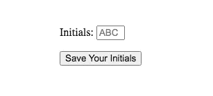
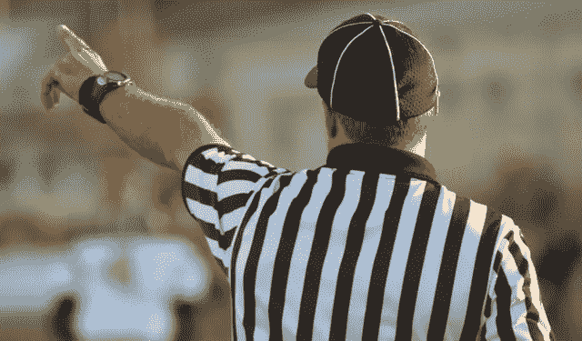

# 用 JavaScript 控制用户输入

> 原文：<https://levelup.gitconnected.com/controlling-user-input-with-javascript-98438e8007f6>


丹尼尔·利维斯·佩鲁西在 [Unsplash](https://unsplash.com/s/photos/road-signs?utm_source=unsplash&utm_medium=referral&utm_content=creditCopyText) 上的照片

作为人类，我们喜欢无限选择的*理念*，但我们常常不喜欢它的现实。如果你曾经花了一个令人沮丧的晚上玩“你想去哪里吃晚饭？”(对此唯一的回答是“我不知道，你想去哪里吃晚饭？”)，这个你亲身经历过。我们永远不希望我们的用户因为犹豫不决而感到麻痹。

有一些方法来塑造我们的代码，以帮助引导我们的用户向我们希望从他们那里得到的输入，我喜欢把这种方法称为“保龄球缓冲器”方法。对于大多数用户来说，bumpers 可以毫不费力地将保龄球从手中拿到球瓶上。然而，如果你没有后端保护，它不会阻止恶意用户想方设法破坏你的数据库。在这个类比中，就是那个决定*扔球*而不是滚动球的人。

尽管保龄球方法不能保证你的数据库免受任何投球手的攻击，但它会使你的应用程序更容易被其他用户访问。本文将帮助您改善应用程序在 HTML、JavaScript 和 CSS 方面的用户体验

# 用 HTML 设置表单


德里克·马丁在 [Unsplash](https://unsplash.com/s/photos/bowling?utm_source=unsplash&utm_medium=referral&utm_content=creditCopyText) 上拍摄的照片

限制用户输入的第一种方法来自 HTML 表单。如果你想对表单有一个基本的了解，或者想看到更多定制表单的选项，可以看看我以前的博客文章，[让你的 HTML 表单保持最佳状态](https://medium.com/better-programming/keeping-your-form-in-top-form-26e42fd973b2)。今天，我们将只关注其中的几个。这种情况下有用的有 *maxlength* 、 *size* 和*占位符*。

用户会根据他们看到的东西做出很多假设，我们可以通过让他们看到的东西与我们正在寻找的输入相匹配来提供帮助。

```
<form action="" method="post">
<p>Initials: <input id="initials" type="text" name="initials" maxlength="3" size="4" placeholder="ABC"></p>
<input type="submit" id="initial-submit" value="Save Your Initials">
</form>
```

此代码将呈现为:



下面是这些属性对我们的作用的简要分析:

*   Maxlength 将阻止用户输入超过我们允许的字符——在本例中不超过三个。
*   *Size* 改变文本框的大小以匹配指定字符数的长度——我们在这里使用四个字符，因为光标会占用空间，并且会引起轻微的水平滚动，这会让用户感到不适。
*   *占位符*从一开始就填充了文本框中的灰色文本(“ABC”)。这是一个很好的地方，既可以放入我们希望看到的例子，也可以用来提供说明或澄清限制。如“不超过 25 个字符”、“仅名字”等。

然而，这些都不会阻止用户输入“123”，或者“***”。这就是我们的 JavaScript 的用武之地！

# 使用 JavaScript 的输入控件



照片由[内森·希维利](https://unsplash.com/@shivelycreative?utm_source=unsplash&utm_medium=referral&utm_content=creditCopyText)在 [Unsplash](https://unsplash.com/s/photos/referee?utm_source=unsplash&utm_medium=referral&utm_content=creditCopyText) 上拍摄

如果您已经对 JavaScript 有了很深的了解，下面的代码可供您阅读。否则，我们将一行一行地浏览:

*   *document . getelementbyId(" initials ")—*这个 document 方法将根据它的 id 获取一个 HTML 元素。您还可以用它代替 querySelector 或另一个文档方法来从 DOM 中获取元素。
*   *。addEventListener("keydown "，(event) = > {…}* —这将为您选择的 HTML 元素附加一个事件侦听器。当它“听到”一个键被按下，它将触发箭头功能。箭头函数会将触发它的事件作为变量*事件*传递到函数体中
*   *if(event . key . match(/[a-zA-Z]+/g)){ return event；}* —如果事件的 key 属性与 RegEx 匹配，则让事件正常发生。在这种情况下，它将允许字母出现在文本框中。你可以用这个正则表达式替换任何一个适合你需要的。
*   *else { event . prevent default()；}* —如果按下的键与您的正则表达式不匹配，它将阻止字母形式出现在文本框中

```
document.getElementById("initials")
.addEventListener("keydown", (event) => {
    if (event.key.match(/[a-zA-Z]+/g)) {
        return event;
    } else {
        event.preventDefault();
    }
});
```

您可能会想，“等等，没有人用小写字母写他们的姓名首字母 JavaScript 代码片段不会阻止这种情况！”那是 100%真实的。请记住，我们的目标是改善用户体验，所以我们希望尽可能让他们觉得事情简单。当我们想要处理他们的输入时，我们将用一个简单的:

```
document.getElementById("initials").value.toUpperCase();
```

这将把在我们的“缩写”文本框中输入的文本全部转换成大写字母。现在，用户不必担心寻找 Shift 键或处理大写锁定，这是一个容易让我们回避的问题！

# 使用 CSS 添加样式


约书亚·雷德科普在 [Unsplash](https://unsplash.com/s/photos/style?utm_source=unsplash&utm_medium=referral&utm_content=creditCopyText) 上的照片

最后，让用户知道他们在输入什么是很重要的。想到你会得到一件可爱的衣服，还有惊喜，一点都不好玩！它的大小适合一个婴儿。我们总是想确保事情对我们的用户来说是清楚的，特别是如果我们要在我们这边看不见的地方操作他们的输入。

CSS 让这变得非常简单。您所要做的就是将这段代码添加到 CSS 文件中:

```
input[type="text"] {
    text-transform: uppercase;
}
```

瞧啊。当用户输入时，它会自动将所有字符显示为大写。

# 权力越大，责任越大


安德烈·梅特列夫在 [Unsplash](https://unsplash.com/s/photos/great-power?utm_source=unsplash&utm_medium=referral&utm_content=creditCopyText) 拍摄的照片

有了 HTML、CSS 和 JavaScript 的强大功能，您在应用程序中可以完成的事情几乎没有限制。然而，很容易让这种力量冲昏你的头脑！请记住，最重要的是用户，当涉及到用户输入时，没有人希望感到惊讶。努力保持“所见即所得”的网页设计原则，尽可能让你的用户感到简单，这样你就能走在正确的道路上！

如果您想看看这段代码的运行情况，请查看 Github 上的 [Fauxtris](https://github.com/rebeccahickson/fauxtris-frontend) 。这是一个有趣的俄罗斯方块克隆，使用普通 JavaScript 和 Rails 作为 API。如果您有任何问题，请随时联系我！