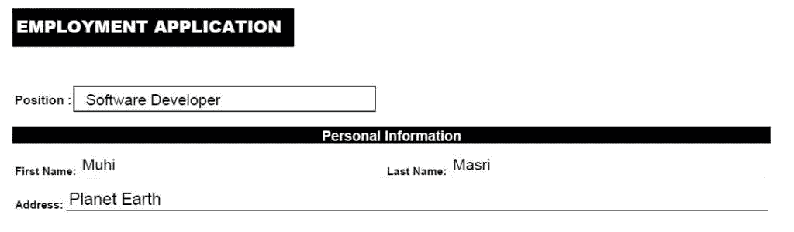
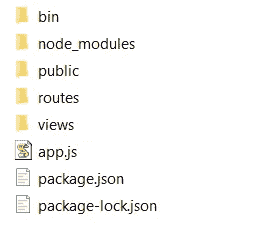
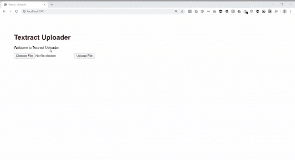

# 使用 Amazon Textract 和 NodeJS 将表单图像转换成 HTML 表单

> 原文：<https://levelup.gitconnected.com/convert-a-form-image-to-an-html-form-using-amazon-textract-and-nodejs-d4d7c1a2b0c5>


在本文中，我们将学习如何使用 Amazon Textract 和 NodeJS 将一个图像(包含一个简单的表单)转换成 HTML 表单。[亚马逊 Textract](https://aws.amazon.com/textract/) 是一项从扫描文档中自动提取文本和数据的服务。这是一种人工智能支持的光学字符识别(OCR)，可以非常简单地从图像中准确提取内容。

Textract 的优势之一是能够识别图像中的表单，并提取数据及其关联关系。意思是，如果我们看一个基本的形式:



Textract 提供了一个 API，使我们能够输出如下结果:

很酷，对吧！但是获得想要的 JSON 对象并不像从 Textract 的 API 中调用一个函数那么简单，在本文中，我们将研究一个简化的解决方案来实现这一点。

本文将假设您有一个 AWS 帐户，包括 S3 存储、访问密钥和秘密密钥。如果没有，你仍然可以继续阅读，但是我强烈建议你创建一个 [AWS 账户](https://aws.amazon.com/account/)，熟悉一下它是如何工作的。

## 概述:

1.  将图像上传到您的 S3 存储器
2.  使用 Textract API 直接从 S3 桶分析文档
3.  使用 AWS Textract Helper 将表单数据提取为 JSON 对象
4.  在 HTML 表单中显示结果

## 1.创建简单的 NodeJS 应用程序:

我们将使用[快速应用生成器](https://expressjs.com/en/starter/generator.html)。它自动创建一个带有 html 视图(使用 pug)和路由系统的项目。这样，我们可以轻松地添加上传功能，并在不同的视图中发布结果

```
mkdir aws-textract-app
cd aws-textract-app
npx express-generator --view=pug
npm install
```

我们简单地创建了一个文件夹，并安装了包含所有 npm 依赖项的 express-generator。您的项目结构应该是这样的:



## 2.将图像上传到您的 S3 存储器:

为了简单起见，我们将使用本文开头的图像，它包含 4 个输入(职位、名字、姓氏和地址)

首先，让我们在 index.pug 视图中添加上传文件所需的所有元素

然后让我们在 view 文件夹中创建一个新的 fileupload.pug 视图来发布结果。此外，稍后我们将添加一个简单的表单来绑定提取的数据。

现在我们已经完成了 HTML 部分，让我们开始编写上传文件的逻辑。

让我们从安装所有的依赖项来截取一个文件并将其上传到 S3 存储开始。

```
npm i formidable
npm i fs
npm i aws-sdk
```

在 routes 文件夹中，您应该找到一个 index.js 文件，该文件已经包含以下代码:

在同一个文件中，我们将包含我们刚刚安装的所有依赖项，并添加一个新的 post 路由器来处理 index.pug 视图中的“file upload”post 操作。

下面我们将添加上传逻辑的实现:

我们刚刚所做的快速总结:

1.  使用强大的解析表单。
2.  读取文件的内容，并将其作为值分配给 AWS 上传参数中的“Body”属性(以及其他必需的属性)。
3.  创建了一个异步“s3Upload”函数，该函数返回变量“s3Content”中的结果。该变量中的信息将在下一步中用于 Textract 读取器。

此时，您应该能够运行 Node 应用程序并将图像直接上传到您的 S3 存储桶。干得好！

## 3.使用 Textract API 直接从 S3 桶分析文档

让我们创建一个名为“documentExtract”的函数，它将 S3 对象键作为参数，然后返回从图像中提取的所有数据。

与我们之前进行的 S3 上传过程类似，Textract API 将需要关于您所在地区、访问密钥、存储桶名称的信息…

您会注意到，我们有一个名为“FeatureTypes”的属性和值“FORMS”，这非常重要，因为它让 Textract 施展魔法并返回键-值集来帮助我们将输入字段与正确的标签关联起来(即，“软件开发商”属于“位置”，“地球”属于“地址”等等)

现在让我们在 S3 上传过程之后插入这个函数并记录结果。到目前为止，我们的 index.js 代码应该是这样的:

运行代码时，控制台将打印 JSON 对象列表，其中每个对象代表一个具有惟一 id、关系列表和其他相关属性的块。让我们以此为例:

每当 BlockType 为“KEY_VALUE_SET”时，就意味着它具有将关联对象连接在一起的关系属性。在这个特定的块中，我们可以通过在“Relationships”对象中查找“Ids”来确定“Position”和“Software Developer”之间的关系。为了更详细地了解它是如何工作的，你可以查看亚马逊的[开发者指南](https://docs.aws.amazon.com/textract/latest/dg/how-it-works-kvp.html)。

## 4.使用 AWS Textract Helper 将表单数据提取为 JSON 对象

为了简化查找所有关系的过程，并使您免于编写几个函数，我创建了一个 [AWS Textract Helper](https://www.npmjs.com/package/aws-textract-helper) 模块来一次性完成这项工作。

让我们安装该模块并将其包含在 index.js 文件中

```
npm i aws-textract-helper
```

API 中有多个可用的函数，但现在你只需要“createForm”。它有两个参数，一个是我们从“documentExtract”函数得到的数据，另一个是 config(可选的),它允许您删除表单键中不需要的字符，比如冒号或额外的空格。

## 5.在 HTML 表单中显示结果

最后但同样重要的是，让我们用 textract helper 函数生成的数据来呈现“fileupload”视图。我们上传函数的最终代码应该是这样的:

现在，当我们运行代码并上传图像时，应该会得到以下结果。此外，完整的示例可以在这个[存储库](https://github.com/muhimasri/aws-textract-app)中公开获得。



## 结论:

相对而言，Amazon Textract 仍然是一种新技术，有很多需要发现和学习的地方，但当您想要从客户捕获的数据(如发票或收据)中即时准确地分析非结构化文本时，它绝对值得一看。

希望你喜欢从这篇文章中学习。如果您有任何问题或反馈，请在下面留下您的评论。

*原载于 2020 年 3 月 24 日*[*【https://muhimasri.com】*](https://muhimasri.com/blogs/convert-a-form-image-to-an-html-form-using-amazon-textract-and-nodejs/)*。*