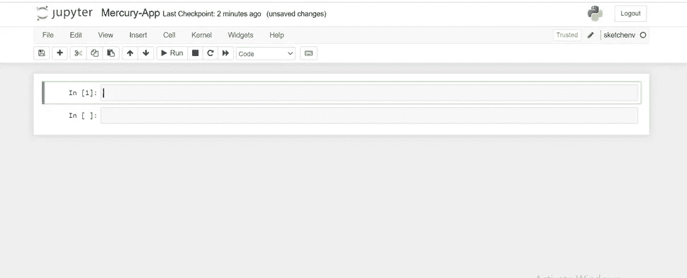
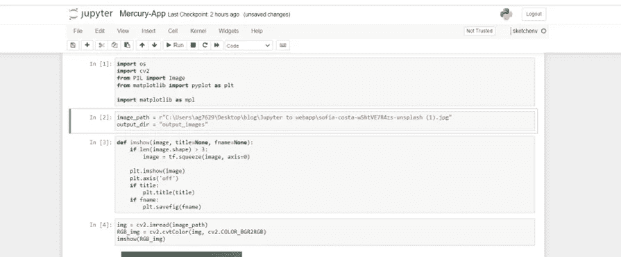
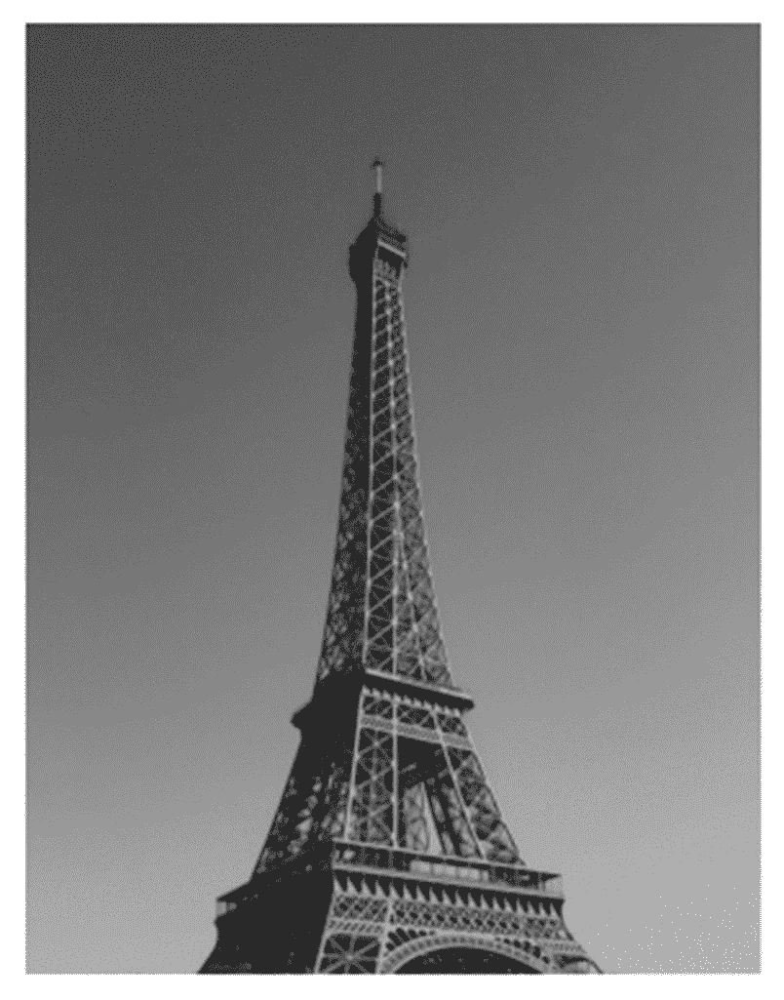
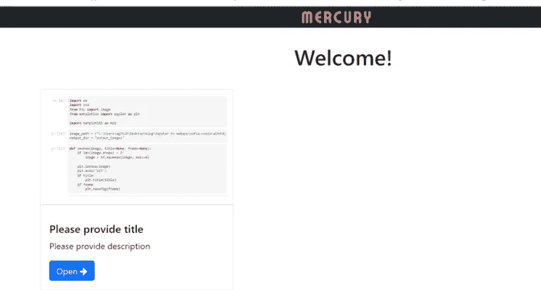
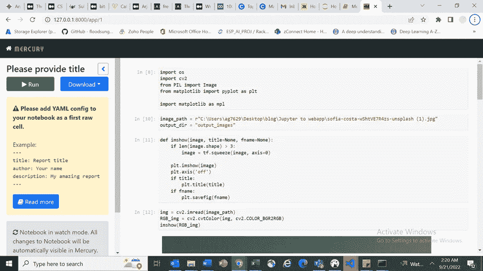
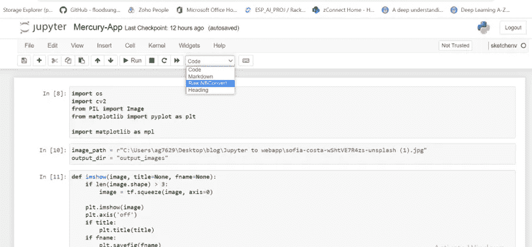
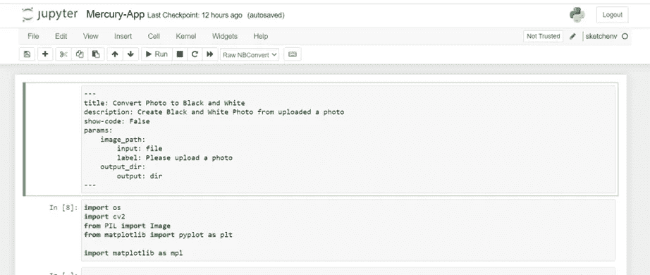
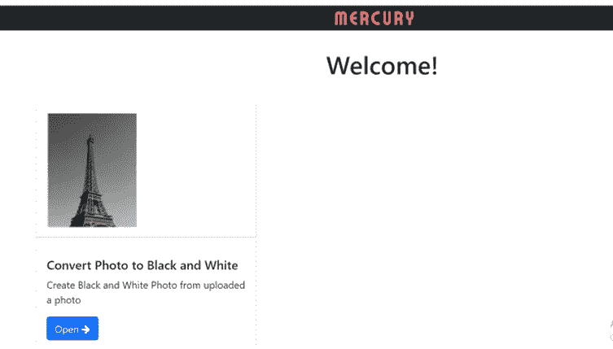
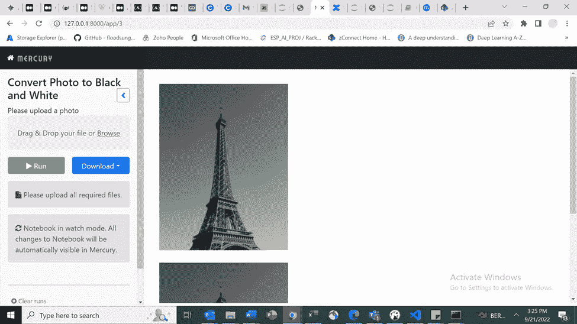
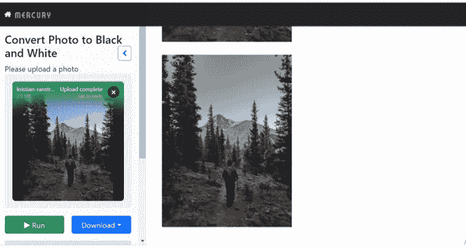

# 用几行代码将 Jupyter 笔记本转换成 web 应用程序。

> 原文：<https://levelup.gitconnected.com/convert-a-jupyter-notebook-to-a-web-app-with-a-few-lines-of-code-e01fbac4a876>

Mercury Library 可以将您的 Jupyter 笔记本转换为一个独立的 web 应用程序，可以在 web 上托管。

在本文中，我们将以一个使用 OPENCV 将任何照片转换成黑白照片的笔记本为例。

让我们安装我们需要的库。

```
pip install mljar-mercurypip install opencv-python-headlesspip install pillowpip install matplotlib
```

Pillow (Python 图像库)是一个图像处理库。它为 python 提供了轻量级的图像处理能力，如创建、裁剪、颜色模式提取、大小信息等。

Mercury 是一个框架，可以将您的 jupyter 笔记本转换为独立的 web 应用程序。您可以向笔记本添加交互式小部件。最终用户可以调整小部件的值，并使用新参数执行笔记本。最终的笔记本可以下载为 PDF 或 HTML 文件。笔记本电脑也可以轻松托管，我们还可以为笔记本电脑添加身份验证。

OpenCV-python-headless 是 OpenCV-python 减去 GUI 模块的非官方版本。在这个例子中，我们不需要 GUI 模块。

让我们开始吧！

通过在命令提示符下运行以下命令，创建新的 jupyter 笔记本:

```
jupyter notebook
```

您应该会看到类似这样的内容:



您可以更改 jupyter 笔记本的名称，例如，我将其命名为 Mercury-App。

让我们从导入包和设置 matplotlib 设置开始。

```
import osimport cv2from PIL import Imagefrom matplotlib import pyplot as pltimport matplotlib as mplmpl.rcParams['figure.figsize'] = (12,12)mpl.rcParams['axes.grid'] = False
```

让我们创建两个变量来存储图像路径和 output_dir

```
image_path = r”C:\Users\ag7629\Desktop\blog\Jupyter to webapp”output_dir = "output_images"
```

image_path 存储图像文件的路径，output_dir 是图像输出的文件夹。

下面的方法接收一个图像并在 jupyter 中绘制它。

```
def imshow(image, title=None, fname=None):if len(image.shape) > 3:image = tf.squeeze(image, axis=0)plt.imshow(image)plt.axis('off')if title:plt.title(title)if fname:plt.savefig(fname)
```

让我们使用 imshow 函数来显示图像。



您应该会在笔记本中看到输出。


Sofia Costa 在 [Unsplash](https://unsplash.com/t/architecture?utm_source=unsplash&utm_medium=referral&utm_content=creditCopyText) 上拍摄的照片

下面的代码对图像应用了一些变换，以便将彩色图像转换为黑白图像。

```
img = cv2.imread(image_path)RGB_img = cv2.cvtColor(img, cv2.COLOR_BGR2RGB)imshow(RGB_img)
```

转换后的图像应该是这样的:



现在我们有一个笔记本，上面有我们的代码，我们如何将它更改为 webapp？

打开 cmd 并运行以下命令:

```
mercury watch Mercury-app.ipynb
```

现在访问 127.0.0.1:8000

你应该会看到这样一个网页。



如果你点击笔记本，你会得到一个类似下面的错误。



该错误指出 YAML 配置丢失。让我们添加一个原始的 NBConvert 单元格，并添加一个 YAML 文件。



YAML 割台配置:

*   **标题** —在主视图和笔记本视图侧边栏顶部使用的应用程序标题，
*   **描述** —描述应用程序正在做什么的文本
*   **显示代码** —决定是否显示或隐藏笔记本代码的变量
*   **params** —添加到笔记本的小部件。

将以下代码添加到笔记本中。

```
title: Convert Photo to Black and Whitedescription: Create Black and White Photo from uploaded a photoshow-code: Falseparams:image_path:input: filelabel: Please upload a photooutput_dir:output: dir — -
```



现在保存笔记本并重新运行水星应用程序。

您应该会看到类似这样的内容:



现在点击打开按钮。

这将打开您的 web 应用程序。



点击浏览并选择你想转换成黑白的图像。

我们将使用这张图片来测试我们的 web 应用程序。


由[克里斯蒂安·朗斯特伦](https://unsplash.com/@redapollos?utm_source=unsplash&utm_medium=referral&utm_content=creditCopyText)在 [Unsplash](https://unsplash.com/t/travel?utm_source=unsplash&utm_medium=referral&utm_content=creditCopyText) 上拍摄的照片

选择图像后，单击运行。

该应用程序会将图像转换为黑白。

您应该会看到这样的输出。



下载按钮允许您下载 pdf 或 HTML 格式的结果。

了解将 Jupyter 笔记本转换为 webapp 有多简单。

[](/remove-objects-from-images-using-ai-a00876460dd1) [## 基于人工智能的数字图像修复

### 只需几个简单的步骤，就可以使用人工智能从你的令人敬畏的图像中删除照片炸弹。

levelup.gitconnected.com](/remove-objects-from-images-using-ai-a00876460dd1) [](/run-python-in-html-pyscript-by-anaconda-cb9fb370a6b9) [## 通过 Anaconda 在 HTML: Pyscript 中运行 Python

### Pyscript 是 anaconda 开发的一个新框架，它允许您在 HTML 代码中运行 python。

levelup.gitconnected.com](/run-python-in-html-pyscript-by-anaconda-cb9fb370a6b9) 

*嘿伙计们，*

我是一个在媒体上写作的新手，希望听到你的反馈。如果你喜欢我写的东西，不要犹豫，竖起大拇指或者留下小费。如果您有任何问题或建议，请随时发表评论。我阅读每一条信息，并尽可能快地回复。

*阿尔琼·古尔巴德哈尔*