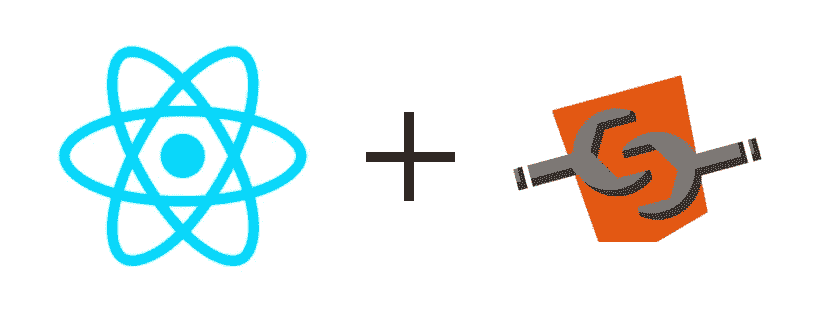
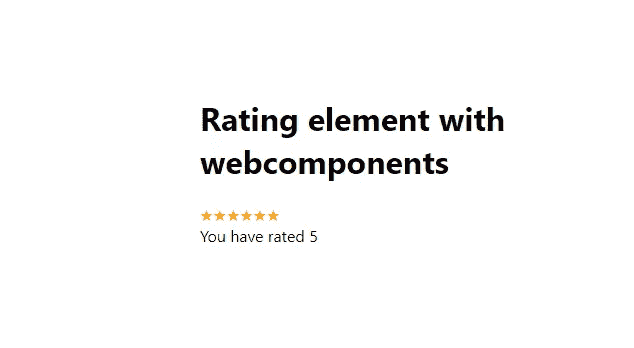
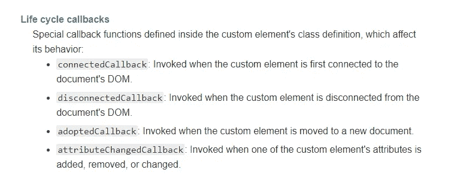

# 将现有的 React 组件转换为 WebComponents

> 原文：<https://levelup.gitconnected.com/convert-existing-react-components-intowebcomponents-2b33b842ff9a>

为了解决不同的问题，JS 生态系统正朝着框架竞争发展。

1.  不同的框架可以和谐地一起工作。
2.  Javascript 开发者不需要依赖任何框架来开发基于组件的架构，双向绑定。
3.  Web 组件依赖于本地浏览器 API，因此速度更快，并且不需要依赖。

将组件反应为 web 组件

**这是你的最终结果:**

由 web 组件包装器包装并在 HTML 页面中呈现的 React 组件

让我们直接进入代码。在大约 5 个步骤中，您将使用现有的 React 组件创建一个生产就绪的 WebComponent。

**第一步:**用 **create-react-app** 创建一个新项目

打开 VS 代码，键入`npx create-react-app your-application-name`如果你需要任何帮助，检查这个[链接](https://reactjs.org/docs/create-a-new-react-app.html)

**步骤 2:** 创建评级反应组件

创建名为 RatingComponent.js 的文件，并将下面代码片段中的代码添加到 RatingComponent.js 中。

它只是一个基本的 react 组件，有 3 个属性，即 1)**max value**——用于控制它应该显示多少颗星星。2) **value** —用于设置当前选中的评级 3) **onRatingUpdatedEvt —** 回调函数，用于将选中的值发布给父级，这样他们就可以有自己的回调逻辑。

在 **componentDidMount 中，**我只是调用了 **createStars** 方法来基于初始 **maxValue** 和**值构建星星。**我还为每个星星添加了对 **onMouseOver** 、 **onMouseOut** 事件的回调，并调用 **createStars** 函数来构建星星并将其分配给 state，这反过来反映在 UI 中。并且我已经将每个 star 的 **onClick** 处理程序附加到了 **setValue** 函数中。每当用户点击任何星号 **setValue** 函数被触发，在其中，我将把当前选择的索引更新为值 prop，并调用 **createStars** 方法来基于此构建列表。

**步骤 3:** Web 组件对包装器做出反应

简而言之，我们将把 web 组件道具、事件和生命周期方法映射到 React 组件，反之亦然。

让我们从 WebComponents 基础开始。这些是 WebComponents 的生命周期事件，您可以在这里的[下找到它。我们将在本教程中使用其中的一些。](https://developer.mozilla.org/en-US/docs/Web/Web_Components)

web 组件的生命周期事件

> connectedCallback 等效于 componentDidMount
> 
> disconnectedCallback 等效于 componentWillUnMount
> 
> adoptedCallback 是生命周期事件，当试图将自定义元素从 iframe 移动到另一个 iframe 时会调用它。
> 
> attributeChangedCallback 非常等同于 *getDerivedStateFromProps*

**connectedCallBack** 函数实现了从裸 HTML 获取属性名和事件，并尝试生成属性和回调，并将其绑定到 React 组件。

> <rating-element maxvalue="5" value="0" onratingupdatedevt="”onratingupdatedevt”"></rating-element>

在 **convert** 方法里面，你会奇怪我为什么加了这个。基本上，我正在尝试转换字符串:

> 否则如果(/^{.*}/.exec(属性值))
> 
> value = JSON . parse(attr value)；

默认情况下，只能将字符串值赋给 HTML 元素的属性。WebComponents 也是一个本地 HTML，因此这里也适用。所以如果你想让你的 WebComponents 属性支持 JSON 对象，你必须把值赋值为上面的 *stringified* 代码会把它应用到 React 组件

在 **getEvents** 函数中，我按名称过滤以“on”开头的 attr，并为每个事件附加代码***this . dispatch event(new CustomEvent(ev . name，{…args })***。它负责将每一个事件发送给父节点。

然后将构建的道具和事件都设置到 React 组件，并渲染它***render(<rating component {…props }/>，this)；***

在 **disconnectedCallback** 方法中，基本上做的是当组件从 DOM 中卸载时的事情。我调用了***unmountComponentAtNode***，它基本上从 DOM 中移除了组件。

在**中，attributeChangedCallback** 基本上卸载并重新装载元素，以便组件反映最新的属性更新。

我们到了最后一部分，只需添加这一行，以便您的自定义组件注册为 WebComponent，这样它就可以被浏览器识别并自动呈现。

***custom elements . define(' rating-element '，react element)；***

并像上面那样更新 index.js。我们不需要反应堆。渲染以将其附加到 HTML 元素，因为我们正在将其构建为 WebComponent。

**第四步:Index.html**

在 public/index.html 下

添加一个带有您用来注册 WebComponent 的名称的标签，并添加逻辑来监听 **onratingupdatedevt** 事件。

我添加了一个 **div** 来显示选定的评级，并添加了一个按钮来重置评级组件的值。您可以看到，每当您单击一个评级星，该值就会反映在 **results div 中。**无论何时点击重置按钮，它基本上将评级组件的值重置为 **0，**，这又调用属性回调并重置评级组件的状态。

**第五步:运行项目**

安装`yarn add http-server -g`。http-server 用于托管和运行特定文件夹下的任何 app。

运行`yarn build` 构建应用程序，这将为您创建一个构建文件夹，然后运行`yarn http-server ./build` ，这将尝试托管构建文件夹，您可以看到应用程序已经启动并正在运行。

如果在 Glitch 中运行示例有任何问题，您可以从我的 Github 中克隆 repos:

 [## sarva bowmen/评级-web 组件

### 运行应用程序的步骤 1。要安装依赖关系-纱 index.html-有评级网页组件定义在 html 和…

github.com](https://github.com/sarvabowmen/rating-webcomponent) 

**参考文献**

 [## 无处不在的自定义元素

### 自定义元素是一种新的 web 标准，它允许开发人员创建自己的 HTML 元素。因为它们是基于…

custom-elements-everywhere.com](https://custom-elements-everywhere.com/)  [## Web 组件

### 作为开发人员，我们都知道尽可能多地重用代码是一个好主意。传统上不是这样的…

developer.mozilla.org](https://developer.mozilla.org/en-US/docs/Web/Web_Components)  [## W3C/web 组件

### Web 组件是一个新的浏览器特性，它为 Web 提供了一个标准的组件模型，由几个…

github.com](https://github.com/w3c/webcomponents)  [## 使用 Web 组件创建微前端(支持 Angular 和 React)

### 如果你是 React 或 Angular，Ember 或 Vue，让我们创建一个地方，让他们都可以生活在一起，在完美的和谐使用…

medium.com](https://medium.com/javascript-in-plain-english/create-micro-frontends-using-web-components-with-support-for-angular-and-react-2d6db18f557a)