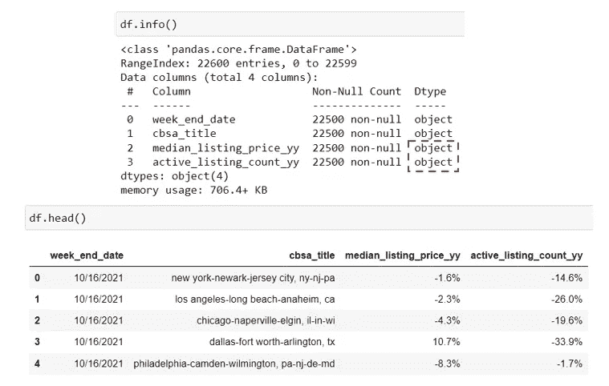
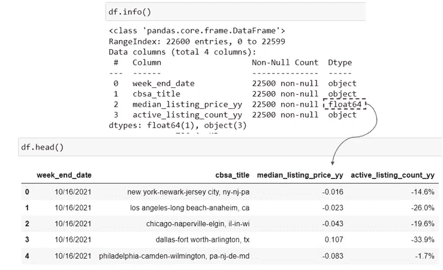
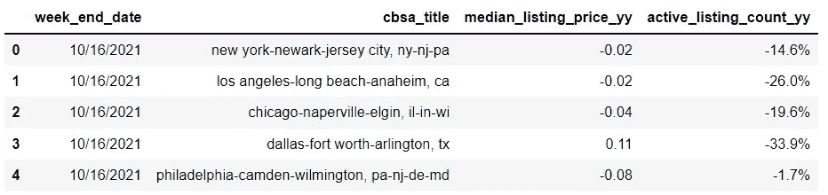
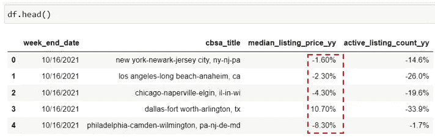

# 在 Pandas 中将百分比字符串转换为数字(反之亦然)

> 原文：<https://levelup.gitconnected.com/convert-percentage-string-to-numeric-and-vice-versa-in-pandas-18a3d66e2853>

## 熊猫初学者的数据清理和格式化技巧


图片由 [Pixabay](https://pixabay.com/illustrations/panda-clipart-face-animal-sticker-2308269/) (作者修改)

在数据世界中，原始数据很少以现成的格式出现在我们面前。在我们进入数据分析或建模阶段之前，几乎总是需要某种程度的数据清理、争论和格式化。

上周我在博客中写了几篇文章，旨在帮助初学者节省一些时间，了解如何在熊猫中完成一些非常常见但有点棘手的数据争论任务。我希望这些简短的教程和代码片段对您有所帮助，并且非常方便(本文末尾提供了链接)。在这篇文章中，我将继续与您分享另一段代码，它处理一个非常常见的数据争论任务:将百分比字符串列转换为数字，反之亦然。

## 将百分比字符串转换为数字

让我们来看一个简单的例子，使用我从 Realtor.com 的开放数据集中创建的样本数据框架。原始数据可以从[这里](https://www.realtor.com/research/data/)免费下载。



作者图片

在此示例数据框架中，我们可以看到 median_listing_price_yy 和 active_listing_count_yy 显示为百分比，并被视为字符串。这在以报告形式呈现表格时可能没问题，但对我们来说不可能对它们执行任何有意义的数学运算或分析，因为它们不是数字变量。我们如何将这些百分比字符串转换成数字数据类型？

这里的解决方案是先用`pandas.Series.str.rstrip()`方法去掉尾部的“%”字符，然后用`astype(float)`把它转换成数字。您也可以使用`[Series.str.lstrip](https://pandas.pydata.org/docs/reference/api/pandas.Series.str.lstrip.html#pandas.Series.str.lstrip)()`删除序列中的前导字符，使用`[Series.str.strip](https://pandas.pydata.org/docs/reference/api/pandas.Series.str.lstrip.html#pandas.Series.str.lstrip)()`删除序列中的前导字符和尾随字符。

这是使用我们的示例将百分比字符串转换为数字的代码片段:

```
df['median_listing_price_yy'] = df['median_listing_price_yy'].str.rstrip("%").astype(float)/100
```



作者图片

如果你想改变小数位数，比如说 2 个小数点，你可以用下面的代码来实现:

```
pd.options.display.float_format = '{:,.2f}'.format
```



作者图片

## 将数字转换成百分比字符串

现在，如何反过来将数字转换回百分比字符串呢？要将其转换回百分比字符串，我们需要使用 python 的字符串格式语法`'{:.2%}’.format` 来添加“%”符号。然后，我们使用 python 的`map()`函数进行迭代，并将格式应用于“median_listing_price_yy”列中的所有行。

```
df.loc[:, "median_listing_price_yy"] =df["median_listing_price_yy"].map('{:.2%}'.format)
```



作者图片

总的来说，如果您的 Pandas 数据帧中有一个百分比字符串列，并希望将其转换为数字/浮点数，请使用以下代码:

```
df[column] = df[column].str.rstrip("%").astype(float)/100
```

如果您有一个数字列，并希望将其转换为百分比字符串，请使用以下代码:

```
df.loc[:, column] = df[column].map('{:.2%}'.format)
```

感谢阅读！我希望这篇简短的教程对你有所帮助。如果你感兴趣的话，这里有更多关于数据清理和格式化的熊猫初学者教程。

[](https://towardsdatascience.com/clean-a-numeric-id-column-in-pandas-dataframe-fbe03c11e330) [## 清理熊猫数据框中的“数字”ID 列

### 熊猫初学者的一段方便的代码

towardsdatascience.com](https://towardsdatascience.com/clean-a-numeric-id-column-in-pandas-dataframe-fbe03c11e330) [](https://towardsdatascience.com/apply-thousand-separator-and-other-formatting-to-pandas-dataframe-45f2f4c7ab01) [## 对熊猫数据帧应用千位分隔符(和其他格式)

### 通过学习这些有用的熊猫格式技巧，为自己节省一些谷歌搜索时间

towardsdatascience.com](https://towardsdatascience.com/apply-thousand-separator-and-other-formatting-to-pandas-dataframe-45f2f4c7ab01) [](https://towardsdatascience.com/why-and-how-to-reshape-a-pandas-dataframe-from-wide-to-long-ca90c89156b9) [## 为什么以及如何将熊猫数据框由宽变长

### 一段简单的代码就完成了这个任务

towardsdatascience.com](https://towardsdatascience.com/why-and-how-to-reshape-a-pandas-dataframe-from-wide-to-long-ca90c89156b9) [](https://medium.com/codex/how-to-batch-rename-columns-in-pandas-based-on-patterns-7d2382b5fc9a) [## 如何基于模式批量重命名 Pandas 中的列

### 分享一段简单的代码，希望对你有所帮助！

medium.com](https://medium.com/codex/how-to-batch-rename-columns-in-pandas-based-on-patterns-7d2382b5fc9a) 

你可以通过这个[推荐链接](https://medium.com/@insightsbees/membership)注册 Medium 会员(每月 5 美元)来获得我的作品和 Medium 的其他内容。通过这个链接注册，我将收到你的会员费的一部分，不需要你额外付费。谢谢大家！