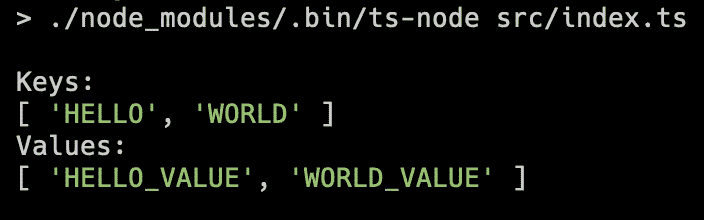

# 在 TypeScript 中将字符串枚举转换为数组

> 原文：<https://levelup.gitconnected.com/convert-string-enums-to-arrays-in-typescript-15f3fb88338c>

使用一行程序轻松地将字符串枚举转换为 TypeScript 中的数组。

卡斯帕·卡米尔·鲁宾在 [Unsplash](https://www.unsplash.com/) 上的照片

通常在 TypeScript 中，当使用枚举时，您希望将所有可能的枚举键作为一个数组。典型的用例是下拉菜单或其他基于枚举的选择组件。

使用`Object.keys(...)`和`Object.values(...)`方法，很容易获得枚举键和值。

例如，在下面的代码片段中，您可以看到我创建了一个名为`MyStringEnum`的字符串枚举，并使用`Object.keys(...)`和`Object.values(...)`方法获取枚举的键和值，然后将其打印到控制台。

运行 index.ts 的输出

## 你想联系吗？

如果你想联系我，请在 LinkedIn 上给我打电话。

另外，请随意查看我的书籍推荐📚。

 [## 我的书籍推荐

### 在接下来的章节中，你可以找到我对所有日常生活话题的书籍推荐，它们对我帮助很大。

mr-pascal.medium.com](https://mr-pascal.medium.com/my-book-recommendations-4b9f73bf961b)  [## 通过我的推荐链接加入 Medium—Pascal Zwikirsch

### 作为一个媒体会员，你的会员费的一部分会给你阅读的作家，你可以完全接触到每一个故事…

mr-pascal.medium.com](https://mr-pascal.medium.com/membership)