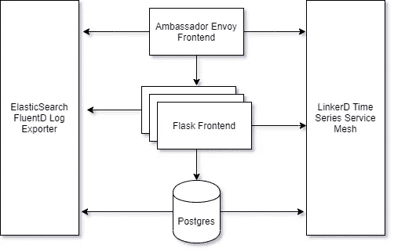
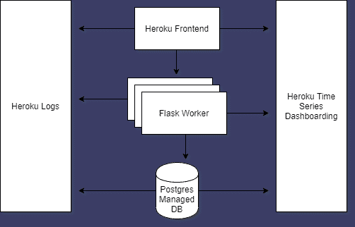

# 将 Kubernetes Fullstack 应用程序转换为 Heroku 容器

> 原文：<https://levelup.gitconnected.com/converting-a-kubernetes-fullstack-application-to-heroku-containers-f8de25e2ac09>

在过去的几年里，谷歌的 Kubernetes 项目引起了巨大的轰动。该项目已经发展成为云基础设施领域的巨头。

虽然这是一个伟大的项目，并为许多目的服务，它仍然是一个复杂的野兽。即使有来自主要云提供商的托管服务，团队也必须使用不断扩展的插件和范式转换来维护复杂、交织的架构。由于其灵活性所固有的复杂性，Kubernetes 需要自己的一套技能来实现、维护、升级和操作这个多样化的编排生态系统。

# PaaS 的简单性

这些密集的、基于技能的需求可能适合一些商业模式。然而，如果你想把时间花在构建应用程序上，而不是管理服务器和安全，那么你可能想考虑平台即服务(PaaS)而不是 Kubernetes。这些提供商维护环境的基础架构、安全性、可观察性和整体状况，因此您可以专注于业务关键型应用程序。

Kubernetes 的吸引力之一是它能够提供统一的环境体验。为适应 Kubernetes 而构建的应用程序在设计上应该是可移植的，本质上是短暂的，能够在任何容器驱动的世界中生存，与基础设施无关(查看[十二因素应用程序](https://12factor.net/)以获得关于构建应用程序的更多指导)。因此，如果一个应用程序团队想要摆脱 Kubernetes 托管基础架构的复杂性，转而支持管理型 PaaS，那会是什么样子呢？

今天我们来看看这个简单的 [Kubernetes 驱动烧瓶应用](https://github.com/Tokugero/kubernetes-hello-world/tree/heroku)。我们将看看它是如何运行的，了解它的需求，并探索如何将它转换成 Heroku。

# 应用程序设计



这个应用程序是一个简单的 Flask 前端，它从 Postgres 数据库中提取一个演员列表，然后将他们显示在一个网站上。如您所见，监控、记录、服务和提供正常运行时间的基础设施比应用程序本身组成了更多的组件。

要在 Kubernetes 中部署应用程序，我们需要先决条件的基础设施组件、应用程序本身的几个 YAMLs 和数据库的导航图。

*   [GitLab CI/CD](https://docs.gitlab.com/charts/)
*   [大使缘栈](https://www.getambassador.io/docs/latest/tutorials/getting-started/)
*   [LinkerD 服务网格](https://linkerd.io/2/tasks/install-helm/)
*   [流动日志收集器](https://github.com/fluent/fluentd-kubernetes-daemonset/blob/master/fluentd-daemonset-elasticsearch.yaml)
*   [弹性搜索文档数据库](https://github.com/elastic/helm-charts/tree/master/elasticsearch)
*   [证书生成](https://github.com/Tokugero/kubernetes-hello-world/blob/heroku/spec/TLS.yaml)
*   [入口定义](https://github.com/Tokugero/kubernetes-hello-world/blob/heroku/spec/Mapping.yaml)
*   [暴露端口&应用部署](https://github.com/Tokugero/kubernetes-hello-world/blob/heroku/spec/Deployment.yaml)
*   [PostgreSQL 头盔定制](https://github.com/Tokugero/kubernetes-hello-world/blob/heroku/spec/postgres/values.yaml)
*   [最后是应用程序本身](https://github.com/Tokugero/kubernetes-hello-world/tree/heroku/app)

要使应用程序可用，需要很多必要的步骤。让我们看看赫罗库的类似的必需品。



因为 PaaS 供应商已经为您做出了技术决策，所以您必须遵守该供应商的决策和意见。但是，作为回报，您可以获得开箱即用的紧密集成的服务产品。以前需要数周时间来研究和实现服务网格和日志导出器，现在只需要几分钟和几个命令。

要在 Heroku 中部署相同的应用程序，我们只需要两步:启动数据库和应用程序。

现在让我们看看如何将这个应用程序从 Kubernetes 转换到 Heroku。我们来看四个步骤:

1.  建立基础设施
2.  转换应用程序
3.  部署应用程序
4.  更新应用程序

# 1.建立基础设施

我们看到了 Kubernetes 的许多组件，它们对于确保产品的可操作性是必要的。每一个都有安装指南和建议，但模式通常非常相似:

1.  下载控件二进制文件。
2.  验证 kubectl 可以到达适当的集群。
3.  ku bectl apply-f[https://dependency/spec . YAML](https://dependency/spec.yaml)或者使用二进制来创建资源。
4.  验证部署是否在适当的安全环境中完成，是否按预期运行。

Heroku 的要求更简单:创建一个帐户，下载 heroku cli，然后就完成了！请记住，PaaS 的一大优势是验证和安装(所有这些您必须自己用 Kubernetes 完成的步骤)已经为您完成了。

这些步骤为您的应用在任一环境中提供核心基础设施服务，例如 TLS 和流量管理、可扩展性、可观察性和可重复性。

# 2.转换应用程序

既然我们已经确定了每个环境如何寻找我们的示例应用程序，我们可以看看我们需要如何调整应用程序以在新的 PaaS 环境中工作。因为许多组件是以我们的名义实现的，所以在我们部署应用程序之前需要进行一些必要的转换。

这些步骤将确保我们可以将应用程序部署为一个容器，在 stdout 中查看应用程序日志，在运行时远程登录到容器，并从基础设施中为应用程序定制参数。

首先，我们必须更改 Dockerfile 文件。对于在初始化时定义我们的应用程序的 Kubernetes Dockerfile，我们很大程度上可以随心所欲地设计它:

```
FROM python:3WORKDIR /usr/src/appCOPY requirements.txt ./RUN pip install — no-cache-dir -r requirements.txtRUN touch /tmp/healthy && echo “healthy” >> /tmp/healthy && cat /tmp/healthyENV FLASK_ENV=developmentENV FLASK_APP=myapp.pyCOPY myapp.py .CMD [ “flask”, “run”, “ — host=0.0.0.0” ]
```

这个映像很简单:使用一个维护的基本映像，设置一个工作目录，添加 python 需求，设置一些默认的环境变量，添加应用程序代码，然后启动服务器。

在后面的步骤中，我们将使用这个 Docker 文件来构建我们的应用程序，将它推送到 Docker 注册表，并让 Kubernetes 将图像拉至其本地服务器来启动应用程序。

在 Heroku 中，由于我们希望使用特定于 Python 的基本映像，我们必须为 Heroku 的容器管理接口添加一些包。我们的新 docker 文件如下所示:

```
FROM python:3WORKDIR /usr/src/appCOPY requirements.txt ./RUN pip install — no-cache-dir -r requirements.txtRUN apt-get update && \ apt-get install -y \ curl \ openssh-serverADD ./.profile.d /app/.profile.dRUN rm /bin/sh && ln -s /bin/bash /bin/shRUN echo “healthy” >> /tmp/healthy && \ cat /tmp/healthyENV FLASK_ENV=developmentENV FLASK_APP=myapp.pyCOPY myapp.py .CMD python3 myapp.py
```

这里我们定义了和以前一样的图像，但是做了一些调整。

*   首先，我们有了一个新的 apt-get 安装系列，将 curl 和 ssh 添加到我们的映像中。我们还添加了一个脚本(heroku-exec.sh)来定义 ssh 环境:

`[ -z "$SSH_CLIENT" ] && source <(curl --fail --retry 3 -sSL "$HEROKU_EXEC_URL")`

*   然后，我们必须通过将/bin/bash 链接到/bin/sh 来显式声明我们的默认 shell。
*   接下来，我们必须通过在 myapp.py 文件中指定 flask 运行时参数来更改映像的实例化方式，以便我们可以使用 Heroku 定义的环境变量来允许应用程序在部署后接受流量。

```
if __name__ == “__main__”: port = int(os.getenv(“PORT”, 5000)) app.run(debug=True, host=’0.0.0.0', port=port)
```

最后要考虑的是数据库。有了 Kubernetes，我们可以利用其可替换的容量来托管[集群或复制数据库](https://wiki.postgresql.org/wiki/Replication,_Clustering,_and_Connection_Pooling)，以防止损坏或节点故障。我们必须使用[掌舵图](https://hub.helm.sh/charts/bitnami/postgresql)，从头开始设计数据库架构，或者为我们的数据库使用外部托管解决方案。

但是，在使用托管服务时，这不是必需的。有了 Heroku，我们只需通过我们的仪表板添加托管数据库。复制和弹性成为提供商需要管理的问题。

(请记住，在这两种数据库实施中，复制和恢复能力都不能替代经过测试的备份！始终备份和验证您的核心数据。)

这样，我们就有了可以部署的应用程序容器映像和数据库。

# 3.运行应用程序

假设我们已经安装了核心基础设施、为我们的集群配置了数据库，以及与我们的服务帐户相关联的适当的基于角色的访问控制(RBAC)配置，我们现在可以专注于应用程序部署了。

在我们的示例中，我们没有明确定义 CI/CD 管道。因此，要将我们的应用程序手动部署到 Kubernetes，我们必须使用 kubectl 二进制文件执行以下操作:

```
docker logindocker build -t myorg/myapp:0.0.1 -t myorg/myapp:latest .docker push myorg/myapp:0.0.1; docker push myorg/myapp:latestkubectl apply -f ./spec/
```

正如我们所看到的，一旦我们部署了核心基础设施并验证了 YAMLs，手动将代码滚动到我们的 Kubernetes 集群并不困难。

通过查看 Heroku 的部署方案，我们有了他们自己的定制二进制文件，我们可以用它与他们的 API 进行交互。

```
heroku loginheroku container:loginheroku container:push web -a myappheroku container:release web -a myapp
```

在这里，我们相信 Heroku 对我们的应用程序的标记和部署，而不是使用我们自己的标记和发布功能——尽管它在很大程度上与手动发布的严格程度相同。

公平地说，构建在任一平台中的部署和发布管道可能会完全混淆所有这些工作；然而，这也必须在任一环境中进行设计、构建和维护。

至此，我们已经定义了在两种环境中部署应用程序的流程。

# 4.更新应用程序

当将一个已经存在的应用程序部署到 Kubernetes 中时，您将使用不同的命令而不是`apply`:

```
docker build -t myorg/myapp:0.0.2 -t myorg/myapp:latest .kubectl rollout deployment/myapp -n myapp --record --image=myapp:0.0.2
```

对于 Heroku，我们只需再次遵循相同的流程:

```
heroku container:push web -a myappheroku container:release web -a myapp
```

通过这最后一步，我们有了一个将应用程序迭代部署到环境中的过程。

# 结论

莎士比亚写道:“玫瑰无论叫什么名字，闻起来都一样香。”同样，我们的应用程序在任何容器化的环境中都是一样的，无论是 Capulet 还是 Montague，因为不是应用程序本身需要符合，而是它的环境需要符合。

除了我们拙劣的类比，我们还探索了在复杂且高度可定制的 Kubernetes 环境中运行一个简单的应用程序需要什么，以及从我们的托管基础架构提供商 Heroku 获得相同级别的功能需要什么。最后，两者都很容易部署和运行，但 Heroku 在入门的先决条件方面被证明要简单得多。