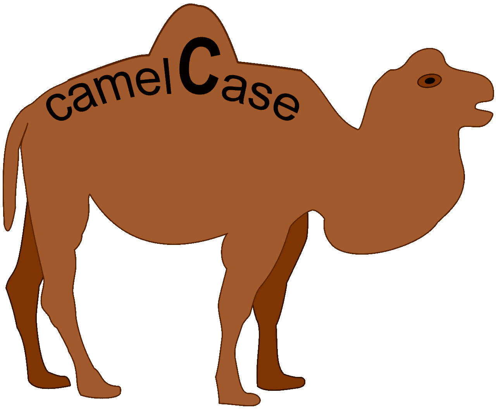
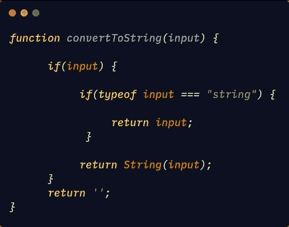
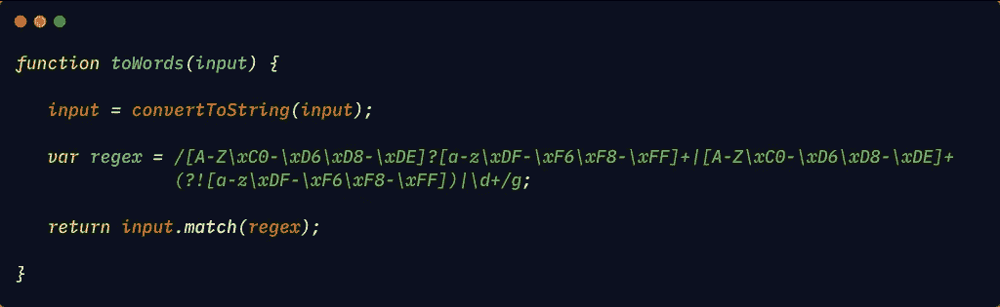
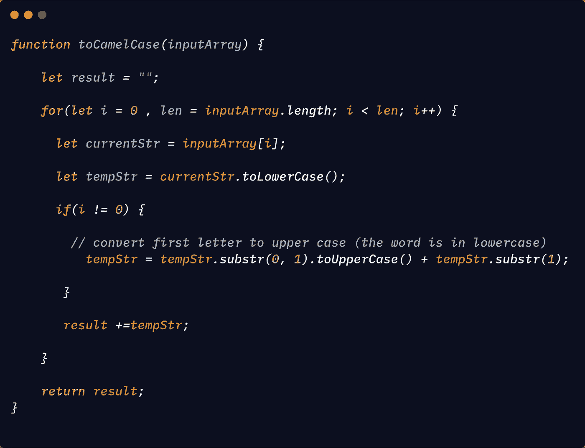
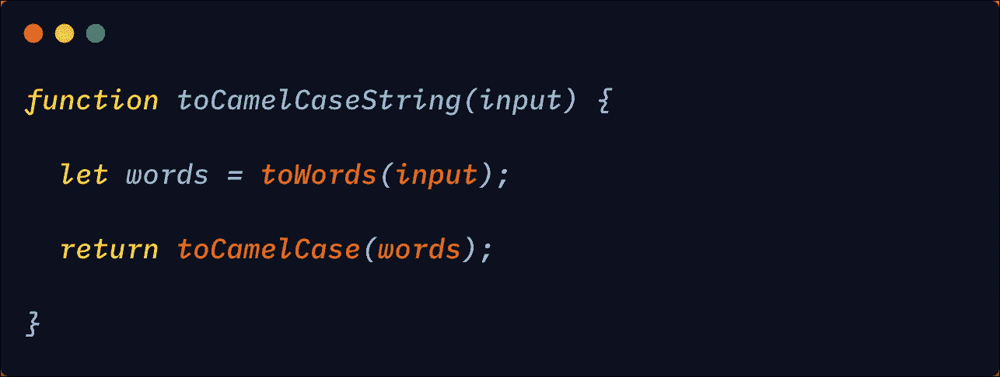
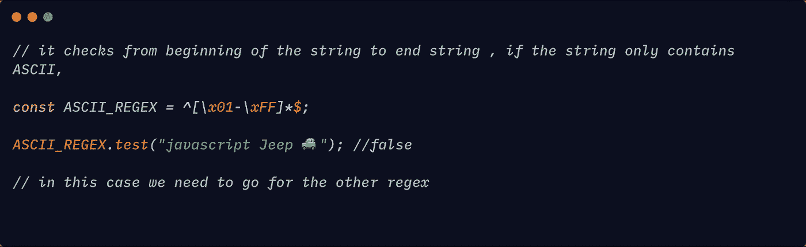

# 在 Javascript 中将字符串转换为 camelCase

> 原文：<https://levelup.gitconnected.com/converting-a-string-to-camelcase-in-javascript-f88a646a22b4>

了解如何用 Javascript 将字符串转换成 camelCase。



图片来自维基百科

**茶包:**

```
**Camel case** (stylized as **camelCase**; also known as **camel caps** or more formally as **medial capitals**) is the practice of writing phrases such that each word or abbreviation in the middle of the phrase begins with a capital letter, with no intervening spaces or punctuation.Example: eBay, iPhone**The above details is taken from wikipedia.** 
```

将字符串转换为🐪情况

*   将输入转换为字符串类型
*   将字符串拆分成单词。分裂不仅仅是基于空间。我们使用正则表达式来解析一个字符串，这将删除所有的特殊字符，如果一个字符串有两个大写字母，则将字符串分成两部分，并将数字部分分开。
*   将第一个字符串转换为小写，将另一个字符串转换为大写。然后连接琴弦。

首先，我们需要将输入转换为字符串，以防将非字符串传递给函数:



[链接到代码](https://gist.github.com/Jagathishrex/f4b57d77a093b7a5614db0f95c5e5060)

现在我们需要使用正则表达式将输入拆分成单独的单词:

```
/[A-Z\xC0-\xD6\xD8-\xDE]?[a-z\xDF-\xF6\xF8-\xFF]+|[A-Z\xC0-\xD6\xD8-\xDE]+(?![a-z\xDF-\xF6\xF8-\xFF])|\d+/g
```

以上正则表达式的解释可以在[这里](http://regexr.com/4inb8)找到。

```
What this will do is , For input: "Text is 123 test TText123test !!12 --!~@#$%%^&*( (test)"The regular expression will match [Text, is, 123, test, T, Text, 123, test, 12, test]
```

现在我们可以使用字符串对象的`match`方法，使用正则表达式将其转换成单词。



[链接到代码](https://gist.github.com/Jagathishrex/f4b57d77a093b7a5614db0f95c5e5060)

现在我们已经将字符串转换为单词，我们可以将它转换为 camel case。

让我们创建一个接受字符串数组的函数。对于索引为 0 的字符串，将该字符串的所有字符转换为小写。对于数组中的所有其他字符串，只将字符串的第一个字符转换为大写，而将所有其他字符转换为小写。

这里，我们在循环的每次迭代中将每个元素都转换为小写。如果索引不是`0`，那么将第一个字符转换为大写。



[链接到代码](https://gist.github.com/Jagathishrex/f4b57d77a093b7a5614db0f95c5e5060)

现在让我们把上面所有的代码结合起来:



[链接到代码](https://gist.github.com/Jagathishrex/f4b57d77a093b7a5614db0f95c5e5060)

注意:如果字符串包含非 ASCII 字符，这不起作用。为了支持这一点，我们需要使用更复杂的正则表达式。

为此，我们测试字符串是否包含非 ASCII 字符:



匹配非 ASCII 代码的正则表达式可以在这里找到。要让它与非 ASCII 一起工作，只需替换`toWords`函数中的正则表达式。

> 如果你发现这个有用的惊喜🎁我这里[](https://www.paypal.me/jagathishSaravanan?source=post_page---------------------------)****。****
> 
> ****开心就分享😃 😆 🙂。****
> 
> ****跟随** [**Javascript Jeep🚙**](https://medium.com/u/f9ffc26e7e69?source=post_page---------------------------) **如果你觉得值得。****

**[](https://gitconnected.com/learn/javascript) [## 学习 JavaScript -最佳 JavaScript 教程(2019) | gitconnected

### JavaScript 是世界上最流行的编程语言之一——它随处可见。JavaScript 是一种…

gitconnected.com](https://gitconnected.com/learn/javascript)**