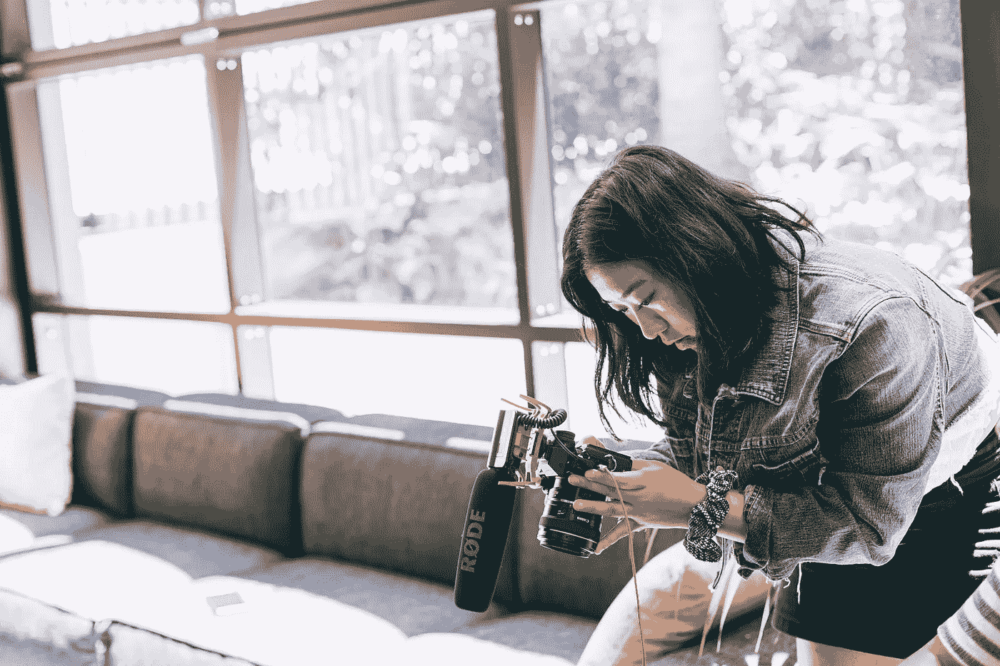

# 在本地机器上将视频转换为 GIF

> 原文：<https://levelup.gitconnected.com/converting-a-video-to-a-gif-on-a-local-machine-aec9bfc666cd>



来自 [Pexels](https://www.pexels.com/photo/woman-wearing-denim-jacket-holding-camera-3626623/?utm_content=attributionCopyText&utm_medium=referral&utm_source=pexels) 的 [Daria Shevtsova](https://www.pexels.com/@daria?utm_content=attributionCopyText&utm_medium=referral&utm_source=pexels) 摄影

如果您在一家对产品实施严格隐私和保密的公司工作，那么很难使用本地录制的视频在内部组织 Github 存储库上演示功能，并且保持在文件大小限制内。当然，你可以录制功能的视频，并在内部非 Github 频道上传播，但这需要额外的链接和知识来记录和传播。

> 如果需要的话，把视频直接复制到你组织的 Github 上不是更好吗？

当然会，但你的组织的 Github 可以限制视频的文件大小，而你的本地记录经常会违反这一点。此外，Github 允许以 GIF 格式嵌入视频。你可以将视频转换成 GIF 格式，但大多数视频转 GIF 工具都是在线的，提交一些内部功能的视频可能会损害你自己的科技公司的隐私/保密标准。

> 你知道在线服务对视频有所有权吗？
> 
> 条款和条件是否允许无条件公开共享？
> 
> 您是否在不知情的情况下将敏感信息传递给第三方？

将视频在本地转换成 GIF 格式，然后复制/粘贴到你的组织的 Github 上会更容易。

# 那么，我如何将本地视频转换成 GIF 呢？

带命令行/终端和*ffmpeg*；

## TL；速度三角形定位法(dead reckoning)

这个脚本(安装了 *ffmpeg* )会将你的视频文件转换成一个优化的 GIF 格式，其观看比例应该在 Github 组织的文件上传许可范围之内(当然取决于长度)

```
inputFile="./MyDemo.mov"
outputFile="./MyDemo.gif"palette="./palette.png"
filters="fps=15,scale=640:-1:flags=lanczos"
ffmpeg -v warning -i $inputFile -vf "$filters,palettegen=stats_mode=diff" -y $palette
ffmpeg -i $inputFile -i $palette -lavfi "$filters,paletteuse=dither=bayer:bayer_scale=5:diff_mode=rectangle" -y $outputFile
```

# 细节

## 什么是 ffmpeg？

ffmpeg 自称是*领先的多媒体框架，能够解码、编码、转码、多路复用、多路分解、流式传输、过滤和播放人类和机器创造的几乎任何东西*。它可以在多种环境下跨平台运行(微软、Mac、Linux 等)。

## 我如何安装它？

您可以[为您的操作系统下载](https://www.ffmpeg.org/download.html)可执行文件。如果你在 Mac 上，你也可以选择运行`brew install ffmpeg`来使用[自制软件](https://brew.sh/)

## 转换脚本实际上做什么？

```
inputFile="./MyDemo.mov"
outputFile="./MyDemo.gif"
```

这些是在转换过程的输入/输出中使用的文件的名称和位置。我们可以将脚本进一步细化为一个 shell/批处理文件，作为一个接受参数并去掉这些参数的函数(即替换为`$1` / `$2`),但是为了透明起见，我们在这里包含了这些参数。

```
palette="./palette.png"
```

这定义了作为第一个 ffmpeg 命令的一部分生成的调色板文件的文件和位置

```
filters="fps=15,scale=640:-1:flags=lanczos"
```

这为转换过程定义了特定的过滤器。1.每秒帧数设置为 15(在大多数情况下已经足够，可以减小文件大小；默认值为 25)。2.该比例强制一个维度上的输出显示纵横比为 640，同时保持另一个维度上的比例(-1)。3. *lanczos* 是一种结合了清晰度和平滑动画的重新缩放算法。

```
ffmpeg -v warning -i $inputFile -vf "$filters,palettegen=stats_mode=diff" -y $palette
```

第一次执行 *ffmpeg* : 1。将日志级别设置为*警告*。2.将输入文件设置为先前定义的参数。3.从输入视频中创建一个调色板文件，该文件是下一步编码中使用的 256 色代表性调色板。4.设置输出调色板文件名&的位置。

```
ffmpeg -i $inputFile -i $palette -lavfi "$filters,paletteuse=dither=bayer:bayer_scale=5:diff_mode=rectangle" -y $outputFile
```

最后一次执行 *ffmpeg* : 1。设置要使用的输入视频文件。2.设置要使用的输入调色板文件。3.使用 *Libavfilter* 从 filtergraph 中读取数据。4.设置我们之前定义的过滤器，并重用输入中给定的调色板文件。—选择一个*抖动*模式，并指定*拜尔*算法，以低于交叉阴影图案的默认比例选项使用。—*diff _ mode*将变化的*矩形*设置为重新处理的区域，这样可以获得更好的压缩效果。5.设置输出 GIF 文件名&的位置。

## 那里有很多我不明白的地方…

我也是，所以不丢人。除非你是视频编码/转码/过滤(等等)方面的专家。)，如果不阅读[文档](https://ffmpeg.org/documentation.html)和摆弄它，很多术语会让你摸不着头脑。然而，如果你的目标是将视频转换成 GIF 文件，并避免使用在线服务，上面的方法应该可以帮你实现。

这个故事最初出现在格雷格·伯恩的博客上——https://www.gregbyrne.ie/