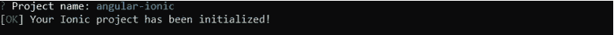

# 将 Angular Web 应用程序转换为 Ionic 应用程序

> 原文：<https://levelup.gitconnected.com/converting-angular-web-application-into-ionic-app-5af678325626>

## 为现有角度应用创建移动应用提供更好的指导


谷歌图片

在软件行业中，在您成功地构建了一个符合客户需求的 web 应用程序之后，您可能会被要求为同一个 web 应用程序构建一个移动应用程序，以满足移动用户的需求。因此，本文将通过简单详细的说明，为您提供更好的指导，将使用 Angular 开发的现有 web 应用程序转换为 Ionic native 应用程序。

> A ngular 是著名的前端 web 开发框架，基于 Typescript，开源。Angular 是 AngularJS 的发展版本。Angular 组件用于修改我们的程序 HTML、CSS 和逻辑。角度服务可以注入到组件中，通过添加服务，我们的代码可以重用。
> 
> Ionic 是一个移动应用开发框架，它是一个开源的 SDK，指导构建 HTML5 移动应用。Ionic 可以通过为用户带来移动应用程序的感觉，以高效的方式处理移动用户界面。

首先，您必须有一个现有的 Angular 项目(假设该项目名为“angular-ionic”)，否则您必须使用以下 CLI 命令创建它。

```
ng new angular-ionic
```

然后，您必须导航到新创建的目录，或者如果您有一个现有的项目，使用以下命令移动到该目录。

```
cd angular-ionic
```

我们的目的是为同一个 web 应用程序创建一个移动应用程序，因此需要将 Ionic 添加到现有项目中。为此，您可以使用 Angular CLI 命令“ng add”将 Ionic 包导入到现有项目中。以下命令将帮助您做到这一点。

```
ng add @ionic/angular
```

成功安装软件包后，您将获得如下输出。


然后，您必须使用以下命令用 Ionic 初始化您的现有项目。如果您使用此命令，您将询问一个问题来输入您的项目名称。确保输入项目名称作为您现有的项目名称。在这种情况下，项目名称是 angular-ionic。

```
ionic init
```



在成功地将 Ionic 初始化到项目中之后，您应该对 angular.json 文件进行了如下 2 处更改，该文件提供了有关项目特定配置的详细信息。

1.  将 angular.json 文件中的 output path“dist/angular-ionic”改为**“www”**，设置文件夹为 www 构建 Ionic 项目。


2.将改为 **< base href= "。/>index.html 文件中的**。< base href="" >定义文档中所有相对 URL 的基本 URL，默认情况下[设置为 root。](https://stackoverflow.com/questions/48555550/what-does-href-means-in-angular-2-4)


完成上述更改后，您可以为您的项目创建一个 Android APK，并使用以下命令来完成。

> 这里你可以看到，通过使用 [cordova](https://cordova.apache.org/docs/en/10.x/guide/overview/index.html) 我们可以将我们的 web 应用程序呈现到一个本地 web 视图中。Cordova 是一个开源框架，可以通过使用 [HTML、CSS 和 JavaScript 内容](https://ionic.io/resources/articles/what-is-apache-cordova)来实现各种移动平台的原生应用。

您构建的 Android APK 可以在平台的根文件夹下找到，并随“platforms \ Android \ app \ build \ outputs \ apk \ debug”移动。你可以通过手机安装它，或者通过启用模拟器，你可以看到你的离子手机应用程序！！！

```
ionic cordova run android --project="angular-ionic"
```

太好了…你将最终拥有一个基于你的 web 应用的移动应用。


值得注意的是，你可能必须解决原生应用的移动响应问题，如对齐问题、图标和图像的外观、间距问题等。

# 结论

**T** 这篇文章告诉你，如何使用 Ionic 为现有的 Angular 应用程序构建一个移动应用程序。按照上面的说明，你将最终成功创建一个移动应用程序。

感谢您的阅读😊！！！！！