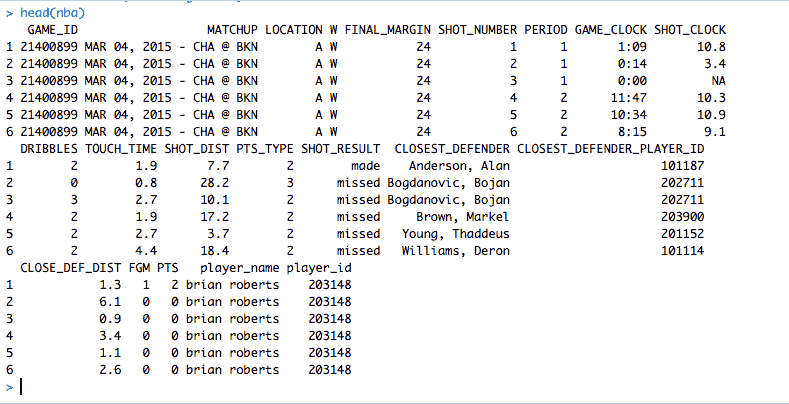
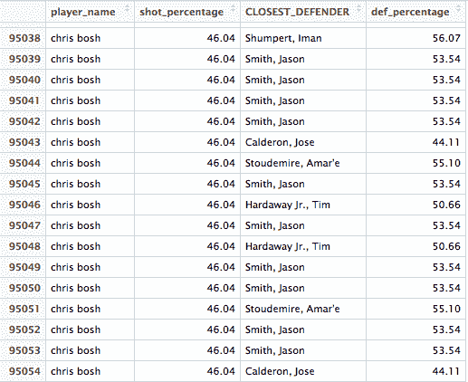

# 为机器学习将分类数据转换为数值数据—一种变通方法

> 原文：<https://levelup.gitconnected.com/converting-categorical-data-to-numerical-data-for-machine-learning-a-workaround-327afacbbe84>


当我在浏览 Quora 时，我遇到了以下问题— *我如何才能将分类数据转换为机器学习的连续数据？*

一些数据科学家很快指出这是不可能的。我是说，我想他们在某种程度上是对的。并不是把第一个元素叫做 1，第二个叫做 2，以此类推那么简单。但让我困扰的是，没有对可能的变通办法的解释。我们有一个完整的特征价值数据——我们如何理解它？我们应该抛弃它吗？我们如何使用这个预测器来进一步增强我们的算法？我遇到过几次这种问题，但训练模型和更好的方法肯定存在，总比什么都不做好。

首先，让我们探究一下为什么一开始就要问这个问题。许多机器学习算法，如随机森林和神经网络，不采用分类预测器(或者，软件包在输入它们之前会自动尝试转换它们)。结果，我们最终没有充分利用这个预测器，因为我们无法从数学上理解如何使用它。

接下来，让我们举例说明为什么我们不能简单地将分类预测值编码为虚拟数值。

假设我们有两个向量，名字和高度。

```
name = ["Kevin Durant", "Kyrie Irving", "James Harden", "Russell Westbrook"] # Categoricalheight = [82, 74, 77, 75] # Numerical
```

对于高度矢量，这是一个数字，我可以**客观地**从数学上理解它。我可以从高到低排序:82 > 77 > 75 > 74。我可以平均一下:77。诸如此类。

然而，对我来说没有意义的是**客观地**说:凯文·杜兰特>詹姆斯·哈登>拉塞尔·威斯布鲁克>凯里·欧文。显然你可以主观地说这个**，**但数学上不行。我能把那些球员相加吗？取他们的平均值？不，为了推动这一点，让我们假设我们有第三个向量，也是绝对的

```
favorite_color = ["Green", "Blue", "Red", "Purple"]
```

虽然你可能强烈认为紫色是国王，但你不能用数学来表达它。你不能对这些颜色求和，也不能对它们进行排序。

我看到的一个常见错误是人们盲目地将分类向量编码成虚拟数值。换句话说，他们说绿色= 0，蓝色= 1 等等。现在，这有时可能对二进制分类器有效，但是当向量长度增加时，如果使用不当，这实际上会损害您的模型。让我们探索一下为什么会发生这种情况。

当我们将变量编码成相应的数字时，我们的模型开始假设它们也像数字一样。74 和 82 之间的差值大于 72 和 77 之间的差值。如果我们像对待数字一样对待类别，我们让绿色= 0，蓝色= 1，红色= 2，紫色= 3，它会假设绿色(0)和紫色(3)之间的距离大于蓝色(1)和红色(2)之间的差异，这显然没有多大意义。它还会假设红色和紫色之间的平均值是 2.5。还是没用。

大多数时候，我看到人们抛弃这些特性，因为他们认为它们不能被使用。或者更糟，尝试一些时髦的系统将它们转换成连续变量，输入到他们的模型中。

诀窍是使用无关的数据对其进行特征设计，使其成为更有用的东西。

让我们回到 NBA 的例子。为了说明，我将使用来自 Kaggle 的 [NBA 投篮日志数据集。它拥有 2014-2015 NBA 赛季期间拍摄的每一次投篮，以及许多相应的属性，如运球计数、投篮时钟上的时间等。](https://www.kaggle.com/dansbecker/nba-shot-logs)



既有定量变量，也有定性变量。假设我想运行一个机器学习算法，该算法获取所有变量并对击球结果进行分类。“球员姓名”(射手)和“最近的后卫”变量都是分类变量。有 281 个独特的因素，因此用虚拟变量对它们进行编码是不合逻辑的。这是不是意味着我们需要把它们扔掉？不。射门的人和最近的防守队员都是重要的信息，我们想利用他们。你可以这样做:

每个玩家都有附随的数据。我们知道詹姆斯·哈登在那个赛季投了多少球(可能很多)。我们知道有多少人进去了，有多少人没进去。所有这些其他信息都是定量的——那么为什么不针对每个玩家制定一个相应的定量变量呢？

你可以写一个函数来计算每个球员的投篮命中率。

```
shot_percentage = number_shots_made / (number_shots_made + number_shots_missed)
```

这将给我们一个量化的变量，对每个投篮者来说都是独一无二的。

你可以对最近的防守者做同样的事情——计算一个“防守百分比”,即#失误数除以#得分+失误数。再次，数量，但独特的代表分类变量。



现在我们对每个分类变量都有了一个定量变量。shot_percentage 列是詹姆斯·哈登的定量对应列。换句话说，我们现在可以用数学方法来指詹姆斯·哈登。这个数字，具体对应于他，可以被排序，你可以找到这些数字的平均值，你可以用它做所有不同类型的定量分析——所有这些都是参照你之前的定性变量。

目标是使用旧数据的特性来设计新数据。

如有任何问题，请随时联系我们！

crb4595@gmail.com

社交媒体:【https://linktr.ee/chrisbuetti 