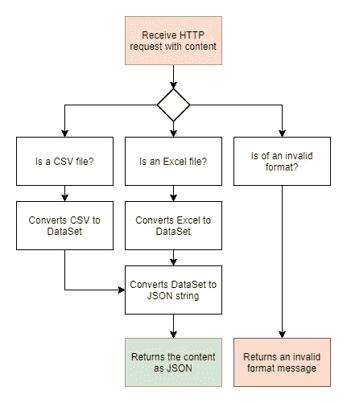

# 使用 C#和 Azure 函数将 Excel 文件转换为 JSON

> 原文：<https://levelup.gitconnected.com/converting-excel-files-to-json-using-c-and-azure-functions-af8ec04be7ff>

这是一个关于如何使用 Azure 函数轻松地将 Excel 或 CSV 转换为 JSON 的故事，利用云计算的力量，并且没有为此维护 Web API 的麻烦。

*TL；DR；*如果你正在寻找源代码，请到本文底部的 GitHub 库。

[Azure Functions](https://azure.microsoft.com/en-us/services/functions/) 是微软的一个无服务器解决方案，它允许开发者以令人难以置信的速度构建解决方案，而不用担心创建完整应用程序的开销。只需编写您的业务逻辑代码，您就可以万事大吉了。要开始使用它，在[Azure on Microsoft Learn | Microsoft Docs](https://docs.microsoft.com/en-us/learn/azure/)上有相当广泛的文档和培训材料可以帮助你。

在你了解了一些 Azure 函数以及如何使用它之后，让我们进入编码。这个项目旨在创建一个简单的功能，接收一个 Excel 文件(*)。xls* 或*。xlsx* )，甚至一个*。csv* 文件，并将其输出为 JSON 字符串。您可以使用它来转换来自不同数据源的数据，用于您的下一个数据科学项目，甚至作为基于 Excel 文件的简单 CRUD，在用户将某些内容更改为对开发人员更友好的格式后进行转换。

# VS 代码和 Azure 函数

这已经很好了，Visual Studio 代码为 Azure 函数提供了惊人的[扩展](https://marketplace.visualstudio.com/items?itemName=ms-azuretools.vscode-azurefunctions)。您可以[使用模板创建您的第一个函数](https://docs.microsoft.com/en-us/azure/azure-functions/create-first-function-vs-code-csharp)，直接从您的机器上模拟测试环境等等。我推荐使用这种方法，因为它将创建项目所需的所有文件，在 Azure 上创建功能，并直接集成您的部署环境。是的，你可以用 Azure 功能进行 CI/CD。

# 逻辑

游戏计划很简单，接收一个包含我们需要转换的文件的 HTTP 请求，检查它的有效性，转换成一个[数据集](https://docs.microsoft.com/pt-br/dotnet/api/system.data.dataset?view=net-5.0)(将来允许多种输出格式的可扩展性)并执行到 JSON 的转换。

为此，我们将使用 [ExcelDataReader](https://github.com/ExcelDataReader/ExcelDataReader) 和 [ExcelDataReader。数据集](https://www.nuget.org/packages/ExcelDataReader.DataSet/)将 Excel 文件解码成数据集。之后，[崔特尔](https://github.com/Cinchoo/ChoETL)和[崔特尔。JSON](https://www.nuget.org/packages/ChoETL.JSON/) 将帮助我们轻松地将数据集转换成有效的 JSON 格式，考虑到 Excel 文件中的一些(如果不是大部分)内容可能会因字符和符号而变得混乱，这会破坏简单的编码器。



应用程序的工作流程

您的代码将从 Run 方法中执行。就像“main”方法一样，在那里编写您的逻辑，用所需的身份验证级别、端点使用的 HTTP 方法和路由参数(如果需要)来参数化您的输入。

```
[FunctionName("<your-function-name>")]
public static async Task<IActionResult> Run([HttpTrigger(AuthorizationLevel.Anonymous, "post", Route = null)] HttpRequest req, ILogger log)
```

https://github.com/gmullernh/azurefunctions-excel-to-json[的完整代码](https://github.com/gmullernh/azurefunctions-excel-to-json)

# 结果呢

实现功能后，让我们测试结果。


包含一些重要数据的 Excel 文件。

现在，让我们使用一个简单的 web 页面从系统中加载文件并上传到函数中。处理完数据后，我们将接收 div 中的内容。


将 excel 文件的内容转换成 JSON

你可以接收内容并将其发送到网页、另一个应用程序端点、另一个 Azure 功能或你的工作(或你的梦想)需要的任何其他介质。

完整代码可在 https://github.com/gmullernh/azurefunctions-excel-to-json[获得](https://github.com/gmullernh/azurefunctions-excel-to-json)