# 使用 CreateJS 和 ZIM 将 Adobe Flash 和动画应用程序转换或移植到 HTML 5 Canvas

> 原文：<https://levelup.gitconnected.com/converting-or-porting-adobe-flash-and-animate-apps-to-html-5-canvas-with-createjs-and-zim-af5ac586e317>

## 你的指南

## 由于 Adobe 不再支持 Flash 插件

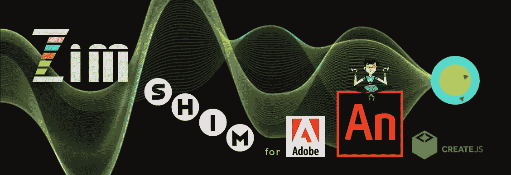

[ZIM 垫片](https://zimjs.com/animate.html)转换动画和 Flash 文件到 ZIM

> 2020 年 12 月，Adobe 将正式停止支持 Flash 插件。

一个 dobe Animate(以前的 Adobe Flash)导出到 HTML 5 作为 CreateJS。 [CreateJS](https://createjs.com) 是一个为 HTML 画布构建的 JavaScript 库。ZIM 是一个 JavaScript 框架，为 CreateJS 增加了便利、组件和控件。你可以在[你的《在画布上创作编码指南](https://medium.com/@zim_67337/your-guide-to-coding-creativity-on-the-canvas-ada0996298f6)中看到它的全部内容。

我们当前的指南有两个主要部分:

1.  从动画导出到画布
2.  在画布上重新创建 ActionScript 内容

# 1.从动画导出到画布

当你开始一个动画项目时，你可以选择一个画布文件。然后，您可以使用 Actions 窗口中的 CreateJS 编写 JavaScript 代码。你会发现 CreateJS 中的编码非常类似于 action script——它是在带有电影剪辑等的舞台上进行的面向对象编程。导出时，输出将是画布上的 HTML 和 JavaScript (CreateJS ),而不是传统的 ActionScript SWF 文件。

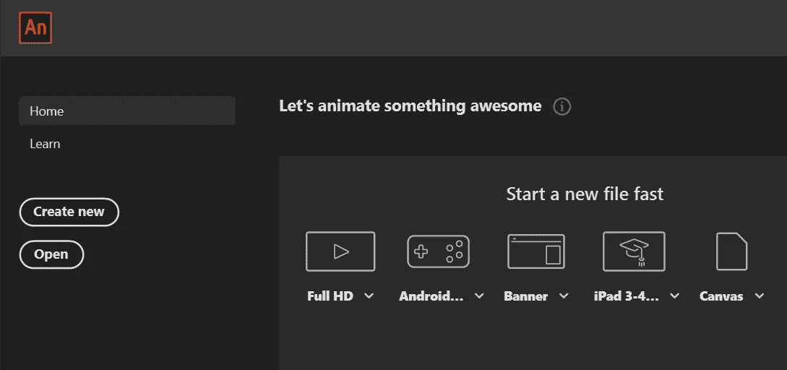

打开 Adobe Animate 并选择画布文件(在右侧)

## 添加 ZIM 特色动画！

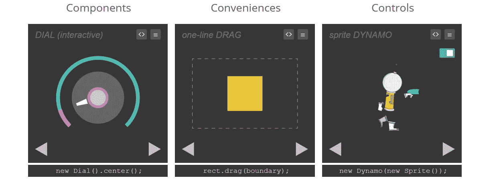

许多 [ZIM](https://zimjs.com) 组件、便利装置和控制装置中的一些

IM 是一个 JavaScript 框架，它添加了许多组件，如按钮、滑块、转盘、单行拖放、多次点击测试等便利功能，以及视差、笔、布局、粒子发射器等控件。把 ZIM 想象成一个有更多选择的简化版。

[ZIM·希姆](https://zimjs.com/animate)为 Adobe Animate 添加了 ZIM 动画的所有功能。使用 SHIM，您可以:

*   Adobe Animate 中的代码 [ZIM](https://zimjs.com) 右
*   将代码与 CreateJS 代码一起导出
*   ZIMIFY 控制动画对象，如电影剪辑
*   添加任何 ZIM 物体，如水滴，发射器等。
*   使用简单的拖动、动画和变换工具
*   添加无数的组件和便利
*   包括屏幕阅读器的可访问性
*   创建超过 100 个令人兴奋的功能！

关于画布上的编码如何补充或取代 Animate 中的编码，请参见[画布上的编码创意指南](https://medium.com/@zim_67337/your-guide-to-coding-creativity-on-the-canvas-ada0996298f6)。

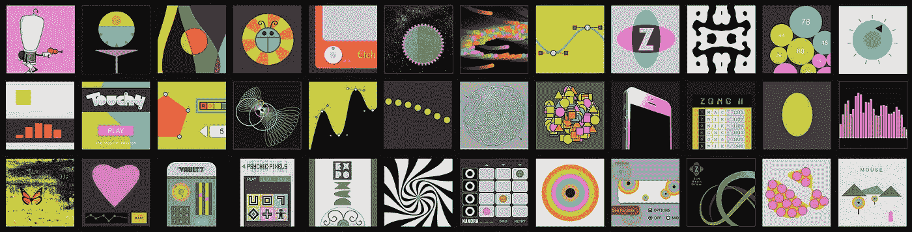

在画布上编码很像 Flash

## 添加 ZIM 垫片动画

进入到 [ZIM SHIM](https://zimjs.com/animate.html) 页面，下载带有样本 FLA 和模板的 [ZIP 文件](https://zimjs.com/animate/zimshim.zip)。在动画中，按下 stage 并在右侧选择(或从顶部菜单中找到发布设置> HTML/JS):

> 发布设置>更多设置> HTML/JS >导入新内容

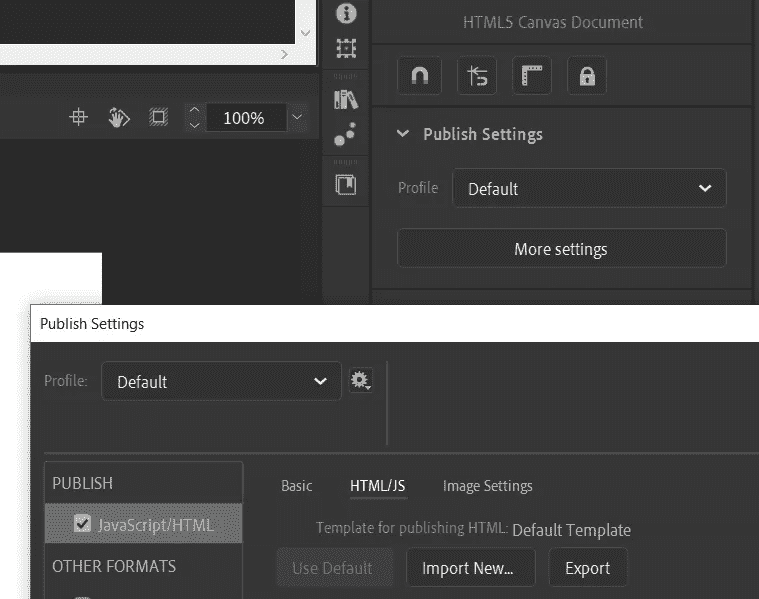

然后从 [ZIP 文件](https://zimjs.com/animate/zimshim.zip)中导入模板，并在 Animate 中用 ZIM 编码。观看[视频](https://youtu.be/ZAtEEUzmCdE)或加入 ZIM [SLACK](https://zimjs.com/slack) 寻求帮助，有一个#animate 频道。下面是以 ZIP 格式发布 FLA 文件的结果。粉色圆圈是 Animate 制作的电影剪辑。剩下的就是 ZIM 了。带注释的代码如下。

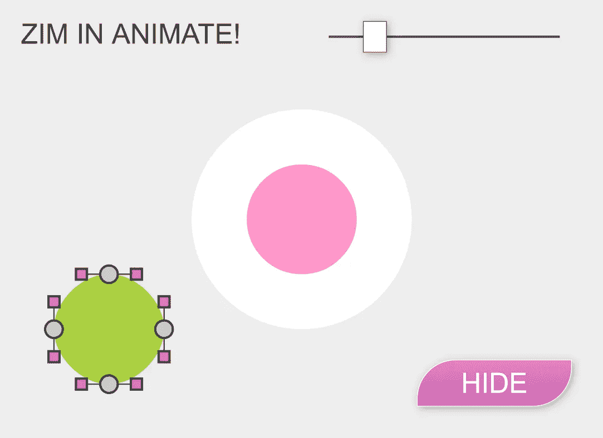

```
// The pink Circle was made in Animate on the timeline
// and given an instance name of circle (so is this.circle)
// we use it later down below// Here is a circle with ZIM: 
var circle = new Circle(100, white).center(); 
 .drag({onTop:false}); // so it stays at the bottom// Here is a Blob animating in bottom left:
new Blob({radius:50})
 .pos(50,50,LEFT,BOTTOM)
 .sca(0)
 .animate({scale:1}, 700, "backOut");

// Here is some text fading in with delay
var title = new Label("ZIM IN ANIMATE!")
 .sca(.7)
 .alp(0)
 .centerReg() // so emitter later can easily center on this
 .pos(20,20)
 .animate({
  wait:1,
  props:{alpha:.8},
  time:1
 });

// Components almost all work the same way 
var slider = new Slider(.5,3)
 .sca(.7)
 .pos(30,20,RIGHT)
 .change(function(){
  circle.sca(slider.currentValue);
  stage.update();
 });
slider.currentValue = circle.scaleX; // MovieClips are CreateJS objects and must be zimified. 
// drag({all:true}) drags the whole clip not individual children
var mc = zimify(this.circle).drag({all:true});// the MovieClip will need its bounds set to use ZIM features
mc.setBounds(-50,-50,100,100);// Animate objects are added to a timeline which is a MovieClip
// move their parent to the top and zimify()
zimify(mc.parent).top();// if ever asking for a mouse event object stageX and stageY 
// use instead frame.mouseX and frame.mouseY 
// which correct positions for retina scale// Here is a hitTest between the mc and the logo
// Let's spice it up with an Emitter... 
// we will start it paused and spurt when it hits 
var emitter = new Emitter({startPaused:true})
  .centerReg()
  .loc(title); 
mc.on("pressmove", function(){
 if (mc.hitTestBounds(title) && emitter.emitterPaused) {
  emitter.spurt(10);
 }
});// Here is a feature rich Button that will toggle circle2
// there are still 40 more options available...
new Button({
 label:"HIDE",
 toggle:"SHOW",
 corner:[50,0,50,0],
 backgroundColor:pink,
 rollBackgroundColor:blue,
 borderColor:white,
 gradient:.1
})
 .sca(.7)
 .pos(30,30,true,true)
 .tap(function(e){
  mc.visible = !e.target.toggled;
  stage.update();
 }); 

// etc. etc.  See the ZIM Examples at [https://zimjs.com/examples](https://zimjs.com/examples) 
// This includes ZIM Bits with 64 examples of basic interactivity 
// There is also the Learn Section and the Vids and Skool, and Tips
// See them all at [https://zimjs.com](https://zimjs.com) 
// and help ZIM grow at [https://www.patreon.com/zimjs](https://www.patreon.com/zimjs)
// SLACK at [https://zimjs.com/slack](https://zimjs.com/slack) has discussion and support
// Welcome to the colorful world of coding!!!
```

这是一个关于使用 ZIM 垫片的视频。

## 移植到 CANVAS 时需要注意的事项

在动画中与 ZIM 一起工作时，有一些事情需要注意。一般来说，你应该能够发布，事情会工作。

1.  Adobe 有一个循环参数，因此设置 loop = zim.loop 使用 loop()。
2.  使用 frame.mouseX 和 frame.mouseY 捕获鼠标位置。这适应了出口到 HMTL 5 的阶段的缩放。
3.  注意动画中的边界-许多 ZIM 要素需要设置边界。在 zimify(obj)之后，您可以通过 obj.setBounds()和 obj.outline()来查看边界。
4.  除非您拖动({all:true})，否则 drag()将拖动 MovieClip 的某些部分。
5.  参见 [ZIM 提示](https://zimjs.com/tips.html)了解我们在 ZIM 编码的许多现代方式。
6.  从 ZIM 猫开始，ZIM 用秒来表示动画()等的时间。
7.  如果你刚到 ZIM——确保你使用了 [ZIM 文档](https://zimjs.com/docs.html)和 [ZIM 学习](https://zimjs.com/learn.html)！

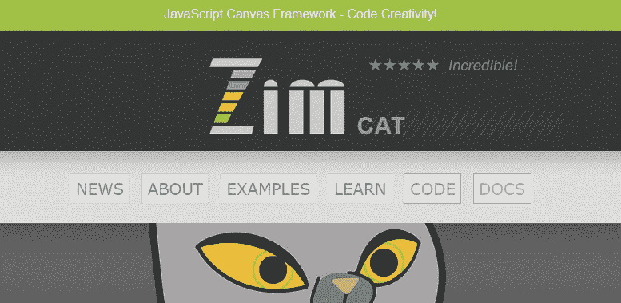

# 2.将 ActionScript 转换为画布

这里没有将 ActionScript 文件转换为 Canvas 的直接方法，但是像 MovieClips 这样的资源可以从基于 ActionScript 的 FLA 文件复制到基于 Canvas 的 FLA 文件。这里有一个 [Adobe 转换参考](https://helpx.adobe.com/ca/animate/kb/as-to-html5.html)，它映射了各种命令。

您可以使用动画中的动作窗口在 CreateJS 和 ZIM(带 SHIM)中编码。但是，您可能会发现直接在 ZIM 中编码并引入动画形状或电影剪辑作为资产更容易。如果你有复杂的矢量或时间轴动画，这是有意义的，否则，甚至不使用动画更有意义。以下是一些与使用矢量资源相关的视频:

## 经验

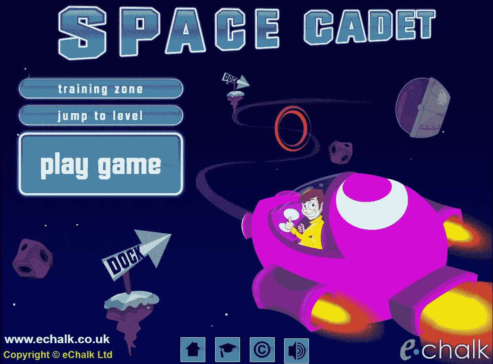

这里有一个来自一家公司的故事，这家公司已经从 Flash 转向画布。eChalk 有限公司的创始人 Iestyn Jones 解释道:

> eChalk 是一个教育模拟和游戏的在线图书馆。我们大约有 1000 个资源最初是 Flash web 应用程序，我们需要尽可能高效地将它们转换成 HTML5/canvas 资源。我们的开发人员习惯了 AnimateCC 环境，我们必须利用我们庞大的动画和图像档案进行 HTML5 转换。
> 
> 没有现成的框架符合这个要求，但后来我们遇到了 ZIM；说它是从事 AnimateCC 的开发人员的理想框架是保守的说法。因为它是建立在 createjs 之上的，所以很自然地适合使用 Animate 的 JavaScript 输出。当你加入这种 Zim 的思想，用最少的编码获得最大的结果，它导致了速度和效率的巨大飞跃，使我们能够产生高度参与的资源。
> 
> Zim 允许我们做以前在 Flash 中做的所有事情，甚至更多。到目前为止，我们已经转换了 850 多种资源，使用 Zim 越多，转换过程就越快。毫不夸张地说，Zim 改变了我们制作互动内容的方式，为我们提供了迄今为止超出我们技术能力的创造性可能性。

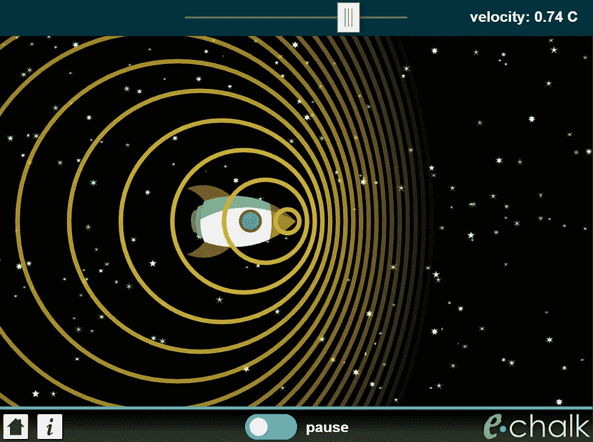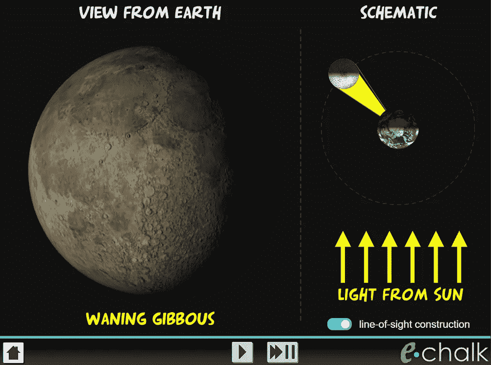

## 经验

还有一个关于从 Flash 转移到画布的故事。这是 ICT 游戏公司的总裁詹姆斯·巴雷特写的。

> 大约 6 年前，我开始寻找 Flash 的合适替代品，越来越担心如何及时替换我的内容。找到 ZIM 绝对是天赐之物！我最初对学习一门新语言有些担心，但我不需要担心，因为 ZIM 的一些小例子和优秀的文档很快向我展示了它的巨大潜力。
> 
> 在很久以前，我曾经使用时间轴(AS1)在 Flash IDE 中向舞台添加资源，然后使用 AS3 在运行时放置资源。这听起来没什么，但对当时的我来说是一个巨大的进步。与 ZIM 的过程是一样的，制作资产，然后添加到画布上，并创建用户界面。非常有趣！
> 
> 我在 Illustrator 中制作静态资产。如果我需要动画，我会使用 Animate CC 的洋葱皮特性来排列它们。然后我导出一个精灵表，制作一个 JSON 文件，剩下的就是画布上的 ZIM。我发现 ZIM 非常灵活和富有创造力，想到一个想法很有趣，想知道你将如何去做，经过一番挠头之后，你发现你已经做到了。
> 
> 顺便说一句，ZIM 的人们可以在被要求休息的几分钟内帮助挣扎中的齐姆学徒！太棒了。YouTube 让大众的视频制作/分享民主化了，我真的觉得 Zim 也为代码做了同样的事情！

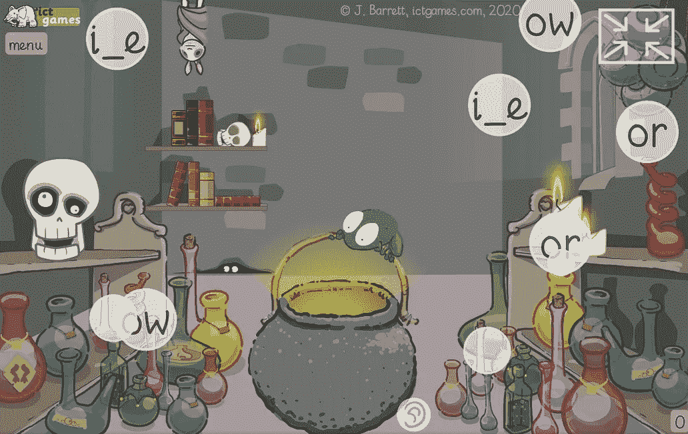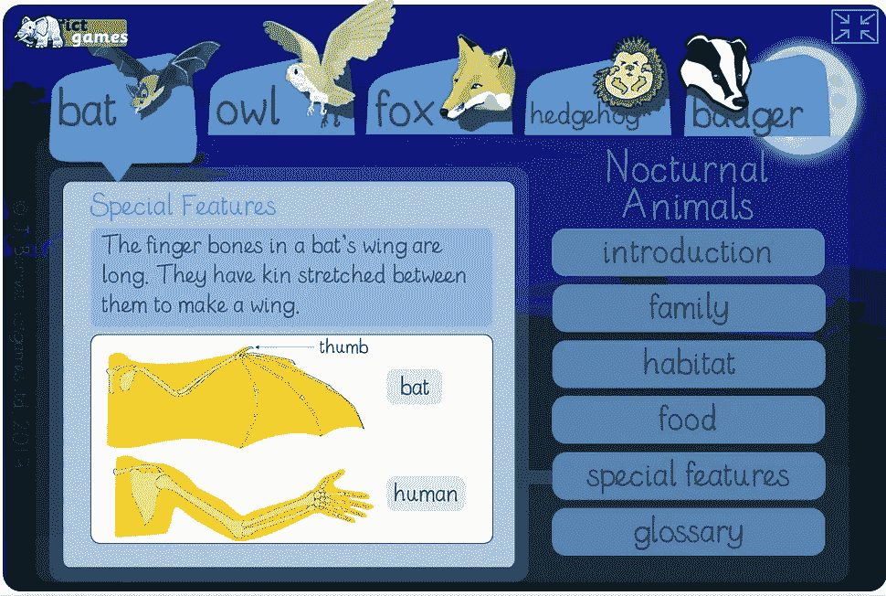

## 易接近

画布是一幅很大的图片，但是在 ZIM 中，我们在画布后面添加了隐藏的 HTML 标签来帮助屏幕阅读器。你可以在◎ [用 JavaScript](https://medium.com/@zim_67337/your-guide-to-accessibility-on-the-canvas-with-javascript-ff58074c30c8) 在画布上实现可访问性的指南中看到更多。

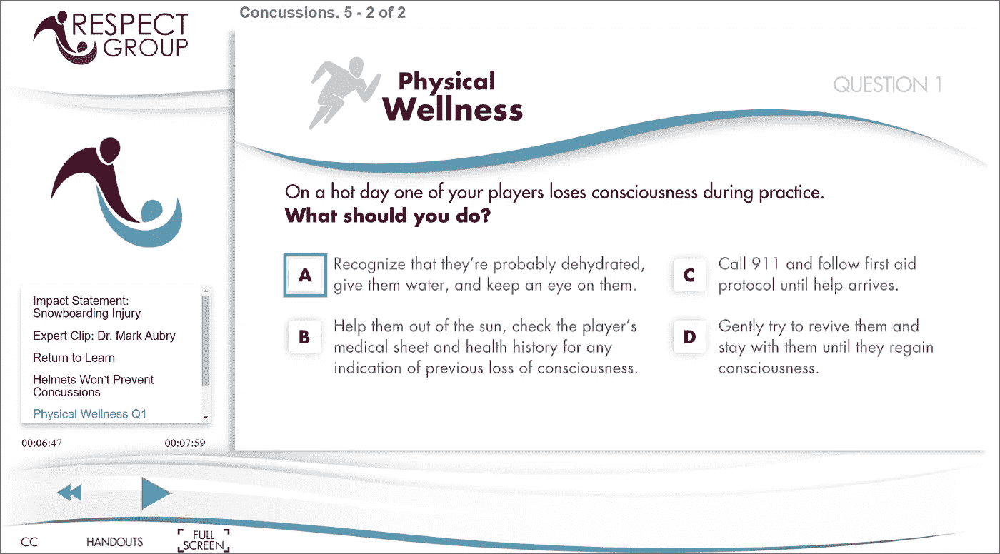

Adobe 动画导出上的 ZIM 辅助功能

下面是 Nathan 关于将 Adobe Animate 导出到 ZIM 并具有辅助功能的一个故事:

> ZIM 框架及其为 HTML5 画布带来可访问性特性的能力对于我和我的团队来说是再好不过的时机了。ZIM 赋予了我们的交互式电子学习程序由依赖辅助技术与网络互动的人来控制和完成的权力；随着可访问性在我们所有的社区中变得越来越重要，这是一个不断增长的话题。使用 Adobe Animate 的 ZIM SHIM，ZIM 框架集成并简化了我们公司在 Adobe Animate 中开发电子学习内容的日常操作。只需在精心设计的 ZIM 网站上遵循几个步骤，你就已经有了一个可以使用的 HTML5 画布。无需从头开始重建！ZIM 已经被证明是 HTML5 画布可访问性的最佳解决方案，我很高兴找到了 ZIM！

# 结论

睫毛是互动媒体创作的巅峰。我花了 15 年的时间在 Flash 中编写代码，这非常壮观。那些没有用 Flash 编写代码的人并不完全理解它有多棒。然而，我从未像现在这样在 ZIM 用 JavaScript 在画布上编码。这是没有使用 Adobe Animate。

使用 ZIM 的创作者同意，如果需要的话，可以使用 Animate 制作时间轴动画和矢量艺术。除此之外，ZIM 拥有强大的动画技术和出色的精灵控制(参见◎ [您的 JavaScript 画布动画指南](https://medium.com/@zim_67337/your-guide-to-animation-on-the-canvas-with-javascript-cb928c4c888a))。ZIM 也有曲线和斑点的贝塞尔曲线创造的形状，所以动画并不像你想象的那样经常需要。参见[画布上的图像、声音和精灵指南](https://medium.com/@zim_67337/your-guide-to-images-sounds-and-sprites-on-the-canvas-1b13b019e76d)。

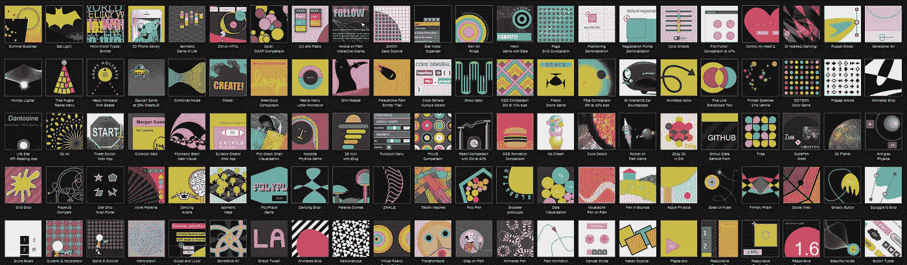

许多 [ZIM](https://zimjs.com) 例子中的一些没有做成动画

ZIM 示例页面有大约 200 个示例，只有几个使用 Adobe Animate。我们的建议是在 ZIM 或另一个画布框架中重新制作项目。参见[选择 JavaScript 画布库或框架的指南](https://medium.com/@zim_67337/your-guide-to-selecting-a-javascript-canvas-library-or-framework-3584f4512a30)。我们认为你会喜欢它的！

祝一切顺利，如果你需要帮助，请加入我们的 [ZIM 松弛](https://zimjs.com/slack)！

抽象博士


> *在推特上关注我们在* [*ZIM 学习*](https://twitter.com/zimlearn) *这里是* [*ZIM 在 YouTube 上学习*](https://www.youtube.com/zimlearn) *！*