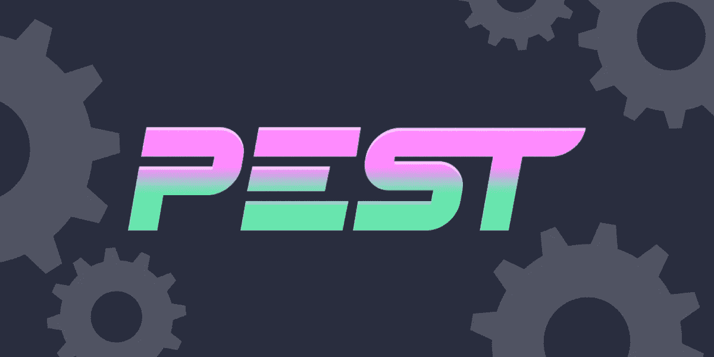
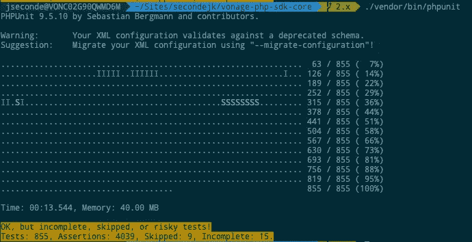
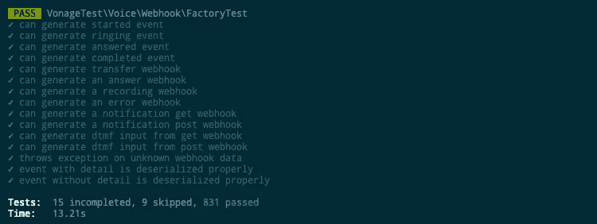
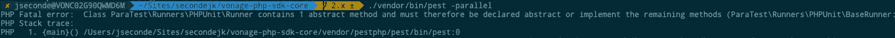
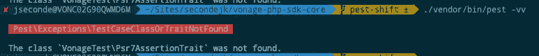

# 将您的测试套件转换为 PEST

> 原文：<https://levelup.gitconnected.com/converting-your-test-suite-to-pest-9cdc26d79c7>

坦白地说，通过测试驱动开发来改变我写代码的方式改变了我作为程序员的能力。突然间，我可以满怀信心地编写服务和功能了——对我来说，为什么这么多公司*仍然*“没有时间做测试”是一个谜长期以来， [PHPUnit](https://phpunit.de/) 一直是编写 TDD PHP 时事实上的首选工具。

最近出现的一个新项目可能会改变这种情况。有[好的文档](https://pestphp.com/docs)和围绕它建立的 [meetup 社区](https://www.youtube.com/playlist?list=PLsGrIkNZ8eVk0RAThd7Ed6cdBvl5JW-GA)，这对开发者来说是一个有吸引力的选择。我当然指的是 PEST，所以我想我应该在我们自己的 [Vonage PHP SDK](https://github.com/Vonage/vonage-php-sdk-core) 上介绍一下。

# 当前套房

我们的 Vonage PHP SDK 经过多年的全面维护，因此包含一个完整的测试套件。虽然它不是“企业级”的，但它仍然是测试 PEST 的一个有用的练习。

这个分支上的当前套件有 831 个通过测试，运行 4039 个断言。有 9 个跳过的测试和 15 个未完成的测试。PHP8 的总执行时间是 13:54。

根据记录，它运行得相当不错，其中一个测试实际上是超时测试，增加了时间。这里的目的不是真正提高跑步者，而是改变它，看看会发生什么。我们的第一站是[安装害虫](https://pestphp.com/docs/installation)并运行它。PEST 值得注意的最重要的特性之一是*它完全向后兼容 PHPUnit* ，因此无论您使用什么语法，它都可以互换使用。这允许我们安装 PEST，运行它以查看结果，并可能尝试和实现最近的[并行测试](https://pestphp.com/docs/plugins/parallel)功能。

要安装 PEST，我在命令行中运行以下命令:

看起来似乎很容易，一个作曲家命令后，我可以运行害虫。然而，值得注意的是，它将运行的这个存储库已经有了要求——其中一个要求是 PHP 最低版本为 7.3。PEST 已经要求 PHP 的最低版本为 7.3 及以上，所以不需要修改就可以更新。

是时候运行 PEST 了，看看会发生什么:

您会注意到的第一件事是，PEST 使用类似于`--testdox`参数的输出格式来格式化 PHPUnit 的输出。它的输出相当不错:

嗯，所以是 13.28 秒？好吧，实际上只对跑步者来说更快。如果我们尝试使用 PEST 的并行功能会怎么样？它是单独包装的，所以我们去买吧:

现在运行它:

还有……哦。好吧，看起来我们的运气已经用完了:

快速搜索一下就会发现，我们在 PHP 本身中有一个错误，正如 PHPUnit 的问题日志中所记录的:

[sebastianbergmann/phpunit # 4305](https://github.com/sebastianbergmann/phpunit/issues/4305)

我想这就是我们为有点锋芒所付出的代价。

# PHPUnit 语法与 PEST

我一直在玩 test runner，但是并没有真正展示代码或者解释 PEST 的实际用途。

Laravel 核心成员 [Nuno Madro](https://twitter.com/enunomaduro) 创建了 PEST 作为一个新的框架，它模仿了 [Jest](https://jestjs.io/) Javascript 框架的语法。这非常符合当前 PHP(尤其是 Laravel)转向更基于闭包的函数式语法的趋势，类似于 Javascript 的编写方式。这在逻辑上是有意义的，因为你的全栈 web 应用程序的 PHP 后端测试是用与前端测试相似的语法编写的。这里有一个来自 Vonage PHP SDK 的“之前和之后”的例子:

我们在这里使用了一些常见的模式——神奇的方法`setUp()`在测试执行之前运行，然后我们使用`assertEquals()`,它是 PHPUnit `TestCase`的一个助手类(在我们的例子中，`VonageTestCase`从它向上扩展)。

现在，向您展示用 PEST 语法编写的相同测试:

总的来说，这是一个很好的例子，说明 PHP 生态系统正在向 Javascript 寻求新的想法——正如您所看到的，PEST 语法非常类似于 JEST。它还展示了 PEST 的一个核心价值，即在 API 中使用更灵活的方法链接来编写更少的代码，这是一种哲学上非常类似 Laravel 的方法。我们现在有了一个更高阶的`beforeEach()`,它内部有一个闭包，将在每次测试之前运行，现在 PHPUnit 中的经典 PHP 函数结构已经被更多的函数式语法所取代。这个例子还展示了[期望 API](https://pestphp.com/docs/expectations) 是如何被设计成以一种人类可读的方式用方法名如`expect(true)->toBe(value)`或`expect($variable)->toBeArray()`来链接断言的。

# 好吧，那么自动化呢？

老实说，事情并没有如我所愿。不过，我会告诉你为什么。

我从 Twitter 上注意到，不管代码是否在 Laravel 中，使用一个工具自动将 PHPUnit 套件转换成 PEST 实际上是可能的。因此，我前往 [Pest Converter](https://laravelshift.com/phpunit-to-pest-converter) 和[设置一个存储库和分支，以便在](https://github.com/SecondeJK/vonage-php-sdk-core/tree/pest-shift)上进行试验。运行时，Shift 将在您提供的基础分支上创建一个新的分支，并创建逻辑步骤提交以在语法间移动。首先需要做的事情之一是将`test/`文件夹改为`tests/`，这样转换器就知道在哪里寻找您的测试。

但是，在转换后运行 PEST 时:

嗯。那么，不是一帆风顺。值得注意的是，我不知道会发生什么，原因有两个:

*   Vonage PHP SDK 是框架无关的
*   这取决于[预言](https://github.com/phpspec/prophecy)库
*   使用了许多 PHP 特征，使得测试套件稍微复杂一些

与使用传统组合不同，PEST 具有不同的模式配置。PEST 有一个`pest.php`配置文件，允许您指定助手函数、特征和常用方法，如`RefreshDatabase`。您还可以指定要将这些类应用到哪些文件夹，如下所示:

`uses(\VonageTest\HTTPTestTrait::class)->in('Secrets');`

PEST 转换器无法解决这些问题的原因是大量的边缘情况。Laravel Shift 的 [Jason McCreary](https://twitter.com/gonedark) 在我们的支持对话中指出的一件事是，一些测试将一个应用程序容器设置到`$this->app`中，这与 Laravel 的应用程序基础设施相冲突(因为它不知道您是否有 Laravel 应用程序)。

# 结论

好了，虽然 PEST Converter 发现很难自动化测试，但它让我得出了两个结论:

*   Laravel Shift，Pest 转换器的创建者已经在查看我使用过的库中的边缘案例，并在研究如何处理它们，但更重要的是
*   *如果你的测试套件很复杂或者过度设计，就不要运行转换器——先解决这个问题*

像任何事情一样，通过自动化进行重大重构也有风险。在我们的例子中，风险是我们正在处理一个没有框架的原始 PHP 库。然而，Shift 通过目标分支进行更新，然后从目标分支创建 Shift 分支以最小化风险。如果不运行，就不要合并！您还可以选择使用[人工转换](https://laravelshift.com/human-shifts)服务，这将不可避免地产生一个完全转换的套件。

我想建议的是，如果你有一个 Symfony 或 Laravel 应用程序，这个转换器绝对是考虑到这些情况而设计的，所以这种转变将会非常稳固。

你应该收养害虫吗？一如既往，这取决于你。如果你想保持在 PHP 变化的前沿，那么这肯定是一个有吸引力的选择。但是请记住，PEST 构造其语法的方式自然符合 Laravel 的 API 流方法，所以如果您使用 Symfony、CakePHP 或 Drupal 等其他流行的工具，它确实有可能让您的开发人员感到困惑。

*最初发布于*[*https://learn . vonage . com/blog/2022/01/14/converting-your-test-suite-to-pest/*](https://learn.vonage.com/blog/2022/01/14/converting-your-test-suite-to-pest/)