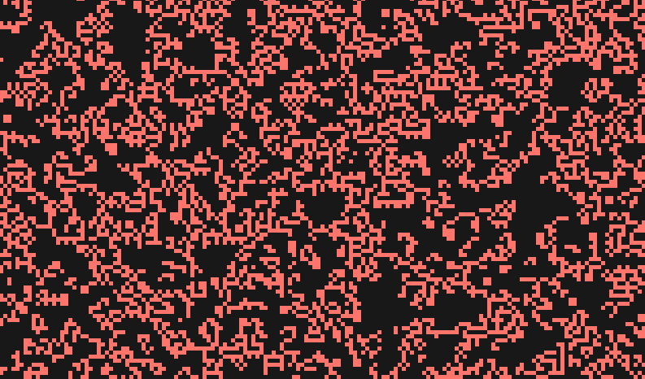

# 康威的 JavaScript 生活游戏

> 原文：<https://levelup.gitconnected.com/conways-game-of-life-in-javascript-9498ae1958fe>

人生的游戏是一个零玩家的进化游戏，游戏的发展将取决于它的初始状态。这个游戏有四个基本规则:

*   如果一个活细胞有三个以上的邻居，它就会死亡
*   如果一个活细胞的邻居少于三个，它就会死亡
*   如果一个死细胞正好有三个邻居，它就会复活
*   在其他情况下，单元保持其状态

详情可在 [**这里找到**](https://en.wikipedia.org/wiki/Conway%27s_Game_of_Life) :

而且你可以在这里 欣赏整个游戏过程[的史诗性:](https://www.youtube.com/watch?v=C2vgICfQawE&t=214s)

通过应用这些规则，我们的目标是在我们的项目中实现这个生命模拟器。结果应该是这样的。



**准备开发环境。**

我们的 HTML 文件非常简单:项目的名称，两个开始和停止游戏的按钮，以及我们的画布，所有的魔法都将在画布上发生。

请注意，脚本的顺序很重要。GameOfLife.js(我们的类文件)应该放在 index.js 之前

```
<body> <h1>Game of Life</h1> <div class="buttons-div"> <button id="start-random">start Random</button> <button id="stop">stop</button> </div> <canvas id="gamefield" width="1400" height="500"></canvas></body><script src="GameOfLife.js"></script><script src="index.js"></script>
```

**CSS 代码:**

```
*{ text-align: center; background-color: #181818;}h1{ font-size: 40px; color: White; margin: 0px; margin-top: 15px; font-family: 'Roboto', sans-serif; font-weight: 300;}.buttons-div > button{ background-color: rgba(255, 255, 255, 0.6); font-family: 'Roboto', sans-serif; font-size: 18px; padding: 10px; border: none; border-radius: 10px; margin: 20px; font-weight: 300; outline: none;}
```

在 **index.js** 中，我们简单地定义了我们的画布和画布的上下文:

```
const canvas = document.querySelector("#gamefield")const ctx = canvas.getContext("2d")
```

在 **GameOfLife.js** 中，我们将只创建一个包含游戏主要逻辑的类。

思考我们需要什么样的函数和变量，我得出了这样的结论:

**变量:**


**功能:**


在**数组初始化**函数中，创建两个带零的二维数组:

```
for (let i = 0; i < this.cells_in_rows; i++) { this.active_array[i] = []; for (let j = 0; j < this.cells_in_column; j++) { this.active_array[i][j] = 0; }}this.inactive_array = this.active_array;
```

在函数 **arrayRandomize** 中，我们循环遍历 active_array 并随机给每个块赋值 1 和 0:

```
for (let i = 0; i < this.cells_in_rows; i++) { for (let j = 0; j < this.cells_in_column; j++) { this.active_array[i][j] = (Math.random() > 0.5) ? 1 : 0; }}
```

**fillingArray** 函数的目标是根据每个单元格的状态给出颜色和位置。

我们定义了颜色，如果单元格的值为 1，则赋予它 alive_color 值，如果单元格的值为 0，则赋予它 dead_color 值。

Ctx —是我们之前在 index.js 中定义的画布的上下文。

函数 fillRect 绘制一个填充的矩形，作为属性，它采用:

1.  位置 x(矩形的左上角)—迭代器 j 乘以单元格大小的位置
2.  位置 y(矩形的左上角)—迭代器 I 乘以单元格大小的位置
3.  宽度—我们的正方形有这样的宽度。cell_size — 5px
4.  高度—我们的正方形有这样的高度。cell_size — 5px

```
for (let i = 0; i < this.cells_in_rows; i++) { for (let j = 0; j < this.cells_in_column; j++) { let color; if (this.active_array[i][j] == 1) color = this.alive_color; else color = this.dead_color; ctx.fillStyle = color; ctx.fillRect(j * this.cell_size, i * this.cell_size,    this.cell_size, this.cell_size); }}
```

我们快到了！现在我们必须根据游戏规则更新状态。

在 **updateLifeCycle** 函数中，我们遍历所有单元格，返回特定单元格的新状态，并将其值赋给 inactive_array。循环结束后，我们将 inactive_array 指定为 active_array。

```
for (let i = 0; i < this.cells_in_rows; i++) { for (let j = 0; j < this.cells_in_column; j++) { let new_state = this.updateCellValue(i, j); this.inactive_array[i][j] = new_state; }}this.active_array = this.inactive_array
```

在 **updateCellValue** 函数中，逻辑非常简单。它获取单元格的列位置和行位置，并返回 1 或 0。

```
const total = this.countNeighbours(row, col);*// cell with more than 4 or less then 3 neighbours dies. 1 => 0; 0 => 0*if (total > 4 || total < 3) { return 0;}*// dead cell with 3 neighbours becomes alive. 0 => 1*else if (this.active_array[row][col] === 0 && total === 3) { return 1;}*// or returning its status back. 0 => 0; 1 => 1*else { return this.active_array[row][col];}
```

**count neighbors**函数是计算邻居数量的辅助函数。

totalNeighbours = 0

对于一个细胞，我们必须去:

1.  向上一排，数邻居:

*   total neighbors+= this . active _ array[row-1][col-1]
*   total neighbors+= this . active _ array[row-1][col]
*   total neighbors+= this . active _ array[row-1][col+1]

2.向下一行:

*   total neighbors+= this . active _ array[row+1][col-1]
*   total neighbors+= this . active _ array[row+][col]
*   total neighbors+= this . active _ array[row+1][col+1]

3.在同一行上:

*   total neighbors+= this . active _ array[row][col-1]
*   total neighbors+= this . active _ array[row][col+1]

为了处理负索引和大于数组长度的索引，我们必须创建另一个助手函数来处理这样的异常。我用试抓块做的。

尝试获取 this.active_array[-1][-1]的值。你可以吗？酷！你不能吗？给我零吧。

```
**this.setCellValueHelper** = (row, col) => { try { return this.active_array[row][col]; } catch { return 0; }};**this.countNeighbours** = (row, col) => { let total_neighbours = 0; total_neighbours += this.setCellValueHelper(row - 1, col - 1); total_neighbours += this.setCellValueHelper(row - 1, col); total_neighbours += this.setCellValueHelper(row - 1, col + 1); total_neighbours += this.setCellValueHelper(row, col - 1); total_neighbours += this.setCellValueHelper(row, col + 1); total_neighbours += this.setCellValueHelper(row + 1, col - 1); total_neighbours += this.setCellValueHelper(row + 1, col); total_neighbours += this.setCellValueHelper(row + 1, col + 1); return total_neighbours;};
```

两个额外的功能来设置我们的游戏，我们已经准备好了！

```
**this.gameSetUp** = () => { this.arrayInitialization();};**this.runGame** = () => { this.updateLifeCycle(); this.fillArray();};
```

在 **index.js** 中创建我们的 **GameOfLife** 类的一个实例。窗口加载后，您可以将 eventListeners 分配给我们的按钮 AAAA 和 enjoy:)

```
const game = new GameOfLife()game.gameSetUp()window.onload = () => { document.querySelector("#start-random").addEventListener("click", () => { game.arrayRandomize(); game.fillArray(); window.setInterval(() => { game.runGame(); }, 300) }) document.querySelector("#stop").addEventListener("click", () => { game.gameSetUp(); })}
```

感谢阅读！:)

Github 库:[https://github.com/fainapahanko/Conway-s-Game-Of-Life](https://github.com/fainapahanko/Conway-s-Game-Of-Life)

