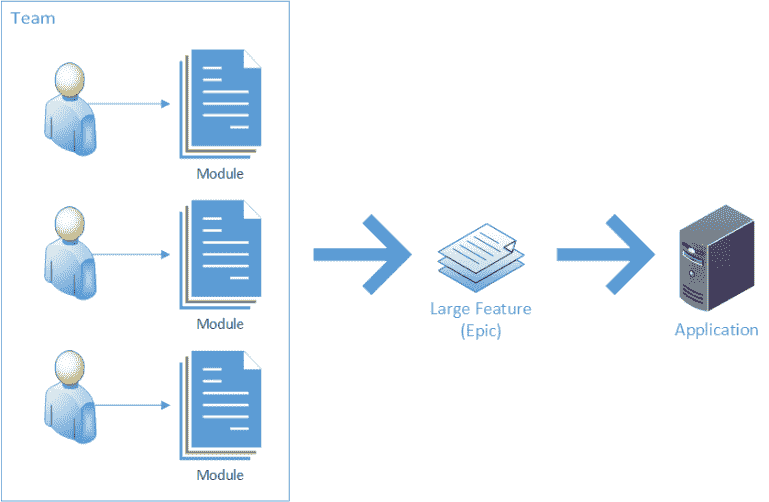

# 康威定律和跨职能团队

> 原文：<https://levelup.gitconnected.com/conways-law-and-cross-functional-teams-58010957e5cd>

## 团队结构如何影响系统沟通

在这篇文章中，我将探索和解释康威定律及其对软件工程部门和他们管理的系统的影响。

# 康威定律解释说

康威定律指出:

> 组织…被限制生产设计，这些设计是这些组织的通信结构的复制品。
> 
> [T3【梅尔文康威】T4](https://en.wikipedia.org/wiki/Conway%27s_law)

换句话说，如果我有一个由 3 个团队组成的开发部门，我将会有 3 个独立的系统或大型模块，它们之间很少交流。

此外，在团队层面，当人们并行工作时，他们倾向于引入人工边界，否则可能不会出现。这可以是新方法、类的形式，甚至是同一整体解决方案中的项目。

从本质上来说，康威定律认为组织结构，甚至单个团队的结构比我们想象的更重要，因为这些组织结构导致我们划分代码。

# 那么康威定律不好吗？

我不会直截了当地说康威定律是好是坏，就像我不会说物理定律是好是坏一样。康威定律简单地描述了软件开发团队及其系统的自然引力。

通过创建独立的系统或模块在团队之间转移劳动力并不一定是坏事。随着时间的推移，随着企业变得越来越大和越来越复杂，这些东西允许我们独立地工作，分配和划分工作，并把我们的头脑包裹在复杂的系统中。

当然，这种将工作划分到独立系统中的做法会导致不良行为，例如:

*   系统按顺序相互通信会降低性能
*   复杂性增加
*   团队之间的误解
*   不同团队的人之间缺乏知识共享
*   由系统交互产生的新类型的错误
*   代码复制
*   可能失败的事物数量增加

请注意，我在这里描述的许多内容与微服务系统中的缺点有一些重叠，特别是那些不依赖于消息队列或请求/确认架构的系统。

然而，康威定律也有一些优点:

*   随着企业的发展，它们可以有效地扩大规模
*   它允许多个开发人员并行工作
*   它为熟练的专家在特定领域工作创造了空间
*   团队可以根据需要调整他们的服务来解决他们关注的问题，只要他们保持相同的外部接口

好的是否超过坏的完全是另一个问题，但很大程度上无关紧要，因为我们不能轻易逃脱康威定律的影响。相反，我们应该把注意力集中在知道它存在的情况下我们能做些什么。

# 操纵康威定律

因此，知道系统最终会形成他们的组织，你可以利用这一点来鼓励某些行为。

如果你的组织正在努力解决系统间的沟通问题，你可能会考虑在团队间转移人员和一些项目。

例如，如果 Priya 和 Ahmed 都负责 MyWebService，并且该系统与 OtherTeamBigService 有大量的通信问题，那么*可能*有理由将他们两个移到另一个团队，潜在地将其他人移出该团队以腾出空间。

通过将人们紧密地联系在一起，您增加了他们的交流和对彼此系统、领域逻辑和技术的理解。随着时间的推移，这使得这些系统之间的事情更加有效，并且可以导致服务合并在一起或者更有效地利用共享逻辑。

# 跨职能团队

这给我们带来了一个有趣的观点。如果你的团队是由不同的技术组成的呢？例如，如果我有一个 JavaScript 团队，在没有某种形式的学习曲线的情况下，我不一定能把他们转移到 Java 团队，尽管有些招聘人员可能会这么想！

如果您按照产品而不是技术来组织您的团队，您可以确定共享领域经验的领域和系统，它们自然需要相互交流，以便正确有效地工作。即使你的团队中只有一个技术专家或者两个相同学科的专家(例如 c# dev vs . Go ),他们也可以在一个地方高效地共享知识，并作为一个团队解决问题。

如果你*不*这样做，你可能会遇到这样的情况:把问题交给另一个团队去解决，然后这个团队再把问题交给另一个团队，没有人聚在一起讨论系统通信中的实际问题和假设。

这听起来可能微不足道，但这个问题可能会变得严重，跨职能团队可能会带来根本的不同。

不利的一面是，在同一技术团队的人之间分享知识变得越来越困难，你不太可能让经理直接参与他们的直接下属正在做的事情，这使得准确评估优秀或表现不佳的人变得更加困难。

不过，总的来说，转移到更小的功能组对于拥有各种工程技术的组织来说很有意义。

# 结束语

无论你是否决定改变组织结构，都要理解康威定律及其随着时间的推移所产生的影响，因为它不可避免地会坚持自己的观点。

就像技术中的其他事情一样，每个决定都有权衡。每一个决定都会解决一些问题，同时让其他事情变得更难。不要仅仅因为你在纸上看起来不错，或者你在网上随便看了一篇文章，就重组你的组织。

也就是说，如果你在团队之间的知识共享和系统交流方面遇到了重大问题，并且似乎无法找到这些问题的解决方案，我认为有明确的证据表明康威定律提供了一些解决方案。

*原载于 2020 年 1 月 30 日*[*【https://killalldefects.com】*](https://killalldefects.com/2020/01/30/conways-law-and-cross-functional-teams/)*。*