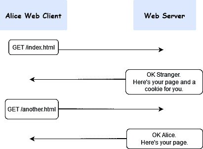

# Cookies 和会话:PHP 简介

> 原文：<https://levelup.gitconnected.com/cookies-and-sessions-a-gentle-introduction-with-php-44acb3a6c483>

每个足够复杂 web 应用程序都使用 cookies 和会话。这是你绝对必须了解的两项技术，即使你不是一名 web 开发人员。我为什么这么说？它们的用法是什么，你应该用什么，为什么？

在这篇文章中，我将帮助你找到这些问题的答案。另外，我将展示一些可以用来实现 cookies 和会话的 PHP 函数。


约翰·施诺布里奇在 [Unsplash](https://unsplash.com?utm_source=medium&utm_medium=referral) 上的照片

## 我为什么要关心饼干？

嗯，有几个原因:

*   **用法。**cookie 和 sessions 几乎无处不在。它们用于实现现代 web 应用程序中的各种功能，如登录、购物车或用户偏好。
*   **方便。**它们允许记住 HTTP 协议的[有状态](https://en.wikipedia.org/wiki/Stateless_protocol)信息，根据定义，HTTP 协议是[无状态的](https://en.wikipedia.org/wiki/Stateless_protocol)。
*   **使用方便。**cookie 和 sessions 真的很好设置。你应该小心使用它们，但是它们在原理上很容易使用。作为一名开发人员，它们非常强大，如果使用正确，它们将为您节省大量时间。

现在我要更深入地谈谈饼干。然后，我我将继续谈论会话。

# **什么是饼干？**

当我们谈论 cookie 时，我们指的是**HTTP cookie**或浏览器 cookie。一般来说，cookie 是在两个通信程序之间交换的一个小数据包。HTTP cookie 是 web 服务器发送给用户的 web 客户端的一小段数据(最多 4 KB)。

Cookies 是存储在客户端的文件，所以它们包含的信息在用户删除文件之前是可用的。特别是，它们存储*键=值*对。但是在服务器设置 cookie 之前，客户端和服务器之间的对话会发生什么呢？看看下面的图表:



客户端/服务器请求/响应交互—作者图片

逐步:

1.  爱丽丝在她的网络浏览器上请求 index.html。她以前从未访问过这个网站。
2.  web 服务器将请求的页面发送给 Alice。此外，由于它还没有看到爱丽丝，它设置了一个 cookie 来记住一些关于爱丽丝的东西，例如，她的名字。
3.  下一次，当 Alice 请求 */another.html* 时，web 服务器知道是 Alice 发出了请求。

## 设置 Cookie

在看 PHP 代码之前，我们先简单说一下 cookies 一般是怎么创建的。

从 web 客户端收到请求后，服务器决定发送响应。在这个响应中，它可以发送任意多的 cookies。服务器唯一要做的就是添加 [Set-Cookie](https://developer.mozilla.org/en-US/docs/Web/HTTP/Headers/Set-Cookie) HTTP 响应头:

```
Set-Cookie: <cookie-name>=<cookie-value>
```

当然，这是基本的语法，但是有很多可能的属性可以添加，比如截止日期:

```
Set-Cookie: username=alice; Expires=Fri, 10 Jan 2022 12:00:00 GMT;
```

在 PHP 中，你必须使用 [setcookie](https://www.php.net/manual/en/function.setcookie.php) 函数来设置一个 cookie:

```
setcookie(name, value, expire, path, domain, secure, httponly);
```

因此，要设置一个用户名等于 *Alice、*的 cookie，您只需:

```
setcookie('username', 'Alice');
```

## 访问和销毁 cookie

要访问 PHP 中的 cookie 集，你所要做的就是访问 [*$_COOKIE*](https://www.php.net/manual/en/reserved.variables.cookies.php) 超全局变量。例如，您想知道是否为传入的请求设置了一个*用户名*值？没问题:

```
if (isset($_COOKIE['username'])){
   echo 'I know you! You are: ' . $_COOKIE['username'];
}
```

假设您想要删除 cookie。您知道用户的用户名，但是您想忘记它。

```
if(isset($_COOKIE['username'])) {
    unset($_COOKIE['username']);
    setcookie('username', '', time() - 3600, '/');
}
```

您取消设置变量，然后使用空值*和旧时间戳*调用 *setcookie()* 。

# 会话怎么样？

现在您已经理解了什么是 cookie，我们可以看看会话了。会话是一个存储在临时目录中的**服务器端文件**，它存储了关于用户的信息，称为*会话变量*。原则上，它类似于一个 cookie，只是它存储在 web 服务器上。实际上，会话依赖于 cookie，因为每当创建一个会话时，*唯一会话标识符*就使用 cookie 存储在客户端的计算机中。

你可能会问:我为什么要这么做？为什么我应该使用会话来存储用户信息，从而占用 web 服务器上的空间？嗯，主要有两个原因:

1.  这样更安全。
2.  更好的**性能**。

由于 cookie 存储在客户端，攻击者很容易修改 cookie 并插入恶意数据。

就性能而言，每次 web 客户端发出请求时，它都会将 cookies 嵌入其中。这意味着，如果您有两个 cookies 集，对于您发出的每个 HTTP 请求，您可能有 8 KB 的额外数据要发送，这不是很好。解决这些问题的方法是使用会话。

## 开始会话

要在 PHP 中启动一个会话，您必须在任何 HTML 被发送到输出之前调用 [session_start()](https://www.php.net/manual/en/function.session-start.php) 函数。然后，要设置一个会话变量，您只需通过在 [$_SESSION](https://www.php.net/manual/en/reserved.variables.session.php) 超全局变量中创建一个新条目来分配它们:

```
$_SESSION["username"]= "Alice";
```

因为$_SESSION 是一个数组，所以只需输入以下命令就可以访问它的每个条目:

```
$username = $_SESSION["username"];
```

## 结束会话

如果您正在使用会话，而用户想要注销，您必须销毁当前会话的所有变量。您可以使用 [session_destroy()](https://www.php.net/manual/en/function.session-destroy.php) 函数来实现:

```
session_destroy();
```

# 结论

总而言之，您必须根据您的需要在 cookies 和会话之间做出选择。会话比 cookies 更安全，并且可以节省带宽，这总是一件好事。cookie 在存储能力方面是有限的，因为一个 cookie 文件最大为 4 KB，而一个会话可以容纳更多的数据(通常为 128 MB)。例如，如果您必须跟踪用户的偏好或者跟踪他们访问的页面，那么 cookie 就非常好。

我希望读完这篇文章后，你对 cookies 和 sessions 有更好的理解。如果您想了解更多，请访问我在文章中提供的参考资料链接。

谢谢😉