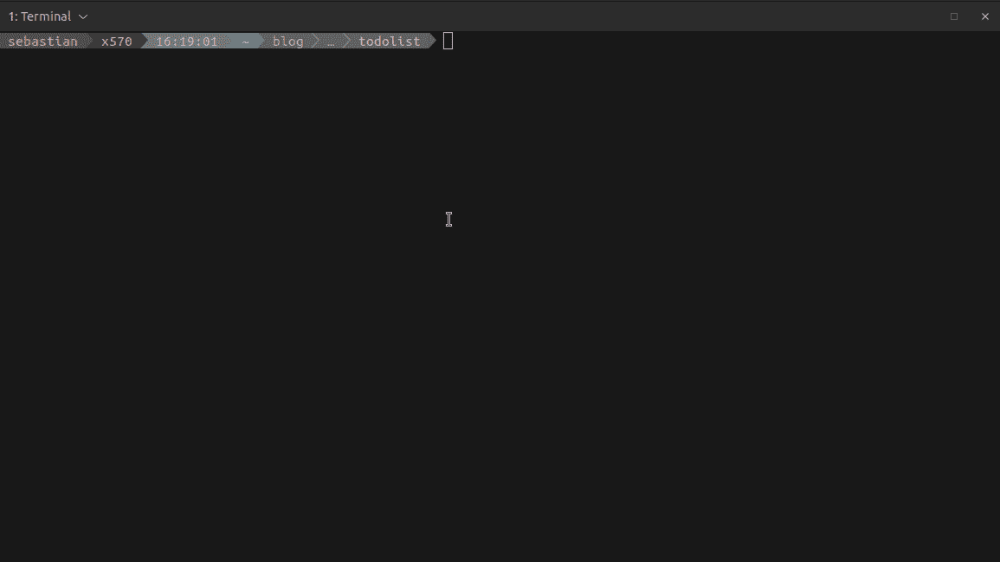

# 用 Python、SQLite 和 typer 可以做的很酷的事情

> 原文：<https://levelup.gitconnected.com/cool-stuff-you-can-do-with-python-sqlite-and-typer-8d998b69476d>


来造点东西吧(图片由作者提供)。

# **简介**

在这个故事中，我将演示如何使用 SQLite 作为底层数据存储来构建一个简单的 CLI(命令行界面)应用程序。我将尝试做一个简单的任务管理应用程序，并演示其背后的基本概念。为了证明我的选择是正确的，我会说这样的应用程序*业务* *逻辑*可以被已经熟悉任何任务管理应用程序的人理解，所以我们可以把注意力集中在技术细节上。

# **堆栈**

*   typer —用于在 python 中构建 CLI 应用程序的库；
*   [SQLite](https://www.sqlite.org/index.html) —小型、快速、独立的 SQL 数据库引擎(这听起来很酷，不是吗？)
*   和一点 python 3

# 准备

1.  你需要在你的虚拟机中安装*类型器*
2.  SQLite 支持内置于 python 中，因此我们在这里是安全的
3.  在您的工作目录中创建您的第一个文件: *main.py*

```
.
└── main.py
```

# 入门指南

让我们从 CLI 的基本框架开始。我们需要的是项目实例和任务实例。对于这两个实例，我们需要列表和创建操作，对于任务，我们假设只有两种状态:打开和关闭，我们需要关闭任务并重新打开它的能力。

**项目实体**

*   *名称* —项目名称(必填)
*   *描述* —项目描述(可选)

**任务实体**

*   *标题* —任务标题
*   *描述* —详细描述
*   *状态* —打开/关闭之一
*   *project_id* —这样我们就知道任务分配给了哪些项目

CLI 界面应该大致如下所示:

*   `projects list` —将列出可用的项目
*   `projects create <name> --description "Some desc"` —将创建新的项目实体
*   `projects tasks list <project_name>`将列出项目中的任务，这里我们可能还需要一些像`--status OPEN`这样的参数来过滤任务
*   `projects tasks create <project_name> <title> --description "Some desc"` —允许我们创建新任务
*   `projects tasks show <task_id>` —将显示任务详细信息
*   `projects tasks open <task_id>` —将打开任务
*   `projects tasks close <task_id>` —将使任务关闭

CLI 框架:

现在我们可以进入命令行，看看它是如何工作的:

1.  主命令处理程序的帮助

```
todolist  python3 main.py --help
Usage: main.py [OPTIONS] COMMAND [ARGS]...Options:
  --install-completion [bash|zsh|fish|powershell|pwsh]
                                  Install completion for the specified shell.
  --show-completion [bash|zsh|fish|powershell|pwsh]
                                  Show completion for the specified shell, to
                                  copy it or customize the installation.
  --help                          Show this message and exit.Commands:
  projects
```

2.项目命令的帮助

```
todolist  python3 main.py projects --help
Usage: main.py projects [OPTIONS] COMMAND [ARGS]...Options:
  --help  Show this message and exit.Commands:
  create  Create the new project.
  list    List of the available projects.
  tasks
```

3.项目创建命令

```
todolist  python3 main.py projects create --help
Usage: main.py projects create [OPTIONS] PROJECT_NAMECreate the new project.Arguments:
  PROJECT_NAME  [required]Options:
  --description TEXT
  --help              Show this message and exit.todolist  python3 main.py projects create TEST
Create new project: TEST, None
```

> 注意这里的`--description`选项。

4.任务创建命令

```
todolist  python3 main.py projects tasks create TEST "This is first task" --description "And this is task description"
Creating the new task: TEST, This is first task, And this is task description
```

# 数据库层

为了存储数据，我们需要首先初始化数据库，这有点棘手，因为它只需要发生一次。我可以为数据库初始化创建特殊的命令，或者对用户隐藏它，并在第一次运行 CLI 时执行。我倾向于第二种选择。让我们开始吧。

让我们首先更新工作目录结构:

```
.
├── __init__.py
├── database.py
└── main.py
```

`database.py`文件内容是:

> 注意检查数据库是否已经初始化的非常简单的方法，即`_db_exists`方法。这很简单，但能完成任务。

现在，对于`main.py`，我们需要添加:

```
from database import Database# ...if __name__ == "__main__":
    database = Database()
    database.initialize()
    app()
```

通过这种方式，我们将始终拥有一个可以与之对话的数据库。

如果您现在从`main.py`运行任何命令，数据库将被创建，您应该能够在文件结构中看到:

```
.
├── database.py
├── __init__.py
├── main.py
└── todos.db
```

现在，在`Database`类上，我们需要实现简单的处理程序来完成:

*   列出项目
*   列出任务
*   创建项目
*   创建任务
*   更改任务状态
*   获取任务详细信息

让我们实现它们，使这个练习更容易——您可以使用一些开源的 [SQLite 阅读器在`todos.db`中手动创建条目。](https://sqlitebrowser.org/)

向`Database`类添加以下方法和属性:

```
class Database:
    # ...
    PROJECT_LIST_SQL = """SELECT * FROM project;""" def run_sql(self, query, args=None, commit=False, fetch=False):
        args = args or ()
        data = None
        with sqlite3.connect("todos.db") as connection:
            cursor = connection.cursor()
            cursor.execute(query, args)
            if commit:
                connection.commit()
            if fetch:
                data = cursor.fetchall()
        return data def get_project_list(self):
        return self.run_sql(query=self.PROJECT_LIST_SQL, fetch=True)
```

修改`main.py`文件，找到项目列表处理程序并执行以下操作:

```
# move the database = Database() to the top of the file@project_app.command("list")
def project_list():
    *"""List of the available projects."""* print(database.get_project_list())
    typer.echo("List of projects")
```

现在，如果您手动将一些项目添加到 SQLlite 数据库，您应该会得到:

```
todolist  python3 main.py projects list
[(1, 'TEST', 'Some test project')]
List of projects
```

正如您看到的原始 SQL 响应，我们也应该通过引入能够处理项目和任务实体的`dataclasses`来解决这个问题，让我们开始吧。

创建新文件`data.py`:

```
.
├── constants.py
├── database.py
├── data.py
├── __init__.py
├── main.py
└── todos.db
```

> 这里注意:在`constants.py` *中，我有*

```
from enum import IntEnum

class TaskStatusE(IntEnum):
    OPEN = 1
    CLOSED = 2
```

并粘贴以下行:

```
from dataclasses import dataclass
from typing import Union

@dataclass
class Project:
    id: Union[int, None]  # when creating ID can be empty
    name: str
    description: Union[str, None]  # description is optional

@dataclass
class Task:
    id: Union[int, None]  # when creating ID can be empty
    title: str
    description: Union[str, None]  # description is optional
    status: int
    project_id: int
```

修改`main.py`文件:

```
@project_app.command("list")
def project_list():
    *"""List of the available projects."""* projects = [Project(id=row[0], name=row[1], description=row[2]) for row in database.get_project_list()]
    for project in projects:
        typer.echo(f"Project: {project.name}, description: {project.description}, ID: {project.id}")
```

运行列出项目的命令后:

```
todolist  python3 main.py projects list
Project: TEST, description: Some test project, ID: 1
```

我们就快到了，我现在将创建从命令行创建项目的可能性。

要创建项目，我们需要修改`main.py`文件中的`project_create`处理程序:

```
@project_app.command("create")
def project_create(project_name: str, description: str = None):
    *"""Create the new project."""* project = Project(id=None, name=project_name, description=description)
    database.create_project(project)
    typer.echo(f"Project `{project_name}` created.")
```

在`Database`类中我们需要添加一个新方法:

```
def create_project(self, project):
    return self.run_sql(query=self.CREATE_PROJECT, args=(project.name, project.description or ""),
                        commit=True)
```

> 注意这里，我是如何使用这里刚刚定义的`Project`数据类的。

测试运行:

```
todolist  python3 main.py projects create TEST01 --description "First one created by CLI"
Project `TEST01` created.todolist  python3 main.py projects list
Project: TEST, description: Some test project, ID: 1
Project: TEST01, description: First one created by CLI, ID: 2todolist  python3 main.py projects create TEST02
Project `TEST02` created.todolist  python3 main.py projects list
Project: TEST, description: Some test project, ID: 1
Project: TEST01, description: First one created by CLI, ID: 2
Project: TEST02, description: , ID: 3
```

现在，使用相同的模式，让我们处理任务处理程序(我将在文章的最后发布文件的最终版本)，现在让我们看看 CLI 的运行情况:



CLI 在发挥作用。

# 可能的改进和练习

*   请注意，在文件中复制了大量代码——在多个地方做了相同的事情(主要与 SQL 数据库和数据类之间的转换相关)——您可以做得更好。
*   错误处理——现在，如果我们在一个不存在的项目中询问任务列表，CLI 将会失败，你也可以让它变得更好。
*   输出显示格式不太好， *typer* 允许使用颜色，并做一些非常好看的 CLI 应用程序，如果你对应用程序的视觉方面感兴趣，你可以这样做。
*   请注意，目前我们是通过`python3 main.py`来使用这个应用程序的，这并不太好，因为我们可以创建`setup.py`文件并安装包，并且有一个很好的[命令入口点](https://packaging.python.org/specifications/entry-points/)，就像`mytasks projects list`
*   如果您不喜欢在 SQL 级别工作——您可以用一些 ORM 替换当前的`Database`类，比如 [pewee](https://github.com/coleifer/peewee)
*   也是最具挑战性的一个——为自己创建一个 CLI 应用程序，选择一个能为自己带来一些价值的用例。
*   CLI 仍然不支持按状态对任务列表进行过滤——实现起来很有趣。

# 文件

`main.py`

`database.py`

`data.py`