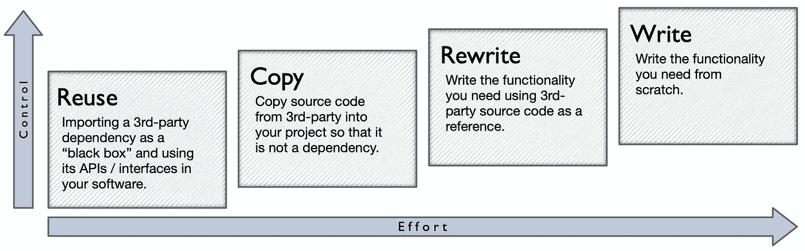
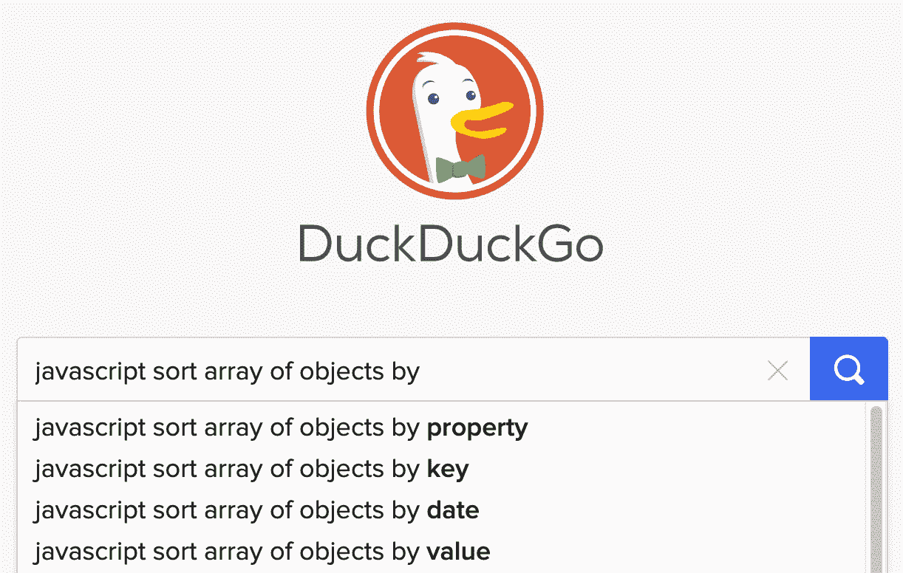
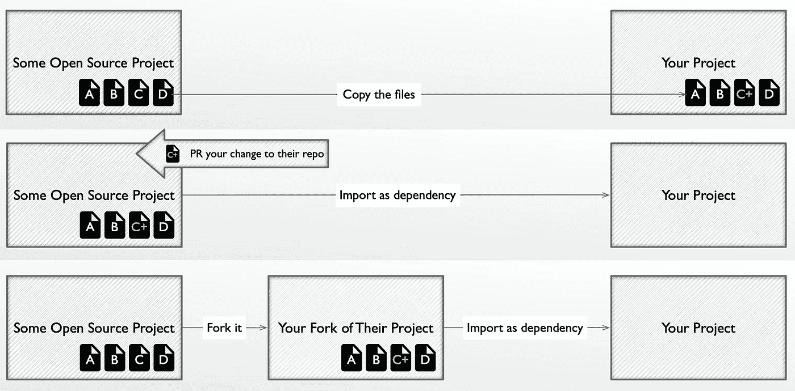
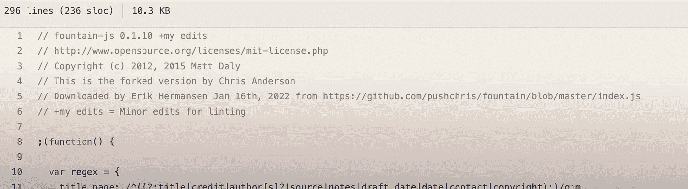
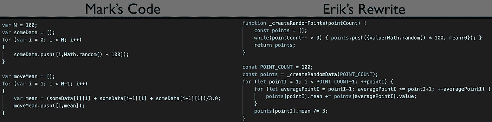
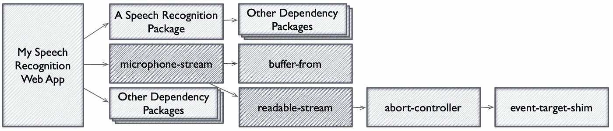
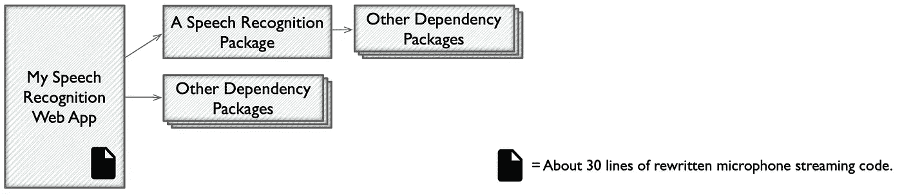
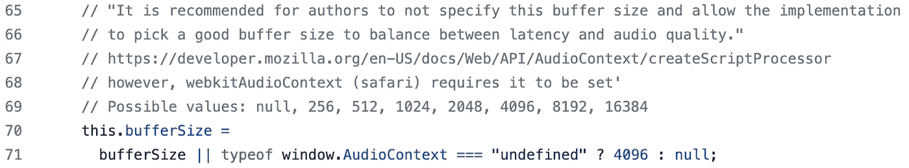

# 抄袭别人的代码很酷

> 原文：<https://levelup.gitconnected.com/copying-other-peoples-code-is-very-cool-717e8a72aa3b>

我最近写了一篇关于[工程师应该如何摆脱使用这么多库、包和其他依赖的文章](https://medium.com/p/write-more-reuse-less-fbf8a010c5f4)。我建议的替代方案是，当重用第三方代码的价值阈值没有达到时，自己编写代码。

在这篇文章中，我想谈谈复用和从头开始写之间的选择。这些技术可以给你一个很好的优势组合。你会听到我提到一些不同编程语言/环境中的例子。但这篇文章足够高，说实话，你从事什么工作并不重要。

我们一直让她写小一点。她浪费了这么多纸。

# 给你的四种编码技术

假设您处于这样一种情况，您希望您的软件做一些它目前不能做的事情。例如，您可能希望将报告下载为便于打印的 PDF 格式。但是你的 app 还不知道怎么做 pdf。作为一名工程师，你有责任解决这个问题。

下图显示了添加该特性的四种不同技术。我没有说“*四大技法”。我敢肯定还有更多涉及飞镖靶和猴子的技术。*

**

*为什么这么多决策都有权衡？这真让人恼火。*

*   ***重用**—根据您的环境，您可以在 lib 中进行链接，或者向`pom.xml`或`package.json`添加一个条目。不管你怎么做，“重用”就是抓取别人的代码，通过它的接口来使用它，而不关心它的内部。这些代码可能还会偷偷带入一大堆可传递的依赖项，这将会给你带来痛苦。最小的努力，最小的控制。*
*   ***复制** —从 Github repo、snippet collection 或其他地方选择您想要的代码。然后将其粘贴到您的项目中。代码现在位于您的代码库中，不再是依赖项。*
*   ***重写** —采用一些适合你的目的的第三方代码，通过重写使之成为你自己的代码。*
*   ***写**—你自己写所有的代码，用你自己的大脑，不借用任何人的任何东西。安·兰德和凯西·穆拉托里会恭敬地点头同意你的决定。最大努力。最大控制。*

*为了确保我上面的图表令人印象深刻，我给了它两个坐标轴——努力和控制。*

**

*另一方面，这个家伙的两把斧子也给人留下了深刻的印象。*

*所有这四种技术都在努力和控制之间进行权衡。*

*通过重用，您可以快速获得大量功能，然后遭受缺乏控制的痛苦，表现为软件膨胀、黑盒调试、安全修补和耦合升级。重用不一定会有这些问题，但是风险会上升。添加到项目中的每一行代码都像是一张彩票，可以赢得一个非常糟糕的问题。*

*或者在图表的另一端，您从头开始编写所有内容，您将完全控制进入项目的新代码。但是你可以花一些荒谬的时间完全按照你的方式做事，你这个代码天后。*

*在我的上一篇文章[写得多，重用得少](https://medium.com/p/fbf8a010c5f4)中，我已经更详细地讨论了重用和编写之间的权衡。*

*我将进一步讨论两种中间技术(复制和重写)。*

# *复制*

*有很多可以复制代码的好地方。如果你想做的事情可以用一句话来描述，并且用不到一百行代码来实现，那么在搜索引擎中输入你的问题就很容易找到。*

**

***谷歌优于 DuckDuckGo 的主要优势:**在对话中用“DuckDuckGo”做动词很别扭。*

*以这种方式搜索关于简单编码任务的问题，你将在几秒钟内进入 Snippet 天堂。*

*我从 StackOverflow，W3Schools，MDN，Unity Answers，还有各种我懒得记的位置复制了很多代码。我总是从搜索引擎开始，在那里问一个问题。通常，我会先加上我正在使用的语言/平台，然后再问问题。在我键入时查看自动完成功能通常很有帮助。*

# *GitHub 副驾驶*

**

*从机器人那里复制你的答案，机器人从人类那里复制他们的答案。*

*如果你宁愿相信复杂的人工智能为你编写代码片段，试试 [GitHub Copilot](https://copilot.github.com/) 。它作为插件集成在您的 ide 中。基本上，你不需要在搜索引擎中输入你想要的，你只需要在一个稍微详细一点的源评论中输入文本。然后实现源代码自动填充到下面。*

*不，真的！我没开玩笑。看一些关于它的视频。*

*它让我充满了恐惧和兴奋。*

# *超越讽刺*

*如果您想为更大的功能复制代码，那么只需:*

1.  *找到一个包含该功能的开源项目，*
2.  *把你需要的文件复制过来。*

*我刚刚建议了一种做法，它可能是疯狂的，也可能是疯狂的。我真的希望下一个问题已经在你的脑海里了。不要让我对你胡说八道。*

# *"什么时候从第三方项目复制比直接导入更好？"*

*如果你只是将一个依赖项的所有未改变的文件复制到你的项目中，那么我只看到这种复制方法的*缺点*。您复制的源代码不容易更新到较新版本的依赖项。这意味着错过了错误修复、新特性和安全补丁。*

*虽然在特定版本上拍摄代码在某些情况下很有价值，但是您可以使用固定版本通过您的构建清单(例如 Java 中的`pom.xml`，Node 中的`package.json`)完成同样的事情。如果您决定是时候升级，固定版本可以在以后轻松更新。*

*另一个潜在的复制原因可能是您想要对项目的源代码进行更改。如果您正在进行增量更改，您可能会更好地选择 1。从原始项目或 2 创建分叉项目。直接将您的更改贡献给原始项目。这将使您以后更容易从原始项目中接收变更。*

**

*三种不同的方法将你对他人代码的修改引入你的项目。最上面的是坏的。*

*可能你正在对代码库进行大规模、彻底的修改。您计划在将来与原始项目的任何合并中彻底断绝关系。太酷了。这样做通常有正当的理由。但是根据我在本文中给出的定义，对源代码进行大的、结构性的修改符合“重写”技术，我将在下面进一步讨论。*

*我只能想到一个将第三方项目的代码复制(而不是重写)到你的项目中的好理由:你只想要*一些*项目的源代码。*

*这个原因出现的次数比你想象的要多。像 [Lodash](https://github.com/lodash/lodash) 和 [TurfJS](https://turfjs.org/) 这样的扩展节点包足够聪明，可以提供子集包，只导入您在函数级粒度上想要的特定功能。但是在野外有很多臃肿的怪物。*

**

*Nodelerfish 需要你的爱。但是不要让他参与你的项目。*

*您可能只需要用 50 行代码实现几个库 API。但是该库的整体导入可能会引入成千上万行代码，尤其是具有可传递依赖关系的代码。在这种情况下，复制一个子集而不是导入整个混乱可能是合理的。*

# *开源许可证*

*我不是律师。既然我不是律师，我就告诉你我在开源许可方面做了什么。你也可以咨询你的世界级律师团队来做出你自己的决定。*

*非律师埃里克做了什么:*

> *如果我将源代码复制到我的项目中，我会将其视为导入代码，并遵守所有许可条款。OSS 许可中的术语通常指的是发布源代码或从许可的源代码中构建的版本的行为。如果复制的代码是我的发布的一部分，那么这也算发布。我也非常小心我使用的是哪一个 OSS 许可证——例如 GPL 可以要求我在 GPL 下许可我自己的代码库，而 MIT 许可证几乎不要求我做任何事情。*

*我也喜欢将复制的代码放在“第三方”目录下(Github 上的[示例)，并在文件顶部添加注释以保持整洁。](https://github.com/erikh2000/chirp/tree/master/src/3rdParty)*

**

*他们不认识我，但马特·戴利和克里斯·安德森是我的代码兄弟。*

# *重写的优点*

*你知道你复制的代码里有什么吗？这是适合你的代码吗？*

**

*对于一些考试，抄袭别人的答案效果不好。*

*你可以也应该去评判别人的代码。也许不要张贴无情的媒体对代码的批评。但是为了你自己的利益，一定要私下评估第三方代码。*

# *重写片段*

*对于不到 200 行的片段或复制代码，我几乎肯定会逐行重写，以此来理解代码的作用，并做出更改，帮助它更好地适应我的项目。这是为数不多的几个进行毫无意义的风格编辑的时候之一。*

*我想给你举一个具体的例子。现在，我要从网上随便找一个片段重写一遍。*

*…*

*好吧，我回来了！抱歉让你久等了。*

**

*左边的代码是原始代码。右边的代码是我重写的。*

*我重写的[片段](https://stackoverflow.com/questions/19981713/html5-js-chart-with-moving-average#19992376)是由一个叫“马克”的人发布在 StackOverflow 上的。他的代码通过将每个点与其左右邻居进行平均来平滑折线图中参差不齐的波峰和波谷。*

*我在重写过程中所做的修改的摘要:*

*   *重命名变量以更容易显示它们的用途*
*   *使用更具体的方式声明变量*
*   *将一些代码重构为一个名为的独立函数，以描述其用途*
*   *删除了特定于另一个第三方库(HighCharts)的一些数据结构*
*   *拨弄空白*

*我写代码的风格并不比马克好。它只是碰巧以正确的方式触动了我的大脑。这不是修改 Mark 代码的足够好的理由。以下是重写他的片段的真正好处:*

*   *我学会了算法。我现在完全明白这种线形图平滑是如何工作的了。*
*   *我创建了对我来说更容易维护的代码，如果不是对 Mark。*
*   *我能够删除与我的需求无关的代码部分。*
*   *我验证了代码中没有任何错误，例如无限循环。*
*   *我验证了没有引入任何安全漏洞，例如在 DOM 中注入一个 querystring 变量。*
*   *我验证了代码不会添加任何额外的依赖项，例如一些统计库。*
*   *我了解了另一个工程师如何喜欢写代码，并有机会考虑那个人的实践为我所用。*

*所以这种肤浅的重写是将其他人的代码引入你的项目的好方法。可以避免一些问题。您可以调整代码以适应您的用例及其他需求。作为一名工程师，你可以通过接触新的算法和实践来成长。*

# *重写的许可注意事项*

*非律师埃里克做了什么:*

> *我认为一个完整的逐行重写应该逃避几乎任何 OSS 许可的法律义务。但是我总是致力于遵循开源精神，比如在源代码评论中引用原始作品，或者为原始项目提供帮助。*

# *更深层次的重写和删减*

*有时，您希望引入多个文件或数千行源代码，然后进行较大的更改以使新代码适合您的项目。特别是，删掉你实际上不需要的东西是有好处的。*

**

*当爬到树上修剪时，我建议坐在**树干**面向切口的一侧。*

*这里有一个简单的复制和修剪方法:*

1.  *将所有依赖项源文件复制到项目中。*
2.  *确保您需要的功能确实在工作。单元测试通常对此有好处。*
3.  *删除一些你不需要的东西。*
4.  *重复第 2 步和第 3 步，直到剩下的代码满足您的需求。*
5.  *至少对剩下的代码做一个浅显的重写，以确保你理解了它并获得其他的好处。*

*您的 IDE 选择和配置应该能够很好地支持您完成这项任务，它提供了林挺、语法突出显示和通知功能，这些功能向您展示了:*

*   *哪个代码在调用函数。(修剪它们？)*
*   *什么函数从来不调用。(修剪它们！)*
*   *哪些变化会破坏你的构建。(解开它们！)*

*如果您的 IDE 没有为您做这件事，考虑投资一些时间来获得一个更好的设置。*

*`git commit`和`git checkout`将让您设置一个已知的良好状态，并在您修剪太用力或损坏东西时恢复到该状态。这是一个很好的安全网，可以让你工作得更快。*

*我已经能听到你的想法了…*

# *"但是这种重写工作太费事了！"*

*我没说你总想重写。只是当你这么做的时候，有些情况会得到很好的回报。我会给你一个真实的例子，当我重写一个第三方项目，以获得巨大的利益。*

*我从这样的依赖树开始:*

**

*经过半天的重写工作，我去掉了对五个依赖项的需要，最后得到了这个:*

**

*我在我的 web 应用程序中使用了一个名为“[麦克风流](https://www.npmjs.com/package/microphone-stream)的 NPM 包，它将从麦克风捕获的样本缓冲区发送到语音识别包的一个接口(Cieran O'Reilly 的 [vosk 浏览器](https://github.com/ccoreilly/vosk-browser)，如果你感兴趣的话)。*

*我最初在开发的“让它工作”阶段使用`microphone-stream`。它包含在我复制到我的项目中的一个示例 web 应用程序项目中。`microphone-stream`运行得很好，直到我升级了一个构建工具(Webpack)并破坏了`readable-stream`的构建，一个更深一层的依赖包。我调查了两个第三方库的一个可能的 PR 补丁。但是向回购提交一个好的变更可能需要几天的工作。出于各种原因，我还拒绝了其他一些变通解决方案。*

*浏览`microphone-stream`的代码，我意识到我并不需要这个库的核心功能——node . js 风格的流接口。所以我小心翼翼地重写了我真正需要的代码部分，并丢弃了我不需要的部分。*

*一路走来，我在原始代码中发现了这样的精华:*

**

*…还有这个:*

**

*我感激地将这些想法合并到我重写的代码中。*

*作者 Nathan Friedly 在源代码注释中展示了他的思考过程。他可能让我以后不用再找 bug 来修复了。这样看来，重写比从头开始写要好。你可以获得他人来之不易的知识。*

*所以对我来说，这是一个明显的例子，重写比重用节省了我的时间，给了我一个更好的结果。重写也比从头开始写要好，因为它让我接触到另一位工程师的真实经验，否则我可能会错过这些经验。*

# *复制和重写——试试吧！*

*这是好东西。这不是作弊。*

*只要遵守开源许可条款，成为你的工程师同事的好邻居。*

*你不想复制或重写一切。但是要学会识别值得去做的情况。*

*享受与他人工作的联系。那些数百万计的项目是由美丽的头脑建造的。*

**

*好吧，这个孩子可能复制得太多了。*

**

** * * [媒体学分](https://medium.com/@ErikH2000/where-my-media-comes-from-59761dc4be7) * * * [想要工作？](https://medium.com/@ErikH2000/yes-i-can-help-you-get-an-it-job-b0b51fee4c95) * * * [LinkedIn 个人资料](https://www.linkedin.com/in/erikhermansen) * * **