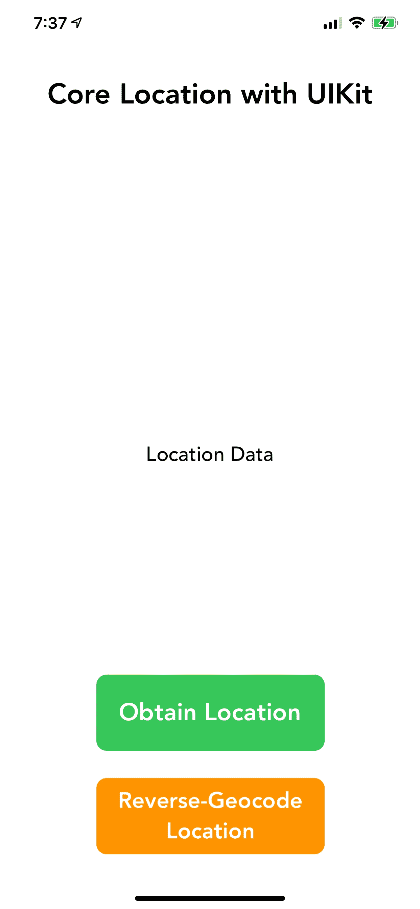
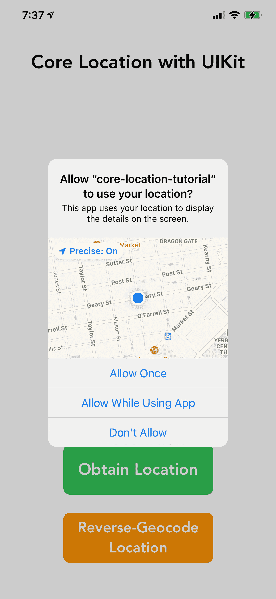
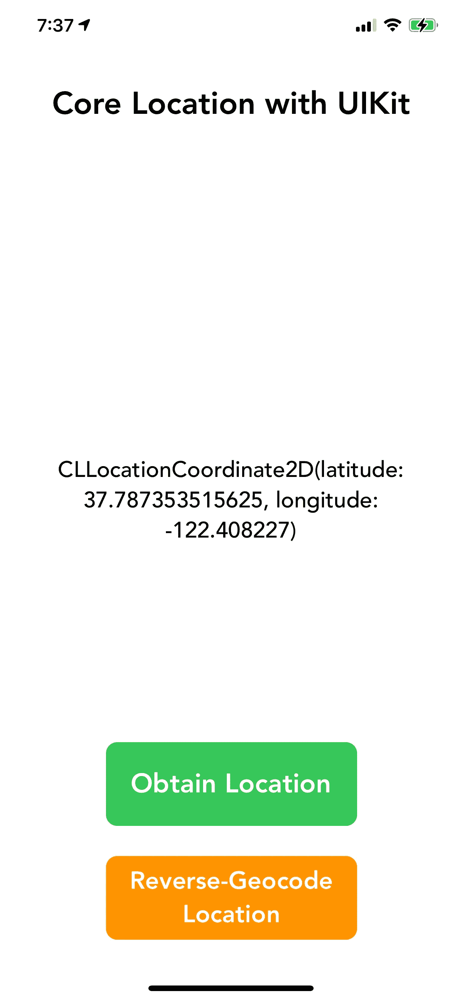
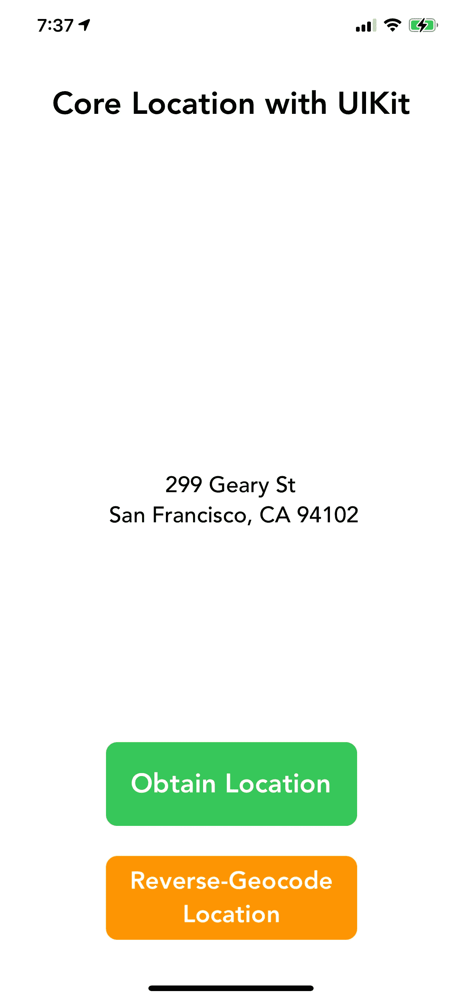

# 核心位置-如何使用 CLGeocoder 显示人类可读的地址

> 原文：<https://levelup.gitconnected.com/core-location-how-to-display-a-human-readable-address-using-clgeocoder-b2497c51b8ab>


由 [Unsplash](https://unsplash.com/s/photos/location?utm_source=unsplash&utm_medium=referral&utm_content=creditCopyText) 上的 [Element5 数码](https://unsplash.com/@element5digital?utm_source=unsplash&utm_medium=referral&utm_content=creditCopyText)拍摄

## 绪论

在之前的一篇文章中，我写了关于在 UIKit 应用程序中设置核心位置的内容。我介绍了向 Info.plist 文件添加用法描述、请求位置授权以及从 CLLocationManager 中提取位置。如果你需要一些帮助来设置 UIKit 应用程序中的核心位置，可以看看那个帖子:[https://rustynailsoftware . com/dev-blog/Core-Location-setting-up-Core-Location-with-ui kit。](https://rustynailsoftware.com/dev-blog/core-location-setting-up-core-location-with-uikit.)

在这篇文章中，我将介绍如何实现**cl geocoder**——这是一个位于核心位置的类，帮助开发人员在他们的 iOS 应用程序中生成人类可读版本的地理坐标。我还将简要介绍一下 **CLLocation** 对象，因为我在第一篇核心位置文章中没有这样做。你可以跟随我在 GitHub 上托管的代码:[https://github.com/andrew-lundy/core-location-tutorial](https://github.com/andrew-lundy/core-location-tutorial)

让我们开始吧。

## CLLocation 类

核心定位的一个重要方面是 **CLLocation** 类。这太重要了，以至于我忘了在我的第一篇核心位置系列博文中写它。 **CLLocation** 类是保存设备位置信息的对象，包括高度和路线信息。路线信息是设备的速度和方向。在核心位置中，您通过 CLLocationManager 类获取位置详细信息。这里，我将信息存储在 **currentLocation** 变量中:

```
let locationManager = CLLocationManager()
let currentLocation = locationManager.location
```

有了这个，我们就可以访问位置细节，并且能够提取这些细节。例如，要获得位置的坐标，使用位置管理器的**坐标**属性:

```
let locationManager = CLLocationManager()
let currentLocation = locationManager.location
// Print the location details.
// Ex: <+37.78735352, -122.40822700> +/- 5.00m (speed - 1.99 mps / course - 1.00) @ 9/5/20, 5:13:46 PM Central Daylight Time
print(currentLocation)let locationCoordinate = currentLocation.coordinate
// Print the coordinate value of the location as a CLLocationCoordinate2D.
// Ex: CLLocationCoordinate2D(latitude: 37.787353515625, longitude: -122.408227)
print(locationCoordinate)
```

## 使用 CLGeocoder 进行反向地理编码

如上所述， **CLLocation** 类以几乎不可用的格式返回位置信息。当然，我们可以得到地理坐标和设备移动的速度。但是，这些信息只在某些情况下有用。当我们需要向不想读取和转换坐标的用户显示位置信息时会发生什么？答案就在苹果的 **CLGeocoder** 类中。

到目前为止， **ViewController** 类持有以下对象和 IBOutlets:

```
@IBOutlet weak var changeLocationBttn: UIButton!
@IBOutlet weak var reverseGeocodeLocation: UIButton!
@IBOutlet weak var locationDataLbl: UILabel!private var locationManager: CLLocationManager!
private var currentLocation: CLLocation!
private var geocoder: CLGeocoder!
```

我将继续初始化 **ViewController** 类的 **viewDidLoad** 方法中的 **CLGeocoder** :

```
override func viewDidLoad() {
  super.viewDidLoad()
  changeLocationBttn.layer.cornerRadius = 10
  reverseGeocodeLocation.layer.cornerRadius = 10
  reverseGeocodeLocation.titleLabel?.textAlignment = .center

  locationManager = CLLocationManager()
  locationManager.delegate = self

  // Initialize the Geocoder
  geocoder = CLGeocoder()
}
```

**CLGeocoder** 将要做的所有工作都将发生在**reverseGeocodeLocationBttnTapped**方法中。我们要做的第一件事是确保 **currentLocation** 变量不为空。这是为了保存设备的位置信息，并在应用程序请求授权状态时赋予一个值。我们需要进行这项检查，因为如果没有位置值，就没有什么可进行反向地理编码的。

```
@IBAction func reverseGeocodeLocationBttnTapped(_ sender: Any) {
    guard let currentLocation = self.currentLocation else {
        print("Unable to reverse-geocode location.")
        return
    }
}
```

要开始反向地理编码坐标的过程，您必须在 **CLGeocoder** 上调用 **reverseGeocodeLocation** 方法。这个方法有两个参数——一个 **CLLocation** 对象和一个 **CLGeocodeCompletionHandler。**完成处理器也有两个参数——一个数组 **CLPlacemark** 和一个 **Error** 。

```
// The method that does the reverse-geocoding.
geocoder.reverseGeocodeLocation(location: CLLocation, completionHandler: CLGeocodeCompletionHandler)// Here is the method when in use.
geocoder.reverseGeocodeLocation(currentLocation) { (placemarks, error) in

}
```

**CLPlacemark** 类是新的，我们来看看。一个 **CLPlacemark** 或“Placemark”，保存了人类可读版本的坐标，并使开发人员能够访问诸如地名、城市、州、邮政编码等信息。关于 **CLPlacemark** 类的更多内容可以在苹果的 docs:[https://developer . Apple . com/documentation/corelocation/CLPlacemark](https://developer.apple.com/documentation/corelocation/clplacemark)

下面是我们将在完成处理程序中执行的步骤:

```
geocoder.reverseGeocodeLocation(currentLocation) { (placemarks, error) in
    // 1
    if let error = error {
        print(error)
    }

    // 2
    guard let placemark = placemarks?.first else { return }
    print(placemark)
    // Geary & Powell, Geary & Powell, 299 Geary St, San Francisco, CA 94102, United States @ <+37.78735352,-122.40822700> +/- 100.00m, region CLCircularRegion (identifier:'<+37.78735636,-122.40822737> radius 70.65', center:<+37.78735636,-122.40822737>, radius:70.65m)

    // 3
    guard let streetNumber = placemark.subThoroughfare else { return }
    guard let streetName = placemark.thoroughfare else { return }
    guard let city = placemark.locality else { return }
    guard let state = placemark.administrativeArea else { return }
    guard let zipCode = placemark.postalCode else { return }

    // 4
    DispatchQueue.main.async {
        self.locationDataLbl.text = "\(streetNumber) \(streetName) \n \(city), \(state) \(zipCode)"
    }
}
```

1.  检查处理程序是否产生错误。如果是，将其打印到控制台。在真正的应用程序中，您可以更有效地处理错误。
2.  使用 guard 语句获取从完成处理程序返回的第一个 placemark。对于大多数地理编码请求，地标数组应该只包含一个条目。我打印了地标数据。
3.  根据用例，从地标中提取特定的数据。在这个例子中，我提取了街道号、街道名、城市、州和邮政编码。
4.  最后，我用地标数据更新了应用程序中的标签。因为这改变了用户界面，所以我在主线程上使用了 **DispatchQueue** 类。

**reverseGeocodeLocationBttnTapped**I action 现在应该是这样的:

```
@IBAction func reverseGeocodeLocationBttnTapped(_ sender: Any) {
    guard let currentLocation = self.currentLocation else {
        print("Unable to reverse-geocode location.")
        return
    }

    geocoder.reverseGeocodeLocation(currentLocation) { (placemarks, error) in
        if let error = error {
            print(error)
        }

        guard let placemark = placemarks?.first else { return }
        guard let streetNumber = placemark.subThoroughfare else { return }
        guard let streetName = placemark.thoroughfare else { return }
        guard let city = placemark.locality else { return }
        guard let state = placemark.administrativeArea else { return }
        guard let zipCode = placemark.postalCode else { return }

        DispatchQueue.main.async {
            self.locationDataLbl.text = "\(streetNumber) \(streetName) \n \(city), \(state) \(zipCode)"
        }
    } 
}
```

## 收尾工作

该应用程序现在可以请求位置授权，获取设备的位置，并通过最新的功能对位置进行反向地理编码。这是应用程序的流程:



自从上一篇文章以来，我已经在用户界面上添加了“反向地理编码”按钮。



点击绿色按钮后，位置授权请求就通过了。



点击绿色按钮后，位置授权请求就通过了。



点击橙色按钮后，使用 **CLGeocoder** 类对位置进行反向地理编码。

感谢您抽出时间阅读本演练。核心位置是构建任何基于位置的 iOS 应用的关键，我希望你学到了一些新东西。欢迎在 Twitter 上与我联系，帮助发展 iOS 开发社区:[https://twitter.com/andrewlundydev.](https://twitter.com/andrewlundydev.)

可以在我的博客上阅读原文：<https://rustynailsoftware.com/dev-blog/core-location-reverse-geocoding-locations-using-clgeocoder>

**资源:**

*用 UIKit 设置核心位置*:[https://rustynailsoftware . com/dev-blog/Core-Location-Setting-Up-Core-Location-with-ui kit](https://rustynailsoftware.com/dev-blog/core-location-setting-up-core-location-with-uikit)

*CLLocation 文档*:[https://developer . apple . com/documentation/core location/cl location](https://developer.apple.com/documentation/corelocation/cllocation)

*CLGeocoder Docs*:[https://developer . apple . com/documentation/corelocation/CLGeocoder](https://developer.apple.com/documentation/corelocation/clgeocoder)

*CLGeocodeCompletionHandler 文档*:[https://developer . apple . com/documentation/corelocation/CLGeocodeCompletionHandler](https://developer.apple.com/documentation/corelocation/clgeocodecompletionhandler)

*CLPlacemark 文档*:[https://developer . apple . com/documentation/corelocation/CLPlacemark](https://developer.apple.com/documentation/corelocation/clplacemark)

*dispatch queue Docs*:[https://developer . apple . com/documentation/dispatch/dispatch queue](https://developer.apple.com/documentation/dispatch/dispatchqueue)