# 核心位置—使用 UIKit 设置核心位置

> 原文：<https://levelup.gitconnected.com/core-location-setting-up-core-location-with-uikit-fc7980565b4f>

# 绪论

核心位置是 Apple 获取设备位置、高度和方向的原生框架。核心位置也是设备与 iBeacon 设备交互的方式。所有这些都是非常酷的技术，可以用惊人的方式加以利用。例如，我已经使用 Core Location 创建了一个坑洞报告应用程序 RoadHazard。我真的认为移动设备是一种将技术与日常生活相结合的方式。

核心位置通过板载组件收集数据，如 Wi-Fi、GPS、蓝牙、磁力计、气压计和蜂窝硬件。在这篇文章中，我将向你展示如何通过使用一个简单的基于故事板的用户界面，CLLocationManager 和位置模拟，在你的 iOS 应用程序中设置核心位置。

你可以在 GitHub 上找到这个项目的代码:[https://GitHub . com/Andrew-lundy/core-location-tutorial/tree/setup](https://github.com/andrew-lundy/core-location-tutorial/tree/set-up)

***环境:Xcode 12，Swift 5，部署目标:iOS 13。***

# 该项目

我已经创建了一个用户界面，它将使用一个 **UILabel** 显示一些位置数据。当按下绿色按钮时，将启用并获得定位服务。

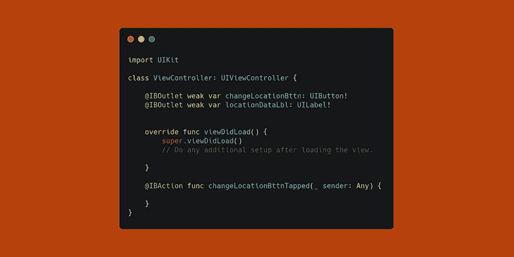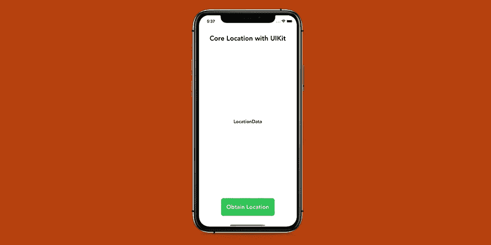

在编写任何核心位置代码之前，您需要在 Info.plist 文件中提供您的应用程序需要用户位置的原因。从 iOS 13 开始，当请求对应用的位置访问时需要两个属性—**nslocationalwaysandheninuseusagedescription**和**NSLocationWhenInUseUsageDescription**。Info.plist 文件中的密钥名称为*隐私—位置始终和使用时使用说明*和*隐私—位置使用时使用说明。*

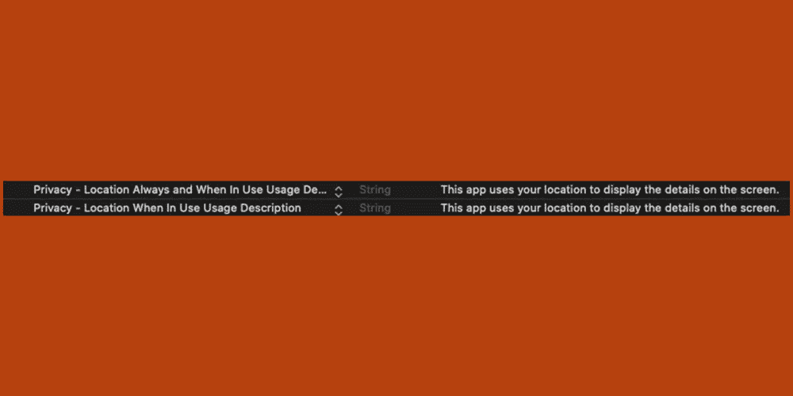

既然您已经提供了访问设备位置的理由，让我们开始使用核心位置。在 **ViewController** 类中，您需要导入 **CoreLocation** 框架，添加一个保存 **CLLocationManager** 的变量，并将 **ViewController** 扩展为**CLLocationManager delegate**。CLLocationManager 是您用来请求位置访问、开始和停止位置事件、设置所需精度等的对象。

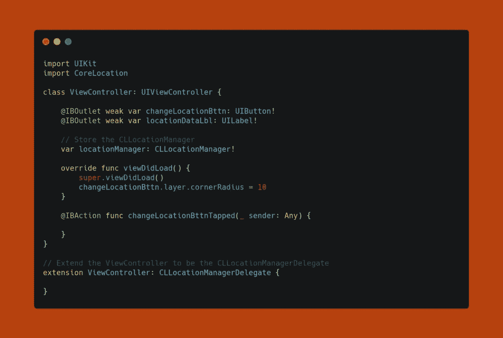

接下来，继续实例化 **CLLocationManager** 并将委托设置为 **ViewController** 。 **viewDidLoad** 方法应该是这样的:

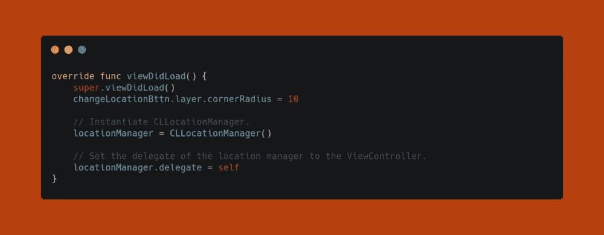

在实际使用任何核心定位功能之前，首先要确保设备定位服务已启用。请注意，这不是强制性的，但最好检查一下您的用户是否启用了定位服务，以便您可以相应地处理这种情况。我已经将该检查添加到了 **changeLocationBttnTapped** 方法中，因为我们将在那里启动位置服务。

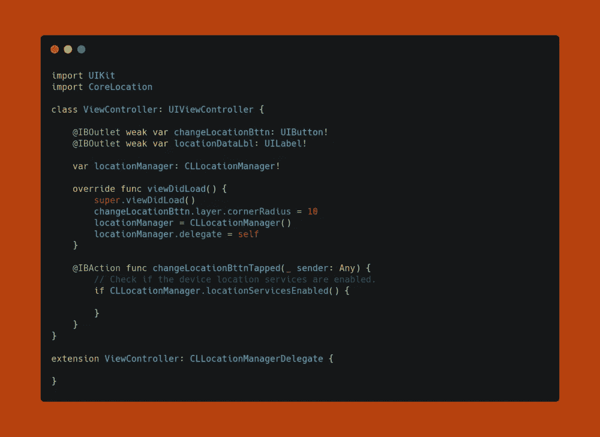

在检查以确保定位服务已启用后，接下来要做的事情是请求授权。在这种情况下，我们将请求“使用时”授权。这正是它听起来的样子——这要求用户在应用程序使用时允许使用定位服务。 **changeLocationBttnTapped** 方法现在应该是这样的:

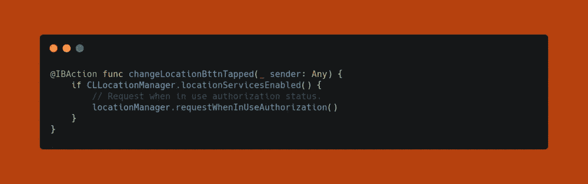

如果运行该应用程序，将会弹出一个警告，询问您是否要让该应用程序访问设备的位置。

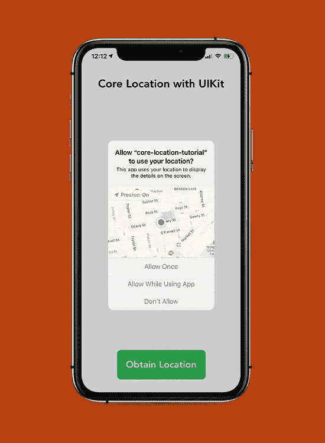

选择授权状态后，您需要在 **locationManager** 上调用 **startUpdatingLocation** 方法，以便开始报告用户的位置。我在**CLLocationManagerDelegate**的 **didChangeAuthorization** 方法中这样做，因为如果一个应用程序没有被授权使用设备的位置服务，它就不能报告位置数据。当应用程序创建位置管理器时以及任何时候 **CLLocationManager** 的授权状态改变时，都会调用 **didChangeAuthorization** 方法。更新**CLLocationManagerDelegate**，如下所示:

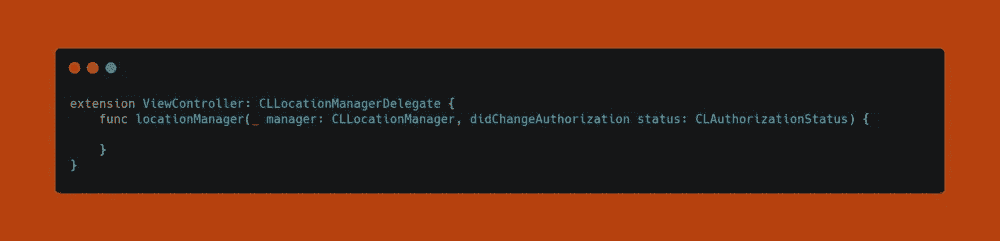

接下来要做的是使用 switch 语句检查 **CLLocationManager** 的**授权状态**。在本例中，我们仅将开关值与**进行比较。authorizedWhenInUse 使用**案例，并在默认案例中简单地“返回”。

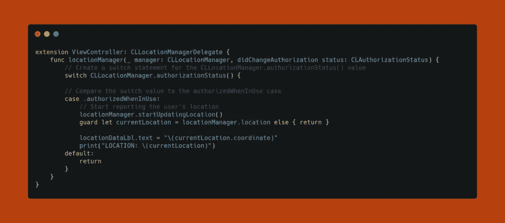

我已经更新了 UI 来显示设备位置的坐标值。坐标类型是一个 **CLLocationCoordinate2D，**，它保存位置的纬度和经度。在以后的文章中，我将使用 **CLGeocoder** 类进行地理编码。地理编码是将纬度和经度转换为人类可读地址的过程。

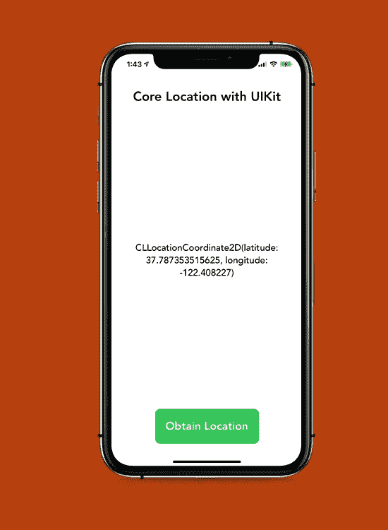

至于现在，这就是你如何设置核心位置。这是一个非常简单的过程，该框架提供了强大的功能，可以在各种不同的应用程序中使用。

感谢您的阅读——下一篇文章再见！