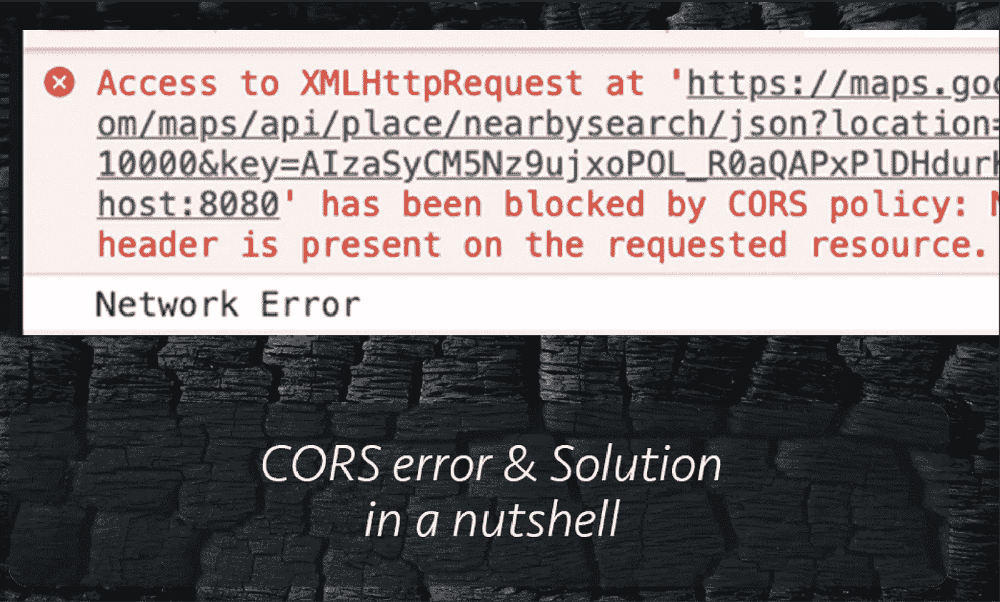
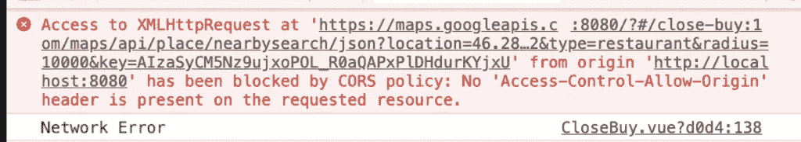
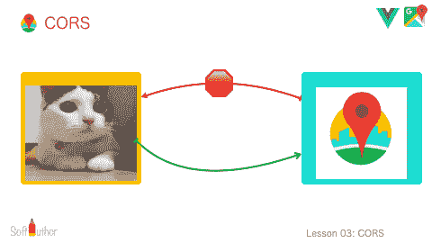
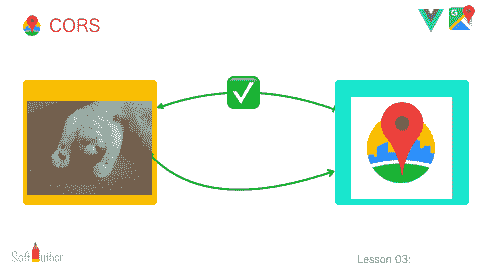
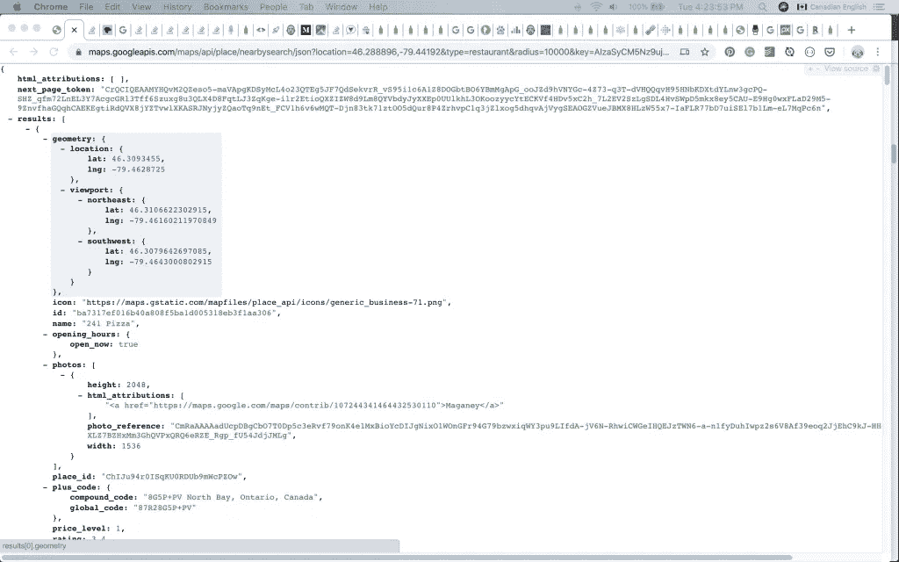
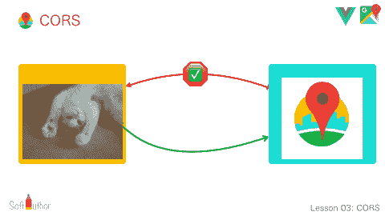

# 不熟悉 JavaScript？当从浏览器发出 HTTP 请求时，您会遇到这个恼人的错误

> 原文：<https://levelup.gitconnected.com/cors-error-solutions-in-a-nutshell-9ebd3b3a5942>

## CORS 误差及简单解决方案



如果你是 JavaScript 或 web 编程的新手，不可避免地会遇到所谓的 CORS 错误。

在本简短教程结束时，您将对以下内容有更好的理解:

*   理解 CORS 是什么
*   为什么会出现 CORS 错误

找到几种方法来修复 CORS 错误:

*   启用 CORS
*   从服务器发出 HTTP 请求
*   使用代理服务器

假设您正在从客户端通过 AJAX 向第三方 API 或您自己的 API 发出 HTTP 请求，但来自不同的域服务器，如下所示。

```
var xhttp = new XMLHttpRequest();
xhttp.onreadystatechange = function () {
  if (this.readyState == 4 && this.status == 200) {
    console.log(xhttp.responseText);
  } else {
    console.log("error")
  }
};
xhttp.open("GET", "[https://maps.googleapis.com/maps/api/place/details/json?place_id=ChIJryijc9s0K4gRG9aU7SDTXdA&key=[YOURAPIKEY](https://maps.googleapis.com/maps/api/place/details/json?place_id=ChIJryijc9s0K4gRG9aU7SDTXdA&key=[YOURAPIKEY)]", true);
xhttp.send();
```

你可能会得到这个恼人的 **CORS** 错误:



错误说…

浏览器阻塞并抱怨来自 Google Places API 的输出响应对象没有“适当的头”来让浏览器从不同的域获取数据。



默认情况下，浏览器将只允许**客户端**和**服务器**之间的通信，只要它们在**同一个** **域**中。

这就是所谓的**同源策略**，出于安全原因，它在浏览器中是默认启用的。



但是，如果您在浏览器地址栏中键入带有有效查询参数的相同 API URL，我们将获得数据并且不会出错！



原因如下。

当你在地址栏中输入 Google API URL 时，你是从一个 Google 服务器发送一个请求，这个服务器就是你将要得到响应的同一个域。

那就是 [**同源策略**](https://en.wikipedia.org/wiki/Same-origin_policy) 并且会起作用！

但真正的问题是…

如何从客户端通过 AJAX 向不同的域发出请求而不出现 CORS 错误呢？

在找到解决方案之前…

# 什么是 CORS？

CORS 代表 [**跨产地资源共享**](https://en.wikipedia.org/wiki/Cross-origin_resource_sharing) 。

这是一种安全机制，允许任何客户端使用来自任何域的数据。

大多数 API 服务提供者将在他们的响应对象中启用 CORS，因为它们将被不同的域使用。

但并不是在所有情况下。



让我们看看如何修复 CORS 错误。

# 启用 CORS

假设您在管理的两个不同的域中有一个客户端应用程序和服务器端 API。

您可以简单地启用 **CORS** ，方法是在服务器端 API(不在客户端)上向响应对象添加下面的头，让浏览器知道您启用了 CORS。

在下面的例子中，我在 node.js 的响应对象中添加了中间件内部的代码。

```
app.use(function(req, res, next) {
  res.header("Access-Control-Allow-Origin", "YOUR-DOMAIN.TLD"); // update to match the domain you will make the request from
  res.header("Access-Control-Allow-Headers", "Origin, X-Requested-With, Content-Type, Accept");
  next();
});
```

一切都会好的！

但是…

如果我试图从第三方 API(如 Google Places API)获取数据，但我无权启用 CORS，该怎么办？

# 从服务器发出 HTTP 请求

在这种情况下，您可以从自己的服务器而不是客户端发出 HTTP 请求。

这是因为当发生服务器到服务器的通信时，**同源策略**不适用。

# 使用代理服务器

您可以从发出 HTTP 请求的客户端使用代理服务器，而不是使用您自己的服务器。

```
[https://cors-anywhere.herokuapp.com/](https://cors-anywhere.herokuapp.com/)
```

您所要做的就是将代理服务器链接附加到 URL 上。

```
var xhttp = new XMLHttpRequest();
xhttp.onreadystatechange = function() {
        console.log(xhttp.responseText)
    if (this.readyState == 4 && this.status == 200) {
       // Typical action to be performed when the document is ready:
       document.getElementById("demo").innerHTML = xhttp.responseText;
    } else {
      console.log("error")
    }
};
xhttp.open("GET", "[https://cors-anywhere.herokuapp.com/https://maps.googleapis.com/maps/api/place/details/json?place_id=ChIJryijc9s0K4gRG9aU7SDTXdA&key=[YOURAPIKEY](https://cors-anywhere.herokuapp.com/https://maps.googleapis.com/maps/api/place/details/json?place_id=ChIJryijc9s0K4gRG9aU7SDTXdA&key=[YOURAPIKEY)]", true);
xhttp.send();
```

上面的示例代码会工作得很好！😀

# 结论

现在，您对为什么会出现 CORS 错误以及浏览器的行为有了更好的理解。

我还向您展示了如何修复 CORS 错误，这样当您遇到 CORS 错误时，您就不会像我过去那样惊慌失措了。

希望有帮助！

如果您有任何问题或任何不清楚的地方，请随时联系我，只需在下面留言。

编码快乐！