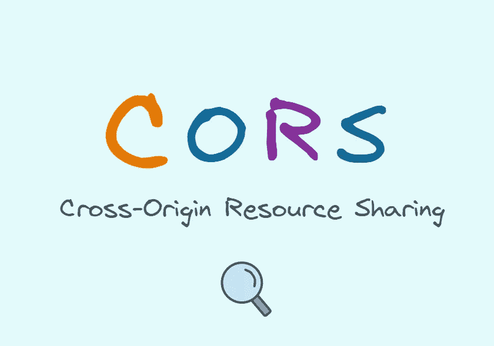
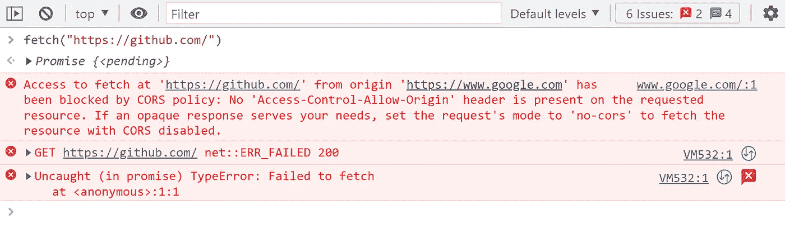
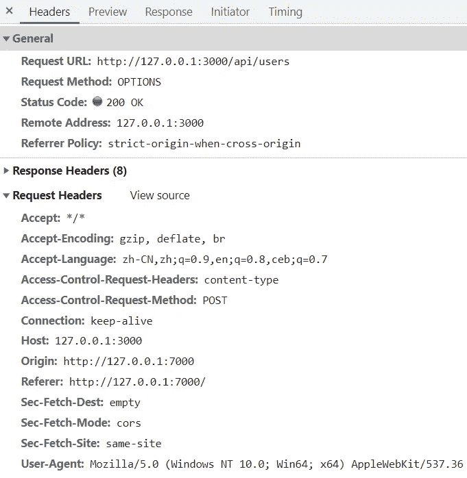
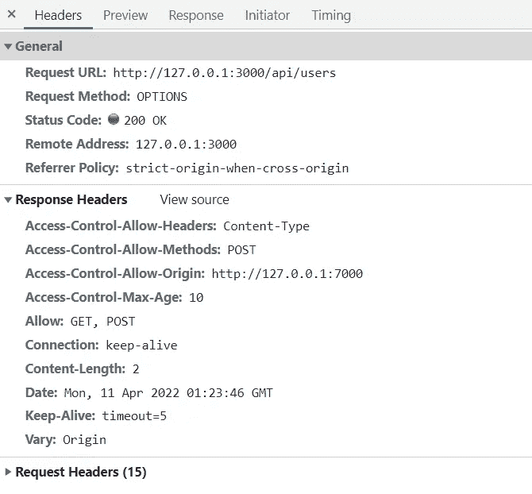

# CORS 是每个网络开发者都应该知道的

> 原文：<https://levelup.gitconnected.com/cors-every-web-developer-should-know-e6db4ba4df38>

## 你真的了解 CORS 吗？

作为一名 web 开发人员，我相信你一定听说过 cross-origin，知道 CORS 机制，那么我来问你一个问题:

> 跨源请求会到达服务器吗？如果到达，相应的后端特性会被执行吗？

也许你已经有答案了，那就看看我的分析是不是和你的一样！

# 同源政策

首先，我们再来回顾一下同源政策。

同源策略是浏览器的关键安全机制。当从 JavaScript 发起 HTTP 请求时，如果当前页面的 URL 和被访问服务的 URL 的协议、端口(如果指定)和主机相同，则认为它们是同源的。也就是说，只要有一个不同，就是不同的原点，就会发生跨原点。

# 什么是 CORS？

顾名思义，跨源资源共享(CORS)允许浏览器客户端基于 HTTP 头从不同的源加载服务器端资源。

以下是失败的跨来源请求:

这里我们可以回答第一个问题，跨原点请求会到达服务器吗？浏览器发送请求时会拦截吗？

答案是跨源请求将到达服务器，因为它需要根据服务器返回的 **HTTP 头决定是否返回对 JavaScript 的响应。**

那么相应的后端特性执行了吗？要回答这个问题，你需要了解简单请求和飞行前请求。

# 简单的请求

简单请求是指**满足以下所有条件:**

1.  **允许的方法之一:** GET 或 HEAD 或 POST。
2.  **仅使用允许的请求头**，它们包括:Accept、Accept-Language、Content-Language、Content-Type(限于 3 个值 application/x-www-form-urlencoded、multipart/form-data、text/plain)、Range(仅具有简单的范围头值；例如，字节=256 或字节= 127–255)。
3.  如果请求是使用一个`XMLHttpRequest`对象发出的，那么在请求中使用的`XMLHttpRequest.upload`属性返回的对象上没有注册事件监听器；也就是说，给定一个 XMLHttpRequest 实例`xhr`，没有代码调用`xhr.upload.addEventListener()`来添加一个事件监听器来监控上传。
4.  请求中未使用 ReadableStream 对象。

# 飞行前请求

在不同源的情况下，除简单请求之外的请求将触发 [CORS 预检](https://developer.mozilla.org/en-US/docs/Glossary/Preflight_request)。

这是因为这些请求可能会对服务器的数据产生副作用。浏览器使用 OPTIONS 方法发起的预检请求是为了知道跨原点请求是否被服务器允许，被允许后再发起实际的 HTTP 请求。

所以我们可以回答第二个问题，当跨原点请求到达时，相应的后端特性会被执行吗？

**答案是不一定，需要分情况。**如果是简单的请求，就会执行；否则，预检请求将不会执行相应的后端功能，只会执行预检请求通过后的请求。

在浏览器客户端，只要是跨原点的请求，其响应能否传递给渲染过程中的主线程(JavaScript)就取决于那些响应头(下面详细描述)。**如果响应头不允许，那么:**

1.  对简单请求的响应在浏览器的网络进程中被丢弃，数据不会传递给 JavaScript。
2.  对飞行前请求的响应不仅会在网络过程中被丢弃，而且不会发出下一个真正的请求。
3.  如果预检请求通过，但是实际请求的响应头**不允许通过**，数据也不会传递给 JavaScript。

# 请求/响应标头

虽然上面已经解决了一开始提出的问题，但是您还需要了解 CORS 的这些重要的请求/响应头。

## 请求标题:

`Origin: <origin>`:表示跨原点访问请求或预检请求的服务器原点。它只是服务器的名称，不包含任何路径信息。在任何访问控制请求中，总是发送源报头。

`Access-Control-Request-Method: <method>`:在预检请求中携带，表示在随后的实际请求中将使用哪种 HTTP 方法。

`Access-Control-Request-Headers: <field-name>[, <field-name>]*`:在预检请求中携带，以指示哪些 HTTP 报头将在随后的实际请求中使用。服务器会用 Access-Control-Allow-Headers 来回答，下面会介绍。

在下面的例子中，我从本地客户端`127.0.0.1:7000`向服务器`127.0.0.1:3000`发出了一个飞行前请求。

## 响应标题:

`Access-Control-Allow-Origin: <origin> | *`:这是一个重要的响应头，表示服务器允许来自某个来源的请求。它可以指定一个原点，也可以指定“*”通配符来允许任何原点。此外，如果指定单个原点，最好在响应头中添加`Vary: Origin`，以表明服务器的响应将根据原点请求头而变化。

`Access-Control-Allow-Methods: <method>[, <method>]*`:响应飞行前请求，告诉客户端在发出实际请求时使用哪种 HTTP 方法，与上面描述的`Access-Control-Request-Method`相比。

`Access-Control-Allow-Headers: <header-name>[, <header-name>]*`:对飞行前请求的响应，告诉客户端在发出实际请求时使用哪个 HTTP 头，与上面描述的`Access-Control-Request-Headers`相比。

`Access-Control-Max-Age: <delta-seconds>`:表示预检请求的结果可以缓存多长时间，`delta-seconds`参数以秒为单位。

下面的截图是本地客户端`127.0.0.1:7000`对服务器`127.0.0.1:3000`的预检请求的响应。

*今天就到这里。我是 Zachary，我会继续输出与 web 开发相关的故事，如果你喜欢这样的故事并想支持我，请考虑成为* [*中级会员*](https://medium.com/@islizeqiang/membership) *。每月 5 美元，你可以无限制地访问媒体内容。如果你通过* [*我的链接*](https://medium.com/@islizeqiang/membership) *报名，我会得到一点佣金。*

你的支持对我来说很重要——谢谢。