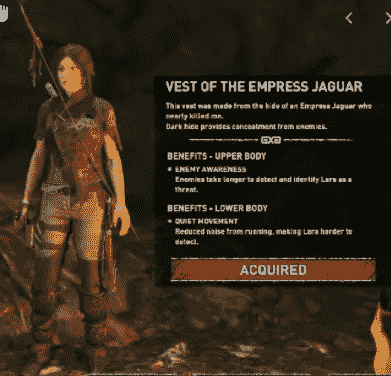
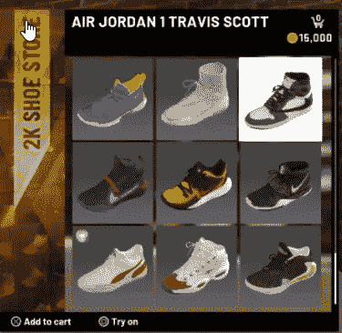
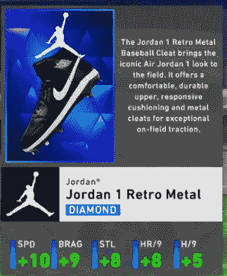

# 电子游戏中的表面奖励糟透了

> 原文：<https://levelup.gitconnected.com/cosmetic-rewards-suck-in-video-games-7b0e2af1251a>

## 游戏设计师可以做得更好…真的可以。

照片由[西格蒙德](https://unsplash.com/@sigmund?utm_source=medium&utm_medium=referral)在 [Unsplash](https://unsplash.com?utm_source=medium&utm_medium=referral) 上拍摄

M 可能我只是在逐渐退出目标市场；也许我只是不理解这种吸引力，但当我说电子游戏中的表面奖励很糟糕时，我是带着一千个太阳的热情来说的。38 岁，我正好符合普通游戏玩家的年龄，所以我不得不问，只有我这样吗？我是不是错过了让游戏变得更好的一些奇妙的东西？让我告诉你我对这件事的想法，你告诉我我是否偏离了我的观点。

首先，让我确切地定义我所说的化妆品。对我来说，一个纯粹装饰性的物品除了改变游戏中某些东西的外观之外，对玩家没有任何好处。其中的一些例子是:

*   贴纸/喷雾
*   舞会
*   表情
*   姿势
*   武器外壳
*   装饰盔甲
*   假发
*   名片/图标/铭牌

上面的名单绝不是权威的，只是当今游戏中一些最大的违规者。对战皇室游戏和多人游戏加入这些东西是最差的，但是单人游戏现在饱受懒惰之苦。还是贪婪？

在我们进一步讨论之前，我还想澄清一下，我不是在谈论创建一个虚拟形象或“变形”系统时的角色定制选项，这些系统允许你给你的盔甲染色或将其改变为另一件有用盔甲的外观。我甚至没有谈论内置的东西，比如像*使命召唤*这样的游戏中的迷彩解锁，甚至没有谈论像*赛博朋克 2077* 或 *GTA* 这样的游戏中商店里的衣服。

汤布拉德尔的阴影(2018)

我的不满在于像《古墓丽影》(2013) 这样的游戏，其中包含了萝拉·卡芙特的 DLC 装备。这些装备对玩家没有任何好处，而且如果你穿着它们，往往会导致游戏中的场景失去一些效果。新的*古墓丽影*系列的后期装置通过给装备增加奖金来解决这个问题。在过去十年左右的时间里，我最喜欢的 RPG 系列之一，*英雄传说:冷钢之路 1–4*，有几个化妆品项目需要获得，包括服装，发型和 Arcus 封面。同样，这些对游戏没有任何影响，也没有对游戏的故事或游戏性产生任何影响，但它们仍然在 DLC 商店出售。

遭受痛苦的不仅仅是 RPG 和冒险游戏。像 *NBA2k* 这样的游戏将大部分*我的玩家*定制锁定在战利品箱、成就或奖励后面。这些都是游戏启动时应该解锁的东西。

M 也许我的问题源于我对微交易的厌恶，我觉得是微交易提升了这一趋势。我们都记得当 DLC 和战利品盒包含强大的物品时，正是对这些做法的强烈反对导致了我们今天看到的“纯粹装饰性”的微交易。这感觉就像游戏开发商/发行商意识到他们可以摆脱纯粹的化妆品的那一刻，他们开始出现在基础游戏中，其他内容开始受到影响。

纯化妆品 NBA 2K 鞋店

现在我明白了，创造十套不同的装饰性盔甲更容易，而不是在游戏中围绕这些盔甲的独特优势进行平衡。尽管如此，我始终相信，如果游戏中存在奖励，它应该服务于一个目的。装饰物品应该是标准的内含物，而不是某种成就的奖励或 DLC 物品。玩家奖励应该有分量，给玩家一些真正进步的感觉，而不仅仅是解锁一个新发型或货币去商店买几双鞋。

至少 MLB 这个节目给了一些奖金

当谈到体育比赛时，我觉得 MLB 的表演是最棒的。虽然我讨厌终极团队游戏模式(谢谢 *Madden* )。获得可以在你的*秀*玩家的路上使用的物品的能力至少给 *MLB 秀*一条腿，使他们的化妆品携带一些实际的游戏性好处。

你可能会问，有什么选择呢？好吧，首先，如果你打算使用表面奖励，那么 a)请给他们一个值，这样我们就可以把他们卖给更实际的东西，b)考虑给他们一些奖励属性或者对游戏性有用的东西。举例来说，如果我因击败敌军将领而获得「敌兵制服」化妆品，那麽当我穿着它时，让它让我不太容易被其他敌兵注意到。如果你给我一些“结实的徒步旅行靴”，让我用更少的耐力穿越崎岖的地形。

或者你可以停止给我们奖励。你想给我一个龙头作为装饰性的战利品，好吧，至少让我用它来制作一些东西或者卖给别人，或者变成一些随机的 NPC 来完成一个秘密任务，让我找到一些伟大的武器或者更多的故事。如果它的唯一目的是填充一个库存槽，那么请不要浪费你或我们的时间。

如果你一定要包括化妆品，它们应该是有意义的。出于对一切神圣事物的热爱，请不要制造我们必须用一种独特的货币购买的物品，我们需要用另一种需要另一种货币购买的不同货币来购买。

如果你打算使用仅仅是装饰性的货币，这本身并不是一个坏主意，让这种货币和普通的游戏货币一起贬值。允许用这种独特的货币购买所有化妆品，让我们这些对金色假发不感兴趣的人以某种特殊的汇率将它兑换成真正的游戏货币。

TLDR:游戏中的化妆品不是坏事，它们只是不应该被用来代替对玩家有意义的奖励，也不应该被锁在旨在吸引玩家玩得更多的任意障碍后面。