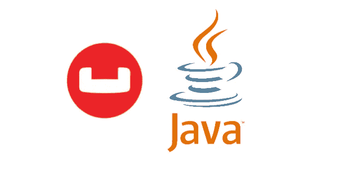
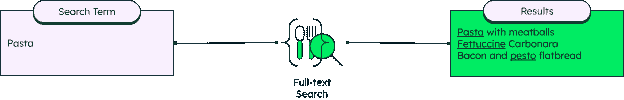
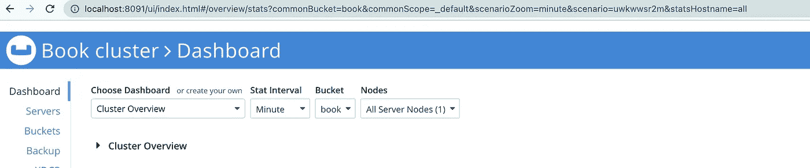
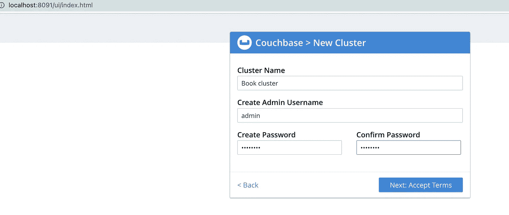
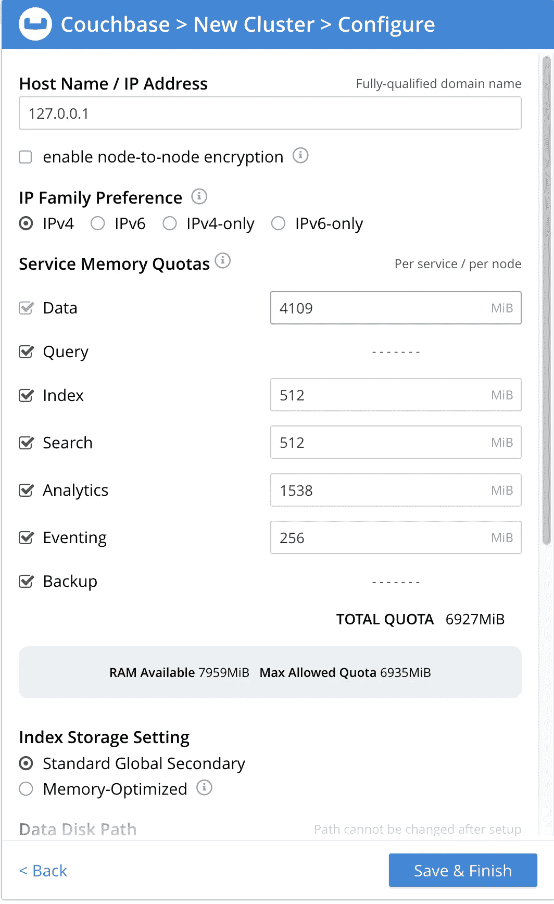
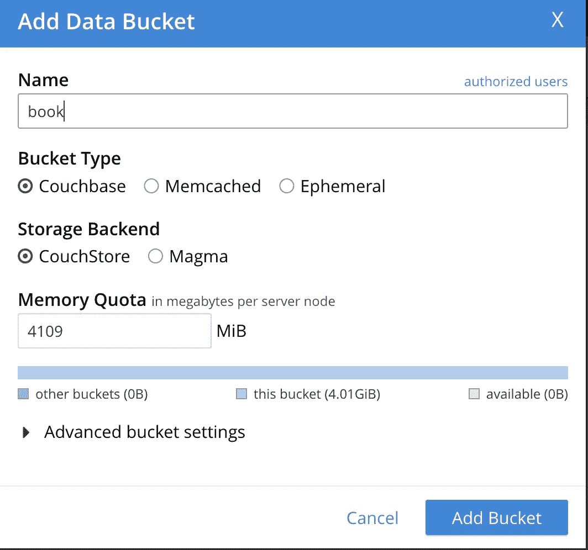
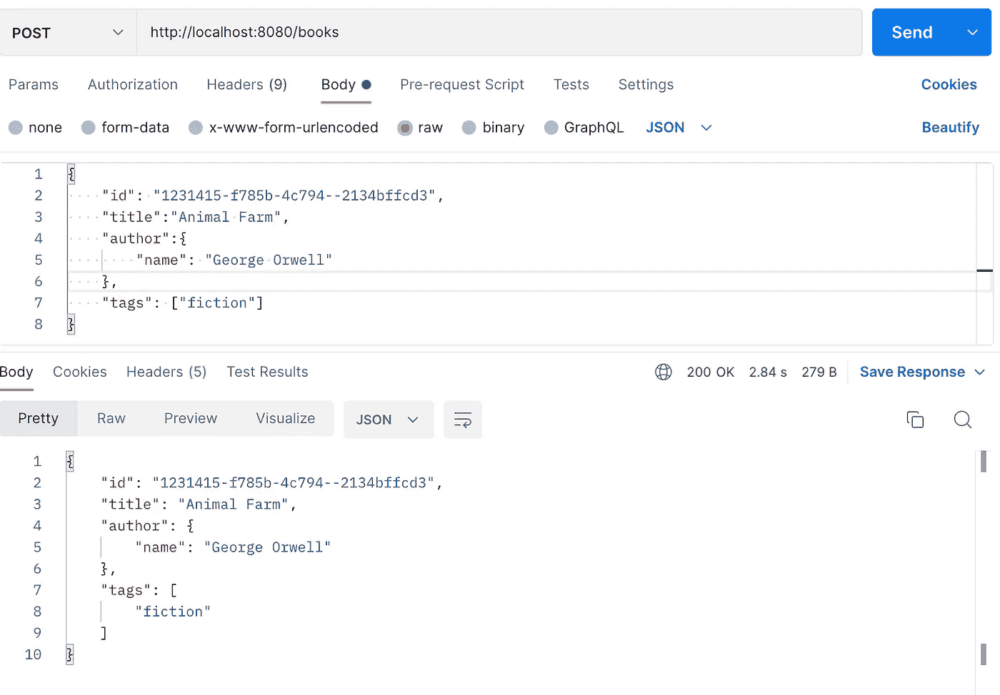
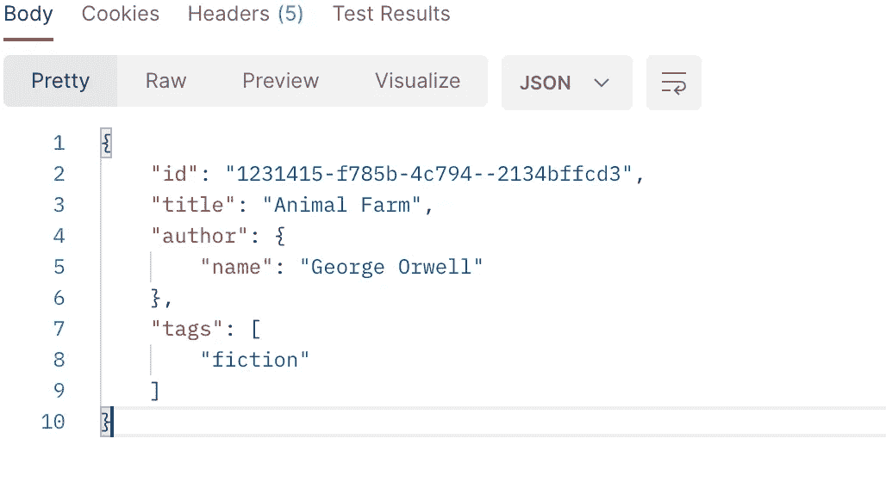
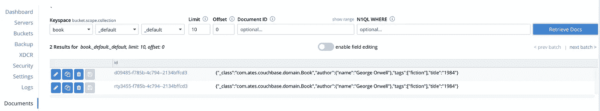

# 使用 Java 的 Couchbase

> 原文：<https://levelup.gitconnected.com/couchbase-with-java-ff87bf995a26>



我今天要讨论一下 Couchbase。首先，我想提供一些关于 Couchbase 的简短信息，例如:这是什么？它是用来做什么的？为什么它更喜欢？。然后，我想添加一段代码，如何使用 Java 和 Springboot 的 Couchbase。

## 什么是 Couchbase？

Couchbase 是一个通用数据库，适合大型企业，可用于各种用例。Couchbase Server 是一个面向 NoSQL 文档的现代云原生分布式数据库，它结合了关系数据库和 NoSQL。您将获得 SQL 和 ACID 事务的强大功能以及 JSON 的无限可伸缩性和灵活性。

## 它是用来做什么的？

Couchbase 广泛用于

*   网
*   移动的
*   物联网应用

## 我们为什么要用它？

*   **快**

对于大型企业应用程序来说，它的速度非常快，并且返回数据的延迟时间很短。

*   **灵活**

这是一个基于 NoSQL 或文档的数据库，这里没有严格的模式。JSON 模式的灵活性欢迎任何业务变化的需求。

*   **N1QL(SQL++):像 SQL 查询一样熟悉的查询**

N1QL 为开发人员和企业提供了一种富有表现力的、强大的、完整的语言，用于查询、转换和操作 JSON 数据。

您可以像查询遗留 RDBMS 应用程序一样查询 JSON 文档数据模型。

*   **全文搜索**

您可以搜索全文，这是指在存储的大量文本数据中搜索一些文本，并返回包含部分或全部查询单词的结果。相比之下，传统搜索将返回精确匹配。或者您可以使用“LIKE”操作进行类似的搜索。但是这个操作相当慢。



全文搜索示例:图片作者[https://www.mongodb.com/basics/full-text-search](https://www.mongodb.com/basics/full-text-search)

在给出一些信息后，我想展示一下我们如何在 Java 和 Springboot 中使用它。

## 实施部分

*   **安装 Couchbase 服务器**

首先，我运行以下脚本，在我的 Docker 上安装和运行 Couchbase 服务器。

```
docker run -d - name db -p 8091–8096:8091–8096 -p 11210–11211:11210–11211 couchbase
```

然后当我在浏览器上打开以下地址时；

```
http://localhost:8091/ui/index.html
```

如果安装成功，那么用户界面如下所示；



我以前没有创建过任何集群，所以我需要用以下信息创建一个新的集群。如果您没有任何集群，您也应该创建它。



我用默认设置配置了集群。



我也没有任何存储桶，所以我通过“存储桶”选项卡下的“添加存储桶”创建了一个新存储桶。


我刚给那个桶取了个名字。我把它命名为“书”。



**编码部分**

*   **依赖关系**

我用的是*spring-boot-starter-data-couch base***和 *spring-boot-starter-web* (这是为了创建 RESTful API) 2.7.1 版本和 *Java* 11 版本。**

**此外，和往常一样，我使用 *Lombok* 进行更好的代码设计。**

*   ****配置床座****

**从 AbstractCouchbaseConfiguration 扩展。正确配置你的沙发底座。我对它的配置非常简单，如下所示。用户和密码信息应该与您的存储桶凭据相同。除非它不会连接到您的服务器。**

*   ****实体模型****

**我创建了一个图书模型。我添加了一些字段，如 id、标题、作者和标签。以下是我使用的一些*注释*的一些信息；**

*****@Document* :** 这个指定了我们的实体应该进入哪个索引。**

*****@Id* :** 使该字段成为您的文档的`id`。这是该索引中的唯一标识符。**

*****@Field* :** 配置字段的类型。**

*   ****服务等级****

**我用 ***findById()*** ， ***save()*** 和 **deleteById()** 方法创建了一个服务类。**

*   ****控制器类别****

**然后，我用 ***findById()*** ， ***save()*** 和 **deleteById()** 端点创建了一个控制器类，以使用服务类的方法。**

**完成我的 API 后，我构建并运行它。然后我使用 **Postman** 调用端点。**

**为了保存数据，我多次调用端点。**

```
POST http://localhost:8080/books
```

****

**然后我用 GET by Id 查数据。**

```
GET http://localhost:8080/books/1231415-f785b-4c794--2134bffcd3
```

****

**或者您也可以在 Couchbase Server 上的 Documents 选项卡下检查记录。例如，我创建了两个记录，当我检查它们时，我看到如下内容:**

****

**你可以在我的 [Github](https://github.com/atesibrahim/couchbase) 上找到全部代码。**

**希望有帮助。**

**感谢阅读…**

*****参考文献:*****

 **[## 使用 Docker 安装 Couchbase 服务器

### Couchbase 服务器可以使用 Docker Hub 的官方 Couchbase 映像来安装。如果您正在尝试 Couchbase 服务器…

docs.couchbase.com](https://docs.couchbase.com/server/current/install/getting-started-docker.html)**  **[## Spring 数据库参考文档

### class Product {(1)monetary amount getPrice(){...} } @ RequiredArgsConstructor(static name = " of ")类产品…

docs.spring.io](https://docs.spring.io/spring-data/couchbase/docs/current/reference/html/)** 

# **分级编码**

**感谢您成为我们社区的一员！在你离开之前:**

*   **👏为故事鼓掌，跟着作者走👉**
*   **📰查看[级编码出版物](https://levelup.gitconnected.com/?utm_source=pub&utm_medium=post)中的更多内容**
*   **🔔关注我们:[推特](https://twitter.com/gitconnected) | [LinkedIn](https://www.linkedin.com/company/gitconnected) | [时事通讯](https://newsletter.levelup.dev)**

**🚀👉 [**加入升级人才集体，找到一份惊艳的工作**](https://jobs.levelup.dev/talent/welcome?referral=true)**