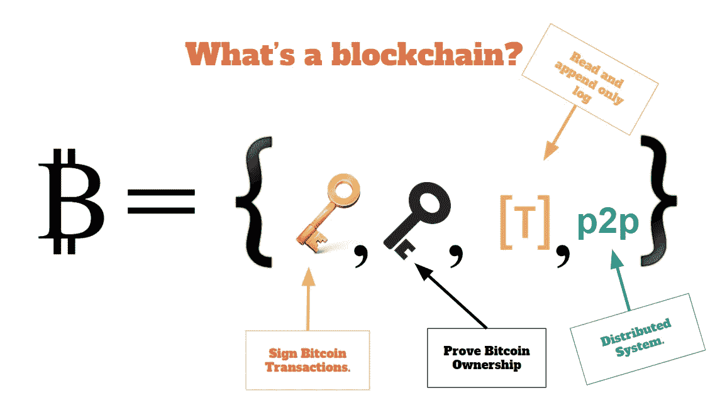
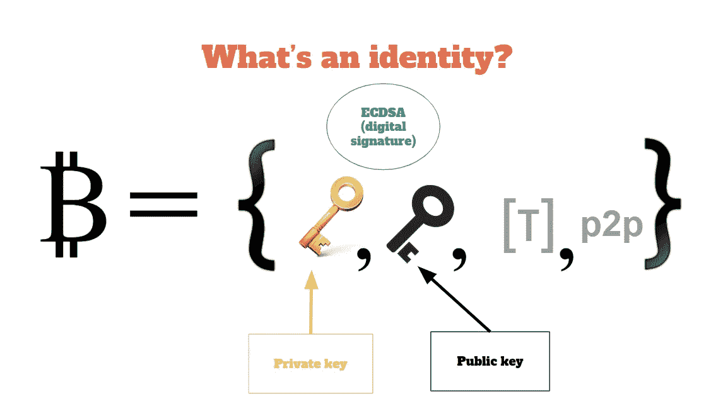
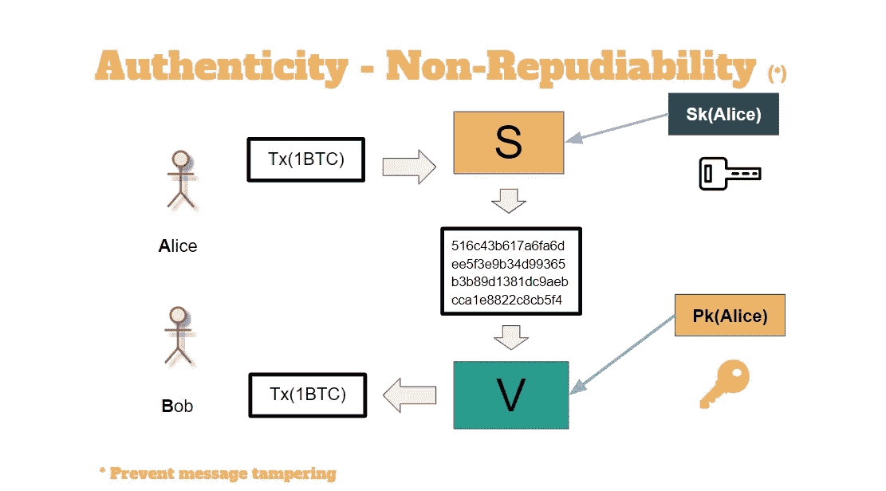
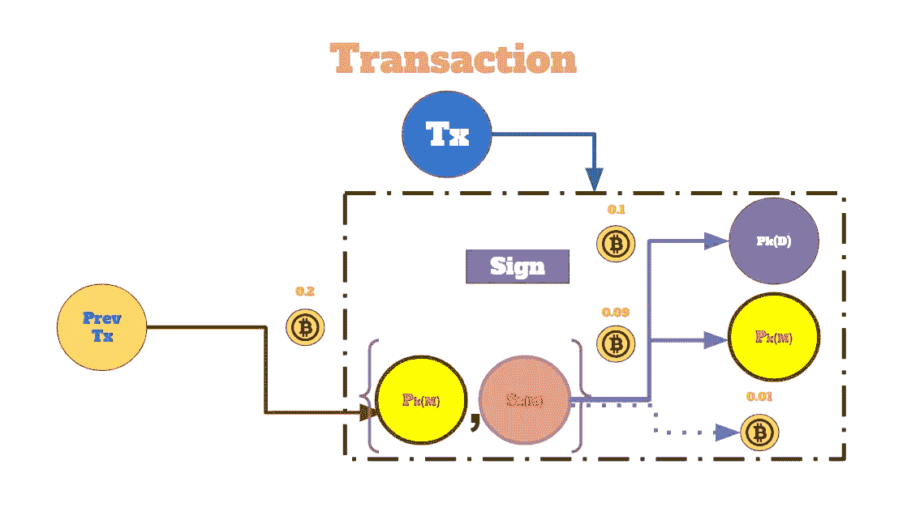
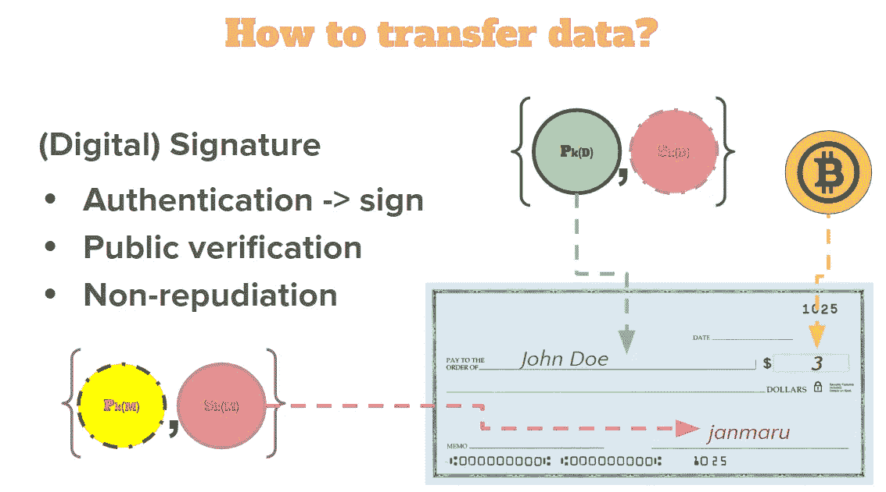
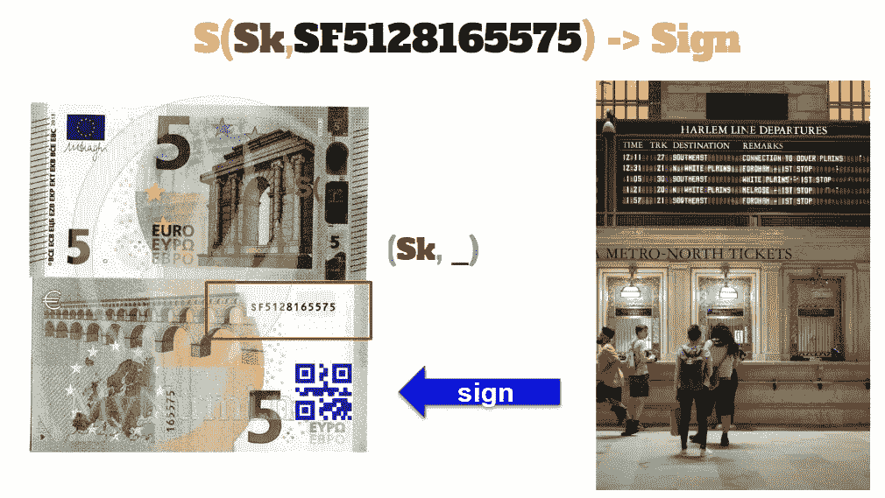
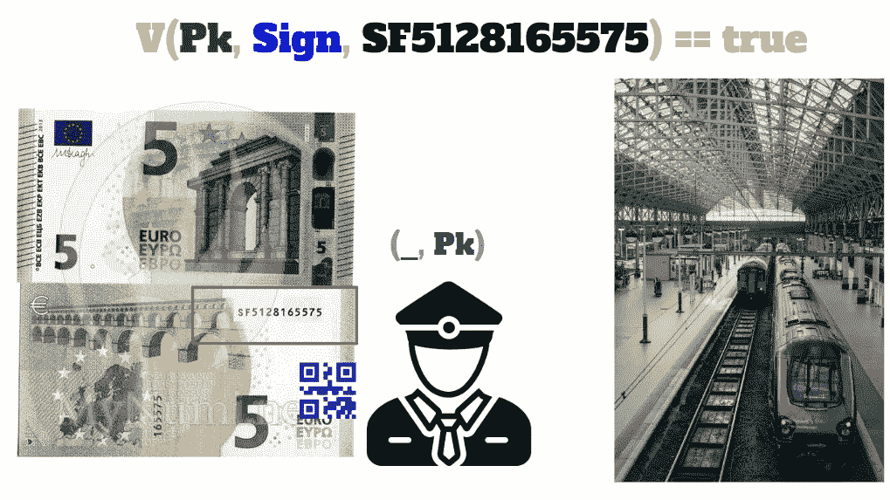

# 有色货币

> 原文：<https://levelup.gitconnected.com/coulored-money-ef6fb7403ab4>


德米特里·德米德科在 Unsplash 上的照片

价值理论是一种经济理论，它试图解释为什么商品和服务被定价，商品和服务的价值是如何产生的，如果这种价值存在，如何衡量它。

总被问到的一个问题是:比特币或任何其他加密货币有内在价值吗？我们如何将它们与法定货币进行比较？因为后者不再由任何黄金或白银支持，它们类似于加密货币，只是衡量人们对政府或国家信任度的*。*

比特币保持其价值的唯一原则是其需求和供应。



但是，如果没有一个轻松愉快的生活环境，比特币就没有任何意义。那是区块链！

区块链是一个*分布式*公共系统，其中每个节点保存一个分类账读取和只追加交易记录。分类帐是块的链接列表，当被整合时，不能被篡改。



在区块链，每个人都是伪匿名身份。当我们谈论它时，我们的意思是:

数字身份:

*   密钥对:(Sk，Pk)(一个秘密密钥和一个公开密钥)
*   Pk 是公开的，应该在任何渠道上发布(例如在公共网站上。)
*   公钥(Pk) ==身份。公钥是区块链中的真实身份。
*   存在一个名为 Verify (Pk，message，signature) == true 的布尔函数，它将公共标识、消息和消息的签名作为输入参数，并给出一个布尔值。如果公共身份被识别为签署文档的人，则为 True。

所以最后，我们谈论真实性，从某种意义上说，我们的公钥表示特定的“消息”是真实的。例如，它已经在特定时间以该格式发布。例如，一个身份(证书颁发机构)可以用它的私钥对任何消息进行签名。然后公布它的公共密钥，并且任何人，给定消息、签名，公共密钥可以检查消息在某个时刻是由权威机构持有/创建的。



在比特币区块链，任何数据的转移都是“钱”的交易。发送方用其私钥对具有作为接收方的公共身份的事务进行签名。一笔钱被转移。



在分布式环境中，比特币可以被视为数据的伪匿名副本，存放在公共的“只读和附加”寄存器中。

彩色硬币是比特币区块链上发行和转移资产的一种方式。可以发行彩色硬币来代表任何东西，包括股票、债券、商品、房地产、法定货币，甚至其他加密货币。

让我们用现实世界的钱来做一个类比，这有助于理解。

公共交通机构有一个*公共身份*和*私有密钥*用于发行、出售和签署火车票。

它实际上并不提供票，而是需要一张钞票，例如一张 5 欧元的钞票，在这张钞票上，顾客可以读取钞票上的唯一序列号。


顾客只需出示带有唯一编号的账单。它不一定要用它来支付。钱只是一个财产的占位符，一种资产。


然后，公共机构读取该唯一号码，用其私钥签署该信息，并提供 QR 码。

```
S(Sk,SF5128165575) -> Sign (QR code)
```



当顾客到达列车时，他将发现售票员不持有管理机构的私钥，而只知道公钥。它将读取票上的唯一号码、QR 码/签名，并使用公钥对其进行验证。



```
V(Pk, Sign, SF5128165575) == true
```

彩色比特币允许加密货币具有真实世界的价值，代表一种资产或发行者将其兑换成某些商品或服务的承诺。

有趣的是，一旦上了火车，5 欧元的钞票可以用来买一杯好喝的咖啡！！！

因此，一旦资产本身被烧毁，在货币上创造资产并不会删除货币的价值。


(*)

克里斯·杨和梅根·马卡姆的照片。