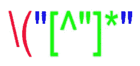

# 用 Python 和正则表达式计算 Word 文档中的引用

> 原文：<https://levelup.gitconnected.com/count-citations-in-a-word-document-with-python-and-regular-expressions-d068218c50b9>


[(来源)](https://www.pexels.com/photo/woman-programming-on-a-notebook-1181359/)

我正在写我的论文的文献综述，我已经记不清到目前为止我已经引用了多少次了。

因为我还在写初稿，所以我一直在手工输入引文，形式是(" *reference_title* "，p. *page_number* )或者简单地(" *reference_title* ")。例如(“学习分析——定义、过程和潜力”，第 2 页)或(“Wanted:理解集成学习系统的路线图”)。

如果我想查找我在哪里引用了特定的文档，这已经足够好了，但是要知道文本中有多少引用，或者更糟糕的是，使用了哪些引用，我不得不承认我提出的这种格式是一团乱麻。

因此，我想出了一个简短的 Python 脚本来解决我的问题。它加载 Word 文档，使用正则表达式(Regex)找到这个“引用格式”的所有实例，并返回找到的引用。该脚本使用 [docx2txt](https://pypi.org/project/docx2txt/) 包将 Word 文件(扩展名为. docx 的文件)加载到单个 Python 字符串中。

# 用我自己的格式查找引文

为了展示这个脚本是如何工作的，我们将使用传统的 Lorem Ipsum 文本，其中混合了一些引文(这些引文包含在以下代码要点的开头):

我的引用格式的脚本

第一部分(直到第 17 行)非常简单:导入 docx2txt 和 Python 的标准正则表达式库，从 Word 文件中以单个字符串的形式加载文本(第 10 行),并用常规双引号替换文本中的任何风格化引号(第 16 和 17 行)。

第二部分(第 19–23 行)是我定义 regex 模式查找引文(第 21 行)并实际尝试在文本中找到它们(第 23 行)的地方。



正则表达式模式(我的引用格式)

在上图中，我通过颜色编码将图案分为三部分:

*   红色:任何引文的左括号(前面的反斜杠对括号进行转义，以便匹配作为第一个字符的文字括号)
*   蓝色:文字双引号(用来分隔引用文档的标题)
*   绿色:匹配双引号之间非双引号的任何字符(即引用文档的标题)

换句话说，上面的正则表达式模式匹配任何用引号括起来并以左括号为前缀的文档标题。例如，对于引用`("Learning Analytics — Definitions, Processes and Potential", p.2)`，该模式只匹配从开始直到第二个双引号`("Learning Analytics — Definitions, Processes and Potential"`。毕竟，只有引用的标题是相关的。左括号有助于识别文档标题。

带有脱字符号(^)和方括号内的双引号的绿色部分意味着模式正在寻找不是双引号的单个字符**。括号外的星号称为通配符，表示单个字符选择可以重复零次或多次。在完整模式的上下文中，绿色部分负责查找用双引号括起来的文档标题(蓝色部分)。**

最后，第三部分(第 25 行到结尾)遍历找到的匹配/引用的 iterable，将它们保存在一个列表中。因为每个匹配都包括匹配子串相对于原始文本/字符串的第一个和最后一个索引，所以我们使用这些索引来提取匹配部分。剩下的就是简单的 Python 来打印找到的所有引文，首先打印所有引文，然后只打印唯一的引文(将引文的`list`转换成`set`会删除重复的引文，将唯一的引文转换回`list`只是个人偏好的问题)。

最后，这个脚本和示例的输出。docx 文件是:

```
All citations found: 3("Wanted: A road map for understanding Integrated Learning Systems"("Wanted: A road map for understanding Integrated Learning Systems"("Learning Analytics - Definitions, Processes and Potential"Unique citations: 2("Wanted: A road map for understanding Integrated Learning Systems"("Learning Analytics - Definitions, Processes and Potential"
```

我本可以从引文中去掉左括号，但保留它也没关系。即使我想对结果进行排序，我也可以简单地调用唯一引用列表上的`sorted()`函数。

# APA 引用的通用解决方案

虽然上面的解决方案解决了我的具体问题，但我决定更进一步，创建一个适用于实际引用的正则表达式，特别是那些使用 [APA](https://aus.libguides.com/apa) 风格编写的引用。正如您在第二个代码要点中看到的，代码中唯一改变的是 regex 模式(好吧，开头的引用示例和。准确地说，加载 docx 文件也是不同的)。

APA 引用格式的脚本

在解释正则表达式之前，让我解释一下它实际上在寻找什么:括号中包含的所有内容。APA 引文不包括文件标题，而是包括作者和日期/年份，因此我认为完整的引文是相关的。此外，这些(错误的)引用例子有一些变化，遵循一些可能的 APA 式引用场景:

*   作者可以是一个或多个作者，匿名(被识别为匿名)或者实际上是用双引号括起来的文档标题(对于没有作者的在线帖子/文章)
*   日期可以是一年、缺失日期(标识为 n.d .)，也可以是该作者在该年的多个出版物之一(标识为带有字母后缀的年份)

现在是正则表达式怪物:


正则表达式模式(APA 引用格式)

黑色部分(引用的括号)是唯一不在 *regex 组*中的东西。正则表达式组用括号括起来，这就是为什么黑色的那一对前面有反斜杠，这样模式就可以匹配引用的文字括号。

该模式中的三个组用颜色编码:

*   红色:与引用作者相匹配的组，无论是哪种类型的作者
*   绿色:分组以匹配分隔作者和年份的逗号和空格
*   蓝色:与年份相匹配的组，无论是哪种类型的年份

现在，由于匹配作者和年份的组内部有多个模式，让我更详细地解释每个组。首先是作者群。


正则表达式作者组

为了方便阅读，我把这个组的括号和竖线都改成了黑色。从颜色可以看出，根据前面提到的可能的作者备选方案，这个寻找作者的小组本身有三个备选方案。在简单的英语中，知道竖线意味着另一种匹配的可能性，第一个正则表达式组匹配引用的作者为:“任何数量的字符，不是双引号或右括号或单词 Anonymous 或在线文章/文章标题，只要它不包含嵌套的双引号或右括号”。现在一个一个来:

*   第一个选项(红色)寻找最常见的选项，有单个作者、两个或更多作者；这种逻辑与我使用的引用样式的正则表达式模式非常相似
*   第二个选项(绿色)只是查找单词 Anonymous。对于匹配为引文作者的单词 Anonymous，您可以认为`\b`确保该单词作为一个完整的单词被找到，谢天谢地，作者和日期之间的逗号以及引文的左括号作为分隔符来确认它是一个完整的单词
*   第三个选项(蓝色)与第一个选项相同，但这次包含了双引号，因为这是第三个作者选项的写法，文章的标题用双引号括起来


Regex 作者-日期分隔符组

第二组模式对分隔作者和引用日期的逗号和空格进行文字匹配。非常简单，谢天谢地，所见即所得。


正则表达式日期组

好吧，再解释一遍，我保证这是正则表达式“废话”的终结。同样，就像 author 组一样，date 组有三个选项，用竖线隔开。首先在英语中，这个组是如何匹配引用日期的:“任何连续出现一次以上的数字(即，一年)或 n.d .表达式或一年后跟一个字母)。这是一个相对简单的模式，但下面是对每种选择的更具体的解释:

*   第一个备选项(红色)匹配一个或多个连续数字(`\d`匹配数字，即 0 到 9)。括号外的加号是另一个通配符，表示该模式查找一个或多个连续数字(不可能找到年份，尽管我可以指定它查找 4 个连续数字，而不是查找一个或多个数字)
*   第二个选项(绿色)简单地寻找 n.d .(无日期)类型的日期。每个句点都被转义，因为在 regex 中，句点匹配任何字符，而我们在这里需要的是文字句点
*   最后一个选项(蓝色)看起来像红色的一年，但这次它必须在结尾有一个额外的字母(`\w`匹配任何字母，a-z)

最后，第二个脚本的输出:

```
All citations found: 21(Anonymous, 2010)("Barcelona to Ban Burqa", 2010)(Sabbagh, n.d.)(Sabbagh, 2009)(Qianyi Gu & Sumner, 2006)(Anonymous, n.d.)(Sabbagh, n.d.)(Sabbagh, 2010a)(Sabbagh, 2010b)(Anonymous, 2010)("Barcelona to Ban Burqa", 2010)(Qianyi Gu & Sumner, 2006)(Sabbagh, 2009)(Anonymous, n.d.)(Qianyi Gu & Sumner, 2006)(Anonymous, n.d.)(Despotovic-Zrakic et al., 2012)(Despotovic-Zrakic et al., 2012)("Barcelona to Ban Burqa", 2010)(Anonymous, 2010)("Barcelona to Ban Burqa", 2010)Unique citations: 9(Qianyi Gu & Sumner, 2006)(Sabbagh, 2009)(Sabbagh, 2010b)("Barcelona to Ban Burqa", 2010)(Sabbagh, n.d.)(Anonymous, 2010)(Sabbagh, 2010a)(Anonymous, n.d.)(Despotovic-Zrakic et al., 2012)
```

# 结论

编写这两个脚本和你正在阅读的这篇文章是我度过周日下午的一种有趣方式，而不是继续我的文献综述:)编写代码非常容易，耗费大量时间的是拿出那些正则表达式来查找引用。

顺便说一下，需要用默认的双引号来代替风格化的双引号是因为/。docx 文件使用前者而不是后者，这意味着正则表达式找不到结果。是的，我本可以搜索风格化的引号，但是为什么不用 Python 来替换呢？

最后一点，使用`finditer()`函数来执行匹配是为了节省内存。前一个函数不是用`findall()`函数直接在内存中创建匹配列表，而是返回一个迭代器，也就是说，在匹配之后，你可以一次一个匹配地遍历这个迭代器，而不是一次用一个列表把它们都放在内存中。然而，在脚本的最后，为了演示的缘故，我忽略了内存问题。

如果你想自己运行这些脚本，可以在[这里](https://repl.it/@ze1598/MyCitations)获得“我的引用”格式的交互式演示，在这里可以获得另一个 APA 引用[格式的演示。脚本和各自的。GitHub 上也有 docx 样本文件](https://repl.it/@ze1598/APACitations)。