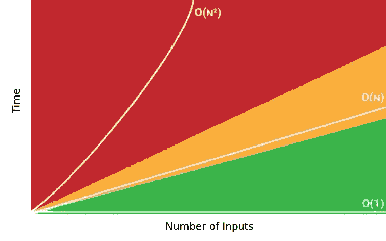
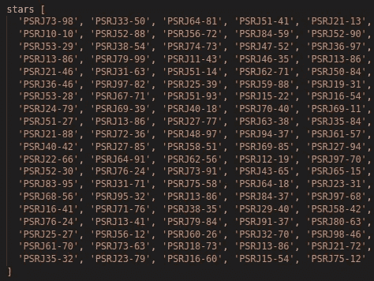
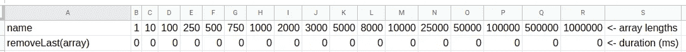
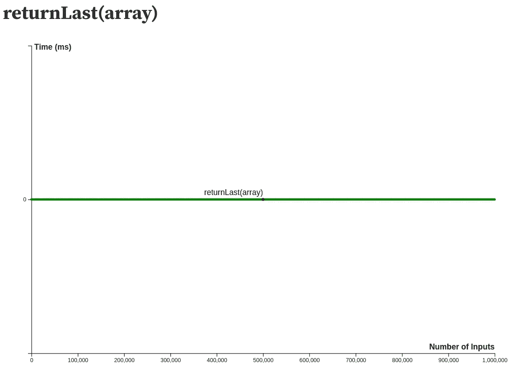
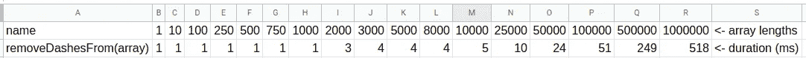
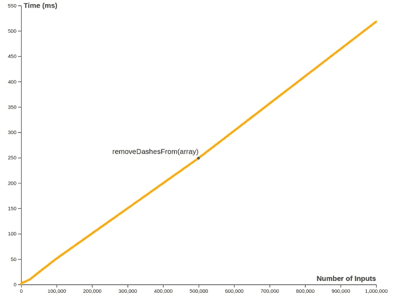
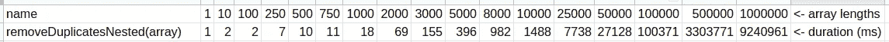
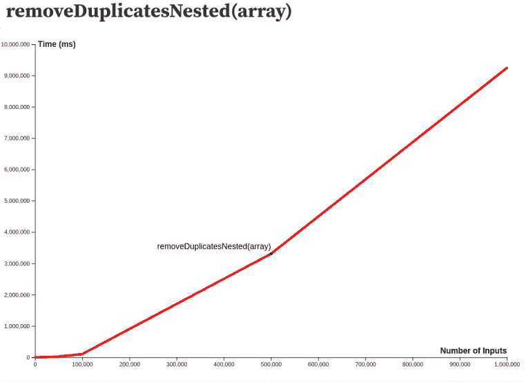
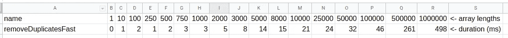
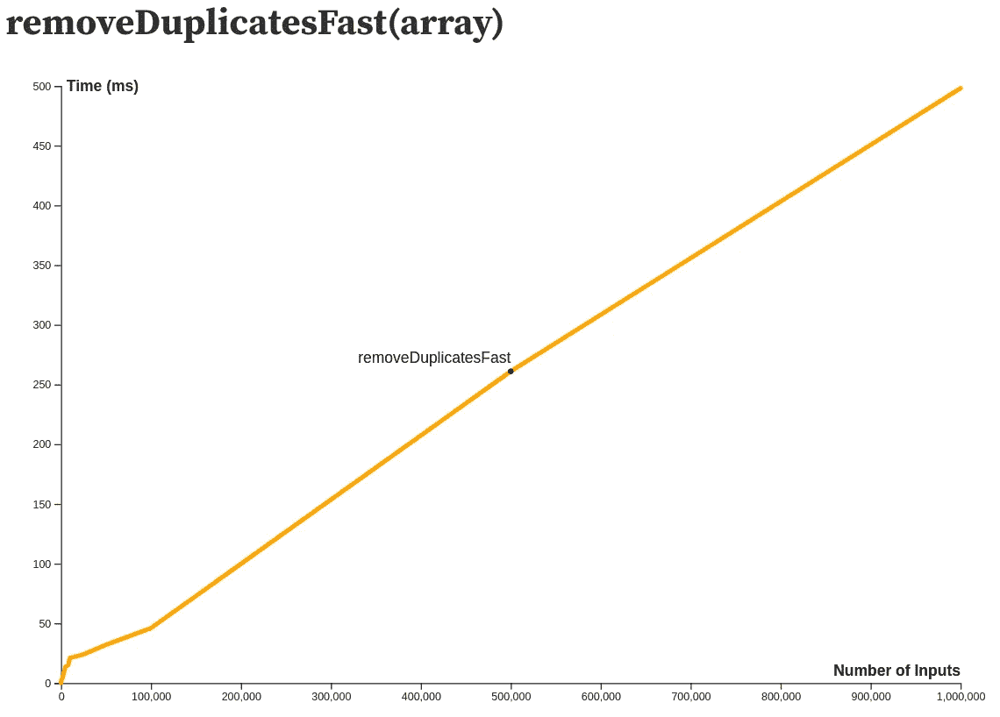

# 数星星

> 原文：<https://levelup.gitconnected.com/counting-stars-86a168c9d14d>

使用大 O 分析编写高效代码


在外层空间，有数十亿颗恒星

## 什么是大 O 分析？

程序员的主要任务是编写代码，执行一系列旨在产生某种期望输出的动作。随着每一段新代码的编写，程序员可能必须评估通过代码解决特定问题的不同方法。

因此，如果有许多不同的方法来编写代码以产生期望的结果，我们如何客观地确定一个代码块是否比另一个更好呢？这就是**大 O** 分析发挥作用的地方。

> 大 O 分析是通过查看代码执行的**效率**来客观地比较产生相同结果的不同代码块。正因为如此，大 O 分析允许程序员识别和缓解瓶颈，并且**编写更高效的代码**，即**更快**并且**消耗更少的资源**。

大 O 关心的是通过看两个因素来描述代码**效率**:时间**和空间**空间**。时间是指特定代码块执行所花费的持续时间。空间是指块使用的内存量。在这篇文章中，我将关注时间。**

所有的计算机都是不同的，一些比另一些更快或者有更大的内存。正因为如此，在对代码进行分类时，大 O 分析并不关心具体的单位(比如毫秒或字节)。让我们能够使用 Big O 在不同环境中进行比较的是，它关注的是当事情扩展时会发生什么，或者当遇到大量输入时块的表现如何。大 O 分析迫使程序员考虑最坏的情况，并考虑诸如…

> “当这个函数接收到一百万个输入时会发生什么？十亿怎么样？”😖

当考虑与 Big O 相关的代码时，我们希望**在情况最糟糕的时候优化代码**。这样，我们可以确保代码在正常情况下运行良好。

那么，现在我们知道大 O 是关于代码效率的分类，它是如何工作的呢？让我们考虑下面简化的**大 O 符号**图。这三行表示三个不同代码块的时间效率。我们可以把代码块想象成算法。在 x 轴上跟踪算法的输入数量，在 y 轴上跟踪完成算法的持续时间。



我们可以看到快速算法在绿色区域执行。那些表现在橙色波段的人需要更长的时间，最后，那些表现在红色波段的人需要最多的时间。请注意，随着输入数量的增加，红色的算法线实际上是向上陡峭弯曲的，标记为 **O(n )** 。如果输入数量大幅增加，像这样执行的算法可能会特别成问题，这也是这条线出现红色的原因。

这三条线标有 **O(1)** 、 **O(n)** 和 **O(n )** 。每一个都是线所代表的算法的大 O 符号。

**O(1)**
以这种方式执行的算法被称为具有**恒定复杂度**，因为算法完成所需的时间与输入的大小无关。分类为 **O(1)** 的算法是最快的，因为不管向算法提供多少输入，它仍将在恒定的时间内运行。

**O(n)** 以这种方式执行的算法被称为具有**线性复杂度**，因为算法完成所需的时间与算法的输入数量(n)直接相关。分类为 **O(n)** 的算法随着输入数量的增加而花费更长的时间，但不是以指数方式。

**O(n )** 以这种方式执行的算法被称为具有**平方复杂度**，因为算法完成的时间以 n 的速度增加。

除了这些，还有更多大的 O 分类，但是为了简单起见，我将把重点放在具有 O(1)、O(n)和 O(n)符号的算法例子上。

因为大 O 关心的是*算法在规模上如何执行，宇宙中的* **恒星**是一个合适的**模型**进行实验。毕竟，宇宙中有数十亿颗恒星，如果我们开始研究许多许多恒星，这听起来像是一个潜在的缩放问题。不知道这么多明星怎么把**命名为**？

经过一些快速的研究，[Space.com](https://www.space.com/57-stars-formation-classification-and-constellations.html)告诉我们恒星是以下列方式命名的:

> 由于宇宙中有如此多的恒星，大多数恒星的名字都是由一个代表恒星类型的缩写或一个列出恒星信息的目录组成，后跟一组符号。例如，PSR j 1302–6350 是一颗脉冲星，因此是 PSR。J 揭示了被称为 J2000 的坐标系统正在被使用，而 1302 和 6350 是类似于地球上使用的纬度和经度代码的坐标。

使用这个逻辑，下面是一个简单的函数，它返回一个随机的星名。

star name 生成器

此函数返回的名称示例可能是:psrj 18–93、psrj 26–74 或 psrj 88–13 等，其中数字是随机的。另外，在上面描述的逻辑中，数字是 4 位数，但是在 starNameGenerator 函数中，我把它们变成了 2 位数,这样这个函数就有更好的机会产生一个重复的名称(稍后会详细介绍)。

接下来，让我们做一些明星，也许从大量开始，但我们不要疯狂。请给我 100 颗星星。

造星

运行后，我的随机星名数组如下所示:



所以，现在我们有办法生成一些数据(如果我们愿意，这可能会增长到数十亿颗恒星)。接下来，我们可以考虑针对不同的数组大小(输入数)编写函数，并根据大 o 来分析它们。

首先，让我们考虑 **O(1)常数复杂性。**记住， **O(1)** 的意思是，无论输入多少次，算法每次都要在大致相同的时间内返回一个结果。

比方说，我们需要一个函数来返回传入的星星数组的最后一个元素。

returnLast 函数为上面的 100 个列表正确地返回了**psrj 75–12**。

接下来，我们希望增加数字输入，以查看该函数对于 Big O 的执行情况。我添加了开始和结束时间戳，以确定该函数执行以下长度递增的随机星形数组(达到 100 万)所需的毫秒数。

为每个输入数组长度记录的迭代时间如下…



这看起来非常非常快，不到 1 毫秒， **returnLast(array)** 函数就返回一个结果，不管传入的数组有多大，即使是 100 万颗恒星。当迭代时间相对于输入量作图时，我们得到一条平坦的线。这个功能确实是 **O(1)** ，绿色快速。



**O(n)**

接下来，我们考虑 **O(n)线性复杂度。**记住，一个线性复杂算法完成的时间与算法的输入数(n)直接相关。

假设我们无法控制 **starNameGenerator** ()函数，比方说这个名字列表可能来自 API 调用或我们无法控制的其他地方。此外，假设我们不喜欢函数在名称 psrj 18**–**93 中插入的破折号(-)，例如，我们希望在将它们保存到数据库之前删除它。所以我们想出了一个 **removeDashesFrom(数组)**函数，在保存之前运行这些名字。

看一下这个函数，我们可以看到我们正在遍历星星数组**一次。**所以，如果将 n 定义为传递的数组长度，那么循环将迭代 n 次。替换所有破折号的迭代次数**与输入数组**的长度直接相关。让我们再次绘制时间图，从 1 到 1，000，000 表示数组的长度。



这条线绝对看起来像 **O(n)** 的形状，这个函数在黄色里。在一百万次输入的情况下，这个函数只需要半秒钟。

最后，让我们考虑一下 **O(n)二次复杂度。**记住，如果 n 被定义为输入数，二次复数算法完成的时间以 n 的速度增加。

假设我们发现 **starNameGenerator** 函数可能会返回重复的名字，我们需要一个函数从我们的星名数组中删除重复的名字。这是一个函数，它将生成去掉重复项的星星数组。这不是最有效的功能，也许是最差的，但它能产生预期的结果。

我已经**故意**把这个函数写得尽可能**低效****。**该函数的逻辑构建一个唯一的星名数组，通过对照每个其他星名检查数组中的每个星名来返回*，除了它当前正在检查的星名之外* ***通过数组循环的每次迭代*** *。*如果没有找到重复项，它将把星名称推入返回数组。更糟糕的是，如果发现了一个重复项，它会被记录下来，但是循环并没有停止寻找更多的重复项，而是在已经找到一个重复项之后继续检查数组中的后续项。

这个函数被归类为 **O(n )** 是因为由于嵌套循环的原因，它将遍历长度为 n，n 次的输入数组。这使得迭代次数为 n * n，或者 n，如果 n 是输入的次数。

下面是为这个低效函数记录的时间。



这条线看起来类似于上图中的 **O(n )** 线，我们可以看到曲率向上，告诉我们输入增加越多，时间以 n 的加速步伐增加。

事实上，如果数组长度达到 100 万，函数完成的时间几乎需要 1000 万毫秒，或者说**154 分钟**！事实上，这个函数是一个潜在的**瓶颈**，是重构的候选对象。

那么，如何提高该函数的性能呢？我们知道问题在于**嵌套循环**，其中迭代**依赖于输入数组**的长度。

如果我们不使用数组来跟踪返回的元素，而是使用一个名为 arrayMap 的对象，会怎么样呢？考虑这个版本:

在这里，我们只遍历输入数组一次，arrayMap 对象用它的每个键的星名称填充，每个键的值是该项在输入数组中出现的所有索引的数组。如果名称在数组中出现多次，则值数组会随着每次重复而增长。

例如，假设我们的星形输入数组如下所示(注意重复的星形，**psrj 33–50):**

```
['PSRJ73–98', '**PSRJ33–50**', 'PSRJ64–81', '**PSRJ33–50**', 'PSRJ21–13']
```

如果这是输入数组，那么在 removeDuplicatesFast(array)函数中，arrayMap 构建如下:

```
{
 'PSRJ73–98': [ 0 ],
 'PSRJ33–50': [ 1, 3 ],
 'PSRJ64–81': [ 2 ],
 'PSRJ21–13': [ 4 ]
}
```

psrj 33–50 键的值为[1，3]。这是因为该值在输入数组的索引 1 和索引 3 处重复。

方便的是，现在我们已经有了填充的 arrayMap 对象，我们可以使用 **Object.keys(arrayMap)** 返回给定对象自己的可枚举属性 **names** 的数组，按照普通循环的顺序进行迭代。该函数现在移除没有嵌套循环的重复**。**

以下是**removeDuplicatesFast(array)**函数记录的时间:



我们可以看到，removeDuplicatesFast(array)函数的执行速度为 **O(n)，**，从一个包含 100 万颗恒星的数组中删除重复项大约需要半秒钟，比上一个函数执行的 154 分钟要好得多！

使用大 O 分析，我们可以识别代码瓶颈或性能不佳的代码，重构有问题的算法并生成健壮的代码。

这篇博文的代码可以在:[https://github.com/FergusDevelopmentLLC/countingStars](https://github.com/FergusDevelopmentLLC/countingStars)找到

**参考文献:**
[大 O 符号完全指南&算法的复杂性分析](https://www.youtube.com/watch?v=HfIH3czXc-8)
[大 O 符号 Javascript 中的时间复杂性](https://medium.com/analytics-vidhya/big-o-notation-time-complexity-in-javascript-f97f356de2c4)
[恒星事实:恒星名称和恒星演化的基础知识](https://www.space.com/57-stars-formation-classification-and-constellations.html)