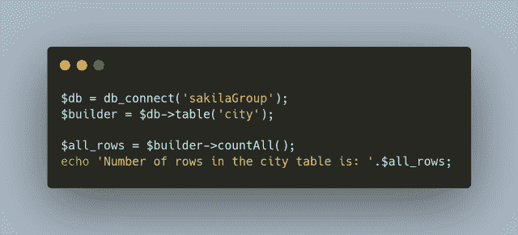
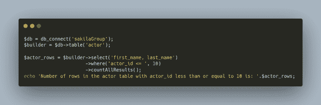
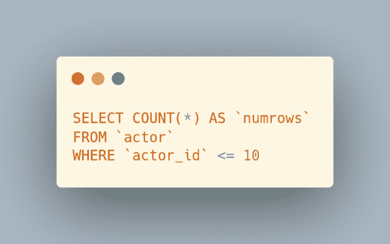

# 在 CodeIgniter 4 中使用 countAll()和 countAllResults()计数

> 原文：<https://levelup.gitconnected.com/counting-with-countall-and-countallresults-in-codeigniter-4-119cfaa022f9>

使用查询构建器`countAll()`或`countAllResults()`函数，在 CodeIgniter 4 中获得表或查询行数非常容易。继续阅读，查看每一个的例子…


图片由 [Gerd Altmann](https://pixabay.com/users/geralt-9301/?utm_source=link-attribution&utm_medium=referral&utm_campaign=image&utm_content=5594879) 从 [Pixabay](https://pixabay.com/?utm_source=link-attribution&utm_medium=referral&utm_campaign=image&utm_content=5594879) 拍摄

需要学习 MySQL 吗？刚刚起步，对如何查询一个表，获取自己需要的数据感到困惑？出于这个特殊的原因，我正在创建优质的 MySQL 初学者内容。来帮助那些想学习 MySQL 基础知识却不知道从何入手的人。[了解更多关于](https://digitalowlsprose.ck.page/03da7bb182)我开发和发布的优质博客文章。

每天通过 Refind 将定制的文章发送到您的收件箱。Refind 是我日常阅读习惯的一部分。使用[我的推荐链接](https://refind.com/joshua-otwell?invite=5440c95e39)让它成为你的一部分。在不增加您费用的情况下，我将有资格通过我的链接获得更多注册的高级订阅。****网络的精华，每天早上都在你的收件箱里。免费订阅****

**自我推销:**

**如果你喜欢这里写的内容，尽一切办法，把这个博客和你最喜欢的帖子分享给其他可能从中受益或喜欢它的人。既然咖啡是我最喜欢的饮料，如果你愿意，你甚至可以给我买一杯！**

## **CodeIgniter 4 查询构建器 countAll()**

**CodeIgniter 4 查询构建器`countAll()`函数将表中的行数作为`INTEGER`返回。在第一个示例中，我们获得了 [Sakila 数据库](https://dev.mysql.com/doc/sakila/en/)‘city’表中的行数:**

****

```
**Number of rows in the city table is: 600**
```

**我有一个故事要讲。关于我作为一个自学成才的后端 web 开发人员的旅程。在 [Real Tough Candy 网站](https://realtoughcandy.com/)上找到更多我参加的这次采访。在这里阅读整个采访。**

## **CodeIgniter 4 查询生成器 countAllResults()**

**其中，`countAll()`返回特定表中的行数，`countAllResults()`返回查询生成器查询的行数。你也可以通过`countAllResults()`使用过滤功能。在这个例子中，我使用`where()`函数过滤查询:**

****

```
**Number of rows in the actor table with actor_id less than or equal to 10 is: 10**
```

****相关**:CodeIgniter 4 查询构建器`where()`函数支持几种不同的参数绑定选项。在帖子[CodeIgniter 4 Query Builder where()函数和 MySQL 的参数结构](https://joshuaotwell.com/codeigniter-4-query-builder-where-function-and-parameter-structure-with-mysql/)中了解它们。**

*****OpenLampTech*** 是面向 PHP 和 MySQL 开发者的简讯。[免费订阅](http://openlamptech.substack.com)，享受每周直接发送到您收件箱的精选原创文章。**

**使用`$db->getLastQuery()`方法，我们可以看到发送到服务器并在服务器上执行的确切查询:**

****

****相关**:阅读帖子 [CodeIgniter 4 查询助手$db- > getLastQuery()方法用于 SQL 原型制作](https://joshuaotwell.com/codeigniter-4-query-helper-getlastquery-method-mysql-prototyping/)，了解关于这个超级方便的 CodeIgniter 4 数据库助手方法的更多信息。**

**你是[中型](http://medium.com/)成员吗？如果是这样的话，[每次我发表博客文章时都会收到一封电子邮件通知](https://parabollus.medium.com/subscribe)如果你更喜欢中型平台的话。不是会员？别担心！使用[我的注册链接](https://parabollus.medium.com/membership)(我会向你收取佣金，无需额外费用)并加入。我真的很喜欢阅读所有伟大的内容，我知道你也会！！！**

**支持我的博客和工作，把你想要的零钱扔进我的小费罐。谢谢大家！**

## **相似阅读**

**如果你喜欢这篇文章，那么你可能也会喜欢下面的文章:**

*   **[Codeigniter 4 最后插入 ID](https://joshuaotwell.com/how-to-retrieve-mysql-last-insert-id-in-codeigniter-4/)**
*   **[使用 CodeIgniter 4 update()函数更新数据](https://joshuaotwell.com/codeigniter-4-query-builder-set-function-with-update/)**
*   **[MySQL IFNULL()函数](https://joshuaotwell.com/mysql-ifnull-function-usage-in-select-queries/)**
*   **[MySQL 展示表格](https://openlamptech.substack.com/p/mysql-show-tables-2-variations)**

**喜欢你读过的？看到什么不正确的吗？请在下面评论，感谢阅读！！！**

# **行动的号召！**

**感谢你花时间阅读这篇文章。我真心希望你发现了一些有趣和有启发性的东西。请在这里与你认识的其他人分享你的发现，他们也会从中获得同样的价值。**

**访问[投资组合-项目页面](https://wp.me/P28ctb-3KD)，查看我为客户完成的博客帖子/技术写作。**

****

**[**咖啡是我绝对喜欢的饮料！**！！](https://ko-fi.com/joshlovescoffee)**

**要在最新的博客文章发表时收到来自本博客(“数字猫头鹰散文”)的电子邮件通知(绝不是垃圾邮件)，请点击“点击订阅！”按钮在首页的侧边栏！(如有任何问题，请随时查看 [Digital Owl 的散文隐私政策页面](https://wp.me/P28ctb-3gI):电子邮件更新、选择加入、选择退出、联系表格等……)**

**请务必访问[“最佳”](https://joshuaotwell.com/where-blog_post-in-digital-owls-prose-best-of/)页面，收集我的最佳博文。**

**[Josh Otwell](https://joshuaotwell.com/about/) 作为一名 SQL 开发人员和博客作者，他热衷于学习和成长。其他最喜欢的活动是让他埋头于一本好书、一篇文章或 Linux 命令行。其中，他喜欢桌面 RPG 游戏，阅读奇幻小说，并与妻子和两个女儿共度时光。**

**免责声明:本文中的例子是关于如何实现类似结果的假设。它们不是最好的解决方案。所提供的大多数(如果不是全部)示例都是在个人发展/学习工作站环境中执行的，不应被视为生产质量或就绪。您的特定目标和需求可能会有所不同。使用那些最有利于你的需求和目标的实践。观点是我自己的。**

*****有什么可以帮你的*** ？**

*   **你想开一个博客吗？我用 WordPress 写博客。让我们都在提供的计划上省钱。💸**
*   **从[我的 Etsy 商店](https://www.etsy.com/shop/digitalowlsprose/)获取 Gmail HTML 电子邮件签名模板，让您的电子邮件更加醒目。✉️**
*   **需要托管你的下一个网络应用程序或 WordPress 网站吗？我使用并强烈推荐 [Hostinger](https://www.hostg.xyz/aff_c?offer_id=6&aff_id=94641) 。他们有很好的价格和服务。**
*   **我喜欢阅读 Refind: *网站的精华，每天早上在你的收件箱里。免费订阅*。通过我的推荐链接为您自己[注册，帮助我获得高级订阅。](https://refind.com/joshua-otwell?invite=5440c95e39)**
*   **获取一个[免费的手机 *Creator* 壁纸](https://click.convertkit-mail4.com/d0uvkov9k4s0h22640am/p8hehqu9xxnm2zbr/aHR0cHM6Ly9zcGFya2xwLmNvL2pvc2h1YWMwM2U2Mw==)包。**
*   **刚入门还是想学 MySQL？在这里找到我的[高级博客文章和 MySQL 初学者系列](https://digitalowlsprose.ck.page/03da7bb182)。**

*****OpenLampTech*** 是面向 PHP 和 MySQL 开发者的简讯。[免费订阅](http://openlamptech.substack.com)，享受每周直接发送到您收件箱的精选原创文章。**

*****披露*** :本帖中的一些服务和产品链接是附属链接。在没有额外费用给你，你应该通过点击其中一个购买，我会收到佣金。**

***原载于 2022 年 2 月 16 日*[*https://joshuaotwell.com*](https://joshuaotwell.com/counting-with-countall-and-countallresults-in-codeigniter-4/)*。***