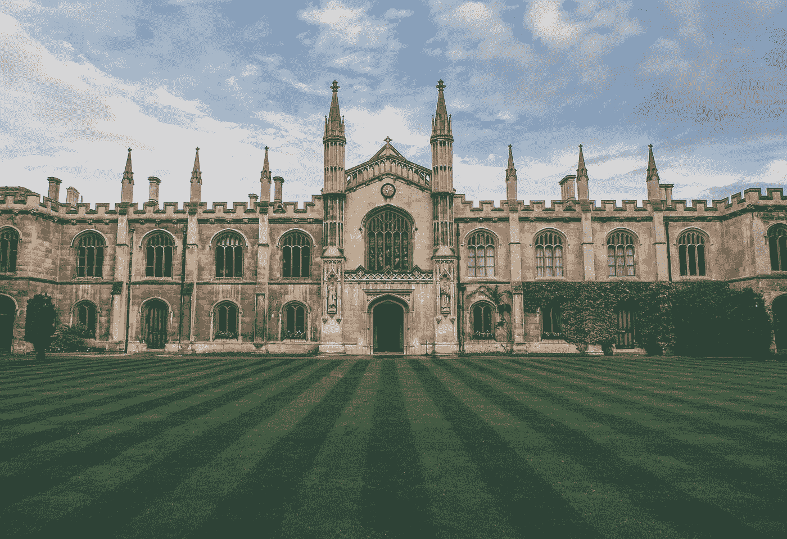

# 我作为数据科学本科生第一年所学的课程

> 原文：<https://levelup.gitconnected.com/courses-i-took-in-my-first-year-as-a-data-science-undergrad-student-abba6bc549e4>

瓦迪姆·谢尔巴科夫在 [Unsplash](https://unsplash.com?utm_source=medium&utm_medium=referral) 上拍摄的照片

当我于 2021 年 8 月加入普渡大学时，数据科学对我来说仍然非常陌生，我希望在这里的这些年里能够学习大量的统计学和计算机科学课程。虽然这没有错，但我作为数据科学本科生的第一年的课程主要是编码工具、CS、数学和其他普通教育课程的入门课程(还有一门统计学课程)。在接下来的几年里，课程变得越来越侧重于数据科学，包括更多的统计和 cs 课程。

这些是我在普渡大学第一学期(2021 年秋季)所学的主要课程(不包括普通教育):

**问题解决&面向对象编程**

这门课程围绕着学习 Java 编程的基础。教学大纲包括原始数据类型和字符串、if、switch、while 和 for 语句、单维和多维数组、修复错误、面向对象编程的特征、异常处理、并发性、I/O、GUI、动态数据结构和递归。

听起来对一个学期来说很多，然而，这是我在普渡大学第一年最愉快的课程之一。我喜欢这门课的结构，它包括每周一次的实验，你可以在那里练习和实现编程概念，并向助教提问，我发现他们真的很有帮助。学期结束时是一个小组项目，我真的很幸运有一个了不起的小组，不仅可以一起工作，而且成为我在普渡大学的第一批亲密朋友。

**编码工具(CS19300)**

这是一个较短的课程，由学生而不是教授授课和指导(所以同样的课程在其他大学可能没有或不一样)。我认为这门课非常有用，尤其是对于那些刚刚适应编码环境的学生。课程主要讲述了如何在执行编码项目时使用 GitHub，比如克隆存储库、创建特性分支、打开拉请求、修复合并冲突、通过终端推送和拉取等。本课程确实涵盖了一些我们可能会在真实项目场景/工作场所中使用的关键概念。根本没有主要的评估(只有小测验);这主要是一个信息课程。

**多元微积分(MA26100)**

如果你去普渡大学，你就会知道我说这里的数学课程很难是什么意思。通过考试并取得好成绩肯定是可行的，但它肯定是占用你大部分学习时间的科目之一(至少对我来说)。多元微积分基本上是正规微积分，但有更多的变量。因此，你将更多地学习多维空间中的平面、直线和曲线的概念，多元微分和积分，以及向量微积分的简短介绍。

这门课并不太可怕，只要你坚持不懈地学习概念，并尽可能多地提问，尤其是在办公时间，它肯定是可行的。

这些是我在普渡大学第二学期(2022 年春季)修的主要课程(不包括通识教育):

**计算机科学基础(CS18200)**

这是到目前为止我在这里的第一年所学的最难的课程，我相信我认识的许多计算机科学和计算机科学本科生也是如此。涵盖的课程包括大量的证明和基于理论的离散数学技术问题，所以这绝对是从我过去写代码或做简单的数学和统计问题的一个跳跃。涵盖的概念主要包括逻辑和证明、计数、算法基础分析(Big-O 符号和操作)、图形和树、证明技术、递归、有限状态机和下推自动机。

**Python 编程(CS38003)**

这是一门关于 Python 基础的半学期课程，非常适合初学这门编程语言的学生！因为在此之前我已经使用 Python 很多次了，所以完成它并不困难。

**线性代数(MA35100)**

这是我第一年学习的第二难的课程，但也是非常重要的课程，因为线性代数是机器学习的本质和核心。本课程着重于线性方程组、有限维向量空间、矩阵、行列式和特征向量的应用。我发现自己很难理解课堂笔记，但如果我能改变我的经历，那就是加入一个学习小组，尽可能多地去办公室上课。

**数据科学统计(STAT 35500)**

这个课程与我过去完成的项目类型非常相似([使用 Spotipy](https://sameehaafr.medium.com/using-data-visualizations-to-understand-the-vast-shift-from-80s-90s-hip-hop-to-today-afa0f942685) & [ML 逐步观察 80/90 年代音乐和现代嘻哈音乐之间的差异:使用 KNN 算法将 Spotify 歌曲分类到播放列表中](https://towardsdatascience.com/ml-step-by-step-using-knn-algorithm-to-classify-spotify-songs-into-playlists-8c7892428371))。该课程侧重于基本的统计概念，如置信区间和假设检验问题，以及统计方法，如线性回归，分类和聚类。我们也用 R 来完成大部分的家庭作业，进行数据分析和统计类型的问题。我发现这门课对我来说很愉快，节奏也很舒适，因为我过去习惯于进行数据分析。

## 结论

这些都是我在普渡大学读数据科学本科第一年时所学的 STEM 相关课程。如果您还有任何问题，请随时联系我！

linktree:【https://linktr.ee/sameehaafr 

🫶🏽

# 分级编码

感谢您成为我们社区的一员！更多内容请参见[升级编码出版物](https://levelup.gitconnected.com/)。
跟随:[推特](https://twitter.com/gitconnected)，[领英](https://www.linkedin.com/company/gitconnected)，[通迅](https://newsletter.levelup.dev/)
**升一级正在改造理工大招聘➡️** [**加入我们的人才集体**](https://jobs.levelup.dev/talent/welcome?referral=true)