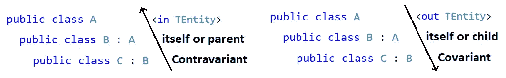

# 中的协方差和逆变。NET C#

> 原文：<https://levelup.gitconnected.com/covariance-and-contravariance-in-net-c-c2b8576b2155>

## 回归基础

## 很难理解吗？让我为你简化它。

[Christina@wocintechchat.com](https://unsplash.com/@wocintechchat?utm_source=unsplash&utm_medium=referral&utm_content=creditCopyText)在 [Unsplash](https://unsplash.com/?utm_source=unsplash&utm_medium=referral&utm_content=creditCopyText) 上拍照

如果你很难理解**中的**协变**和**逆变**是什么。NET C#** 的意思是，不要为此感到羞耻，你不是一个人。

这发生在我和许多其他开发人员身上。我甚至认识一些有经验的开发人员，他们要么不知道它们，正在使用它们，但仍然不能很好地理解它们。

在我看来，这种情况正在发生，因为每次我看到一篇谈论**协方差**和**逆变**的文章，我都发现它专注于一些技术术语，而不是关心我们最初为什么会有它们以及如果它们不存在我们会错过什么。

 [## 订阅艾哈迈德的时事通讯？

### 订阅艾哈迈德的时事通讯📰直接获得最佳实践、教程、提示、技巧和许多其他很酷的东西…

medium.com](https://medium.com/subscribe/@eng_ahmed.tarek) 

照片由 [Olga Thelavart](https://unsplash.com/@olga_o?utm_source=unsplash&utm_medium=referral&utm_content=creditCopyText) 在 [Unsplash](https://unsplash.com/s/photos/note?utm_source=unsplash&utm_medium=referral&utm_content=creditCopyText) 上拍摄，由 [Ahmed Tarek](https://medium.com/@eng_ahmed.tarek) 修改

## 2021–11–04

> 我注意到理解**不变性**、**协变性**和**逆变性**将有助于你理解其他主题并做出正确的设计决策。你可以在我的故事 [**中了解更多。NET c#；定义 imi interface<T>够了吗？我也需要 IMyInterface 吗？**](/a-best-practice-for-designing-interfaces-in-net-c-2c6ebdb4f1c1?sk=1f07b674adf763b7567d652ddd9f4a43)

[塔达斯·萨](https://unsplash.com/@stadsa?utm_source=unsplash&utm_medium=referral&utm_content=creditCopyText)在 [Unsplash](https://unsplash.com/?utm_source=unsplash&utm_medium=referral&utm_content=creditCopyText) 上拍摄的照片

# 微软的定义

如果你查看[微软的文档](https://docs.microsoft.com/en-us/dotnet/csharp/programming-guide/concepts/covariance-contravariance/)中**中的**协方差**和**方差**。NET C#** ，你会发现这个定义:

> 在 C#中，协变和逆变支持数组类型、委托类型和泛型类型参数的隐式引用转换。协方差保持赋值兼容性，逆变则相反。

你明白了吗？你喜欢吗？

你可以在网上搜索，你会找到大量关于这个话题的资源。你会遇到定义，历史，当介绍时，代码样本，…和许多其他的，这不是你在这个故事中会发现的。我向你保证，你在这里看到的是不同的…

照片由[里斯·肯特什](https://unsplash.com/@rhyskentish?utm_source=unsplash&utm_medium=referral&utm_content=creditCopyText)在 [Unsplash](https://unsplash.com/?utm_source=unsplash&utm_medium=referral&utm_content=creditCopyText) 上拍摄

# 它们实际上是什么？

基本上，微软所做的是在你定义通用模板类型占位符的方式上添加了一个小的附加物，著名的 *< T >* 。

在定义一个通用接口时，你通常会遵循模式`public interface IMyInterface<T> {…}`。引入协方差和逆变后，现在可以遵循模式`public interface IMyInterface<**out** T> {…}`或`public interface IMyInterface<**in** T> {…}`。

多出来的`**out**`和`**in**` 你认得出来吗？你在别的地方见过他们吗？
可能是靠这个出名的。网`public interface IEnumerable<**out** T>`？
还是著名的。网`public interface IComparable<**in** T>`？

微软引入了一个新概念，以便编译器在设计时确保您使用和传递给泛型成员的对象类型不会引发由错误的类型预期导致的运行时异常。

还是不清楚吧？请容忍我...让我们假设编译器没有应用任何设计时限制，看看会发生什么。

里克·蒙泰罗在 Unsplash 上的照片

# 如果编译器不应用任何设计时限制会怎样？

为了能够处理适当的示例，让我们定义以下内容:

查看上面的代码，您会注意到:

1.  A 类定义了`F1()`。
2.  B 类定义了`F1()`和`F2()`。
3.  C 类定义了`F1()`、`F2()`和`F3()`。
4.  接口`IReaderWriter`有`Read()`和`Write(TEntity entity)`，前者返回一个类型为`TEntity`的对象，后者需要一个类型为`TEntity`的参数。

那么让我们定义一个`TestReadWriter()`方法如下:

## 传入`IReaderWriter<B>`的实例时调用`TestReadWriter()`

这应该没问题，因为我们没有违反任何规则。`TestReadWriter()`已经需要类型为`IReaderWriter<B>`的参数。

## 传入`IReaderWriter<A>`的实例时调用`TestReadWriter()`

*记住编译器不应用任何设计时间限制的假设*，这意味着:

1.  `param.Read()`将返回类 **A** ，**B**
    **=>**的一个实例，因此，`var b`实际上将是类型 **A** ，**B**
    **=>**这将导致`b.F2()`行以**失败**作为`var b`——这实际上是类型**A**
2.  上面代码中的`param.Write()`行将期望接收类型为 **A** 的参数，而不是 **B**
    = >因此，在传入类型为 **B** 的参数时调用`param.Write()`将会使两个**都工作正常**

因此，既然在点 **#1** 中我们预期运行时失败，那么我们不能通过传入`IReaderWriter<A>`的实例来调用`TestReadWriter()`。

## 传入`IReaderWriter<C>`的实例时调用`TestReadWriter()`

*记住编译器不应用任何设计时间限制的假设*，这意味着:

1.  `param.Read()`将返回类 **C** 的实例，而不是 **B**
    **= >** 因此，`var b`实际上将是类型 **C** ，而不是 **B**
    **= >** 这将导致`b.F2()`行到**工作正常**，因为`var b`将有`F2()`
2.  上面代码中的`param.Write()`行将期望接收类型为 **C** 的参数，而不是 **B**
    = >的参数。因此，在传入类型为 **B** 的参数时调用`param.Write()`会导致**失败**，因为您无法用父 **B** 替换 **C**

因此，既然在点 **#2** 中我们预期运行时失败，那么我们不能通过传入`IReaderWriter<C>`的实例来调用`TestReadWriter()`。

马库斯·温克勒在 [Unsplash](https://unsplash.com/?utm_source=unsplash&utm_medium=referral&utm_content=creditCopyText) 上拍摄的照片

现在，让我们分析一下到目前为止我们发现了什么:

1.  当传入一个`IReaderWriter<B>`的实例时调用`TestReadWriter(IReaderWriter<B> param)`总是没问题的。
2.  如果我们没有`param.Read()`调用，那么在传入`IReaderWriter<A>`的实例时调用`TestReadWriter(IReaderWriter<B> param)`就可以了。
3.  如果我们没有`param.Write()`调用，那么在传入`IReaderWriter<C>`的实例时调用`TestReadWriter(IReaderWriter<B> param)`就可以了。
4.  然而，由于我们总是在`param.Read()`和`param.Write()`之间混合使用，我们将总是坚持调用`TestReadWriter(IReaderWriter<B> param)`并传入`IReaderWriter<B>`的实例，除此之外别无其他。
5.  除非……

照片由[哈尔·盖特伍德](https://unsplash.com/@halacious?utm_source=unsplash&utm_medium=referral&utm_content=creditCopyText)在 [Unsplash](https://unsplash.com/?utm_source=unsplash&utm_medium=referral&utm_content=creditCopyText) 上拍摄

# 替代方案

如果我们确保`IReaderWriter<TEntity>`接口定义了`TEntity Read()`或`void Write(TEntity entity)`，而不是同时定义了两者，那会怎么样？

因此，如果我们删除`TEntity Read()`，我们将能够通过传入`IReaderWriter<A>`或`IReaderWriter<B>`的实例来调用`TestReadWriter(IReaderWriter<B> param)`。

类似地，如果我们删除`void Write(TEntity entity)`，我们将能够通过传入`IReaderWriter<B>`或`IReaderWriter<C>`的实例来调用`TestReadWriter(IReaderWriter<B> param)`。

这对我们更好，因为限制更少，对吗？

照片由[通讯社跟随](https://unsplash.com/@olloweb?utm_source=unsplash&utm_medium=referral&utm_content=creditCopyText)在 [Unsplash](https://unsplash.com/?utm_source=unsplash&utm_medium=referral&utm_content=creditCopyText) 上拍摄

# 是时候了解一些事实了

1.  在现实世界中，编译器——在设计时——永远不会允许通过传入`IReaderWriter<A>`的实例来调用`TestReadWriter(IReaderWriter<B> param)`。您将得到一个编译错误。
2.  此外，编译器在设计时不允许通过传入`IReaderWriter<C>`的实例来调用`TestReadWriter(IReaderWriter<B> param)`。您将得到一个编译错误。
3.  从点#1 和点#2，这被称为**不变性**。
4.  即使您从`IReaderWriter<TEntity>`接口中删除了`TEntity Read()`，编译器在设计时也不会允许您通过传入`IReaderWriter<A>`的实例来调用`TestReadWriter(IReaderWriter<B> param)`。您将得到一个编译错误。这是因为编译器不会——自己隐式地——查看定义在接口中的成员，看看它是否会一直在运行时工作。您需要通过`<**in** TEntity>`自己完成这项工作。这相当于你对编译器的承诺，接口中的所有成员要么不依赖于`TEntity`，要么把它作为**输入**，**而不是输出**。这叫做**逆变**。
5.  类似地，即使您从`IReaderWriter<TEntity>`接口中删除了`void Write(TEntity entity)`，编译器在设计时也不会允许您通过传入`IReaderWriter<C>`的实例来调用`TestReadWriter(IReaderWriter<B> param)`。您将得到一个编译错误。这是因为编译器不会——自己隐式地——查看定义在接口中的成员，看看它是否会一直在运行时工作。您需要通过`<**out** TEntity>`自己完成这项工作。这相当于你对编译器的承诺，接口中的所有成员要么不依赖于`TEntity`，要么把它作为**输出**，**而不是输入**。这叫做**协方差**。
6.  因此，添加`<**out** >`或`<**in** >`使得编译器在满足我们的需求时限制更少，而不是像一些开发人员认为的那样限制更多。

图片由[哈里什·夏尔马](https://pixabay.com/users/harishs-3407954/?utm_source=link-attribution&utm_medium=referral&utm_campaign=image&utm_content=3245793)提供，来自 [Pixabay](https://pixabay.com/?utm_source=link-attribution&utm_medium=referral&utm_campaign=image&utm_content=3245793)

# 摘要

至此，你应该已经明白了**不变性**、**协变性**和**逆变性**的全部故事。但是，快速回顾一下，您可以将以下内容作为**备忘单**:

1.  输入和输出之间混合泛型类型= >不变性= >最严格= >不能用父或子替换。
2.  增加了`<**in** >` = >只需**输入** = > **逆变** = > **本身或替换为父母**。
3.  增加了`<**out** >` = >仅**输出** = > **协方差** = > **本身或替换为子**。

图片由[艾哈迈德·塔里克](https://medium.com/@eng_ahmed.tarek)拍摄

此外，在后来的故事中，我注意到理解**不变性**、**协方差**和**逆变**将有助于你理解其他主题并做出正确的设计决策。你可以在我的故事 [**中了解更多。NET c#；定义 imi interface<T>够了吗？我也需要 IMyInterface 吗？**](/a-best-practice-for-designing-interfaces-in-net-c-2c6ebdb4f1c1?sk=1f07b674adf763b7567d652ddd9f4a43)

 [## 中设计界面的最佳实践。NET C#

### 定义 imi interface<t>够了吗？我也需要 IMyInterface 吗？</t>

levelup.gitconnected.com](/a-best-practice-for-designing-interfaces-in-net-c-2c6ebdb4f1c1) 

最后，我会在这里放一些代码供您检查。这会帮助你多练习。

就这样，希望你觉得读这篇文章和我写这篇文章一样有趣。

# 希望这些内容对你有用。如果您想支持:

如果您还不是**中型**会员，您可以使用 [**我的推荐链接**](https://medium.com/@eng_ahmed.tarek/membership) ，这样我就可以从**中型**中获得您的一部分费用，您无需支付任何额外费用。订阅
[**我的简讯**](https://medium.com/subscribe/@eng_ahmed.tarek) 将最佳实践、教程、提示、技巧和许多其他很酷的东西直接发送到您的收件箱。

# 资源

这些资源可能对你有用。

 [## 何时不使用 DI、IoC 和 IoC 容器

### 知道什么时候 DIs 不是正确的解决方案，什么时候应该使用更好的设计

better 编程. pub](https://betterprogramming.pub/when-not-to-use-di-ioc-and-ioc-containers-f95881d0fe0)  [## 怎么串进去的。NET C#工程

### 关于字符串及其在。NET C#

levelup.gitconnected.com](/how-string-in-net-c-works-f1d69bfa30f5)  [## 如何在中全面介绍基于 I/O 文件的应用程序。带有单元测试的. NET C#

### 学习如何将应用程序划分成更小的模块，这样你就可以 100%覆盖这些模块

levelup.gitconnected.com](/how-to-fully-cover-i-o-file-based-applications-in-net-c-with-unit-tests-ca75c07f3b2c)  [## 中的策略设计模式。NET C#

### 了解中的策略设计模式。NET C#

levelup.gitconnected.com](/strategy-design-pattern-in-net-c-b9dbd863c31e?sk=e96fabc74efc59f6ba55784788b3b69f)