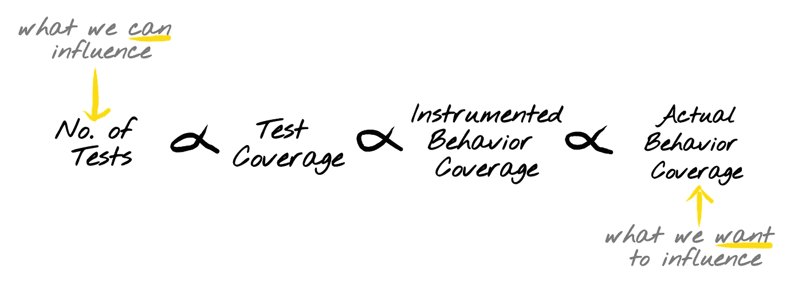
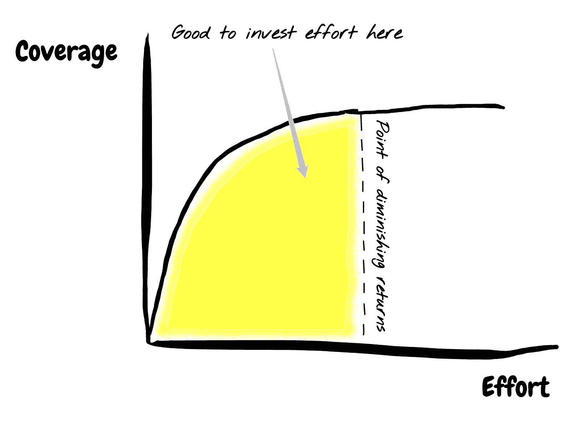

# 测试中的覆盖率与工作量

> 原文：<https://levelup.gitconnected.com/coverage-vs-effort-in-testing-dfeeb6436d4a>

对测试代码的偏好通常取决于两个变量:

1.  覆盖率:测试覆盖的行为的表面区域
2.  努力:编写和维护测试的努力

一套完美的测试应该覆盖代码中 100%的行为，并且不需要花费精力来编写或维护测试。正如许多完美的事情一样，完美的测试套件并不存在。

# 测试是有成本的

编写测试需要时间，重构需要时间，维护需要时间。它们占用了基础设施，占用了在您的开发环境和 CI 上运行的时间。它们有你在应用程序代码中找不到的不同构造——比如 mocks、stubs、fixtures 和维护这些构造时附带的附加文档。

虽然进行测试的想法是可取的，但我们应该始终注意这一成本。

# 代码覆盖率是行为的代理

在代码库中，试图测试代码在现实中的所有行为方式是不可能的。有太多的事情可能出错，我们的代码可以接受太多的输入和执行上下文的排列，以至于编写测试来捕获代码库中的所有这些场景是徒劳的。

为了解决这个问题，我们有覆盖度量，它将跟踪我们的测试是否“覆盖”了我们所写的实际物理代码。例如，覆盖率报告告诉我们，我们的测试已经覆盖了我们编写的 98%的代码行。

如果我们编写一个测试，100%地执行我们已经编写的代码行，我们可以合理地确信被测试的行为导致了预期的结果。但是我们不能说，例如，对于代码可能经历的所有可能的行为，代码不会中断。

您可以对代码库的代码进行 100%的覆盖，但这并不意味着您的代码对问题空间中的所有输入都是正确的。

# 代码覆盖率的问题是

我们已经确定代码覆盖率只是我们真正关心的东西的一个代理——行为覆盖率。由于我们不能相信另一个度量，我们必须记住代码覆盖率只是一个代理，您永远不能忘记目标，即断言正确的行为。

我遇到的问题表现在几个不同的方面:

## 衡量不应该是一个目标

开发人员倾向于使用度量(代码覆盖率)作为目标。当你开始把衡量作为你的目标时，你就看不到什么是真正重要的。拥有 100%的代码覆盖率是一个令人印象深刻的壮举，但是最后的 x%肯定是收益递减的领域。也不能保证您的代码能够工作。

## 虚假的安全感

开发人员将覆盖率作为一种虚假的安全感。如果我们的测试通过了，并且我们的覆盖率很高，我应该对我发布的代码感到非常安全。然而，我们很可能用一个困难的问题来代替(我对我的代码实际工作有多自信？)用一个更简单的问题(测试覆盖了多少代码？).

## 并非所有的覆盖面都是平等的

在您的代码库中，有些部分的失败可能会对您的系统产生不成比例的影响(例如:身份验证、错误处理、初始化逻辑)。在这样的领域中，x%的覆盖率比公共事业出版诊断指标中的 x%覆盖率更有价值。

# 如何有效地使用代码覆盖率

尽管覆盖率是一个不完美的代理，但它仍然是一个代理。可能还有其他的代理，但是根据我的经验，代码覆盖率是断言行为的“最不糟糕”的代理。

这有几个原因:

1.  它是高度可用的。每一个主要的测试框架都可以将代码覆盖率与您的开发工作流集成在一起。
2.  开发者理解，也很容易推理。

因此，我们的目标应该是有效地使用这个工具，知道它的局限性。

因此，我想从将帕累托原理应用于测试开始。帕累托原理说，80%的结果是 20%的原因的结果。换句话说，少数测试将产生绝大多数的测试覆盖率。

# 收益递减点

随着代码库的成熟，它们倾向于建立“覆盖阈值”。这非常类似于测试覆盖中的收益递减点。在这一点上，我们意识到我们将不得不花费不相称的努力来实现更多的代码覆盖率。这个门槛很大程度上取决于许多因素，如:编程语言、产品的成熟度、代码变动率等。

对于一些关键任务服务，该阈值将非常接近 100%。对于低影响的批处理服务，这可能要少得多。关键是没有放之四海而皆准的“正确”数字。如上所述，选择一个高得离谱的阈值会增加测试成本。

# 关于 100%代码覆盖率的一个注记

如果代码库维护者同意付出的代价是值得的，那么努力保持 100%的代码覆盖率是完全合理的。

当努力达到 99%或更低的代码覆盖率时，你让代码作者知道他们可以决定不为哪 1%的代码编写测试。一般来说，这 1%应该是给出最低值测试的 1%。但是，也有可能这 1%很难测试，但是有测试价值。例如，它可以是 if-else 或异常处理程序中的`else`路径。

当争取 100%的时候，你有一个简单的规则。编写涵盖所有内容的测试。*有时候*简单的规则更好。