# 新冠肺炎对股票收盘价估计的影响

> 原文：<https://levelup.gitconnected.com/covid-19-impact-on-stock-closing-price-estimation-be88af52143>

## BIST 银行 500 天的模拟

*股票收盘价，新冠肺炎，BIST-Banks，Ridge，Lasso*

新冠肺炎被确认于 2020 年 3 月 11 日抵达土耳其，随后疾病已蔓延至土耳其全国。截至 2020 年 7 月 14 日，该国确诊病例总数超过 214，993 例。另一方面，股票价格反映了对未来利润的预期，投资者认为病毒抑制了经济活动，减少了利润。

由于缺乏足够的数据，有限数量的研究分析了新冠肺炎对不同国家和不同部门的经济和金融变量的影响。鉴于对新冠肺炎之后股票价格估计的实证分析数量有限，有必要进一步研究疫情的影响，特别是在部门一级。因此，考虑到新冠肺炎每日案例总数，本项目试图估算银行在伊斯坦布尔证券市场(BIST)的股票收盘价。

BIST 银行

Jupyter 的笔记本、数据文件和研究报告可以在 GitHub 上找到:【https://github.com/ezgicn/Project2_webscraping_regression 

在 2020 年 3 月 10 日至 7 月 1 日期间，在[www.investing.com 观察到的各银行股票、黄金、白银、布伦特汽油、美元、欧元、英镑和比特币数据集的每日最高价、最低价和开盘价。](http://www.investing.com.)

2020 年 3 月 10 日至 7 月 14 日期间的新冠肺炎病例总数是使用土耳其共和国卫生部的 *BeautifulSoup* 收集的[https://covid 19 bilgi . sag lik . gov . tr/tr/haberler/turkiye-deki-gun luk-新冠肺炎-瓦卡-sayilari.html](https://covid19bilgi.saglik.gov.tr/tr/haberler/turkiye-deki-gunluk-covid-19-vaka-sayilari.html) 。

股票收盘价估算的特征

为了使用新冠肺炎和其他变量的每日案例总数来估计银行的股票收盘价，线性、岭和套索回归被认为是机器学习方法。

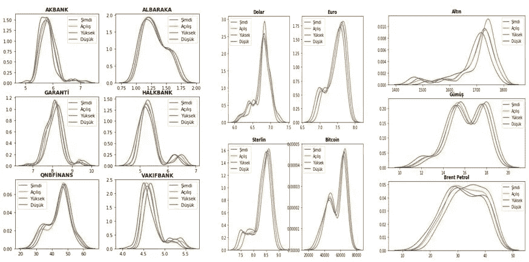

2020 年 3 月 10 日至 7 月 14 日期间的变量分布图。

由于观察值数量较少，因此根据 500 天场景的数据分布生成了随机数。

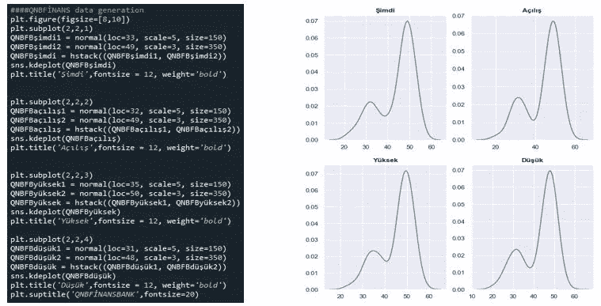

根据预期的每日启发式病例数计算总病例数(toplam vaka sayı)。

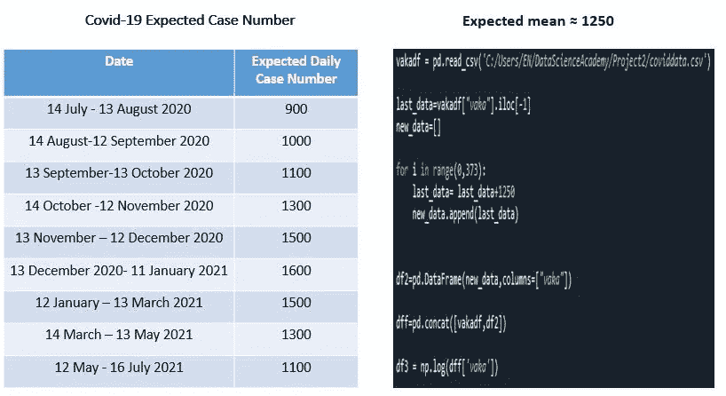

Covid19 未来几天的预期病例数计算。

计算回归模型特征之间的相关率，并用热图显示。

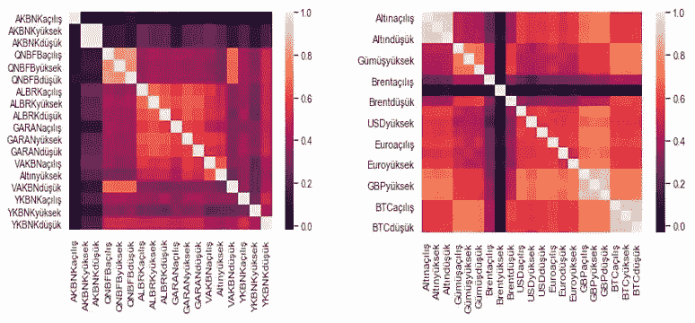

特征的相关热图。

在应用线性回归之前，检查了线性回归分析的五个基本假设，这些可以在 Jupyter 笔记本上看到。例如，AKBANK 普通最小二乘法(OLS)结果如下所示:

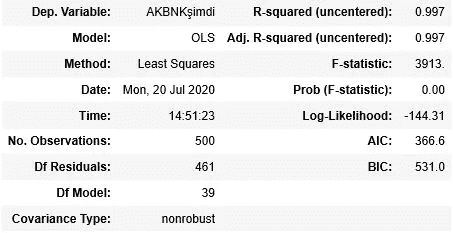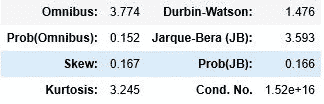

阿克银行模型的 OLS 结果

条件数为 1.52e+16，对于线性回归来说相当高。很容易说特征之间存在完美的多重共线性。因此，R 平方被高估了。因此，考虑了岭回归。Lasso 也用于比较 R 平方和平均绝对误差(MAE)结果。

套索和脊模型的调谐参数(alpha)是从一个宽的值范围中选择的，而不是进行 10 重交叉验证。

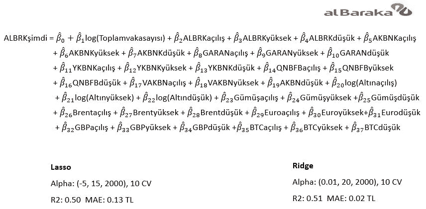

低 R 平方的 ALBARAKA 模型

为了捕捉具有低 MAE 的较高 R-square，从模型中移除了收缩为零的特征。此外，还增加了对模型贡献较大的特征的多项式效应。

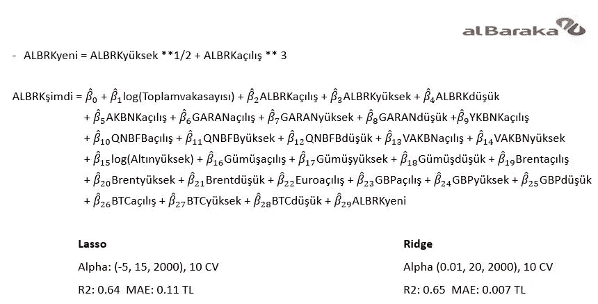

具有较高 R 平方的 ALBARAKA 模型

根据 Albaraka 模型，根据 Lasso 回归，64%的观察到的变化可以由模型输入解释，误差为 0.11。根据岭回归，65%的变化可以用误差为 0.007 的输入来解释。

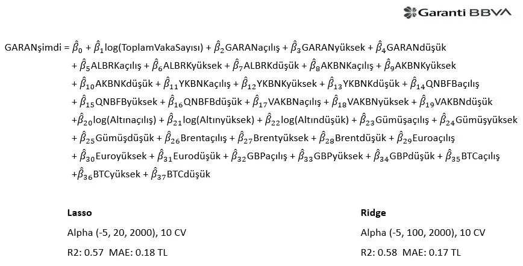

低 r 平方的 garanti̇模型

为了捕捉具有低 MAE 的较高 R-square，从模型中移除了收缩为零的特征。此外，还增加了对模型贡献较大的特征的多项式效应。

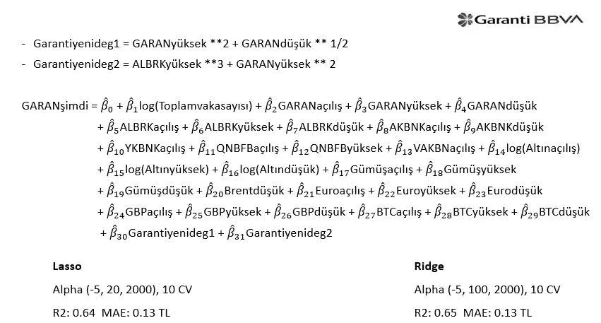

具有较高 r 平方的 garanti̇模型

根据 Garanti 模型，根据 Lasso 回归，64%的观察到的变化可以由模型输入解释，误差为 0.13。根据岭回归，65%的变化可以由误差为 0.13 的输入来解释。

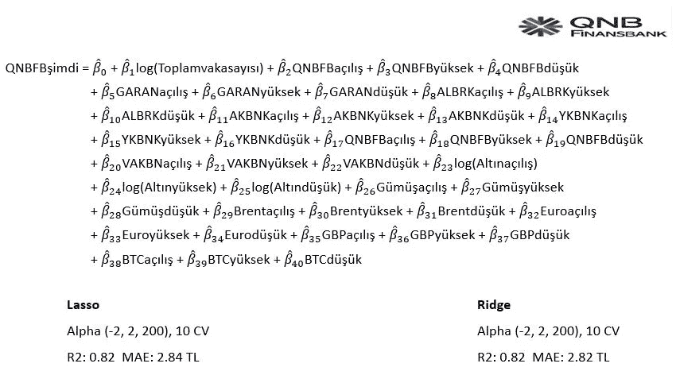

具有最高 r 平方的 qnbfi̇nansbank 模型

根据 QNBFinansbank 模型，82%的观察到的变化可以用模型输入来解释，根据 Lasso 回归，误差为 2.84。根据岭回归，82%的变化可以由具有 2.82 误差的输入来解释。

请注意，由于随机数据生成，生成的数字和相关结果可能会有所不同。