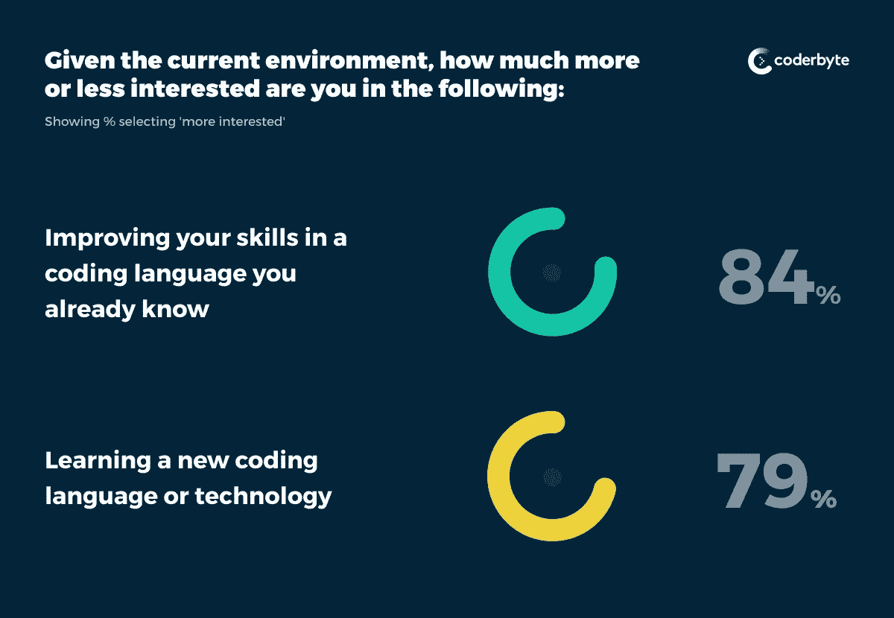
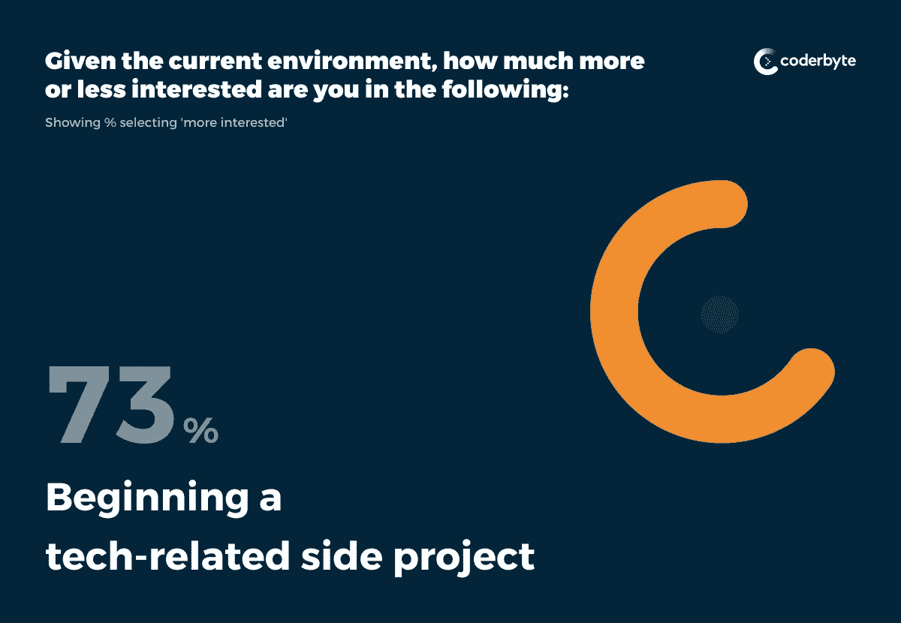
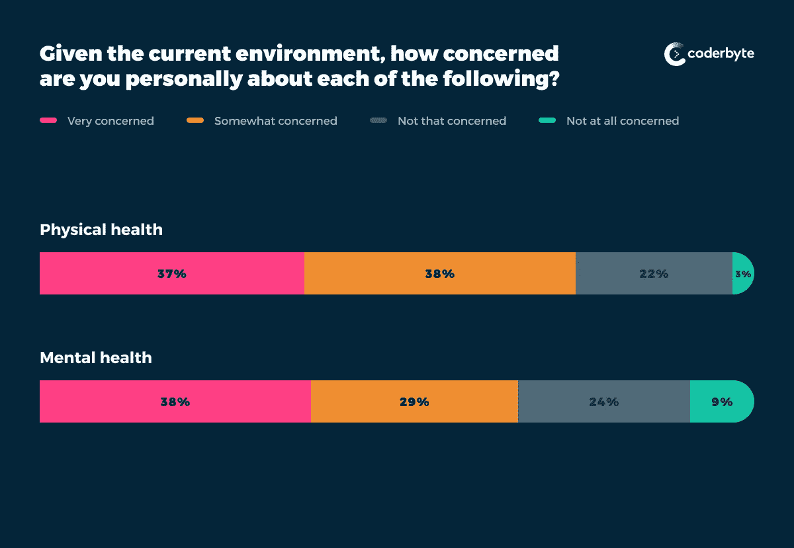

# 新冠肺炎给软件开发人员时间，让他们抓紧时间开发激情项目

> 原文：<https://levelup.gitconnected.com/covid-19-is-giving-software-developers-time-to-hustle-and-work-on-passion-projects-979411212d2b>

疫情冠状病毒对每个行业都产生了巨大的影响。数百万人被暂时解雇，还有数百万人现在在 T2 在家工作。不管是好是坏，工作场所的这些结构性变化让许多软件开发人员在家里有了额外的空闲时间。

在一项独家调查中， [Coderbyte](https://coderbyte.com) ，一个有 30 多万开发人员使用的技术面试准备平台，询问软件开发人员他们如何利用新获得的空闲时间。

开发人员表示，他们正在从事一系列与技术相关的活动，以打发隔离期间的时间。从磨练他们的编程技能到从事兼职工作，冠状病毒锁定给了开发人员实践、创新甚至在此过程中获得一些乐趣的机会。

# **用练习题打发时间**

在隔离期间人们做的许多打发时间的活动中，软件开发人员正在做的一件事是解决代码挑战以提高他们的技能。科技集团甚至组织在线编码聚会，以促进疫情的社交联系。

在我们的调查中，61%的开发人员报告说，由于目前的情况，他们现在更有兴趣将编码挑战作为乐趣或保持忙碌。

84%的开发人员表示，他们有兴趣改进他们已经知道的编码语言，而 79%的人表示有兴趣学习新的编码语言。随着职位空缺的减少和技术职位竞争的加剧，现在是开发人员磨练技能的好时机。

有很多网站提供对编码挑战的访问。在 Coderbyte，我们最近免费提供了几项高级挑战，包括全栈挑战，如 [React 挑战](https://coderbyte.com/information/React%20Button%20Toggle)和 [SQL 挑战](https://coderbyte.com/information/SQL%20Member%20Count)。

以下是一些提供免费内容的额外在线学习平台:

*   [比特度数](https://www.bitdegree.org/tag/covid)
*   [代码学院](https://news.codecademy.com/)
*   [夸夸其谈](https://codyhouse.co/)
*   [Code.org](https://code.org/)
*   [Coursera](https://blog.coursera.org/coursera-together-free-online-learning-during-covid-19/)
*   [FreeCodeCamp](https://www.freecodecamp.org/)
*   [Udacity](https://blog.udacity.com/2020/03/one-month-free-on-nanodegrees.html)
*   [Udemy](https://www.udemy.com/courses/free/)
*   [技术开发](https://skilled.dev)

# **庄家充分利用不利局面**

开发人员也利用他们在隔离区的时间从事兼职工作。在我们的调查中，近四分之三的开发人员表示，鉴于当前的环境，他们现在更有兴趣开始一个与技术相关的副业项目。

副业可以用来给未来的雇主留下深刻印象，而且，在冠状病毒肆虐的时候，可以服务于更大的利益。本着这种精神，开发人员正在参与世界各地的在线技术活动，用技术解决与新冠肺炎相关的问题。

4 月初，麻省理工学院(MIT)举办了一系列虚拟黑客马拉松(T23)，恰如其分地命名为“击败疫情”，专注于支持医疗系统和保护危机期间的弱势群体。

同样，医疗保健数据公司 Datavant 最近举办了[疫情响应黑客马拉松](https://datavant.com/pandemic-response-hackathon/)，产生了 18 个“聚焦”项目，包括一个便于追踪接触者的[应用](https://devpost.com/software/containit)，一个为医疗保健专业人员提供卫生策略的[平台](http://reuze)，以及一个建议个人是否应该接受冠状病毒测试的[聊天机器人](https://devpost.com/software/cov2words)。

[Product Hunt](https://www.producthunt.com/) 还举办了一场在家工作[创客节](https://www.producthunt.com/makers-festival/wfh?utm_campaign=4365_2020-03-25&utm_medium=email&utm_source=Product+Hunt&utm_term=editorial)以促进新冠肺炎为重点的产品开发。Product Hunt 鼓励参与者为其节日打造一系列产品，包括推广“自我护理、家庭娱乐、抗击错误信息传播的方法或面向危机前线医护人员的产品”的产品。

许多冠状病毒启发的产品已经在产品搜索中推出。对于那些希望回馈社会的人来说，[口罩匹配](https://www.producthunt.com/posts/mask-match)是一个工具，使人们能够向医护人员发送 N95 口罩，这个[项目帮助个人通过礼品卡购买支持当地企业](https://www.producthunt.com/posts/give-local)。也有支持社交联系的平台，如[自我隔离读书俱乐部](https://www.producthunt.com/posts/self-quarantine-book-club)，这是一个在线 Slack 社区，人们可以加入特定书籍的频道，并添加他们的想法、问题和评论。

# **给自己留点时间**

尽管软件开发人员渴望提高他们的技能并接受新项目，但许多人说他们担心自己的健康。事实上，75%的人担心他们的身体健康，67%的人担心他们的精神健康。开发人员还担心他们的工作保障(72%)和公司的稳定性(64%)。

这是一个充满挑战的时刻，在职业发展和自我照顾之间找到平衡很重要。

目前有许多资源可用于支持个人，包括:

*   [Clearstep 新冠肺炎筛选程序](https://www.clearstep.health/covid19):基于聊天机器人的症状检查软件
*   [希望热线](https://www.hopeline-nc.org/):免费且保密的心理健康帮助热线，可通过电话或短信获得
*   授权工作(empower work):一个支持希望与受过培训的同事顾问讨论工作相关问题的个人的组织
*   [我可能的自己](https://www.mypossibleself.com/blog/free-mental-wellbeing-tools-for-the-covid-19-pandemic/):一款提供管理压力、焦虑和低落情绪策略的应用，在疫情期间提供免费访问
*   [裁员名单](https://www.layoffs.tech/):为失业的求职者和技术招聘人员牵线搭桥
*   [跳板](https://learn.springboard.com/career-coach-ama/):每周提供免费职业指导和求职建议问答的科技训练营

虽然这确实是艰难的时刻，但看到开发人员社区努力改善自己并支持他们周围的人是令人振奋的。我们将[继续跟踪](https://medium.com/coderbyte)新冠肺炎如何影响整个软件开发行业，以及开发者如何在这个快速变化和不确定的环境中导航。