# Covid19 推文分析(带源代码)

> 原文：<https://levelup.gitconnected.com/covid19-tweet-analysis-with-source-code-e916e2871de6>

使用原始 NLP 和 NLTK 的基本情感分析。情感分析是分析给定文本背后的情感的技术。在本文中，我们将研究分析给定文本情感的方法，然后使用 GetOldTweets3 API 分析 Twitter 数据。你应该熟悉 python，将它安装在你的系统中，并且拥有你自己的 IDE。所以不多说了，让我们开始吧！

# 情感分析

***第一步:清理数据，*** 我们将从清理要分析情绪的文本开始。因此，我们将创建一个外部文本文件，将要分析的段落插入到该特定的文本文件中，比如说“main.txt”。

清理给定数据的第一步是将其转换为一种通用的独立格式，这里我们将坚持小写。因此，我们将把“main.txt”中的文本读入 python，并将其转换成小写字母。接下来，我们要删除文章中所有的标点符号。第三个子步骤是将半清理的数据标记化。通过标记化，我的意思是将一个数据块分割成一个单词列表(我们将使用 split 函数)，最后我们将寻找停用词(没有任何情感的单词)并将它们从我们最终清理的文本列表中删除。

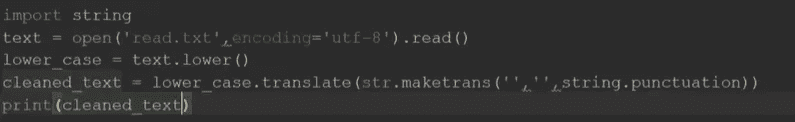

将文本转换成小写，并删除所有标点符号。

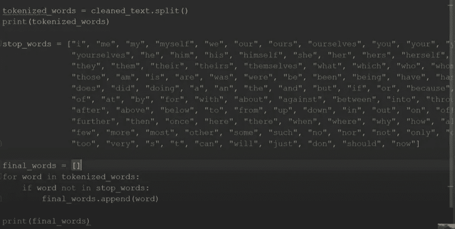

标记并删除停用词(没有 NLTK)。

***第二步:情感算法(基本的自然语言处理)，*** 一旦我们清理完数据，我们需要创建一个外部文件(emotions.txt)，里面包含单词以及附加在单词上的情感。例如“game”:“happy”，所以一旦创建了文件，我们需要将它读入 python 并对其进行清理。清理之后，我们需要检查 emotions.txt 中的单词是否也存在于我们之前清理的单词的标记化列表中。这样，我们就能知道文章中包含的情感。

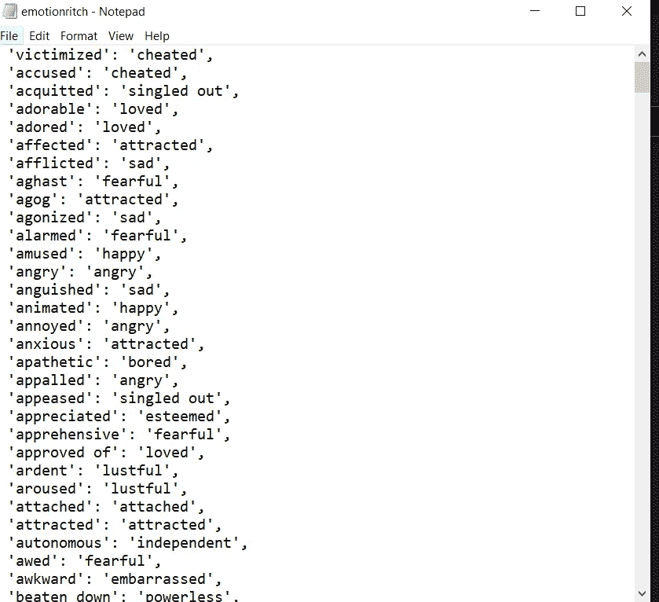

emotions.txt

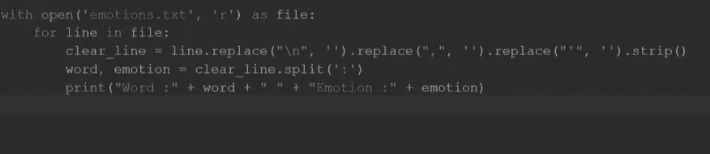

阅读并清理情绪. txt

我们确实找到了与文章相关的情感，但我们真正需要的是统计数据，所以我们需要计算特定情感出现的次数，进行计算，并绘制图表。(确保从集合导入计数器添加**，以便使用计数器功能)**

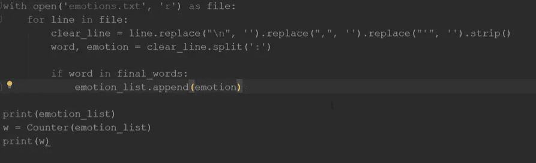

(计数器是从集合包导入的)

***最后一步:使用 Mat Plot Lib 绘制图表，*** 一旦计数完成，就可以将这些计数绘制成条形图，这样在视觉上就令人愉悦了。

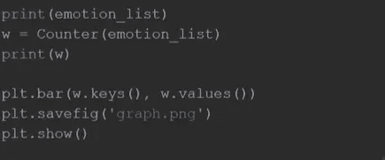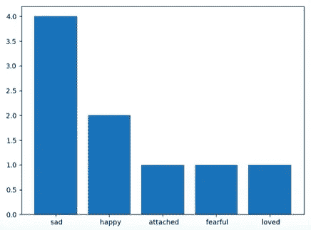

# ***Covid19 推文分析***

我们之所以从基本的情感分析开始，是因为推文分析完全基于它。这里唯一不同的是，我们要分析的文本。以前，我们习惯于将段落加载到外部文本文件(main.txt)中并对其进行分析。这里，我们将调用 Mottl 开发的名为 [GetOldTweets3 的 API，而不是外部文本文件。](https://github.com/Mottl/GetOldTweets3)

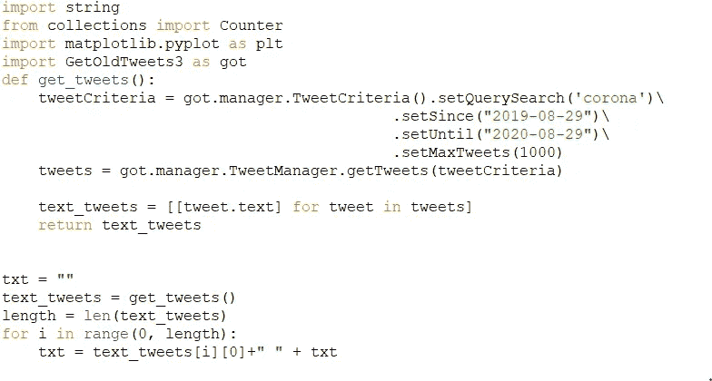

我们将定义一个名为 get_tweets 的函数，在该函数下，我们将编写代码来获取给定时间线、给定关键字以及给定限制的 tweets。官方 [GetOldTweets3 文档](https://github.com/Mottl/GetOldTweets3)中提供了代码。除此之外的一切几乎和我们的情感分析部分一样。推文分析的源代码附在本文末尾。

# 自然语言工具包(NLTK)

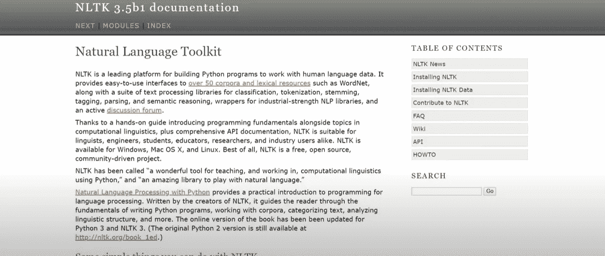

NLTK 帮助我们标记、产生预定义的停用词，以及帮助我们容易地定义情绪。因此，现在我们可以摆脱迄今为止必须做的所有手工工作。

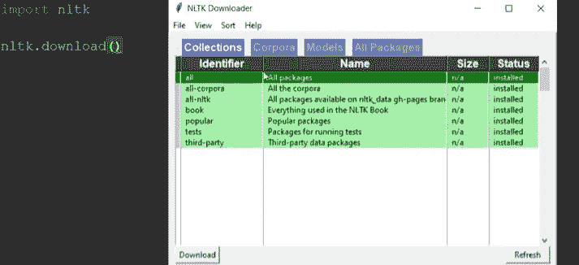

NLTK 安装

NLTK 非常快速高效！但是它需要安装，而且可能会很慢，这取决于你的系统。所以我提供了没有 NLTK 的源代码。

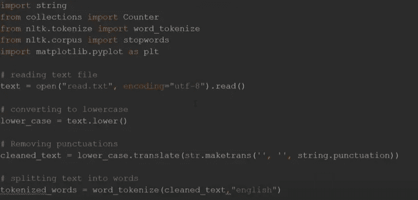

使用 NLTK 进行标记化、停用词生成、情感生成

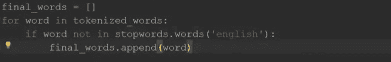

【https://github.com/ritchiepulikottil/covid19_tweet_analysis】covid 19 Tweet 分析的源代码**(不含 NLTK):**

[GitHub](https://github.com/ritchiepulikottil)

[领英](https://www.linkedin.com/in/ritchie-pulikottil-6876341aa/)

[推特](https://twitter.com/itsritchie1005)

[Instagram](https://instagram.com/ritchiepulikottil)