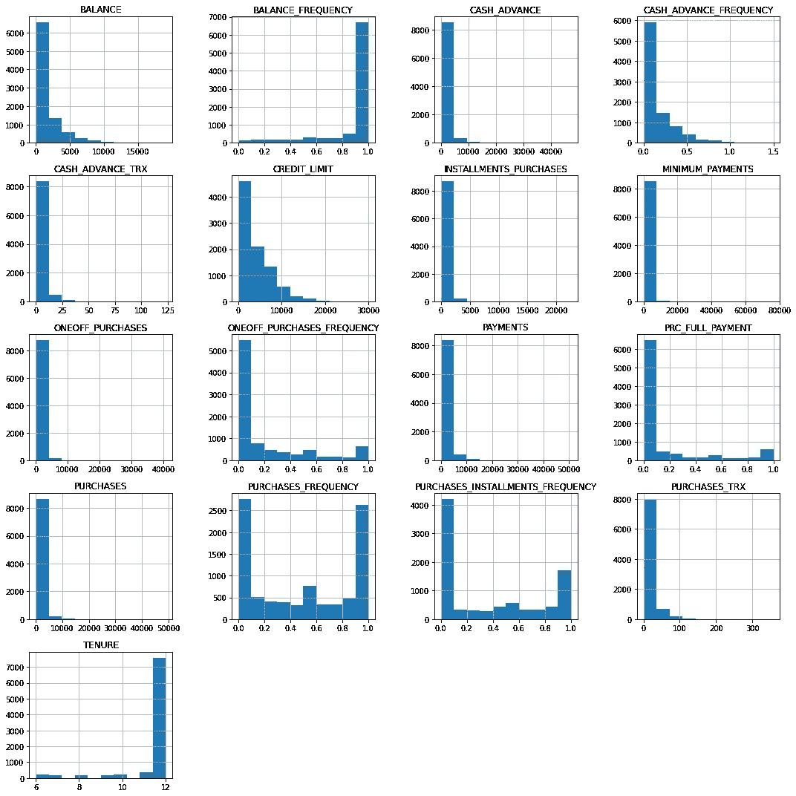
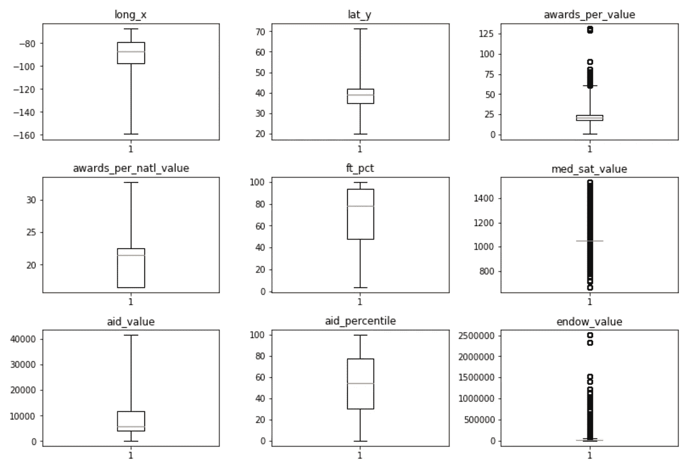

# Python 中的 EDA 指南

> 原文：<https://levelup.gitconnected.com/cozy-up-with-your-data-6aedfb651172>

## 在探索性数据分析期间要问的关于数据的重要问题

创建机器学习模型很酷。作为初学者(我从经验中得知),直接跳到最酷的部分很有诱惑力——毕竟，这也是最重要的部分，对吗？

如果你直接跳到一部你从未看过的电影的高潮部分会怎样？你会感到困惑吗？会很愉快吗？

> 正如电影中角色发展的第一个小时是基础一样，探索性数据分析(EDA)是迈向良好数据科学项目的关键第一步。


[真实社](https://unsplash.com/@trueagency?utm_source=medium&utm_medium=referral)在 [Unsplash](https://unsplash.com?utm_source=medium&utm_medium=referral) 上拍摄的照片

是时候带上你最喜欢的毯子、零食和毛衣，舒适地享受你的数据了。在 EDA 结束时，你应该像了解你最喜欢的电影中的角色一样了解你的数据集。

对于本文，我列出了在数据科学项目开始时进行 EDA 时我试图回答的问题。我已经提供了代码片段(全部用 Python 编写，使用 Pandas 库)来给出一些代码示例，您可以运行这些代码来回答这些问题。


开拍！(照片由[雅各布·欧文斯](https://unsplash.com/@jakobowens1?utm_source=medium&utm_medium=referral)在 [Unsplash](https://unsplash.com?utm_source=medium&utm_medium=referral) 上拍摄)

# 0.下载数据前要问的问题

我将这一步称为 0，因为它发生在将数据导入 Python 之前。这很容易忘记，但如果你能回答这些问题，它可以节省你很多时间和挫折。

*   这些数据是如何收集的/从哪里来的？
*   我为什么对这些数据感兴趣？
*   感兴趣的目标变量是什么？(如果适用)
*   这些数据来源可靠吗？
*   这里有足够的数据做一个 ML 模型吗？
*   其他人对此数据集进行过类似的分析/建模项目吗？我是想从他们的结论中学习，还是想创造一个新颖的项目？
*   数据集有数据字典吗？完成了吗？
*   如果我使用这些数据，我会遇到任何额外的挑战或问题吗？

当您可以选择使用什么数据集时，像使用过滤器一样使用这些问题会很有帮助。在项目进行到一半的时候，很难意识到你选择了一个错误的数据集。


# 1.数据结构和分布

在这一节，我将只看连续变量。然而，当你分析离散变量时，你也想重复所有适用的问题。

下面是我一直运行的两行代码:

```
df.shape
df.info()
```

这里有一个来自`df.info()`的输出示例供参考:

```
<class ‘pandas.core.frame.DataFrame’> 
RangeIndex: 1302102 entries, 0 to 1302101 
Data columns (total 10 columns): 
unitid 1302102 non-null int64 
year 1302102 non-null int64 
gender 1302102 non-null object 
race 1302102 non-null object 
cohort 1302102 non-null object 
grad_cohort 889380 non-null float64 
grad_100 410069 non-null float64 
grad_150 889380 non-null float64 
grad_100_rate 332061 non-null float64 
grad_150_rate 694869 non-null float64 
dtypes: float64(5), int64(2), object(3) 
memory usage: 99.3+ MB
```

**要回答的问题:**

*   你有几个特点？
*   你有多少观察值？
*   每个特征的数据类型是什么？
*   根据您对数据集特征的了解，这些数据类型有意义吗？你需要改变什么吗？

示例:您的数据的每一行都有一个客户 ID 号，每个号码都是五位数，存储为整数。您永远不会像对整数那样聚合或分析客户 ID，所以您应该将其更改为“object”数据类型。

*   你有空值吗？(待稍后修复)
*   这个数据集使用了多少内存？这会给你以后带来问题吗？

看看变量分布，这几行代码是**魔法:**

```
df.hist(figsize=(15,15)) 
#set a large figsize if you have > 9 variables
plt.tight_layout()
plt.show()
```



上面代码的输出示例

**需要回答的问题:**

*   每个变量的分布是怎样的？
*   是否存在异常值？(待稍后修复)
*   思考变量的含义以及直方图对它们的值和分布的说明——有什么惊喜吗？

以及查看汇总统计数据的最后一段代码:

```
df.describe()
```

**要回答的问题:**

*   变量的最大/最小值是否合理？您看到任何看起来像错误的值了吗？
*   每个变量的平均值是多少？从整体上看，这些方法能告诉你数据集的哪些信息？


# 2.空值和重复值

让我们从简单的开始:重复值。

```
df.duplicated().sum()
```

运行这段代码后，是否得到一个大于 0 的值？如果是这样，您可以使用以下命令轻松删除重复的行:

```
df.drop_duplicates(inplace=True)
```

现在是空值。要打印数据集中所有变量和空值百分比(不包括 0)的列表，可以运行:

```
null = df.isna().sum()/len(df)
null[null > 0].sort_values()
```

下面是一个输出示例:

```
aid_value 0.000273 
aid_percentile 0.000273 
pell_value 0.000273 
pell_percentile 0.000273 
ft_pct 0.001093 
ft_fac_percentile 0.003347 
ft_fac_value 0.003347 
retain_value 0.062022 
retain_percentile 0.062022 
cohort_size 0.069536 
grad_100_value 0.069536 
grad_100_percentile 0.069536 
grad_150_value 0.069536 
grad_150_percentile 0.069536 
grad_150 0.121790 
grad_cohort 0.121790 
grad_150_rate 0.279528
```

**要回答的问题:**

*   空值是数据记录方式的结果吗？

示例:调查响应数据记录在“是”、“否”列中，空值表示“不回答”在这种情况下，所有的空值都可以用一个值来填充，比如“no answer”

*   您能在不显著影响您的分析的情况下删除空值行吗？
*   观察变量的分布，你能证明用该变量的平均值或中值填充缺失值是正确的吗？

小心点！您必须以某种方式处理丢失的值，但有时删除行比修补原始数据更好，因为如果您将坏数据放入模型中，您将无法获得有意义的结果。

*   如果你的数据是时间序列数据，可以用插值来填补缺失值吗？
*   某个变量是否有太多缺失值，以至于应该从数据集中删除该变量？


# 3.极端值

我喜欢制作箱线图来可视化数据集中的异常值。如果你的变量大致相同，使用 Pandas `df.boxplot()`方法会很好。这将在同一图表上创建数据集中每个连续变量的箱线图。如果变量有不同的比例，可以用循环中的支线剧情来绘制它们:

```
continuous_labels = list(continuous.columns)
i = 1plt.figure(figsize=(15,30))for var in continuous_labels: #plotting boxplot for each variable
   plt.subplot(round(len(continuous_labels),0)/3+3,4,i)
   plt.boxplot(continuous[var],whis=5)
   plt.title(var)
   i+=1plt.tight_layout()
plt.show()
```



用上面的代码创建的箱线图的部分图片。

**要问的问题:**

*   您的变量中是否有异常值(在箱线图上用黑色圆圈表示)？
*   为什么你认为你有离群值？
*   异常值代表真实的观察结果吗(即不是错误)？
*   你应该排除这些观察吗？如果不是，你是否应该对这些值进行 winsorize？

这是一个棘手的问题。我通常会找出我的异常值，然后让它们保持原样，直到我尝试了一些模型。如果我发现模型的准确性很低，我会回去重新评估我是否应该对有异常值的变量进行 winsorize(如果我没有其他选择的话)。


# 4.相关性/关系

要创建连续变量的相关性矩阵，您需要的所有代码是:

```
df.corr()
```

如果您想要包含离散变量，那么您需要使用 one-hot-encoding(参见下一节)将这些变量转换成数字变量。那么它们也可以包含在相关矩阵中。

**要问的问题:**

*   哪些变量与你的目标变量最相关？(如果适用)
*   是否存在多重共线性？(相关性大于 0.8 的两个特征)这将如何影响您的模型？
*   你有代表相同信息的变量吗？可以掉一个吗？


# 5.特征工程

先说一个常用的特征工程方法:变量变换。

## 变量变换

最常见的转换是 **one-hot-encoding** 将分类变量转换成数字变量，具体来说是二进制变量。这是必要的，因为机器学习模型无法处理“对象”数据类型。熊猫让这变得容易:

```
new_df = pd.get_dummies(df,drop_first=True)
```

另一个常见的转换(对某些模型来说是必要的)是**标准化**变量。下面是代码:

```
from sklearn.preprocessing import StandardScaler
X_std = StandardScaler().fit_transform(X)
```

最后，根据您使用的模型，您可能希望变换变量，使它们遵循正态分布。为此，您可以尝试使用`np.log()`、`np.sqrt()`、box-cox 变换和其他函数来变换您的数据，以更好地适应正态分布。

## 创建新功能

在我看来，这是最难的部分，需要最批判性的思维。我无法给出适用于许多项目的任何代码——这真的取决于数据集。

以下是您可能想要尝试创建新要素的几种情况:

*   你怀疑一个结果和一个特征的关系取决于另一个特征→创建一个交互变量
*   您想要创建线性关系→创建二次或更高级别的函数
*   您可以考虑数据集中缺失的变量/信息→使用您拥有的变量函数创建此变量


# 结束了

恭喜你走到了 EDA 的尽头！写这篇文章让我意识到，通过几行非常简单的代码，您可以了解多少关于数据的信息。希望你有足够的爆米花(和能量)用于建模过程。

不确定 EDA 之后从哪个型号开始？下面是流行的监督机器学习模型的用例汇总图:

[](https://towardsdatascience.com/2-months-of-supervised-machine-learning-curriculum-in-2-charts-259970e38a63) [## 两个月的监督机器学习课程，包含在两个图表中

### 这是我希望在数据科学训练营时拥有的参考表

towardsdatascience.com](https://towardsdatascience.com/2-months-of-supervised-machine-learning-curriculum-in-2-charts-259970e38a63) 

感谢阅读！