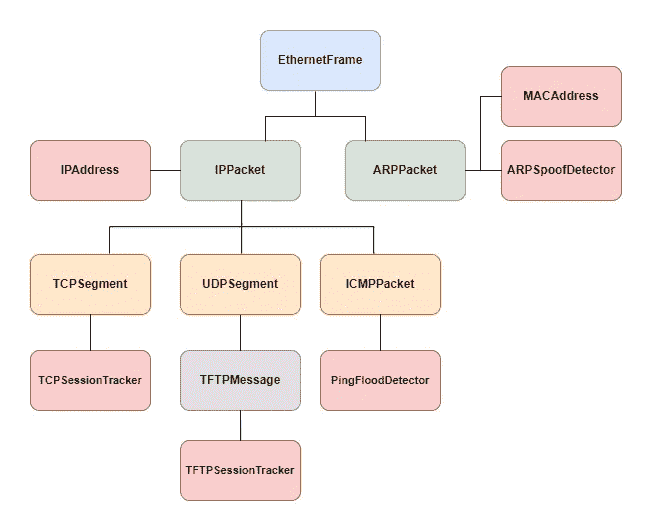
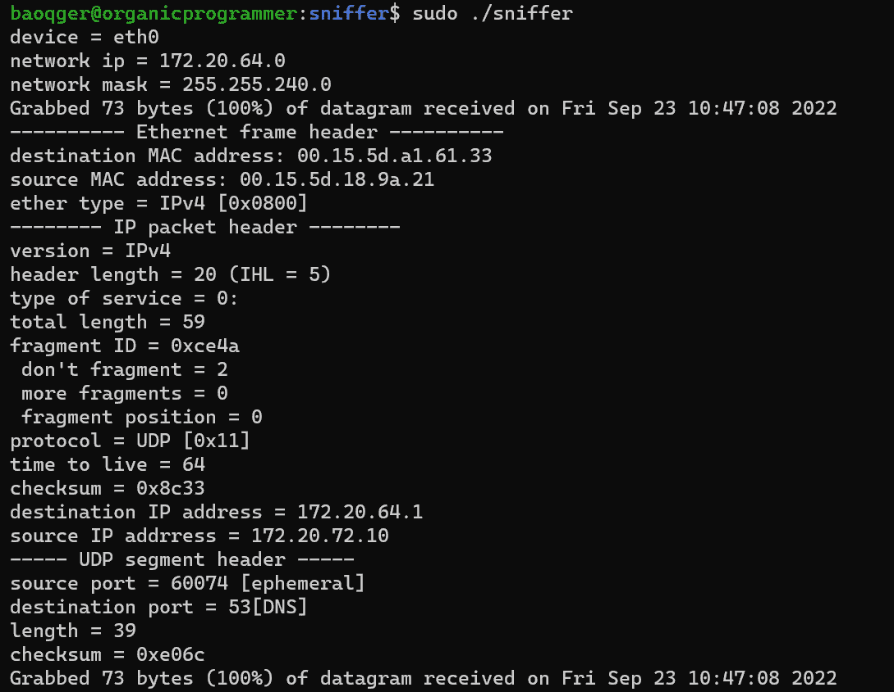
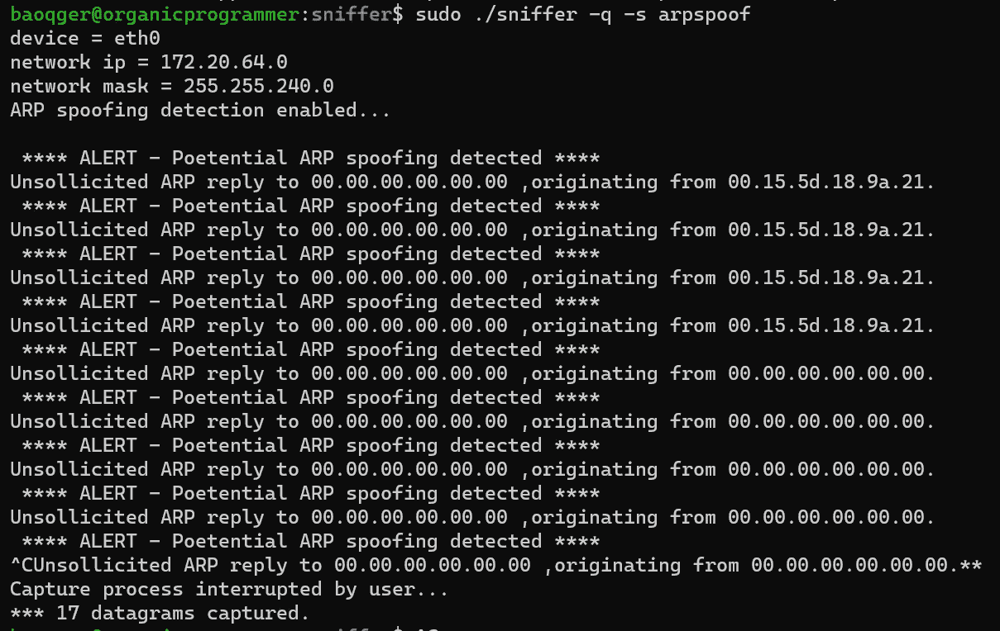
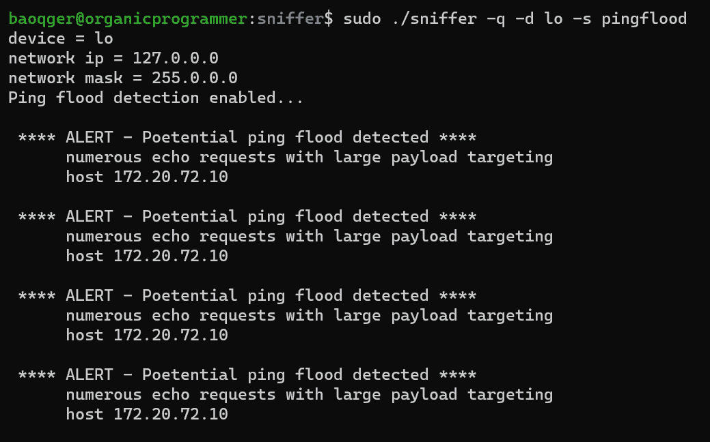
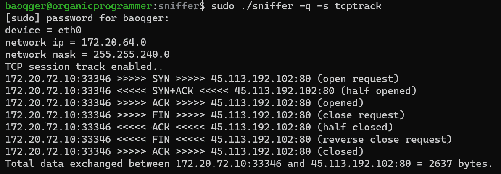

# 用 C 写一个包嗅探器

> 原文：<https://levelup.gitconnected.com/cpacketsniffer-write-a-packet-sniffer-in-c-9ea769f0de1a>

# 背景

在这篇文章中，我想介绍我的新项目:`[cPacketSniffer](https://github.com/baoqger/cPacketSniffer)`。我花了两个月的时间在这上面。终于算出来了，放在这里觉得很自豪！

 [## 基于 libpcap 的 C 语言网络数据包捕获

### cPacketSniffer 是一个基于 libpcap 用 C 语言编写的 Linux 网络数据包嗅探器。cPacketSniffer 用于…

github.com](https://github.com/baoqger/cPacketSniffer) 

# 动机

简单地说，我想在`network programming`和`Linux system programming`中磨砺我的技术。这两个话题都可以把你引向计算机或者软件的底层。费曼说[“底部空间很大”](https://en.wikipedia.org/wiki/There%27s_Plenty_of_Room_at_the_Bottom)，我觉得这个物理定律也可以适用于软件。

# 确认

我很幸运地看到了这个网站[“Linux 中的网络编程”](http://tcpip.marcolavoie.ca/index.html)，它用`C++`开发了一个网络数据包捕获工具。在确认这个网站上的文档和源代码都是完整清晰的之后，我决定用 C 语言对其进行重构。这是我的项目`cPacketSniffer`的起点。

# 特征

作为网络数据包嗅探器，`cPacketSniffer`提供了以下功能:

cPacketSniffer

*   与`libpcap`集成支持:过滤抓包、离线抓包、特定设备抓包、混杂模式抓包。
*   分析 TCP/IP 协议栈低层的网络数据包，包括`Ethernet`、`ARP`、`ICMP`、`IP(IPv4)`、`TCP`、`UDP`等。应用层也有一个协议:`TFTP`。
*   检测网络安全攻击:
    - ARP 欺骗检测。
    -平洪水检测。
*   分析和跟踪网络流量:
    - TCP 会话跟踪和流量分析。
    - TFTP 会话跟踪和流量分析。

下图展示了`cPacketSniffer`的一些典型用法:

**数据包分析**:

**ARP 欺骗检测**:

**平洪水检测**:

**TCP 会话跟踪**:

除了上述与网络编程相关的功能外，它还包括以下几点:

*   用 c 开发通用数据结构(哈希表和二叉查找树)
*   c 语言中的错误处理。
*   c 中的数据封装(面向对象风格编程)。
*   c 中的手动内存管理。
*   等等。

本文不会详细讨论这几点，以后我会分别就这些话题写文章。

# 未来的工作

现在`cPacketSniffer`可以根据设计作为网络数据包嗅探器。此外，它还可以作为一个试验台来尝试实验功能。下一步我计划尝试以下想法:

*   实现网络入侵检测功能。
*   使用高级数据结构(如二分搜索法树)提高性能。
*   内存和缓存性能调优。
*   通过垃圾收集实现自动内存管理。
*   集成`ncurses`用于基于文本的用户界面。

请继续关注我的博客！