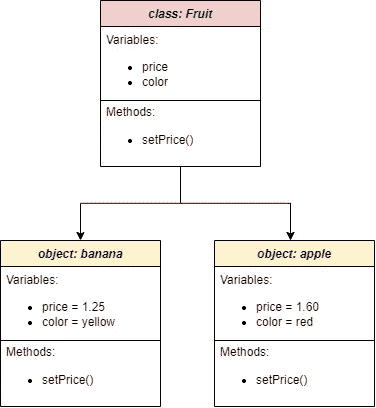

# C++面向对象编程:深入指南

> 原文：<https://levelup.gitconnected.com/cpp-object-oriented-programming-an-in-depth-guide-f56a597091d8>

## C++ OOP 的详细解释以及你应该如何在你的代码中使用它


照片由 [Fotis Fotopoulos](https://unsplash.com/@ffstop) 在 [Unsplash](https://unsplash.com/) 上拍摄

> 让我们切入正题:OOP 是什么？

面向对象编程(OOP)是一种计算机编程模型**,几乎每个开发人员都在他们编码生涯的某个阶段使用它。它是占主导地位的编程范例之一，自 20 世纪 90 年代以来已经成为主流。**

OOP 被认为是在教育程序中编写代码的标准方法，[尽管它并不是最好的方法](https://www.johndcook.com/blog/2011/07/19/you-wanted-banana/)。但我认为这是为初学者编写有效程序的最佳方式。这主要是因为 OOP 概念对大多数人来说是天生的。

大多数流行的编程语言都支持 OOP，包括 C++。这也是 C++语言的主要特征。而且你大部分时间都会用 OOP 来编写一个优秀的 C++程序。

# C++程序设计中面向对象的定义

顾名思义——OOP 使用对象的概念来设计软件。它将一个软件程序打包成一个更加简单的和**模块化的**代码，使得**更容易操作和维护**。

## 班级

为了创建一个模块化的对象，我们需要一个叫做**类**的可重用蓝图。类是 C++中用户定义的数据类型。它不同于其他原始数据类型(int、bool、char 等。)因为我们可以定制它。

那么，我们如何定制类呢？我们可以在一个类中构造属性(变量数据)和方法(函数)，形成一种新的数据类型。变量定义类属性，而方法用于执行一些通常操作类属性的操作。

> **属性** —假设我们想要创建一个名为`Fruit`的类，它包含类似于`price`的属性。我们可以简单地在`Fruit`中声明一个 float 数据类型的变量。
> 
> 如果我们想有一种方法来确定水果的价格。我们可以在类内部定义一个名为`setPrice`的方法。

我们的蓝图是怎样的:

```
class Fruit{
public:
   void setPrice(float new_price){price = new_price;}private:
   float price;
};
```

到目前为止，我们只创建了一个名为`Fruit`的蓝图(类)。**要创建一个对象**，我们需要像其他原始数据类型一样用对象名调用类`Fruit`。

```
int main(){
   Fruit banana;
   Fruit apple;
}
```

上面的例子只通过调用 C++编译器生成的默认构造函数创建了**对象实例**。因为我们从不指定构造函数。

## 构造器

那么什么是构造函数呢？构造函数是在对象创建时调用的方法。

通常，我们希望在创建新对象时执行一些类方法或定义类变量成员。这就是构造函数派上用场的地方。你可以查看本页了解更多关于构造函数的信息。

我们可以如下声明构造函数:

```
class Fruit{
public:
   Fruit(float _price, std::string _color){
      price = _price;
      color = _color;
   }  
   void setPrice(float new_price){price = new_price;}private:
   float price;
   std::string color;  
};
```

如您所见，上面的构造函数(`Fruit()`)需要两个参数:`_price`和`_color`。构造函数帮助我们在对象创建期间在对象内部创建有意义的数据:

```
int main(){
   Fruit banana(1.25, "yellow");
   Fruit apple(1.60, "red");
}
```



类(水果)及其两个对象实例，香蕉和苹果

# OOP 的 4 个主要概念

四个基本概念让 C++变得过于强大(OOP):

## 1.包装


照片由 [danilo.alvesd](https://unsplash.com/@daniloalvesd) 在 [Unsplash](https://unsplash.com/) 上拍摄

封装是将重要信息 **包装在一个对象内。**换句话说，变量和方法在创建时就存储在对象内部。

封装可以防止不必要的类外访问。这个概念有利于保护程序的使用。你可能不希望你的客户对你的软件做一些灾难性的改变。

为了实现这种限制，我们需要某种东西来指定“安全级别”这就是**访问修饰符**发挥作用的地方。

**访问修饰符**

访问修饰符是`public`和`private`，正如你在上面的例子中看到的。(还有一个叫`protected`，后面会详细介绍)

我们可以将类成员指定为`public`或`private`。默认情况下，一个类的所有成员都是`private`，除非他们被特别标记为`public`。

任何对象用户都可以直接访问公共成员，但是私有成员只能由对象本身访问。

以上面的例子为例，我们将`price`声明为私有成员，因为我们不希望用户直接访问它。我们将方法`setPrice`定义为公共成员，以允许其他用户仅通过显式调用该方法来设置`price`。

示例:

```
int main(){
   Fruit banana(1.25, "yellow");

   // error   
   std::cout << banana.color << std::endl;
   }
```

对象`banana`不能直接访问`main()`中的类变量`color`。

访问修饰符有助于限制某些类成员的使用。你可以参考[这本完整的指南](https://www.programiz.com/cpp-programming/access-modifiers)来学习更多关于访问修饰符的知识。

## 2.抽象

OOP 中的数据抽象意味着**只显示基本信息**，而**对最终用户隐藏细节**。这个概念是封装的扩展。

在类中，抽象是指将类的接口从实现细节中分离出来。

> 如果你还是得不到，你可以理解为——“你只看到我选择给你看的东西”

抽象允许我们使用简单的类来表达复杂的细节。

让我们举一个开车的例子:


[兰斯·阿斯伯](https://unsplash.com/@lance_asper)在 [Unsplash](https://unsplash.com/) 上拍摄的照片

你不需要知道发动机是如何工作的来驾驶一辆汽车。你不需要了解其中涉及的工程:动力传输是如何完成的，冷却系统是如何工作的，或者底盘是如何设计来承受汽车的重量 bla bla bla…

你只需要知道加速或刹车该踩哪个踏板，以及如何操控汽车转弯。所有的细节都隐藏在里面，以保护用户和它的制造商。

这类似于 C++面向对象。让我们看看如何在 C++中实现抽象:

*fruit.h*

```
class Fruit{
public:
   void increasePrice(float percentage);private:
   float price;
};
```

*fruit.cpp*

```
void Fruit::increasePrice(float percentage)
{
   price *= 1.0 + (percentage / 100);
}
```

通常情况下，用户只能看到头文件*、*、 *fruit.h* ，而看不到源文件 *fruit.cpp* 。

用户可以通过`increasePrice()`函数与`Fruit`类进行交互。但是，他们不需要知道`increasePrice()`(隐藏在 *fruit.cpp* 里面)的实现细节。

## 3.遗产


胡安·巴勃罗·塞拉诺·阿里纳斯在[像素](https://www.pexels.com/)上拍摄的照片

继承允许类从另一个类派生属性和特征。

这是 OOP 最重要的特性之一，因为它支持可重用性。您不需要重新定义与您之前定义的类具有相似特征的另一个类。

例如，让我们使用我们之前定义的`Fruit`:

```
class Fruit{
public:
   void setPrice(float new_price){price = new_price;}protected:
   float price;
   std::string color;  
};
```

我们可以从`Fruit`派生出其他类，比如`Durian`和`Strawberry`。因此，我们不需要再次定义成员变量— `price`和`color`。

继承的另一个好处是派生类可以有不同的成员变量，比如`thorns`和`is_berry`:

```
class Durian : public Fruit {
private:
   bool thorns = true;
};class Strawberry : public Fruit {
private: 
   bool is_berry = false;
};
```

`Durian`和`Strawberry`被称为派生类。相反，由其他类继承的`Fruit`被称为基类。

你们中的一些人可能已经发现了另一个访问说明符—`Fruit`中的`protected`。`protected`是用于类继承的**。**

派生类不继承对其基类的私有数据成员的访问。为了防止其他用户直接访问`price`和`color`，同时允许`Durian`和`Strawberry`继承两个成员变量，使用了`protected`。

定义派生类时，访问说明符也用在继承中。对于这个例子，我们使用公共继承。

虽然我们**通常在 C++中使用公共继承**，但你可能想检查一下什么时候在[这个链接](https://www.programiz.com/cpp-programming/public-protected-private-inheritance)中应用另外两个，私有和受保护继承。

## 4.多态性


照片由[魏明·林](https://unsplash.com/@cmzw)在 [Unsplash](https://unsplash.com/) 上拍摄

[多态性](https://www.mygreatlearning.com/blog/polymorphism-in-cpp/#:~:text=Polymorphism%20in%20C%2B%2B%20means%2C%20the,in%20numbers%2C%20it%20performs%20addition.)在希腊语中是“有多种形式”的意思。在面向对象程序设计中，它意味着一个函数的**根据它被调用的方式不同而执行**的能力。

**过载**

在 C++中，多态性通常是通过**重载、**实现的，也称为**编译时多态性**。而重载又有两种:[运算符重载](https://www.geeksforgeeks.org/operator-overloading-c/)和函数重载。操作符重载更难理解，所以为了本文的简单起见，我们不在这里讨论它。

函数重载非常简单。通过阅读下面的例子，你会明白我的意思:

```
class Fruit{
public:
   Fruit(float _price){price = _price;} void increasePrice(double percentage)
   {
      price *= 1.0 + (percentage / 100);
   }
   void increasePrice(int cents)
   {
      price += cents/100.0;
   }private:
   float price;
};int main()
{
   Fruit orange;
   Fruit apple;
   Orange.setPrice(0.60);
   Apple.setPrice(0.80); orange.increasePrice(0.20);
   apple.increasePrice(10);
```

结果:

```
Price of orange: 0.72
Price of apple: 0.90
```

我们定义了两个名称完全相同但参数数据类型不同的函数，一个是`double`，另一个是`int`。程序将根据输入执行任一功能。

因此，当您传递一个`double`参数时，`increasePrice(0.20)`将 orange 的价格提高了 20%。但是如果你传递一个`int`参数，那么`increasePrice(10)`会将苹果的价格提高 10 美分。

**超越**

多态性也可以用另一种方式实现: [**覆盖**](https://www.programiz.com/cpp-programming/function-overriding) **。**这种方法被称为运行时多态性。

要实现覆盖，您必须在基类中声明一个`virtual`函数，同时在派生类中定义另一个具有相同函数名和参数类型的函数。

```
class Fruit{
public:
   virtual void printSkinColor() 
   { 
      std::cout << "The skin colour of fruit is " << color << "\n";
   }protected:
   std::string color;  
};class Durian : public Fruit {
public:
   void printSkinColor()
   {
      std::cout << "The skin colour of durian is " << color << "\n";
   }
};
```

最终，调用不同的类会得到不同的结果。

使用重载和重写的多态性保持了一致性，并提高了代码的可读性。它还促进了代码的可重用性。

# 结论

这就结束了对 C++面向对象编程的介绍。

学习 C++通常很有挑战性，但是 OOP 总是一个很好的开始选择。你会在学习[指针](https://cplusplus.com/doc/tutorial/pointers/)的同时发现更多的乐趣(嗯，几十个人退出了，但是我相信你会乐在其中的！).

如果你喜欢这个博客，用“鼓掌”来表示你的支持。记住，你最多可以鼓掌 50 次。

# 分级编码

感谢您成为我们社区的一员！在你离开之前:

*   👏为故事鼓掌，跟着作者走👉
*   📰查看[升级编码出版物](https://levelup.gitconnected.com/?utm_source=pub&utm_medium=post)中的更多内容
*   🔔关注我们:[Twitter](https://twitter.com/gitconnected)|[LinkedIn](https://www.linkedin.com/company/gitconnected)|[时事通讯](https://newsletter.levelup.dev)

🚀👉 [**将像你这样的开发人员安置在顶级创业公司和科技公司**](https://jobs.levelup.dev/talent/welcome?referral=true)