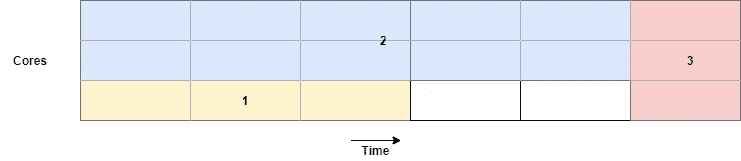
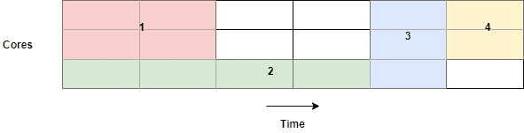
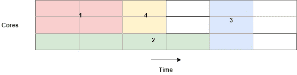
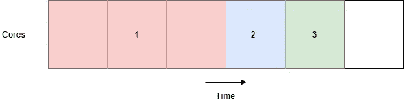
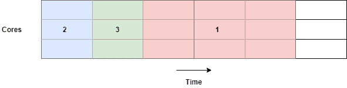

# CPU 调度算法

> 原文：<https://levelup.gitconnected.com/cpu-scheduling-algorithms-497e6992aa86>

## 一个过程来统治他们所有人

安娜·杜德科娃在 [Unsplash](https://unsplash.com?utm_source=medium&utm_medium=referral) 上的照片

在我们进入正题之前，让我们问问自己

> 什么是 CPU 调度，我们为什么需要它？

真的吗？很好。现在继续(糟糕的笑话)。

# 什么&为什么

CPU 调度是确定哪个进程下一个应该获得 CPU 并开始或继续执行的“行为”。

调度程序本身是一个进程，它根据我们将要讨论的不同参数来控制其他进程何时开始运行。

至于“为什么”,我相信在理解了什么是 CPU 调度程序之后，没有它几乎不可能工作。

# 两种类型

有两种主要类型的调度程序—抢占式和非抢占式调度程序。
如果一个调度程序是抢占式的，它可能在某个时候决定进程 A 现在有足够的 CPU，并决定把它交给另一个进程。
非抢占式调度程序不支持这种行为，当一个进程终止或该进程正在等待一些 I/O 操作并同时处于睡眠状态时，CPU 会让出。

# 我们如何衡量调度程序

我们将关注几个主要指标，但在此之前，让我们尝试给出一个调度器的示例

在上图中，您可以看到我们的机器有 3 个内核。数字表示到达的顺序。
第一个任务来了，要求为 3 个时间单位提供 1 个内核，然后第二个任务来了，要求为 5 个时间单位提供 2 个内核，依此类推。

## 利用

利用率由 CPU 繁忙时间的百分比来定义。
在上面的案例中，我们有 18 个可用块，但其中只有 16 个正在使用，这意味着这里的利用率是 0.888 (88.8%)。

## 吞吐量

吞吐量是指单位时间内完成的工作量。在我们的例子中，3 个进程以 6 个时间单位完成它们的执行，这意味着我们的吞吐量是 0.5。

## 等待时间

等待时间是由作业提交时间和实际开始运行时间之间的差值定义的。
在我们的例子中，假设作业 3 可以在时间单元 2 中提交，但是此时，作业 1 和 2 占用了所有资源，这使得作业 3 等待，直到它有足够的资源开始运行。

## 响应时间

响应时间由作业提交时间和终止时间之间的差异来定义。
假设任务 3 在时间单元 2 提交，在时间单元 6 终止，这意味着该任务的响应时间为 4。

> 我们希望最大化利用率和吞吐量，最小化等待和响应时间

# 先来先服务

这个名字很容易理解——作业是根据它们的到达时间来安排的。如果有足够的空闲核心，一个到达的作业将立即开始运行。
否则，它会一直等待，直到有足够的内核被释放。

上图展示了 FCFS 是如何工作的，我们可以立即看到我们可以优化它。
如我们所见，作业 4 只需要两个内核用于一个时间单元，并且可以在未利用的内核上进行调度。

优点:

*   易于实施——FIFO 等待队列
*   被认为是最公平的

缺点:

*   产生碎片——未利用的内核
*   小型或短期工作可能会等待很长时间

# 带回填的 FCFS

FCFS 的这种变化减少了未利用的核心数量。
每当一个任务到达或终止时，我们试图启动等待队列的头部——就像我们在最初的 FCFS 中所做的那样。
然后，迭代等待的作业，并尝试回填它们。

当一个短暂的等待作业可以“跳过”等待队列的头部而不延迟其开始时间时，就会发生回填。

如您所见，作业 3 没有被延迟，但是我们可以让作业 4 跳过它并在作业 3 等待足够的资源时执行。

优点:

*   碎片更少—利用率更高

缺点:

*   必须提前知道运行时间，以便计算“洞”的大小，并知道哪些候选人可以回填。

# 最短作业优先(SJF)

与 FCFS 不同，我们不是根据任务的到达时间来排序任务，而是根据任务的预计运行时间来排序时间。
该算法在平均等待时间的度量上是最优的，让我们尝试得到一些直觉为什么。

让我们假设执行 FCFS 导致了这一点

FirstCome

让我们试着想想 SJF 的情况会有什么不同，并计算各自的平均等待时间。

SJF

关于 FCFS 调度程序(第一个图示):

*   作业 1 等待 0 个时间单位
*   作业 2 等待 3 个时间单位
*   作业 3 等待 4 个时间单位

因此，平均等待时间是(0+3+4)/3 = 7/3

让我们为 SJF 调度程序做同样的事情(第二个例子):

*   作业 1 等待 2 个时间单位
*   作业 2 等待 0 时间单位
*   作业 3 等待 1 个时间单位

在这种情况下，平均等待时间是(2+0+1)/3 = 1

还有很多调度算法，我将在以后介绍。我们甚至还没有谈到抢占式调度器，所以还有很多东西要讨论，但是现在让我们休息一下。

# 最后一句话

本周我刚刚开通了我的个人博客，在那里你可以找到更多像这样的故事，所以希望，如果你读得很好，我会在那里看到你。