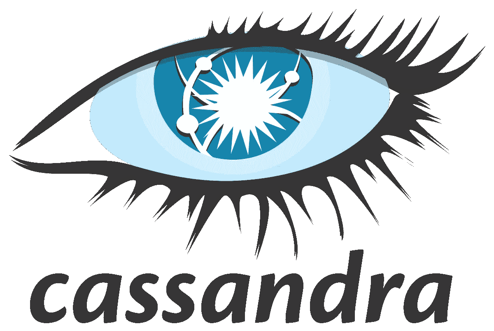
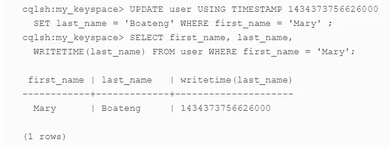

# CQL 类似 SQL，不一样

> 原文：<https://levelup.gitconnected.com/cql-is-similar-to-sql-not-the-same-8202ea582d26>

## Cassandra 查询语言

[https://SVN . Apache . org/repos/ASF/Cassandra/logo/Cassandra . SVG](https://svn.apache.org/repos/asf/cassandra/logo/cassandra.svg)

B ig data 正在快速发展，并已用于科学的各个领域，提出了需要自己的架构来实现的新概念和程序。这个架构最重要的部分之一是可以管理所需数据的数据库。与常规数据库不同，在这种架构中，数据库没有函数关系，由于大数据中使用的数据不一定是结构化的，我们需要另一种类型的数据库，称为 NoSQL，Apache Cassandra 拥有 NoSQL 架构中最合适的基础之一。

Cassandra 数据库是一个分布式的、开源的、完全免费的数据存储系统，它将数据分布在许多服务器上，并为您分配数据提供了很大的灵活性。您还可以轻松输入您的数据存储容量，因为所有节点都在一个集群中，不需要处理复杂的设置。Cassandra 是一个分布式数据库，没有单点故障，可以很容易地分布在多台计算机上。这是一个线性可扩展的高可用性数据库，旨在处理大数据，以便用户可以轻松快速地接收数据。Cassandra 没有使用主/从架构，所以在这种类型的架构中，主节点通常会因为功能性高而成为系统的瓶颈。也就是说，如果主设备出现故障或速度变慢，整个系统都会出现故障。这就是为什么在 Cassandra 中没有所谓的主节点，所有连接的节点的行为都是一样的，数据在不同的节点中是重复的。Cassandra 属于列族数据库类别。这些数据库不是一行一行地查看和存储数据，适合大数据处理等应用。

我猜你可能会问，这个奇妙的平台有什么缺点？对于新手用户来说，Cassandra 的一个问题是，Cassandra 是一个基于请求的数据库，这意味着我们必须基于 SQL 查询来存储数据，我们将在未来对数据运行这些查询。另一方面，数据检索方法依赖于那个表的主键，在非键字段上，你不能查询和搜索。这个缺点是，对于具有不同查询的特定表，我们有时必须创建多个表来存储相同的数据，但是每个表都有不同的键，并且是为特定的查询创建的。当然，它们以最快的速度响应我们，但是它们严重占用了我们的存储资源。

Cassandra 引入了 Cassandra 查询语言(CQL)，这是一个访问 Cassandra 的简单接口，作为传统查询结构化语言(SQL)的替代。CQL 增加了一个抽象层，隐藏了该结构的实现细节，并为集合和其他常见编码提供了本机语法。语言驱动程序可用于 Java (JDBC)、Python (DBAPI2)、Node。JS (Datastax)、Go (gocql)和 C++。了解 Cassandra 数据库是用 Java 编写的可能会对您有所帮助。

CQL 支持一组灵活的数据类型，包括简单的字符和数字类型、集合和用户定义的类型。CQL 提供了一个接近 SQL 的模型，在这个意义上，数据被放入包含*列*的*行*的*表*中。这是手动设置时间戳的 CQL 代码示例。

# 参考

https://en.wikipedia.org/wiki/Apache_Cassandra

https://cassandra.apache.org/doc/latest/cql/

*卡珊德拉:权威指南，第二版，杰夫·卡彭特，埃本·休伊特，2016 年 7 月，奥赖利媒体公司，ISBN: 9781491933664*

*西亚达提，萨曼。(2020).数据质量基于 ISO 8000–63:2019。10.13140/rg . 2.26906.67523/1。*