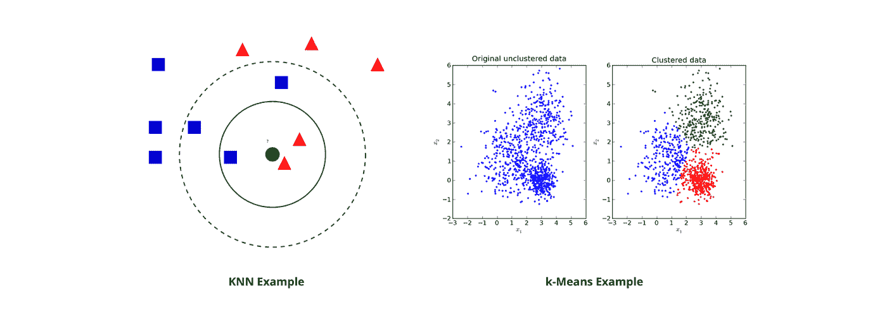

# 破解 40 大机器学习面试问题

> 原文：<https://levelup.gitconnected.com/crack-the-top-40-machine-learning-interview-questions-a7526335bcdc>

## 机器学习面试是一个严谨的过程。今天就来深度挖掘一下 FAANG 公司的 40 大机器学习面试问题。

**机器学习(ML)** 是我们世界的未来。在未来几年，几乎所有产品都将包含 ML 组件。预计 ML 将从 2020 年的 73 亿美元增长到 2024 年的 306 亿美元。这种对 ML 技能的需求遍及整个行业。

机器学习面试是一个严格的过程，对候选人的基本概念知识以及对 ML 系统、现实世界应用和产品特定需求的理解进行评估。

如果你正在寻找机器学习的职业生涯，了解面试中的预期是至关重要的。所以，为了帮助你准备，我收集了前 40 个机器学习面试问题。我们将从一些基础问题开始，然后转向高级问题。

**今天我们来复习一下:**

*   机器学习面试概述
*   公司特定流程
*   初学者问题(10)
*   中级问题(15)
*   高级问题(10)
*   特定于产品的问题(5)
*   接下来学什么

# 机器学习面试概述

机器学习面试问题是成为数据科学家、机器学习工程师或数据工程师不可或缺的一部分。根据公司的不同，机器学习工程师的职位描述可能会有所不同。你可以期待看到像机器学习工程师、数据科学家、人工智能工程师等头衔。

招聘机器学习职位的公司会进行面试，以评估个人在各个领域的能力。ML 面试问题往往属于这四类中的一类。

*   **算法与 ML 理论:**算法如何比较，如何精确衡量
*   **编程技巧:**通常是 Python 或者特定领域语言
*   **对机器学习的兴趣:**行业趋势和您对未来 ML 组件的愿景
*   **行业或产品特定问题:**您如何将一般的 ML 知识应用到具体的产品中

ML 面试问题现在主要集中在**系统设计**。在 ML 系统设计面试部分，候选人被给予开放式 ML 问题，并被期望建立一个端到端的机器学习系统。常见的例子有推荐系统、视觉理解系统和搜索排名系统。

> *要了解如何解决这些问题，请查看我们的文章* [*机器学习面试问题*](https://www.educative.io/blog/anatomy-machine-learning-system-design-interview)

# 公司特定流程

在我们进入前 40 个机器学习面试问题之前，我们先来看看顶级公司在面试重点上有什么不同。

## 谷歌 ML 面试

谷歌 ML 面试，通常称为机器学习工程师面试，强调算法、机器学习和 Python 方面的技能。

一些**常见问题**包括梯度下降、正则化/归一化方法和嵌入。

面试过程将是**通用的**，而不是专注于某个特定的团队或项目。一旦你通过了面试，他们会把你分配到一个适合你技能的团队。

## 亚马逊 ML 面试

亚马逊 ML 面试被称为机器学习工程师面试，主要关注电子商务 ML 工具、云计算和人工智能推荐系统。

亚马逊**的人工智能工程师**预计将建立人工智能系统，并使用深度学习模型。**数据科学家**在技术和业务之间架起一座由数据驱动的桥梁。研究科学家具有更高的教育水平，并致力于改进 ASR、NLU 和 TTS 功能。

ML 面试的技术部分集中在 ML 模型、偏差-方差权衡和过度拟合上。

## 脸书 ML 面试

脸书 ML 面试由通用算法问题、ML 设计和系统设计组成。你将被期待与新闻提要排名算法和本地搜索排名。脸书寻找理解端到端移动通信系统组件的工程师，包括部署。

你可能会遇到的一些常见的面试头衔是研究科学家、数据科学面试或机器学习工程师。像亚马逊一样，它们在关注点和对通才知识的需求上略有不同。

## Twitter ML 访谈

Twitter 的数据科学家角色包括数据科学家和研究科学家两种角色，分别针对不同的团队。

面试的技术部分测试你对 ML 理论(包括 SQL 和 Python)的应用和直觉。Twitter 寻找统计学、实验模型、产品直觉和系统设计的知识。

# 初学者问题(10)

现在让我们深入探讨一下 ML 面试的前 40 个问题。这些问题分为初级、中级、高级和特定于产品的问题。

## 1.偏倚和方差之间的权衡是什么？

**偏差**(模型拟合数据的程度)指的是由于您的 ML 算法中不准确或过于简单的假设而导致的错误，这会导致过度拟合。

**方差**(模型根据输入变化的程度)是指由于 ML 算法的复杂性而产生的误差，它对训练数据的高水平变化和过度拟合非常敏感。

换句话说，简单模型是稳定的(低方差)，但有很大偏差。复杂的模型容易过度拟合，但表达了模型的真实性(低偏差)。误差的最佳减少需要偏差和方差的折衷，以避免高方差和高偏差。

## 2.解释有监督和无监督机器学习的区别。

**监督学习**需要训练标注数据。换句话说，监督学习使用一个基础事实，这意味着我们已经有了关于输出和样本的知识。这里的目标是学习一个近似输入和输出之间关系的函数。

**另一方面，无监督学习**不使用标记输出。这里的目标是推断数据集中的自然结构。

## 3.有监督学习和无监督学习最常用的算法有哪些？

**监督学习算法:**

*   线性回归
*   逻辑回归
*   决策树
*   随机森林
*   朴素贝叶斯
*   神经网络

**无监督算法的例子:**

*   聚类:k 均值
*   可视化和降维
*   主成分分析(PCA)，t 分布
*   随机邻居嵌入(t-SNE)
*   关联规则学习(先验)

## 4.解释 KNN 和 k-均值聚类的区别。

主要区别在于 **KNN 需要标记点**(分类算法，监督学习)，而 **k-means 不需要**(聚类算法，无监督学习)。

要使用 K-最近邻，您需要使用想要分类到未标记点的已标记数据。K-means 聚类采用未标记的点，并学习如何使用点之间距离的平均值对它们进行分组。

## 5.什么是贝叶斯定理？我们为什么要用它？

贝叶斯定理是当我们知道其他概率时，我们如何找到一个概率。换句话说，它提供了先验知识事件的**后验概率**。这个定理是计算条件概率的一种原则性方法。

在 ML 中，贝叶斯定理用于概率框架中，该概率框架将模型拟合到训练数据集，并用于构建分类预测建模问题(即朴素贝叶斯、贝叶斯最优分类器)。

## 6.什么是朴素贝叶斯分类器？我们为什么要使用它们？

朴素贝叶斯分类器是分类算法的集合。这些分类器是共享一个共同原则的算法家族。朴素贝叶斯分类器假设一个特征的出现或缺失不会影响另一个特征的出现或缺失。

换句话说，我们称之为“天真”，因为它假设所有数据集特征都是同等重要和独立的。

朴素贝叶斯分类器用于分类。当独立性假设成立时，它们很容易实现，并且比其他复杂的预测器产生更好的结果。它们用于垃圾邮件过滤、文本分析和推荐系统。

## 7.解释第一类和第二类错误的区别。

第一类错误是**假阳性**(当它没有发生时声称某事已经发生)，第二类错误是**假阴性**(当它实际发生时声称什么也没有发生)。

## 8.判别模型和生成模型之间有什么区别？

判别模型学习不同类别数据之间的**差异。生成模型学习**数据类别。**判别模型一般在分类任务上表现更好。**

## 9.什么是参数模型？举个例子。

参数模型有**个有限数量的参数**。你只需要知道模型的参数就可以做出数据预测。常见的例子如下:线性支持向量机，线性回归，逻辑回归。

非参数模型有无限数量的参数**来提供灵活性。对于数据预测，您需要模型的参数和观察数据的状态。常见的例子如下:k 近邻、决策树、主题模型。**

## 10.解释数组和链表的区别。

数组是对象的有序集合。它假设每个元素都有相同的大小，因为整个数组存储在一个连续的内存块中。数组的大小是在声明时指定的，以后不能更改。

数组的搜索选项有线性搜索和二分搜索法(如果已排序)。

链表是一系列带有指针的对象。不同的元素存储在不同的存储位置，并且可以在需要时添加或删除数据项。

链表的唯一搜索选项是线性的。

> ***附加初学者问题可能包括:***
> 
> 模型性能和精度哪个更重要？为什么？
> 
> F1 的分数是多少？如何使用？
> 
> 什么是维度的诅咒？
> 
> 什么时候应该使用分类而不是回归？
> 
> 解释深度学习。它与其他技术有何不同？
> 
> 解释可能性和概率的区别。

# 中级问题(15)

这些中级问题从上面获取 ML 的基本理论，并以更严谨的方式应用它们。

## 1.对于时间序列数据集，您会选择哪种交叉验证技术？

时间序列不是随机分布的，而是按时间顺序排列的。您希望使用类似于**正向链接**的东西，这样您就可以在查看未来数据之前基于过去的数据进行建模。例如:

*   折叠 1:培训[1]，测试[2]
*   折叠 2:培训[1 2]，测试[3]
*   折叠 3:训练[1 2 3]，测试[4]
*   折叠 4:训练[1 2 3 4]，测试[5]
*   折叠 5:训练[1 2 3 4 5]，测试[6]

## 2.如何根据训练集的大小选择分类器？

对于小的训练集，具有高偏差和低方差模型的模型更好，因为它不太可能过度拟合。朴素贝叶斯就是一个例子。

对于大型训练集，具有低偏差和高方差模型的模型更好，因为它表达更复杂的关系。逻辑回归就是一个例子。

## 3.解释 ROC 曲线和 AUC。

ROC 曲线是分类模型在所有阈值的性能的**图形表示**。它有两个阈值:真阳性率和假阳性率。

简单地说，AUC(ROC 曲线下面积)就是 ROC 曲线下的面积。AUC 测量 ROC 曲线下从(0，0)到(1，1)的二维面积。它用作评估二元分类模型的性能度量。

## 4.解释无监督学习的 LDA。

潜在狄利克雷分配(LDA)是**主题建模**的常用方法。它是一个生成模型，用于将文档表示为主题的组合，每个主题都有自己的概率分布。

LDA 旨在将高维空间的特征投影到低维空间。这有助于避免维数灾难。

## 5.你如何确保你没有过度适应一个模型？

有三种方法可以用来防止过度拟合:

1.  使用**交叉验证**技术(比如 k 折交叉验证)
2.  保持模型**简单**(即接受更少的变量)以减少方差
3.  使用**正则化技术**(像套索)来惩罚可能导致过度拟合的模型参数

## 6.在 SQL 中，主键和外键是如何关联的？

SQL 是 ML 中使用的最流行的数据格式之一，因此您需要展示您操作 SQL 数据库的能力。

外键允许您在相应表的主键上匹配和连接表。

如果您遇到这个问题，请回答基本概念，并解释您将如何设置 SQL 表和[查询它们](https://www.educative.io/blog/what-is-database-query-sql-nosql)。

## 7.你会用什么评估方法来衡量一个 ML 模型的有效性？

首先，将数据集分成训练集和测试集。您还可以使用交叉验证技术来分割数据集。然后，您将选择并实现性能指标。例如，您可以使用混淆矩阵、F1 分数和准确度。

> *你需要解释如何根据不同的参数测量模型的细微差别。脱颖而出的受访者会进一步回答这样的问题。*

## 8.解释如何处理数据集中缺失或损坏的数据。

您需要标识查找数据并删除行/列，或者用其他值替换它们。

[Pandas](https://www.educative.io/blog/python-pandas-tutorial) 为此提供了有用的方法:`isnull()`和`dropna()`。这些允许您识别和丢弃损坏的数据。`fillna()`方法可以用来用占位符填充无效值。

## 9.解释你将如何开发数据管道。

数据管道使我们能够采用数据科学模型，并对其进行自动化或扩展。一个常见的数据管道工具是 Apache Airflow，使用 Google Cloud、Azure 和 AWS 来托管它们。

对于这样的问题，您需要解释所需的步骤，并讨论您在构建数据管道方面的实际经验。

**谷歌云主机的基本步骤如下:**

1.  登录谷歌云平台
2.  创建计算实例
3.  从 GitHub 获取教程内容
4.  使用气流概览管道
5.  使用 Docker 设置虚拟主机
6.  开发 Docker 容器
7.  打开气流 UI 并运行 ML 管道
8.  运行部署的 web 应用程序

## 10.如何修复模型中的高方差？

如果模型具有低方差和高偏差，我们使用 bagging 算法，该算法使用随机抽样将数据集分成子集。我们使用这些样本，通过单一的学习算法生成一组模型。

此外，我们可以使用正则化技术，其中较高的模型系数被惩罚以降低整体复杂性。

## 11.什么是超参数？它们与模型参数有何不同？

模型参数是模型内部的**变量。参数值是从训练数据中估计出来的。**

超参数是模型外部的**变量。该值不能从数据中估计，它们通常用于估计模型参数。**

## 12.您正在处理数据集。你如何选择重要的变量？

*   在选择重要变量之前，删除相关变量
*   使用随机森林和绘图变量重要性图表
*   使用套索回归
*   使用线性回归选择基于 p 值的变量
*   使用向前选择、逐步选择和向后选择

## 13.如何为数据集选择使用哪种算法？

选择 ML 算法取决于所讨论的数据的**类型。业务需求是选择算法和构建模型所必需的，所以在回答这个问题时，解释您需要更多信息。**

例如，如果您的数据以线性方式组织，线性回归将是一个很好的算法。或者，如果数据由非线性交互组成，那么 bagging 或 boosting 算法是最好的。或者，如果你正在处理图像，神经网络将是最好的。

> *在 5 分钟内阅读更多关于* [*数据科学 10 大算法*](https://www.educative.io/blog/top-10-ml-algorithms-for-data-science-in-5-minutes)

## 14.使用神经网络的优点和缺点是什么？

**优点:**

*   将数据存储在整个网络上，而不是数据库中
*   并行处理
*   分布式存储器
*   即使信息有限，也能提供很高的准确性

**缺点:**

*   需要复杂的处理器
*   网络的持续时间多少是未知的
*   我们过于依赖误差值
*   黑盒性质

## 15.决策树中的默认拆分方法是什么？

默认的方法是**基尼指数**，这是一个特定节点杂质的度量。本质上，它计算某个特定要素被错误分类的概率。当元素由一个类链接时，我们称之为“纯的”。

您也可以使用随机森林，但基尼指数是首选，因为它不是计算密集型和不涉及对数函数。

> ***附加中间题可能包括:***
> 
> 什么是 Box-Cox 变换？
> 
> 取水问题
> 
> 解释决策树的优点和缺点。
> 
> 使用反向传播技术时的爆炸梯度问题是什么？
> 
> 什么是混淆矩阵？你为什么需要它？

# 高级问题(10)

这些高级问题将您的知识应用于特定的 ML 组件，并在基础上扩展以思考现实世界的应用。这些技能一般需要编码而不仅仅是理论。

## 1.给定一个数据集，缺失值分布在中值的 1 个标准差范围内。有多少百分比的数据不会受到影响？

数据分布在中位数上，所以我们可以假设我们正在使用正态分布。这意味着大约 68%的数据位于平均值的 1 个标准偏差处。所以，大约有 32%的*的数据没有受到影响。*

## *2.有人告诉您，您的回归模型存在多重共线性。如何验证这是真的，并建立一个更好的模型？*

*您应该创建一个相关矩阵来识别和删除相关性超过 75%的变量。请记住，我们这里的阈值是主观的。*

*您还可以计算 **VIF(方差膨胀因子)**来检查多重共线性的存在。大于或等于 4 的 VIF 值表示不存在多重共线性。小于或等于 10 的值表明存在严重的多重共线性问题。*

*你不能只移除变量，所以你应该使用惩罚回归模型或者在相关变量中添加随机噪声，但是这种方法不太理想。*

## *3.为什么 XGBoost 的表现比 SVM 好？*

*XGBoos 是一个使用许多树的**集合方法**。这意味着它随着自身的重复而改进。*

*SVM 是一个**线性分隔符**。所以，如果我们的数据不是线性可分的，SVM 需要一个内核来使数据达到可分的状态。这可能会限制我们，因为对于每个给定的数据集，都没有完美的内核。*

## *4.你用 10，000 棵树建立一个随机森林模型。训练误差为 0.00，但验证误差为 34.23。解释哪里出了问题。*

*你的模型很可能**过度装配**。训练误差为 0.00 意味着分类器已经模仿了训练数据模式。这意味着它们对我们看不见的数据不可用，返回一个更高的错误。*

*使用随机森林时，如果我们使用大量的树，就会出现这种情况。*

## *5.解释构建 ML 模型的各个阶段。*

*这在很大程度上取决于手头的模型，因此您可以提出澄清性问题。但一般来说，过程如下:*

1.  *理解商业模式和最终目标*
2.  *收集数据采集*
3.  *进行数据清理*
4.  *基本探索性数据分析*
5.  *使用机器学习算法开发模型*
6.  *使用未知数据集检查准确性*

## *6.下面的混淆矩阵的召回率、特异性和精确度是多少？*

*   **TP /真阳性:病例呈阳性，预测为阳性**
*   **TN /真阴性:病例为阴性，预测为阴性**
*   **FN /假阴性:病例呈阳性，但预测为阴性**
*   **FP /假阳性:病例为阴性，但预测为阳性**

**

*   *召回率= 20%*
*   *特异性= 30%*
*   *精度= 22%*

> ****解释:****
> 
> **召回率= TP / (TP+FN) = 10/50 = 0.2 = 20%**
> 
> **特异性= TN / (TN+FP) = 15/50 = 0.3 = 30%**
> 
> **精度= TP/ (TP + FP) = 10 / 45 = 0.2 = 22%**

## *7.对于 NLP，使用编码器-解码器模型的主要目的是什么？*

*我们使用编码器-解码器模型来基于输入序列生成输出序列。*

*编码器-解码器模型如此强大的原因是解码器使用编码器的最终状态作为其初始状态。这使得解码器能够访问编码器从输入序列中提取的信息。*

## *8.对于使用 TensorFlow 的深度学习，需要哪个值作为评估的输入`EstimatorSpec`？*

*损失度量是必需的。在 TensorFlow 的模型执行中，我们使用`EstimatorSpec`对象来组织训练、评估和预测。*

*`EstimatorSpec`对象是用一个名为 mode 的必需参数初始化的。该模式可以取三个值之一:*

*   *`tf.estimator.ModeKeys.TRAIN`*
*   *`tf.estimator.ModeKeys.EVAL`*
*   *`tf.estimator.ModeKeys.PREDICT`*

*初始化`EstimatorSpec`所需的关键字参数因模式而异。*

## *9.当使用 scikit-learn 时，当特征值变化很大时，我们真的需要缩放我们的特征值吗？*

*是的。大多数机器学习算法使用欧几里德距离作为度量来测量两个数据点之间的距离。如果取值范围相差很大，同一变化在不同特征上的结果就会大不相同。*

## *10.您的数据集有 50 个变量，但有 8 个变量的缺失值高于 30%。你如何解决这个问题？*

*您可以采用三种通用方法:*

1.  *只是删除它们(不理想)*
2.  *为缺失值分配一个独特的类别，以查看是否有趋势导致此问题*
3.  *用目标变量检查分布。如果找到了一个模式，保留丢失的值，将它们分配到一个新的类别，并删除其他值。*

> ****附加高级题可能包括:****
> 
> *您必须评估基于 R、调整 R 和容差的回归模型。你的标准是什么？*
> 
> *对于 k-means 或者 kNN，我们为什么要用欧氏距离而不是曼哈顿距离？*
> 
> *线性回归模型通常使用调整后的 R 或 F 值进行评估。你如何评价逻辑回归模型？*
> 
> *解释正常软边际 SVM 和线性核 SVM 之间的差异。*

# *特定于产品的问题(5)*

*公司希望看到你能把 ML 概念应用到他们现实世界的产品和团队中。你可能会遇到关于一家公司基于 ML 的产品的问题，甚至会被要求自己设计这些产品。*

## *1.你将如何为我们的用户实现一个推荐系统？*

*许多类似这样的 ML 面试问题涉及到对一个组织的具体问题实施模型。要回答好这个问题，你需要提前对公司进行调研。了解收入驱动因素和用户群。*

> ****重要:*** *用这样的问题来展示你的系统设计技巧吧！您需要用需求、指标、培训数据生成和排名来勾画出一个解决方案。**
> 
> *[*钻研机器学习面试*](https://www.educative.io/courses/grokking-the-machine-learning-interview) *用网飞的推荐系统详细讲解了这个问题。**

***建立推荐系统的一般步骤如下:***

*   *通过提问来设置问题*
*   *了解规模和延迟要求*
*   *定义在线和离线测试的指标*
*   *讨论系统的架构(数据将如何流动)*
*   *讨论培训数据生成*
*   *概述特征工程(涉及哪些参与者)*
*   *讨论模型训练和算法*
*   *建议部署后您将如何扩展和改进(即您可以预测的问题)*

## *2.你认为我们业务中最有价值的数据是什么？*

*这测试你对商业/行业的知识。它还测试您如何将数据与业务成果相关联，并将其应用于特定公司的需求。你需要研究一个组织的商业模式。在开始之前，一定要提问以进一步澄清问题。*

***一些通用答案可能是:***

*   *ML 团队所理解的质量数据对于缩放和做出正确的预测是有用的*
*   *告诉我们客户想要什么的数据对于所有商业决策都是必不可少的*
*   *更好的数据管理可以增加他们的年收入*
*   *对公司最有价值的数据类型是客户数据、IT 数据和内部财务数据*

## *3.你将如何为广告预测系统构建广告选择流程？*

*广告选择组件的主要目标是缩小与给定查询相关的广告集。在基于搜索的系统中，广告选择组件负责根据用户和查询上下文从广告数据库中检索最相关的广告。*

*在基于订阅源的系统中，广告选择组件将更多地基于用户兴趣而不是搜索项来选择前 k 个相关广告。*

*下面是这个问题的一般解决方案。假设我们使用基于漏斗的方法来建模。将广告选择过程分为以下三个阶段是有意义的:*

*   ***阶段 1:** 根据选择标准快速选择给定查询和用户上下文的广告*
*   ***第二阶段:**根据一种简单快速的算法对这些选定的广告进行排序，以修整广告。*
*   ***第三阶段:**将机器学习模型应用于修剪后的广告，以选择最佳广告。*

**

## *4.基于 feed 的系统的架构组件是什么？*

*同样，这个问题在很大程度上取决于所讨论的组织。你首先要问一些关于系统的澄清性问题，以确保你满足它的所有需求。你可以用假设的方式说话，为不准确留有余地。*

*我将使用 Twitter 的 feed 系统来解释它，让你知道如何处理这样的问题。它将包括:*

*   ***Tweet selection:** 用户的 Tweet 池被转发给 ranker 组件*
*   ***训练数据生成:**正反例训练*
*   ***Ranker:** 用于预测交战概率*

**

## *5.你觉得 GPT 3 号怎么样？你认为我们能如何使用它？*

*这个问题衡量你在这个行业的投资，以及你对如何应用新技术的看法。GPT-3 是一种新的语言生成模型，可以生成类似人类的文本。*

*关于 GPT-3 有很多观点，所以读一读它是如何被用来展示下一代批判性思维的。通过 OpenAI 查看 CPT-3 的[20 大用途。](https://www.educative.io/blog/top-uses-gpt-3-deep-learning)*

***一些通用答案可能是:***

*   *改进聊天机器人和客户服务自动化*
*   *用自然语言处理改进搜索引擎*
*   *持续学习的工作培训和演示*
*   *改进 JSX 电码*
*   *简化用户界面/UX 设计*

> ****附加问题可能包括:****
> 
> *为我们公司设计一个广告预测系统。*
> 
> *我们的搜索排名标准是什么？你会如何改进它们？*
> 
> *你对我们目前的数据处理有什么看法？*
> 
> *描述一下你在机器学习方面的研究经历。*
> 
> *用 SQL 编写一个查询来衡量广告在瞬间和新闻提要中的浏览量。*
> 
> *您认为量子计算将如何影响该组织的 ML？*
> 
> *我们当前的哪些产品可以受益于新的 ML 组件？*

# *接下来学什么*

*恭喜你。你现在已经了解了在机器学习面试中会遇到的前 40 个问题。要巩固你的知识，掌握系统设计、Python 和所有 ML 工具，还有很多东西要学。*

*请务必回顾我在每一节末尾提供的附加问题。*

*要进行更多实践，请查看 Educative 的课程 [**探索机器学习面试**](https://www.educative.io/courses/grokking-the-machine-learning-interview) 。您将学习如何从头开始设计系统，并培养思考 ML 系统的高级能力。这是一个理想的地方，让你的 ML 技能更上一层楼，并从竞争中脱颖而出。*

*快乐学习！*