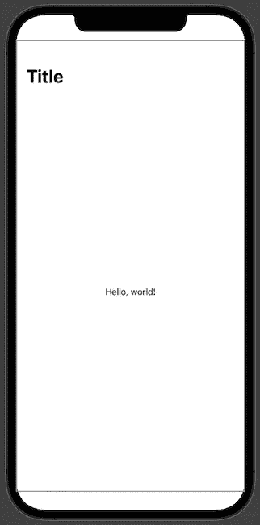
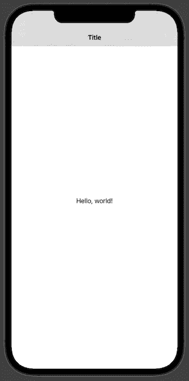
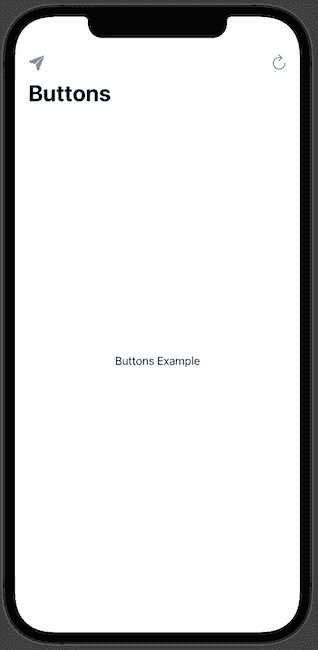
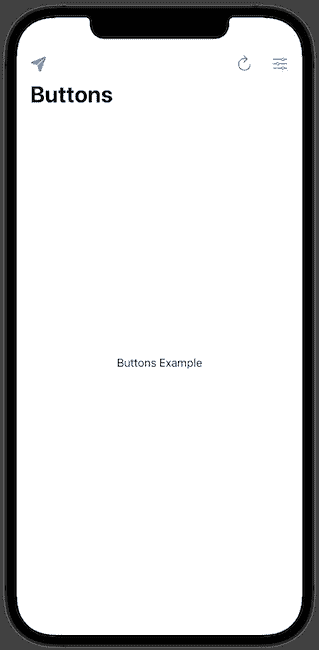
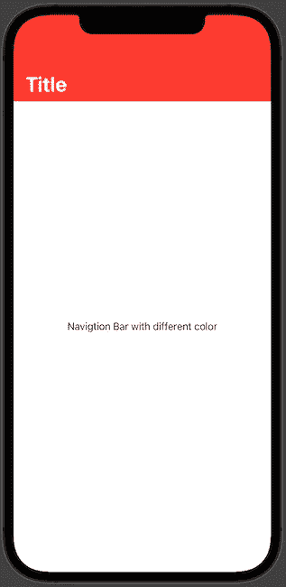

# 用 SwiftUI 破解导航栏秘密

> 原文：<https://levelup.gitconnected.com/cracking-the-navigation-bar-secrets-with-swiftui-30e9b019502c>

从一个视图导航到另一个视图，或者简单地显示标题和按钮，是现代 iOS 应用程序最重要的组成部分之一。几乎每个 app 都有这个功能。SwiftUI 为如何显示导航栏、设置标题和添加按钮带来了一些新方法。所以我们来看看。


照片由[叶戈尔·迈兹尼克](https://unsplash.com/@vonshnauzer)在 [Unsplash](https://unsplash.com/?utm_source=medium&utm_medium=referral) 上拍摄。

# 显示导航视图

为了使用 SwiftUI 显示导航栏，我们应该使用负责此目的的`NavigationView`组件。它要求我们提供一个`View`类型的`Content`。`Content`可以是从文本字段到可滚动内容的任何内容。简而言之，它可以是任何 SwiftUI 视图。

为了显示导航的标题，SwiftUI 采用了一种与我们习惯的 UIKit 完全不同的方法。我们应该将它设置为视图修改器，不是为`NavigationView`，而是为`Content`。

```
var body: some View {
  NavigationView {
    Text("Hello, world!")
      .navigationTitle("Title")
  }
}
```



SwiftUI 框架提供了一种指定`NavigationView`大小的方法。我们想为`Content`使用`.navigationBarTitleDisplayMode`修改器，并提供一个显示模式。`DisplayMode`类型是有三种情况的枚举:

*   `automatic` -继承上一个导航项；
*   `inline` -导航尺寸小；
*   `large` -大导航尺寸。

让我们看看如何在代码中使用它。

```
NavigationView {
  Text("Hello, world!")
    .navigationTitle("Title")
    .navigationBarTitleDisplayMode(.inline)     
}
```



当我们想要将`NavigationView`更改为更大的尺寸时，我们只需将`.inline`更改为`.large`。

```
NavigationView {
  Text("Hello, world!")
    .navigationTitle("Title")
    .navigationBarTitleDisplayMode(.large)
}
```

# 添加导航视图按钮

现在我们知道了如何显示`NavigationView`，让我们来探索如何添加按钮。我想指出的是，以前在 SwiftUI 中，我们使用了`.navigationBarItems`视图修饰符，但是现在不推荐使用了。对于最新的 SwiftUI 版本，我们应该调用`.toolbar`修饰符。下面我们来深入探讨一下如何在各种场景下使用。

# 添加单个按钮

让我们在`NavigationView`的前端和后端添加一个`Button`。为了实现这一点，我们需要使用`.toolbar`视图修改器并传递`.ToolbarItem`视图。为了初始化`.ToolbarItem`，我们应该提供位置和内容。放置参数是一个类型`ToolbarItemPlacement`，它是一个结构体。有几种方法可以管理布局，但现在我们将研究其中的两种方法:

*   `navigationBarLeading` -显示导航栏前端的按钮；
*   `navigationBarTrailing` -显示导航栏尾部的按钮。

```
var body: some View {
  NavigationView {
    Text("Buttons Example")
      .navigationTitle("Buttons")
      .toolbar {
        ToolbarItem(placement: .navigationBarLeading) {
          Button(action: {
            print("Refresh")
          }) {
            Label("Send", systemImage: "paperplane.fill")
          }
        }
        ToolbarItem(placement: .navigationBarTrailing) {
          Button(action: {
            print("Refresh")
          }) {
            Label("Refresh", systemImage: "arrow.clockwise")
          }
        }
      }
  }
}
```



# 添加多个按钮

现在我们知道了如何添加单个按钮，让我们学习如何添加多个按钮。这次我们需要使用代表一组工具栏项目的`ToolbarItemGroup`。

```
.toolbar {
  ToolbarItemGroup(placement: .navigationBarLeading) {
    Button(action: {
      print("Send")
    }) {
      Label("Send", systemImage: "paperplane.fill")
    }
  } ToolbarItemGroup(placement: .navigationBarTrailing) {
    Button(action: {
      print("Refresh")
    }) {
      Label("Refresh", systemImage: "arrow.clockwise")
    } Button(action: {
      print("Edit")
    }) {
      Label("Edit", systemImage: "slider.horizontal.3")
    }
  }
}
```



在添加多个按钮的时候，不要太疯狂。最终可能会变得难以使用应用程序，因为按钮可能会掩盖导航栏的标题。

# 更改导航视图颜色

现在，SwiftUI 没有改变`NavigationView`颜色的选项。为此，我们需要返回 UIKit 并使用`UINavigationBarAppearance`对象来定制导航栏。

要更改 SwiftUI 导航栏的颜色，我们可以将`init`方法添加到 SwiftUI 视图中，并在其中更改导航栏的外观，如下所示:

```
init() {
  let coloredAppearance = UINavigationBarAppearance()
  coloredAppearance.configureWithOpaqueBackground()
  coloredAppearance.backgroundColor = .systemRed
  coloredAppearance.titleTextAttributes = [.foregroundColor: UIColor.white]
  coloredAppearance.largeTitleTextAttributes = [.foregroundColor: UIColor.white]

  UINavigationBar.appearance().standardAppearance = coloredAppearance
  UINavigationBar.appearance().compactAppearance = coloredAppearance
  UINavigationBar.appearance().scrollEdgeAppearance = coloredAppearance

  UINavigationBar.appearance().tintColor = .white
}var body: some View {
  NavigationView {
    Text("Navigtion Bar with different color")
      .navigationTitle("Title")
  }
}
```

从代码中我们可以看到，我们正在做多件事情，比如改变背景颜色和标题文本颜色。我们可以使用系统颜色，也可以从 iOS 应用程序资产目录中引入颜色。



# TL；速度三角形定位法(dead reckoning)

导航栏是现代 iOS 和 iPadOS 应用程序的重要元素。大多数应用程序都有不止一个屏幕，我们的用户必须在我们的应用程序中来回导航。

SwiftUI 提供了一个新的视图，`NavigationView`，与 UIKit 相比，我们需要完全转变对导航以及如何使用它的想法。

使用 SwiftUI，在屏幕上添加导航、更改标题和在导航栏上添加按钮非常简单。但是如果我们想改变颜色，我们应该回到 UIKit。我相信这种情况很快就会改变。

# 链接

*   [样本代码](https://github.com/fassko/SwiftUINavigationView)
*   [swift ui 中导航视图的完整指南](https://www.hackingwithswift.com/articles/216/complete-guide-to-navigationview-in-swiftui)
*   [SwiftUI 导航查看教程示例](https://www.simpleswiftguide.com/swiftui-navigationview-tutorial-with-examples/)
*   [swift ui 中的导航栏样式](https://youtu.be/kCJyhG8zjvY)
*   [swift ui 中的导航栏样式](https://swiftuirecipes.com/blog/navigation-bar-styling-in-swiftui)
*   [定制 SwiftUI 导航栏](https://medium.com/@francisco.gindre/customizing-swiftui-navigation-bar-8369d42b8805)
*   [swift ui 中的自定义导航视图栏](https://medium.com/swlh/custom-navigationview-bar-in-swiftui-4b782eb68e94)
*   [https://www . hacking with swift . com/quick-start/swift ui/how-to-add-bar-items-to-a-navigation-view](https://www.hackingwithswift.com/quick-start/swiftui/how-to-add-bar-items-to-a-navigation-view)
*   [定制 SwiftUI 导航栏](https://medium.com/@francisco.gindre/customizing-swiftui-navigation-bar-8369d42b8805)