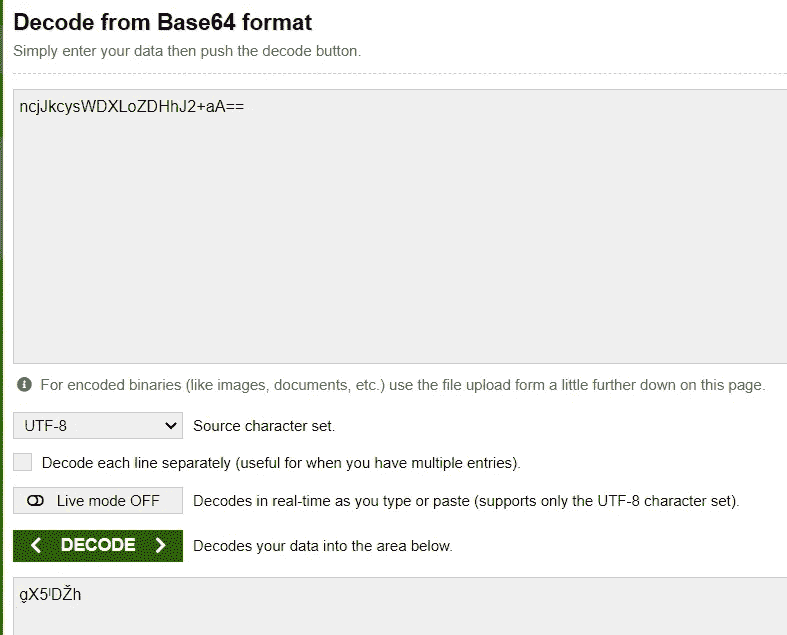
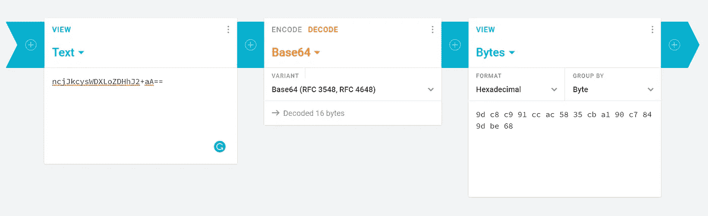
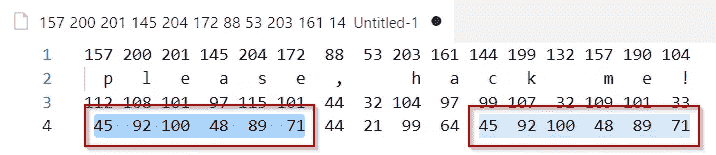
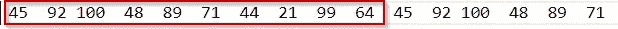

# 破解你的加密非常简单

> 原文：<https://levelup.gitconnected.com/cracking-your-encryption-is-damn-simple-e4b9ce89c142>

## 专业地加密您的数据。否则有人会偷走它。


图片由作者生成，DALL-E .归作者所有。

几天前，有人问我是否有可能解密 CSV 文件中一些加密列的内容。加密的字符串看起来有点像`doPRULpnkoqjY5bKy1DBqI+AyLJOfYU=`。

在我的处置下，我有一堆加密样本。我还有一个纯文本样本，以及相应的加密结果。那是(相当于)`please, hack me!`的东西。加密到`ncjJkcysWDXLoZDHhJ2+aA==`

我破解了。以下是方法。

# 关心你的加密！

我不是安全或密码学专家。我用非常基本的密码学概念和一点运气制作了它。

这篇文章应该提醒我们所有人，当我们的数据没有得到专业的保护时，有多少人可能会访问我们的数据。

# 什么算法？

重要的事情先来。我们需要确定使用了哪种加密算法。对于一个经验丰富的程序员来说，发现一个 [base64 编码](https://www.techopedia.com/definition/27209/base64)是非常容易的。

## Base64

对于不太老练的人来说:字符串末尾的`=`是 base64 编码字符串的典型标志。[是填充](https://www.baeldung.com/java-base64-encode-and-decode#2-java-8-base64-encoding-without-padding)，结尾可以有 0、1 或者 2 个`=` **。**

此外，即使有 0 个`=`，你也可以发现一个 base64，因为它们看起来像一个[有限字符集](https://en.wikipedia.org/wiki/Base64#Base64_table_from_RFC_4648)的随机布局。存在一些[字符集变体](https://en.wikipedia.org/wiki/Base64#Variants_summary_table)。老实说，12 年来我从未遇到过变异的样本。

然后让我们使用[base64decode.org](https://www.base64decode.org/)来解码我们的字符串。



从 base64 输入字符串解码(截图来自[base64decode.org](https://www.base64decode.org/))

结果看起来很奇怪，原因有二。

第一:**不可读**。但这并不奇怪。即使我的祖母看不懂，Base64 也是一种编码，不是加密😅。

图片来自 [Giphy](https://giphy.com/gifs/Originals-wtf-what-l0MYQ5jcwegmAtXuU)

第二也是最重要的。**比输入**短。base64 编码的结果总是大于其输入。特别是:

```
output_size=((input_size + padding) / 3) * 4
```

这表明解码的内容是二进制的，而不是文本的。

我们需要从整体上看待它。让我们试试[cryptii.com](https://cryptii.com/)，配置成以十六进制格式输出字节。



输入字符串解码从 base64 到字节(截图来自[cryptii.com](https://cryptii.com/))

在[十六进制基数](https://en.wikipedia.org/wiki/Hexadecimal)中，输出为`9d c8 c9 91 cc ac 58 35 cb a1 90 c7 84 9d be 68`。它翻译成基数为 10 的`157 200 201 145 204 172 88 53 203 161 144 199 132 157 190 104`。

我们来分析一下。第一个观察结果是**与输入**的长度相同:16 个字节。这让我们排除了一些最常见的加密算法，如 [AES](https://stackoverflow.com/questions/3283787/size-of-data-after-aes-cbc-and-aes-ecb-encryption) 或 [RSA](https://stackoverflow.com/a/25699277/636400) 。在最常见的实现中，它们的输出与输入的长度不同。

也很有可能没有[盐](https://crypto.stackexchange.com/questions/1776/what-is-a-cryptographic-salt)，除非我们假设输出也是 zipped。采用[奥卡姆剃刀](https://en.wikipedia.org/wiki/Occam%27s_razor)原理，让我们排除拉链。

上述考虑似乎为我们指明了定制加密算法的方向。

# 自定义加密算法

让我们试着利用这个理论。探索新事物的好方法是从最简单的案例开始。最幼稚的加密是[凯撒密码](https://www.dcode.fr/caesar-cipher)。

如果采用凯撒密码，那么两个相同的字符将加密成相同的数字。在我们的`ple**a**se, h**a**ck me!`中，我们可以观察到`a`字符在位置 3 和 9(基于 0)的重复。

`157 200 201 **145** 204 172 88 53 203 **161** 144 199 132 157 190 104`

看来凯撒密码不是这样的。`145`在位置 3`161`在位置 9。从这里怎么走？

它可能改变了字母的位置，也可能通过随机的方式移动了位置……也许两者都有。


作者用 [Imgflip](https://imgflip.com/memegenerator) 生成的图片

让我们想象我们所知道的，寻找建议。打开一个高级的文本编辑器(如 Notepad++或 Visual Studio Code ),绘制出我们所知道的内容。

```
157 200 201 145 204 172  88  53 203 161 144 199 132 157 190 104 p   l   e   a   s   e   ,       h   a   c   k       m   e   !112 108 101  97 115 101  44  32 104  97  99 107  32 109 101  33
```

按顺序:编码字符串字节、纯文本字符串和纯文本字符串字节。

这样做的目的是目视检查任何类型的图案。例如查看编码的字节是否遵循与纯文本相同的顺序。但还是没有运气。

# 是时候编码了！

我们必须提高一点我们分析中所考虑的复杂性。下一步是检查加密和纯文本的字节值之间的差异。

让我们写一个脚本来计算它。我将在 Deepnote 中使用 [Python 笔记本](https://deepnote.com/workspace/luca-piccinelli-37f2-d1557232-c701-4528-93e2-7d7a65936144/project/hack-the-string-e1395044-b879-430f-bca7-891f2a43f068)

然后将差异作为新的一行添加到我们的编辑器中。(我的是 VsCode)



将我们已知的信息绘制成 VsCode

使用高级文本编辑器的意义在于，当你选择一个文本时，它会突出显示同一文本的其他出现。

看起来我们找到了些东西。差异中有一个重复的方案。

我们找到了加密密钥！这是一个长度为 10 的移位表。



轮班表

“长度为 10 的移位表”意味着每 10 个字符，我们在表的相同位置添加一个值。第一个字符加上 45，第二个字符加上 92，直到第九个。然后重启:到第十个 45，到第十一个 92，等等…

# 解码算法

我们现在可以编写函数来解码所有加密的列。

按顺序:

1.  从 base64 解码
2.  将输出转换为列表
3.  从字节值中减去表中的相应值
4.  将列表转换回字符串

# 结论

“怎么会有人猜到这张随机加密表？他们甚至不知道我正在使用的算法。”

这应该是实现本文所破解的加密的人的想法。不幸的是，事实是，几乎任何人，只要有非常基本的知识和一点时间(我花了大约 4 个小时)，就可以破解你的加密。

想象一下专家能做什么。

在选择如何加密应用程序中的数据时，要格外小心。始终使用专业的加密方法，并避免自制的解决方案。

## 本可以阻止我破解钥匙的预防措施

如果不能避免使用自定义加密，至少要多加小心。不费吹灰之力，就能让我更难破解这个钥匙。示例:

*   如果移动台的长度更大。假设是 100。我不会注意到重复计划。
*   如果使用一个以上的换档表。根据单词的第一个字母来改变它是很容易的

这些预防措施不会阻止专业人士。但至少可以阻止像我这样的新手。

现在，你能猜出本文第一个例子`doPRULpnkoqjY5bKy1DBqI+AyLJOfYU=`中加密了什么吗？

请在评论中告诉我！