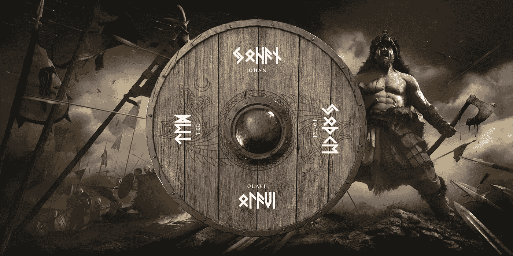
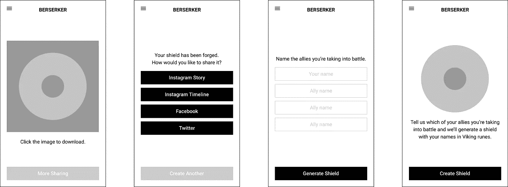
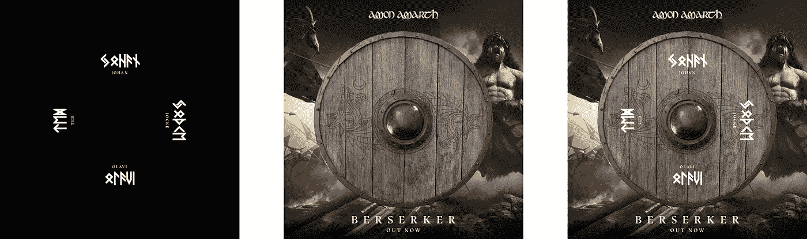
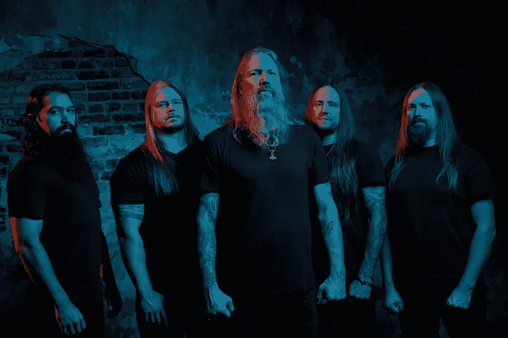

# 用 Vue 组件和帆布为维京人制作盾牌

> 原文：<https://levelup.gitconnected.com/crafting-shields-for-vikings-with-vue-components-and-canvas-20b90875b628>

## 阿蒙·阿玛思最新发布*狂战士*



“勇敢是胜利的一半”——哈拉尔德·哈德拉达传奇

我喜欢一个好的图像发生器，所以当[阿蒙·阿马斯](https://twitter.com/AmonAmarthBand)让我支持他们的最新发行版 [*狂战士*](https://amonamarth.lnk.to/berserker) 时，我很激动，他们开发了一个基于令人难以置信的艺术的发生器。🛡的解决方案是一个简单的[nuxt . js](https://medium.com/u/20f059d252cc?source=post_page-----20b90875b628--------------------------------)应用程序托管在 [Netlify](https://medium.com/u/5250f9d9bd2f?source=post_page-----20b90875b628--------------------------------) 上，它接受四个名字，并把它们渲染成圆形盾牌上的维京符文。然后，根据各大社交平台的建议尺寸，在背景上组成这个盾牌。如果像阿蒙·阿玛特一样，你在你的发布的创意方向上花了很多精力，那么让粉丝们使用可伸缩的图像生成来个性化一些视觉效果是有意义的。[今天就创建你的盾牌](https://berserker.amonamarth.com)，继续阅读，了解发电机的一些技术解决方案。



我在我最近的摩城项目案例研究中提到了这一点，但是我已经开始使用 Vue.js 组件和 HTML5 canvas 的组合来创建动态图像。我目前的基本设置看起来有点像这样。

```
<template>
  
</template><script>
export default{
  computed: {
    canvasImage() {
      let canvas = document.createElement('canvas') canvas.height = 1080
      canvas.width  = 1080 let context = canvas.getContext('2d') context.fillStyle = 'red'
      context.fillRect(0, 0, 1080, 1080) return canvas.toDataURL('image/jpeg')
    }
  }
}
</script>
```

HTML 模板是一个带有动态源的图像标签，它引用一个名为`canvasImage`的计算属性。在这个属性中，我利用一个离线画布来生成一个新的图像，比如本例中的 1080x1080 红色正方形。然后画布作为数据 URL 返回，这样它就可以被``显示。然后，我可以将这个组件包含到我的一个视图中，并像放置任何其他图像一样放置它。

盾牌本身由两层构成:名字和背景。因为名称是动态的，所以我们使用新的画布和自定义排版来动态生成这些名称。一旦布局完成，它就被放置在预先渲染的背景图像之上。这两层都有一个相似的问题，即它们都依赖于外部资产。为了使该组件在多种浏览器中正常运行，您必须首先预加载您的字体和图像。



对于图像，我添加了一个新的名为`loadImage`的 [promise](https://developers.google.com/web/fundamentals/primers/promises) 方法，该方法获取图像的 url，加载它，然后在完成时返回分辨率。

```
loadImage(url) {
  return new Promise((resolve, revoke) => {
    let img = new Image() img.crossOrigin = 'Anonymous' img.onload = () => {
      resolve(img)
    } img.src = url
  })
}
```

在画布上使用自定义字体可能非常棘手，但是 [Bram Stein](https://medium.com/u/fe478cb14d5a?source=post_page-----20b90875b628--------------------------------) 编写了优秀的[字体外观观察者](https://github.com/bramstein/fontfaceobserver)加载器来帮助识别自定义字体何时被加载。回到我们的 CSS 中，我们可能有一个类似这样的`@font-face`声明。

```
@font-face{
  font-family: 'Runes';
  src: url('/runes.woff2') format('woff2'),
       url('/runes.woff') format('woff');
  font-weight: normal;
  font-style: normal;
}
```

回到我们组件中，我们可以使用字体外观观察器来检查字体是否已经加载。

```
let font = new FontFaceObserver('Runes')font.load().then(() => {
  console.log('loaded')
})
```

正如您从这个片段中看到的，Font Face Observer 也返回了一个承诺，因此我们实际上可以将我们的图像和排版加载结合在一起，以确保在调用 canvas 之前所有资产都已准备就绪。

```
let font = new FontFaceObserver('Runes')Promise.all([
  loadImage('/background.jpg'),
  font.load()
]).then(data => {
  let background = data[0]
})
```

为了生成名称，我只使用了一些 canvas 方法来将文本准确地放置在需要放置的位置。我将参考我在图 9 中的设计来找到准确的尺寸和位置。

```
context.textAlign    = 'center'
context.textBaseline = 'middle'
context.font         = '24px Runes'
context.fillText('Lee', 540, 540)
```

在这个项目中，文本在一个单独的画布上生成，然后*将*放到另一个包含背景图像的画布上。这使得名字可以以非常精确的方式生成，然后调整大小并放在不同的背景图像上。您可以使用`drawImage`方法将预加载的背景和动态名称放到一个新的画布上。

```
context.drawImage(background, 0, 0)
context.drawImage(names, 135, 135, 810, 810)
```

您最不想做的事情就是为您的用户提供适合他们当前环境的下载说明。在移动设备上，用户不能点击下载图像，所以说明应该是:“按住下载图像。”(我使用 [mobile-detect](https://github.com/serbanghita/Mobile-Detect) 来查看用户是否来自移动设备。)在桌面上，我会用 [downloadjs](https://github.com/rndme/download) 连接一键下载，以提供最佳体验。实际上，您可以传入相同的计算方法来实现这个函数。

```
download(canvasImage)
```



阿蒙·阿玛思

感谢斯蒂芬·里德和 [5bam](http://5bam.com) 让我参与其中，也祝贺阿蒙·阿马斯发行了他们的新唱片 [*狂战士*](https://amonamarth.lnk.to/berserker) *。*今天在 [Spotify](https://open.spotify.com/album/4NxlBCBuzKXCwNVNMfRGUa) 或 [Apple Music](https://itunes.apple.com/us/album/berserker/1453761098?uo=4&&app=music&at=1l3vpUI&ct=LFV_be82cab1fffe7341a1c8113864ea3de6) 上播放。🤘🏻