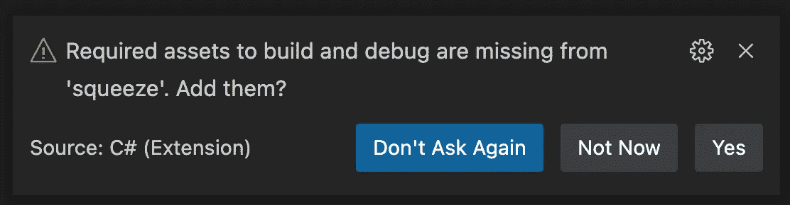
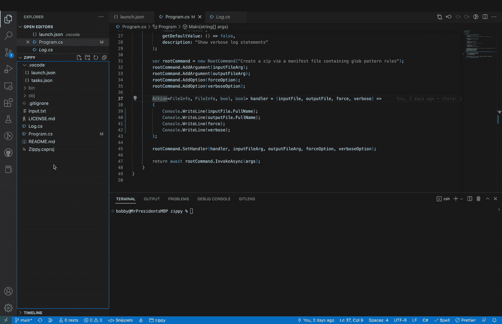

# 速成班开始了。网络工具

> 原文：<https://levelup.gitconnected.com/crash-course-in-net-tools-b2d84fd5074e>

构建可以在任何地方运行的强大开发工具


建造。净工具在您的车库中的乐趣和利润！（📷[valeriaarnaud](https://www.shutterstock.com/catalog/collections/2980330549278672466-79aa65d68370d3a1f2653d3875dee6b7a9a5dbbfa8fea0d9c4e37a22fda81108)

“我们变成我们所看到的样子。我们塑造我们的工具，然后我们的工具塑造我们。”——[*马歇尔·麦克卢汉*](https://www.brainyquote.com/quotes/marshall_mcluhan_141113?src=t_tools)

# 启动你的引擎🏎️

生产力是一个变化无常的过程，需要专注和坚持。随着技术系统的复杂性增长到难以控制的程度，开发人员最不愿意体验的地方就是工具配置。不考虑具体的工具选择，选择跨团队技术堆栈的一致性的好处包括提高开发人员的效率、自然的代码重用和共享特性所有权。

C#是一种非常流行的语言。网包生态圈是海量的。随着毛伊岛和 ASP.NET 核心的引入，有可能创建完整的堆栈。NET 系统，这些系统是跨平台的、云原生的和高度可伸缩的。如果你的团队在用 C#工作。NET 工具是一个自然的选择。

本教程概述了如何创建一个. NET 命令行工具，它可以随 NuGet 一起发布，并在 Windows、macOS 和 Linux 上运行。

# 走吧。🚦

让我们从[安装开始。网 7](https://dotnet.microsoft.com/en-us/learn/dotnet/hello-world-tutorial/install) 。一旦安装完毕。NET 中，通过在终端窗口发出`dotnet --version`命令来测试您的系统。

```
bobby@mbp ~ % dotnet

Usage: dotnet [options]
Usage: dotnet [path-to-application]

Options:
  -h|--help         Display help.
  --info            Display .NET information.
  --list-sdks       Display the installed SDKs.
  --list-runtimes   Display the installed runtimes.

path-to-application:
  The path to an application .dll file to execute.
```

使用`dotnet new`命令创建一个新的控制台项目，在我们的教程中，我们将把项目命名为`Squeeze`。

```
dotnet new console -n Squeeze && cd Squeeze
```

我们的项目将利用 [ZipCreator](https://github.com/BugSplat-Git/ZipCreator) 包。让我们使用`dotnet add`来添加这个包。

```
dotnet add package ZipCreator
```

我们也将使用[系统。测试版的命令行](https://github.com/dotnet/command-line-api)包。让我们使用`--prerelease`选项添加这个包。

```
dotnet add package System.CommandLine --prerelease
```

系统。命令行包允许你从命令行添加类型安全到你的输入。我们的示例将定义 2 个[参数](https://learn.microsoft.com/en-us/dotnet/standard/commandline/define-commands#define-arguments)、`inputFileArg`和`outputFileArg`，并将定义 2 个[选项](https://learn.microsoft.com/en-us/dotnet/standard/commandline/define-commands#define-options)、`verboseOption`，以及一个单独的[根命令](https://learn.microsoft.com/en-us/dotnet/standard/commandline/define-commands#define-a-root-command)。

```
var inputFileArg = new Argument<FileInfo>(
  name: "input",
  description: "Zip file manifest containing glob patterns of file paths to include"
);

var outputFileArg = new Argument<FileInfo>(
  name: "output",
  description: "Path to zip file output"
);

var forceOption = new Option<bool>(
  name: "--force",
  getDefaultValue: () => false,
  description: "Overwrite output file if it exists"
);

var verboseOption = new Option<bool>(
  name: "--verbose",
  getDefaultValue: () => false,
  description: "Show verbose log statements"
);

var rootCommand = new RootCommand("Create a zip via a manifest file containing glob pattern rules");
rootCommand.AddArgument(inputFileArg);
rootCommand.AddArgument(outputFileArg);
rootCommand.AddOption(forceOption);
rootCommand.AddOption(verboseOption);
```

在定义了我们的参数和选项之后，我们需要添加一个在调用`rootCommand`时被调用的处理程序。处理程序是一个[动作](https://learn.microsoft.com/en-us/dotnet/api/system.action-1?view=net-7.0)，它接受添加到根命令的参数和动作的[通用类型参数](https://learn.microsoft.com/en-us/dotnet/csharp/programming-guide/generics/generic-type-parameters)。

```
Action<FileInfo, FileInfo, bool, bool> handler = (inputFile, outputFile, force, verbose) =>
{
  // Handler code goes here
};
```

在这个例子中，我们的`inputFileArg`和`outputFileArg`参数都是 [FileInfo](https://learn.microsoft.com/en-us/dotnet/api/system.io.fileinfo?view=net-7.0) 对象，我们的`forceOption`和`verboseOption`选项都是[布尔值](https://www.w3schools.com/cs/cs_booleans.php)。我们正在给`handler`分配一个 lambda 函数。

当`handler`被调用时，`inputFile`和`outputFile`将被传递一个`FileInfo`的实例，该实例是由用户调用我们的工具时通过命令行传递的字符串值创建的。类似地，`force`和`verbose`将被设置为`true`或`false`，这取决于`--force`和/或`--verbose`标志是否存在。

为了配置我们的`handler`,我们还必须调用`rootCommand.SetHandler`,并向它传递我们希望它能够访问的所有参数。

```
rootCommand.SetHandler(handler, inputFileArg, outputFileArg, forceOption, verboseOption);
```

最后，当从命令行调用工具时，我们将通过用户传入的参数调用我们的命令。下面是一个基本完成的`Program.cs`，演示了如何解析一个字符串数组`args`。

```
using System.CommandLine;
using ZipCreator;

public class Program
{
    [STAThread]
    static public async Task<int> Main(string[] args)
    {
        var inputFileArg = new Argument<FileInfo>(
            name: "input",
            description: "Zip file manifest containing glob patterns of file paths to include"
        );

        var outputFileArg = new Argument<FileInfo>(
            name: "output",
            description: "Path to zip file output"
        );

        var forceOption = new Option<bool>(
            name: "--force",
            getDefaultValue: () => false,
            description: "Overwrite output file if it exists"
        );

        var verboseOption = new Option<bool>(
            name: "--verbose",
            getDefaultValue: () => false,
            description: "Show verbose log statements"
        );

        var rootCommand = new RootCommand("Create a zip via a manifest file containing glob pattern rules");
        rootCommand.AddArgument(inputFileArg);
        rootCommand.AddArgument(outputFileArg);
        rootCommand.AddOption(forceOption);
        rootCommand.AddOption(verboseOption);

        Action<FileInfo, FileInfo, bool, bool> handler = (inputFile, outputFile, force, verbose) =>
        {
            Console.WriteLine(inputFile.FullName);
            Console.WriteLine(inputFile.FullName);
            Console.WriteLine(force.ToString());
            Console.WriteLine(verbose.ToString());
        };

        rootCommand.SetHandler(handler, inputFileArg, outputFileArg, forceOption, verboseOption);

        return await rootCommand.InvokeAsync(args);
    }
}
```

处理程序代码的完整代码片段可在[配套报告](https://github.com/bobbyg603/zippy/blob/main/Program.cs)中获得。

# 进站🔧

现在我们已经写好了工具，让我们用 [VS 代码](https://code.visualstudio.com/)来运行它，以确保它能够工作。当你打开包含`Squeeze.csproj`的文件夹时，你应该会看到下面的提示。



VS 代码 C#所需的资产

点击 Yes 按钮，将`launch.json`和`tasks.json`添加到 repo 根目录下的`.vscode`文件夹中。如果该提示没有出现，您可以从[配套回购](https://github.com/bobbyg603/zippy/tree/main/.vscode)中复制文件。

修改`launch.json`以便它在运行时将参数传递给我们的程序。

```
"args": [
    "input.txt",
    "output.zip",
    "--verbose"
]
```

在您的`handler`函数中设置一个断点并启动调试器。



VS 代码调试器断点

有用！让我们发布工具，以 NuGet 和 finish strong。

# 最后一圈🏳️

在发布到 NuGet 之前，我们需要创建一个帐户，并通过登录并导航到下面的链接来生成 API 密钥。

 [## 获取图库| API 密钥

www.nuget.org](https://www.nuget.org/account/apikeys) 

我们需要指示`nuget`命令将我们的项目打包成一个工具。将以下字段添加到`<PropertyGroup>`部分下的`Squeeze.csproj`。

```
<PackAsTool>true</PackAsTool>
<ToolCommandName>squeeze</ToolCommandName>
```

使用`dotnet`将项目打包成一个`.nupkg`文件。

```
dotnet pack --configuration Release
```

运行下面的命令来推送到 NuGet！确保用您刚刚创建的 API 键替换`<Your NuGet API key>`。

```
dotnet nuget push ./bin/Release/Squeeze.1.0.0.nupkg --source https://api.nuget.org/v3/index.json --api-key <Your NuGet API key>
```

软件包被索引后，可以通过`dotnet tool install`进行安装。

```
dotnet tool install --global Squeeze
```

该工具将被添加到您的路径中，并且可以通过在终端中键入`squeeze`来调用。在 Windows 上，您可能需要关闭并重新打开终端窗口来重置您的 [PATH](https://www.maketecheasier.com/what-is-the-windows-path/) 变量。

```
bobby@mbp % squeeze -h

Description:
  Create a zip via a manifest file containing glob pattern rules

Usage:
  Squeeze <input> <output> [options]

Arguments:
  <input>   Zip file manifest containing glob patterns of file paths to include
  <output>  Path to zip file output

Options:
  --force         Overwrite output file if it exists [default: False]
  --verbose       Show verbose log statements [default: False]
  --version       Show version information
  -?, -h, --help  Show help and usage information
```

# 胜利圈🏁

您已经成功地向 NuGet 发布了一个. NET 工具——干得好！

如果你对额外积分感兴趣，试着创建一个自动增加版本的 [Azure CI/CD 管道](https://cloudblogs.microsoft.com/industry-blog/en-gb/technetuk/2019/06/18/perfecting-continuous-delivery-of-nuget-packages-for-azure-artifacts/)，并发布你的包。

感谢阅读！

```
**Want to Connect?**

If you found the information in this tutorial useful please subscribe on [Medium](http://bobbyg603.medium.com/), follow me on [Twitter](https://twitter.com/bobbyg603), and/or subscribe to my [YouTube](https://www.youtube.com/c/bobbyg603) channel.
```