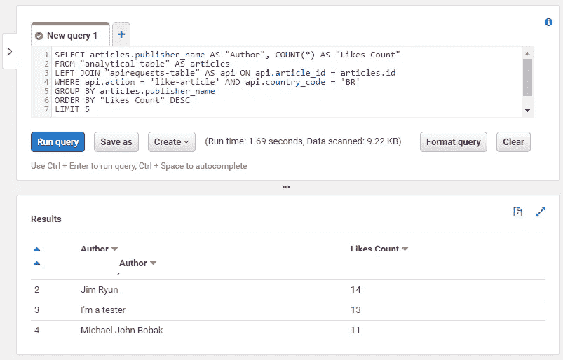

# AWS CDK 速成班和无服务器 REST API 和数据湖分析查询

> 原文：<https://levelup.gitconnected.com/crash-course-on-aws-cdk-and-serverless-with-rest-api-and-data-lake-analytical-querying-37500b6625c0>


原文在此:[https://dash bird . io/blog/crash-course-AWS-CDK-server less-rest-API-data-lake-analytical-query/](https://dashbird.io/blog/crash-course-aws-cdk-serverless-rest-api-data-lake-analytical-querying/)

这是一门关于如何使用 [AWS CDK](https://aws.amazon.com/cdk/) 部署完全无服务器的 web 应用的实践课程。您将学习如何:

*   构建**CDK 堆栈* *以部署端到端的应用
*   部署一个与 **AWS Lambda** 集成的 **REST API** ,用于动态请求处理
*   使用 **DynamoDB** 以快速且经济的方式存储数据
*   在事件驱动架构中使用 **DynamoDB 流**作为**λ**的源
*   使用 **Kinesis Firehose** 摄取和处理大量数据流
*   用**雅典娜**、 **S3** 和**胶水**部署并查询一个**数据湖**
*   **使用 [Dashbird](https://dashbird.io/?utm_source=dashbird-blog&utm_medium=article&utm_campaign=aws-cdk&utm_content=tutorial-serverless-website) 在一个地方监控**您的整个应用程序的健康状况

您可以使用这个演示应用程序中声明的资源作为起点，在以后混合和适应您自己的体系结构，这将节省您相当多的时间。

# 应用和架构

演示应用是一个公共博客，任何人都可以阅读、发布和喜欢帖子。此链接上有[可用。继续在左上角(黄色按钮)发表一些东西，并“喜欢”已经发表的文章。查看本报告](https://d1qmte5oc6ndq5.cloudfront.net/)中[的代码库。](https://github.com/byrro/serverless-website-demo)

# 前端


# 后端


# 数据湖和分析查询


# 什么是自动气象站 CDK

CDK 代表云开发工具包。用你喜欢的语言(Python、Typescript、C#等)把它想象成 CloudFormation (CF)。大致说来，它是这样工作的:

1.  您使用 CDK 库提供的类来声明云资源。示例:

```
from aws_cdk import aws_s3
my_bucket = aws_s3.Bucket(self, 'MyBucket')
```

1.  运行`cdk deploy`
2.  CDK 将它转化为云形成模板，并为你部署在 AWS 上

如果你想更深入地了解，AWS 也有一个研讨会,可以让你从基础开始。我也强烈推荐阅读 CDK 官方文档。

# 使用自动气象站 CDK 的优势

1.  例如，使用比 YAML 或 JSON 更有表现力的语言
2.  少——少得多！—比云信息模板详细
3.  更容易将可重用性和继承原则应用于基础设施代码
4.  更好地与 ide 集成，实现代码完成、智能感知等
5.  可以测试你的基础代码，就像其他软件一样
6.  可移植性:因为它只是 CF 的包装器，我们可以很容易地将其移植到 JSON 或 YAML

# 使用自动气象站 CDK 的缺点

尽管 AWS 团队发布了一个稳定的项目，但许多部分(许多好的部分)仍然是实验性的，API 可能会以向后不兼容的方式改变。

它正在不断发展。在准备这门课程的过程中，我不得不三次升级我的库。

某些部分仍然缺少文档，你需要偶尔看看 CDK 代码，以理解如何声明某些东西。

# 自己部署

虽然我们提供了在线演示，但您也可以在自己的 AWS 帐户中部署此应用程序:

1.  克隆回购:`git clone git@github.com:byrro/serverless-website-demo.git sls-demo; cd sls-demo`
2.  设置您的虚拟环境:`virtualenv -p /urs/bin/python3.8 .env; source .env/bin/activate; pip install -r requirements`
3.  指定 AWS 帐户 ID: `export AWS_ACCOUNT_ID=1234567890` **
4.  部署所有三个堆栈:`cdk deploy sls-blog; cdk deploy sls-blog-api; cdk deploy sls-blog-analytical`

**您还可以在 CDK 项目中硬编码您的帐户 ID，我马上会展示这一点；

当从头开始一个新项目时，你会运行`cdk init --language [python|typescript|...]`。对于本演示，这不是必需的，因为项目已经创建。

# 监视

在云中部署这种架构并盲目相信它会完美地工作是不合理的。我们想成为第一个知道什么时候不对劲并尽快采取行动的人。

在这个项目中，我使用了 [Dashbird](https://dashbird.io/?utm_source=dashbird-blog&utm_medium=article&utm_campaign=aws-cdk&utm_content=tutorial-serverless-website) ，因为它易于使用和无缝集成。Dashbird 不需要在我的代码中部署代理，而是通过一个 CloudFormation 模板插入到我的堆栈[中，我只需点击一下鼠标就可以完成部署。它不仅监视 Lambda 函数错误，还监视我们正在使用的其他资源，比如 DynamoDB 表。他们甚至建议](https://dashbird.io/docs/quickstart/setting-up-dashbird/?utm_source=dashbird-blog&utm_medium=article&utm_campaign=aws-cdk&utm_content=tutorial-serverless-website)[架构改进的见解](https://dashbird.io/features/insights-engine/?utm_source=dashbird-blog&utm_medium=article&utm_campaign=aws-cdk&utm_content=tutorial-serverless-website)与行业最佳实践相互参照。

最后，Dashbird 提供了一个永远免费的计划。通过[免费注册](https://dashbird.io/register/?utm_source=dashbird-blog&utm_medium=article&utm_campaign=aws-cdk&utm_content=tutorial-serverless-website)来尝试它是显而易见的。

# CDK 项目是如何构建的

一个 CDK 项目创建了一个“应用程序”。此应用程序可能有一个或多个“堆栈”。栈是一组使用 CDK 类实例化的云资源(Lambda 函数、S3 桶等)。在一个 CDK 项目中也可以有多个应用程序。

# 应用程序对象

创建 CDK 应用程序非常简单:

```
app = core.App()
```

> 当您运行`cdk init --language [language]`时，在`app.py`下的项目根目录中会为您创建一个带有基本样板代码的初始应用程序。

接下来我们需要一个环境，它由一个 AWS 帐户 ID 和区域组成:

```
env = env = core.Environment(
    account=1234567890,
    region='us-east-1',
)
```

声明一个环境并不是必需的(CDK 可以从您的 AWS 凭证中推断出来)，但这是一个很好的实践。我们大多数人都使用多个 AWS 帐户。搞几个项目、账户、凭证很容易。当我们在 CDK 应用程序中明确设置环境时，它会被锁定，以防止错误的部署。

现在我们声明我们的堆栈:

```
from my_project.my_project_stack import MyStackmy_stack = MyStack(
    app,
    'my-stack',
    env=env,
)
```

这就是我们如何*为部署实例化*我们的堆栈。在下一节中，我们将看到如何*声明*那些堆栈。

# 堆栈对象

堆栈对象是我们声明 AWS 资源的地方。它继承自`core.Stack` CDK 类，并接受一个作用域——也就是我们的`app`对象——一个字符串标识符和一个环境。

```
class MyStack(core.Stack):
    def __init__(
            self,
            scope: core.Construct,
            id: str,
            env: core.Environment,
            **kwargs,
            ) -> None:
        super().__init__(scope, id, **kwargs) # Declare AWS resources here
```

# 声明 AWS 资源

为了声明 AWS 资源，我们需要为每个服务提供一个特定的库。这里列出了所有的 [Python 库](https://docs.aws.amazon.com/cdk/api/latest/python/index.html)和它们的 [Typescript](https://docs.aws.amazon.com/cdk/api/latest/typescript/api/index.html) 副本。其他口味还有 [Java](https://docs.aws.amazon.com/cdk/api/latest/java/index.html) 和[。网](https://docs.aws.amazon.com/cdk/api/latest/dotnet/api/index.html)。

让我们看看如何声明一个基本的 REST API(为了可读性，去掉了类型表达式):

```
from aws_cdk import aws_apigateway, aws_lambdaclass MyStack(core.Stack):
    def __init__(self, scope, id, env):
        super().__init__(scope, id, **kwargs) my_lambda = aws_lambda.Function(
            self,
            'MyLambda',
            runtime=aws_lambda.Runtime.PYTHON_3_8,
            code=aws_lambda.Code.asset('my_lambda_folder),
            handler='my_lambda.handler',
        ) aws_apigateway.LambdaRestApi(
            self,
            'sls-blog-rest-api-gateway',
            handler=my_lambda,
        )
```

我们首先声明一个 Lambda 函数`my_lambda`。我们将其代码指向`my_lambda_folder`。在这个文件夹中，应该有一个`my_lambda.py`文件，包含一个名为`handler`的函数。这个处理函数应该正常接受 Lambda 调用(一个`event`和`context`对象)。

接下来声明一个`LambdaRestApi`，使用`my_lambda`作为处理器(不要与 Lambda 的处理器函数混淆)。这将使用`[AWS_PROXY](https://docs.aws.amazon.com/apigateway/latest/developerguide/api-gateway-api-integration-types.html)` [集成类型](https://docs.aws.amazon.com/apigateway/latest/developerguide/api-gateway-api-integration-types.html)创建一个与`my_lambda`集成的新 API Gateway REST API。所有 HTTP 请求都将被路由到 Lambda 函数。

# 我们的项目应用和堆栈

这个项目由一个应用程序和三个堆栈组成。它们都在`[app.py](https://github.com/byrro/serverless-website-demo/blob/master/app.py)`和`[sls_website_stack.py](https://github.com/byrro/serverless-website-demo/blob/master/sls_website/sls_website_stack.py)`文件中声明。

下面我们将简要介绍所有筹码。我鼓励你检查一下[栈文件](https://github.com/byrro/serverless-website-demo/blob/master/sls_website/sls_website_stack.py)，以了解这些资源是如何声明和集成的。例如:在一个堆栈中创建一个 Kinesis Firehose，并在另一个堆栈中引用它，以将其名称作为 Lambda 函数的环境变量，与它进行交互。

除了前端静态堆栈——它很小——您会注意到资源在开始时用一个`None` (null)值初始化。原因是，尽管 CDK 通常比云形成更简洁，但它仍然可能很长，足以扰乱整个堆栈的视图。在一行中首先声明每个资源，我可以提供堆栈中所有内容的简短摘要，然后在其他方法中实例化 CDK 类。

```
class SlsBlogApiStack(core.Stack):
    def __init__(self, scope, id, env, static_stack):
        super().__init__(scope, id, **kwargs) self.static_stack = static_stack # SQS Queues
        self.queue_ddb_streams_dlq = None  # Dead-letter-queue for DDB streams # DynamoDB Tables
        self.ddb_table_blog = None  # Single-table for all blog content # DynamoDB Event Sources
        self.ddb_source_blog = None  # Blog table streams source # DynamoDB Indexes
        self.ddb_gsi_latest = None  # GSI ordering articles by timestamp # Lambda Functions
        self.lambda_blog = None  # Serves requests to the blog public API
        self.lambda_stream_reader = None  # Processes DynamoDB streams # Continues with other resources...
```

注意，它将另一个 Stack 对象(`static_stack`)作为其初始化的参数。在`[app.py](https://github.com/byrro/serverless-website-demo/blob/master/app.py)`文件中，您可以看到`SlsBlogApiStack`是通过将`SlsBlogStack`作为参数进行初始化的。

我们用它来引用 Lambda 环境变量中的 CloudFront 分布域([d1qmte5oc6ndq5.cloudfront.net](https://d1qmte5oc6ndq5.cloudfront.net/))。该变量可用于定制 HTTP 响应头`Access-Control-Allow-Origin`以符合 [CORS 标准](https://docs.aws.amazon.com/apigateway/latest/developerguide/how-to-cors.html)。这说明了一种在 CDK 项目中将信息从一个堆栈轻松集成和引用到另一个堆栈的方法。

在初始化结束时，调用另一个方法来实例化每个资源的 CDK 类并配置它们的参数。

```
self.create_cdk_resources()
```

接下来，我们将遍历项目的每个堆栈。

# 堆栈 1:静态网站

我们关注的是无服务器的后端，所以这里的前端非常粗糙和简单。它存储在 S3 桶中，并通过 CloudFront CDN 分发。

CDK 有一个叫做 BucketDeployment 的有用的类。它获取目录的内容并同步到 S3 存储桶。在这种情况下，我们将前端代码存储在`website_static`文件夹中。

```
aws_s3_deployment.BucketDeployment(
    self,
    'SlsBlogStaticS3Deployment',
    sources=[aws_s3_deployment.Source.asset('website_static')],
    destination_bucket=static_bucket,
    distribution=cdn,
)
```

# 堆栈 2:API/后端

我们的后端由一个 API 网关(REST)组成，连接到一个[单片 Lambda 函数](https://dashbird.io/knowledge-base/well-architected/monolith-vs-microservices/?utm_source=dashbird-blog&utm_medium=article&utm_campaign=aws-cdk&utm_content=tutorial-serverless-website)。微服务受到了很多压力，但是你可能不应该总是把你的应用程序分成几个功能。一整块就可以了——[，有时还推荐](https://www.martinfowler.com/bliki/MonolithFirst.html)——真的。

这个 API & Lambda 支持带有 query string“action”单个端点(带有 GET 和 POST 方法),它有三个参数:

*   `get-latest-articles`:填充最新的博客文章
*   `like-article`:当有人喜欢一篇文章时触发
*   `publish-article`:发表一篇新的博客文章

这就是 CDK 模式的力量。我们可以用 10 行代码创建一个 REST API:

```
rest_api_blog = aws_apigateway.LambdaRestApi(
    self,
    'sls-blog-rest-api-gateway',
    handler=lambda_blog,  # Previously declared Lambda function
    deploy_options=aws_apigateway.StageOptions(
        stage_name='api',
        throttling_rate_limit=lambda_param_max_concurrency,
        logging_level=aws_apigateway.MethodLoggingLevel('INFO'),
    ),
)
```

一个很好的小事情是 Lambda 内存被用作最新文章的缓存。我们在 Lambda 处理函数之外加载缓存容器。即使在调用结束后，它仍保留在内存中，可供后续请求使用。在这里了解更多关于[如何使用 Lambda 作为缓存机制](https://dashbird.io/blog/leveraging-lambda-cache-for-serverless-cost-efficiency/?utm_source=dashbird-blog&utm_medium=article&utm_campaign=aws-cdk&utm_content=tutorial-serverless-website)。

```
MAX_CACHE_AGE: int = 120  # In seconds
CACHE_LATEST_ARTICLES: Dict[str, Union[int, list]] = {
    'last_update': time.time(),
    'articles': [],
}
```

使用[单表设计](https://www.alexdebrie.com/posts/dynamodb-single-table/)，以[按需模式](https://aws.amazon.com/blogs/aws/amazon-dynamodb-on-demand-no-capacity-planning-and-pay-per-request-pricing/)将所有数据存储在 DynamoDB (DDB)中。该网站通过设置一个`time-to-live`属性，只显示几天后被 DDB 自动删除的最新博客文章和条目。

```
ddb_attr_time_to_live = 'time-to-live'
ddb_param_max_parallel_streams = 5ddb_table_blog = aws_dynamodb.Table(
    self,
    'sls-blog-dynamo-table',
    partition_key=aws_dynamodb.Attribute(
        name='id',
        type=aws_dynamodb.AttributeType.STRING,
    ),
    billing_mode=aws_dynamodb.BillingMode.PAY_PER_REQUEST,
    point_in_time_recovery=True,
    removal_policy=core.RemovalPolicy.DESTROY,
    time_to_live_attribute=self.ddb_attr_time_to_live,
    stream=aws_dynamodb.StreamViewType.NEW_AND_OLD_IMAGES,
)
```

DDB 表格还有一个 [GSI(全球二级索引)](https://docs.aws.amazon.com/amazondynamodb/latest/developerguide/GSI.html)，可以更容易地检索网站上按日期排序的文章:

```
self.ddb_table_blog.add_global_secondary_index(
    index_name='latest-blogs',
    partition_key=aws_dynamodb.Attribute(
        name='item-type',
        type=aws_dynamodb.AttributeType.STRING,
    ),
    sort_key=aws_dynamodb.Attribute(
        name='publish-timestamp',
        type=aws_dynamodb.AttributeType.NUMBER,
    ),
    projection_type=aws_dynamodb.ProjectionType.ALL,
)
```

对 DDB 项目的修改生成由第二λ函数处理的流。这些流然后被重新打包，并被发送到一个 Kinesis 消防水带流处理器。

DDB 不提供 SQL 数据库所提供的灵活性，例如，许多人选择了 [Aurora 无服务器](https://aws.amazon.com/rds/aurora/serverless/)。虽然极光是一个伟大的服务，就个人而言，我更喜欢 DDB 的简单和可靠的，一致的性能。但是有时我们确实需要运行分析查询，那些带有聚合和即时过滤器的查询。为此，我们将使用 Athena(在下一个堆栈中会有更多)。

# 堆栈 3:分析查询

Kinesis Firehose 流负责批处理在 DDB 插入/修改的数据，将它们转换为 Apache Parquet 格式并存储在专用的 S3 桶中。在 S3，我们用 AWS Glue(用于声明我们的数据模式)和 Athena(用于查询数据)创建了一个数据湖。

雅典娜极其强大。我们可以[使用 SQL SELECT](https://docs.aws.amazon.com/athena/latest/ug/select.html) 语句([带有一些限制](https://docs.aws.amazon.com/athena/latest/ug/other-notable-limitations.html))来查询万亿字节的数据并按需付费(每扫描一 GB 数据 0.005 美元)。使用 Parquet 不仅可以提高查询速度，还可以通过最小化 Athena 为每个查询扫描的数据量来降低成本。

在 DynamoDB 中不可能或昂贵/缓慢的查询，如聚合和连接，在 Athena 中是快速和廉价的。这两种服务以一种完美的方式相互结合，因此您的应用程序具有优化的事务存储和灵活的分析查询功能。

我们可以使用 Athena 查询所有已发表的文章，并与 likes 和 HTTP 元数据(源 IP 地址、国家、设备类型等)进行交叉引用。即使文章已经在 DynamoDB TTL(生存时间)到期，也可以在数据湖中继续使用。

比如哪些国家最喜欢的文章？在 AWS 控制台中，我们会看到类似这样的内容:


也可以使用 [Athena API](https://docs.aws.amazon.com/athena/latest/APIReference/API_StartQueryExecution.html) 或[AWS SDK](https://aws.amazon.com/getting-started/tools-sdks/)(例如 [Python 的 boto3](https://boto3.amazonaws.com/v1/documentation/api/latest/reference/services/athena.html#Athena.Client.start_query_execution) )以编程方式执行查询，以便将这些数据集成到我们需要的任何地方。

Athena 也支持连接。下面是一个结合文章和 HTTP 元数据来分析特定国家读者中最受欢迎的作者的示例:



# 部署

CDK 可以一次部署一个堆栈。因为我们有三个，所以有必要在运行`cdk deploy`命令时指定哪一个。我们通过将堆栈 ID 作为 CLI 参数传入来实现这一点。例如，以下命令将部署 SlsBlogApiStack (id: `sls-blog-api`):

```
cdk deploy sls-blog-api
```

由于所有的栈都涉及某种类型的许可授予，CDK 在部署这些资源之前要求确认。你可以查看请求的权限，并在合适的时候点击`y`。


# 包扎

我们已经介绍了如何构建 CDK 应用程序，以及如何通过一个简单的`cdk deploy`命令添加大量 AWS 资源进行部署。如果你是 CDK 的新手——正如本文前面所建议的——强烈建议遵循 AWS [CDK 研讨会](https://cdkworkshop.com/)和[文档](https://docs.aws.amazon.com/cdk/latest/guide/home.html)。

[也请关注未来的出版物](https://sls.dashbird.io/newsletter-sign-up?utm_source=dashbird-blog&utm_medium=article&utm_campaign=aws-cdk&utm_content=tutorial-serverless-website)，因为 [Dashbird](https://dashbird.io/?utm_source=dashbird-blog&utm_medium=article&utm_campaign=aws-cdk&utm_content=tutorial-serverless-website) 正在发布其他示例和教程，以利用 CDK 或其他的基础自动化功能来充分利用 AWS 无服务器服务。