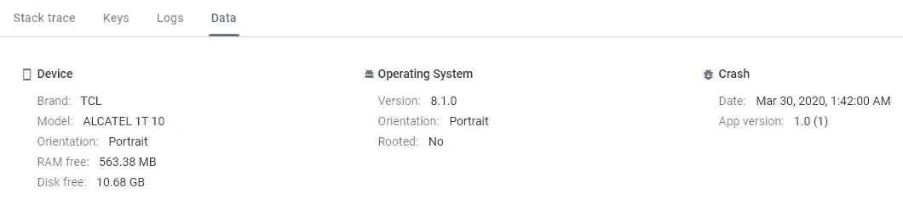

# Crashlytics:通过监控异常减少调试时间

> 原文：<https://levelup.gitconnected.com/crashlytics-reduce-debugging-time-by-monitoring-exceptions-2b5df6754072>

Crashlytics 是一个流行的崩溃报告工具，最初由 **Fabric** 开发，允许您远程和本地监控您的软件，并在出现问题时生成详细的报告。使用这样的工具可以显著减少调试时间，因为当崩溃发生时，您会立即得到通知，并得到定制的报告。

谷歌于 2017 年从 Twitter 收购了 Fabric，最近决定将其关闭。幸运的是，所有 Crashlytics 功能都将合并到 Firebase 中，从 2020 年 5 月 4 日**起(由于冠状病毒而延期)，** Fabric Crashlytics 将不再提供。因此，如果你已经在使用它，现在是一个过渡到 Firebase Crashlytics(目前处于测试阶段)的好时机。

您需要做的就是获取依赖项并创建一个 Firebase 项目。

# 解决依赖关系

将以下内容插入到您的`app/build.gradle`文件中:

将以下类路径添加到项目级 build.gradle 文件中:

# 建立新的 Firebase 项目

1-)转到`https://console.firebase.google.com`，点击`Add Project`。

2-)给你的项目起个名字，然后继续。

3-)启用谷歌分析。

4-)你需要选择一个谷歌分析帐户。如果您已经有一个，您将能够选择它。如果没有，你可以这样创建一个新的账户:简单地给一个新的账户名，选择一个地点并同意条款。

5-)创建您的项目可能需要几秒钟时间。创建完成后，点击`Continue`。

6-)您将被重定向到新的 Firebase 项目。点击你想用的平台，我会选择安卓。

7-)输入你的安卓应用的包名，点击`Continue`

7-)下载名为`google-services.json`的项目证书文件，并将其添加到项目的 app 文件夹中。

8-)只需在`Add Firebase SDK`步骤中点击`Continue`，因为我们已经完成了。一旦您构建并安装了包含凭证的应用程序，您将看到在最后一步连接成功:

# 使用 Firebase Crashlytics API

用法非常简单。Firebase Crashlytics 将崩溃信息保存为会话。会话是最终导致异常的所有事件的集合。您可以使用各种方法自定义会话，以便在其中保存附加信息。默认情况下，API 被配置为自动发送崩溃报告。通过将`setCrashlyticsCollectionEnabled()`设置为假，可以禁用崩溃报告的自动发送。如果禁用此选项，日志将保存在本地，不会发送到云中。如果您想使用`sendUnsentReports()`方法，您可以手动发送它们。

下面是它如何工作的一个例子:

*   `log()`方法用于向会话追加额外的日志。需要注意的是，日志不会直接发送到服务器。如果崩溃真的发生了，它们会被存储起来并随崩溃一起发送。
*   `setCustomKey()`方法可能用于存储您的变量状态或其他用户配置。这是一个与崩溃报告一起发送的键/值映射。
*   `recordException()`用于报告非致命事故。你可以用这个发送你处理过的异常。

你所有的崩溃报告都可以在 Firebase 控制台的 **Crashlytics** 标签下找到。除了您定制的崩溃报告，您还可以找到设备信息，如 Android 版本、内存使用情况、品牌/型号等。如果您想要区分特定的用户，您可以使用 FirebaseCrashlytics 中的`setUserId()`方法来配置 userId。

列出了所有致命和非致命事故。您可以看到特定的崩溃发生了多少次，以及有多少不同的用户遇到了它。

致命异常报告

非致命异常报告

设备信息也会随崩溃一起报告。

## 参考资料:

 [## 使用 Firebase Crashlytics SDK 开始使用 Firebase Crashlytics

### iOS 版 Firebase Crashlytics SDK 是测试版。这意味着功能可能会反向改变…

firebase.google.com](https://firebase.google.com/docs/crashlytics/get-started-new-sdk?platform=android)  [## 面向团队的 Fabric - App 开发平台

### 最好的织物现已上市。我们将最好的面料整合到 Firebase 中，为您带来一个强大的…

get.fabric.io](https://get.fabric.io/)  [## 碰撞分析

### 编辑描述

en.wikipedia.org](https://en.wikipedia.org/wiki/Crashlytics)