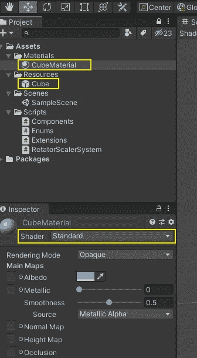
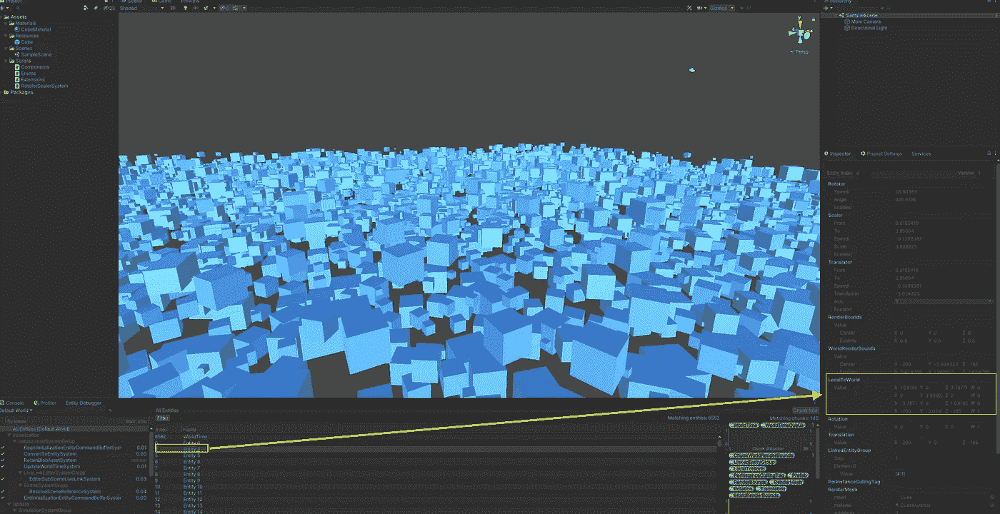
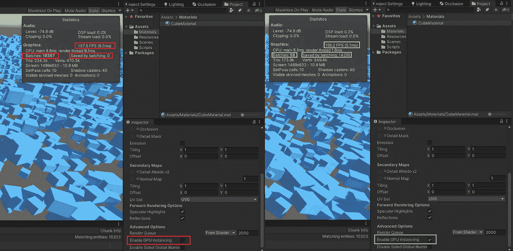

# 更疯狂的立方体:一个使用 Unity DOTS 的简单的、性能优化的场景。

> 原文：<https://levelup.gitconnected.com/crazier-cubes-a-simple-performance-optimized-scene-using-unity-dots-abdcf6e7c5a3>

如何轻松创建具有数千个立方体的场景，同时不断修改它们的位置、旋转和缩放属性，并保持高水平的性能。

雷纳托·拉莫斯·普马在 [Unsplash](https://unsplash.com/photos/hBaPqlwNarc) 拍摄的照片

# 介绍

之前，我们展示了 Unity ECS 实施的基本技术方面，以及它可以为我们的项目带来的性能改进。现在，我们将为每个立方体创建更复杂的运动模式，更深入地挖掘编码细节，应用简单的性能优化技术并展示其结果。

# 规范

本文使用的硬件是 2016 年的笔记本电脑，16 GB RAM，英伟达 GTX 960M 显卡，四核 2.6 GHz 处理器；Unity 编辑器版本为 2019.4.23f1。

# 我们的目标

在这个项目中，复杂性应该尽可能低，无论是代码大小还是游戏对象层次结构。只有一个主摄像头的空场景就可以了。我们也不需要任何“产卵者”游戏对象，因为所有的实体都将从系统内部动态产生。几千个随机大小的立方体将被注入到场景中，系统将同时随机激活每个立方体的平移、旋转和缩放属性。

# 组件

我们需要一组分量来表示三个基本运动矢量；平移、旋转和缩放。这些组件中的每一个都支持在下一次作业迭代中保持自己的状态。定标器和转换器组件也支持主值的允许范围的边界。使用 GenerateAuthoringComponent 属性，不需要提供单独的 IConvertGameObjectToEntity 实现；Unity 会自动为每个实体生成适当的组件数据。

代码片段 1: TRS 组件实现

# 立方体预制件和材料

我们还需要一个标准的预制品和一个简单的材质，这样我们就可以批量生成立方体实体，并在渲染过程中获得更大的性能增益。这里没有惊喜；该材质只是一个单色不透明选择，在标准着色器下运行。

图 1:立方体预制和材料配置

# 动画核心

与典型的游戏对象相反，Unity ECS 中的实体默认不包含转换组件；相反，它们可以附加一个 LocalToWorld 组件(参见参考文献[4]和[5])。LocalToWorld 组件(float4x4 类型的 4x4 矩阵)的值用于计算其所属实体的精确定位、旋转和缩放，以便可以在我们的场景中直观地呈现该实体。

图 2:场景中渲染的选定实体的 LocalToWorld 组件

在场景中生成立方体后，我们的目标是随机并不断地修改每个立方体的 LocalToWorld。重视我们预定工作中的数据，以创造高性能的“更疯狂的立方体”效果。

# 系统和工作

我们的系统实现是直接从 Unity.Entities.SystemBase 中派生出来的。LocalToWorld(内部)、缩放器、旋转器和转换器。这意味着我们可以在访问它们之前轻松地过滤掉它们。在 OnCreate()方法中构造一个标准的 EntityQuery 并应用到我们的作业中就足够了。

同样，在相同的方法中，我们通过根据预设的名称解析/Resources 项目文件夹的内容来解析立方体预设。这样，我们甚至不需要为预置本身添加一个明确的编辑器引用。细节可以在图片 1 和片段 2 中看到。

代码片段 2:动态解析立方体预置并从中衍生实体。

同样需要注意的是，为了让效果正常工作，我们将同时修改每个渲染立方体实例的平移、旋转和缩放(TRS)值。在每次调用 IJobChunk 时。Execute()方法实现，我们分别计算新的平移、旋转和缩放值，使用它们来获得新的 TRS 变换矩阵，然后将该矩阵赋给 LocalToWorld 组件的 Value 成员。然后，新的 TRS 值存储在组件实例中，以便在下一次 IJobChunk 迭代中使用。

代码片段 3:用于创建“更疯狂的立方体”效果的工作的核心功能。

与前一篇文章(见参考文献[1])相比，在编辑器中没有发生混淆的“拖放”操作来将立方体预设连接到 IConvertGameObjectToEntity 类，没有“spawner”空游戏对象被添加到场景中，并且只有两个代码文件被用于实现 ECS 模式；一个用于组件，一个用于系统。这使得整个项目设置更简单，也更容易记忆。

[的完整源代码](https://github.com/mkoutroumpas/UEduFour)可以在参考文献【2】中找到。

# 简单优化

事实上，我们在上一步中创建的自定义材质将用于所有衍生的实体，这有助于在游戏过程中显著提高性能。仅在材质上启用 GPU 实例化，就足以批量处理数千个绘制调用，并且对于 1480 x 680 像素的视口大小，指定笔记本电脑上的帧速率几乎翻倍。

图 3:通过在自定义材质上启用 GPU 实例化来提高渲染性能

视频 1:游戏过程中主摄像头拍摄的演示场景

# 结论

Unity 的 DOTS 是一个强大的工具，当我们的场景包含数千个同时渲染的相似实体时，它会变得非常有用。尽管如此，它并不复杂或难以学习，所以这个演示项目旨在为更大规模和更复杂的 Unity DOTS 实现提供一个快速简单的“手册”。

# 参考

1.  【Unity ECS 的简单入门指南
2.  [项目源代码](https://github.com/mkoutroumpas/UEduFour)
3.  [Unity 实体 v. 0.11.2 规范](https://docs.unity3d.com/Packages/com.unity.entities@0.11/manual/index.html)
4.  [Unity Entities v. 0.11.2 转换系统规范](https://docs.unity3d.com/Packages/com.unity.entities@0.11/manual/transform_system.html)
5.  [揭开 Unity ECS 中转换的神秘面纱](https://youtu.be/NGLVVI2HAo4)
6.  [Unity GPU 实例化手册](https://docs.unity3d.com/2019.4/Documentation/Manual/GPUInstancing.html)