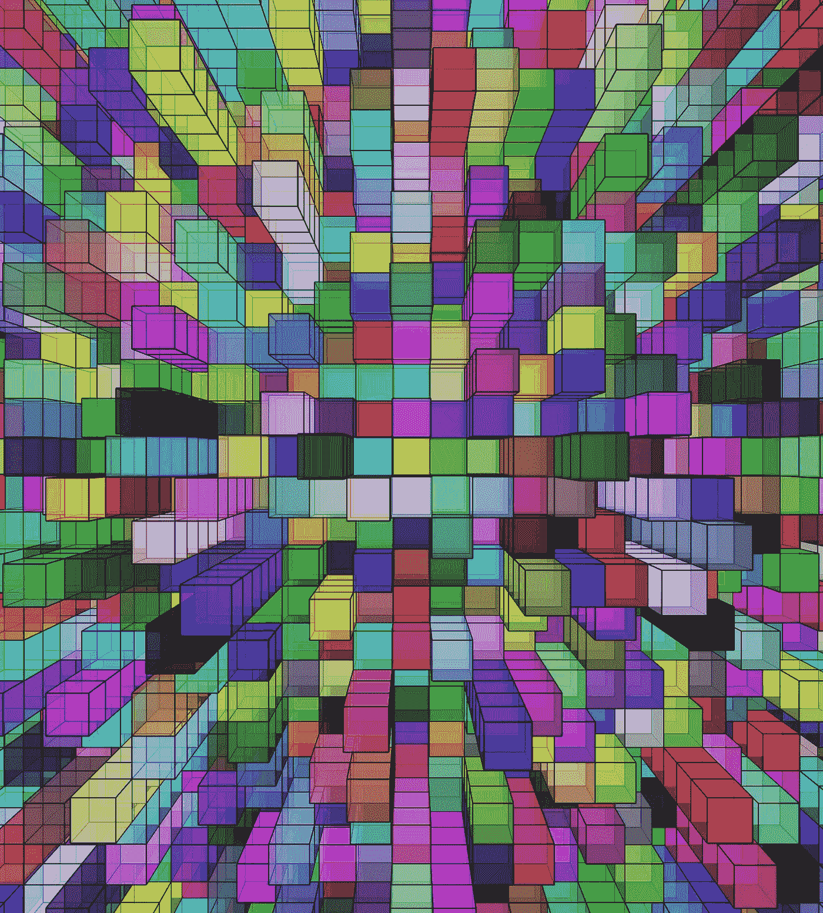

# 使用 p5js-Artwork 创建 3D 网格框

> 原文：<https://levelup.gitconnected.com/create-3d-grid-box-using-p5js-artwork-d040942cbb74>

p5.js 是一个 JavaScript 库，用于在 web 浏览器中创建交互式图形和艺术品。它提供了一组函数和变量，可用于绘制形状、创建动画以及以各种方式与用户输入进行交互。



p5.js 的一些常见用法包括:

*   绘制基本形状，如直线、矩形、椭圆和曲线
*   使用颜色函数设定形状的填充、描边和背景颜色
*   使用以指定帧速率重复调用的`draw`函数创建动画
*   使用`translate`、`rotate`和`scale`等功能转换坐标系
*   使用`box`、`sphere`、`cylinder`等 3D 渲染功能创建 3D 作品
*   响应用户输入，如鼠标点击、按键和触摸事件
*   加载和显示图像、音频和视频
*   使用粒子系统、分形和细胞自动机等技术创建交互式图形

p5.js 经常被艺术家和设计师用来为网络创作原创作品和交互式视觉体验。它是一个多功能的工具，可以用来创建各种各样的创意项目，从简单的绘图和动画到复杂的交互系统。

以下是一个示例研讨会大纲，它解释了如何使用 p5.js 创建盒子的 3D 网格:

1.  打开文本编辑器或代码编辑器，创建一个新文件。用“index.html”这样的名称保存文件
2.  在该文件的顶部，添加以下行以将 p5.js 库包含在您的项目中:

```
<!DOCTYPE html>
<html lang="en">

<head>
    <meta charset="UTF-8">
    <meta http-equiv="X-UA-Compatible" content="IE=edge">
    <meta name="viewport" content="width=device-width, initial-scale=1.0">
    <title>Document</title>
    <script src="https://cdnjs.cloudflare.com/ajax/libs/p5.js/1.5.0/p5.js"></script>
    <script src="https://cdnjs.cloudflare.com/ajax/libs/p5.js/1.5.0/addons/p5.sound.min.js"></script>
    <link rel="stylesheet" type="text/css" href="style.css">
</head>

<body>
    <script src="sketch.js"></script>
</body>

</html>
```

3.创建一个新的脚本文件，命名为“sketch.js ”,并定义`setup`和`draw`函数和初始值。

```
let d = 35;
let i, j, n;

function setup() {
  createCanvas(windowWidth - 30, windowHeight - 30, WEBGL);
  noLoop();
}

function draw() {
  // code for drawing the 3D grid of boxes goes here
}
```

4.在`draw`函数中，使用嵌套循环遍历盒子的 x、y 和 z 位置。对于每个位置，使用`fill`函数将方框的填充颜色设置为 alpha 值为 127 的随机颜色。然后使用`push`、`translate`和`box`功能在当前位置画一个方框。最后，使用`pop`函数恢复之前的变换矩阵。

```
function draw() {
  for (i = -d * 15; i < d * 15; i += d) {
    for (j = -d * 15; j < d * 15; j += d) {
      fill(random(255), random(255), random(255), 127);
      for (n = 0; n < Math.ceil(random(9)); n++) {
        push();
        translate(i, j, n * d);
        box(d);
        pop();
      }
    }
  }
}
```

以下是完整的代码 sketch.js:

```
let d = 35;
let i, j, n;
function setup() {
  createCanvas(windowWidth-30, windowHeight-30, WEBGL);
  noLoop();
}
function draw() {
  for (i = -d * 15; i < d * 15; i += d) {
    for (j = -d * 15; j < d * 15; j += d) {
      fill(random(255), random(255), random(255), 127);
      for (n = 0; n < Math.ceil(random(9)); n++) {
        push();
        translate(i, j, n * d);
        box(d);
        pop();
      }
    }
  }
}
```

来源:https://github.com/easywebsify/p5js-d3-grid-box

感谢阅读

# 分级编码

感谢您成为我们社区的一员！在你离开之前:

*   👏为故事鼓掌，跟着作者走👉
*   📰查看[级编码出版物](https://levelup.gitconnected.com/?utm_source=pub&utm_medium=post)中的更多内容
*   🔔关注我们:[推特](https://twitter.com/gitconnected) | [LinkedIn](https://www.linkedin.com/company/gitconnected) | [时事通讯](https://newsletter.levelup.dev)

🚀👉 [**加入升级人才集体，找到一份惊艳的工作**](https://jobs.levelup.dev/talent/welcome?referral=true)