# 通过 AWS CloudFormation 创建 3 层架构

> 原文：<https://levelup.gitconnected.com/create-a-3-tier-architecture-via-aws-cloudformation-b25e450e8acd>

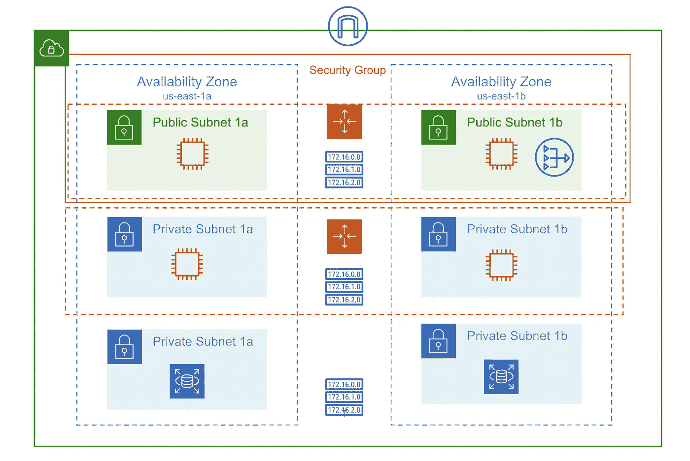

*什么是三层架构？*这是一个由三层组成的架构:web 层、应用层和数据库层。

**Web 层**是一个顶层，其主要目的是显示和收集用户的信息，并以 HTML/JS/CSS 的形式将其内容发送给浏览器。它的主要目的是向用户显示信息并从用户那里收集信息。

**应用层**是应用的大脑。这一层包含用于处理用户输入的业务逻辑。应用层还可以添加、删除或修改数据库层中的数据。

数据库层是 web 应用程序的数据层或后端层。它是存储和管理应用程序处理的信息的地方。

**先决条件:**

*   Git 安装在你的电脑上
*   GitHub 帐户
*   代码编辑器——我将使用 [Visual Studio 代码](https://code.visualstudio.com/)
*   AWS 帐户

***我们开始吧！***

# 1|云形成模板

您可以在 Visual Studio 代码中创建自己的模板，也可以派生 my CloudFormation 模板并在本地计算机上另存为. yml 文件。

下面的代码将构建以下内容:

*   VPC
*   路由表
*   互联网网关
*   将 Internet Gateway 连接到您刚刚创建的 VPC
*   2 个公共子网
*   公共子网的扩展策略
*   公共子网的路由表
*   将公共子网与路由表相关联
*   使用 HTTP 和 SSH 打开到 0.0.0.0/0 的安全组
*   使用引导脚本启动模板来安装和启动 Apache
*   公共子网的自动缩放组
*   缩放策略
*   4 个专用子网—两个在美国东部 1a，两个在美国东部 1b
*   应用层中两个专用子网的自动扩展组

# 2|创建您的第一个堆栈

在 AWS 控制台中，导航到**云信息**:

*   点击 ***创建堆栈***
*   选择 ***模板准备好*** 选项
*   在模板来源下，选择 ***上传模板文件***
*   上传您创建的 YAML 文件或附加。上一步中的 yml 文件
*   点击 ***下一个***

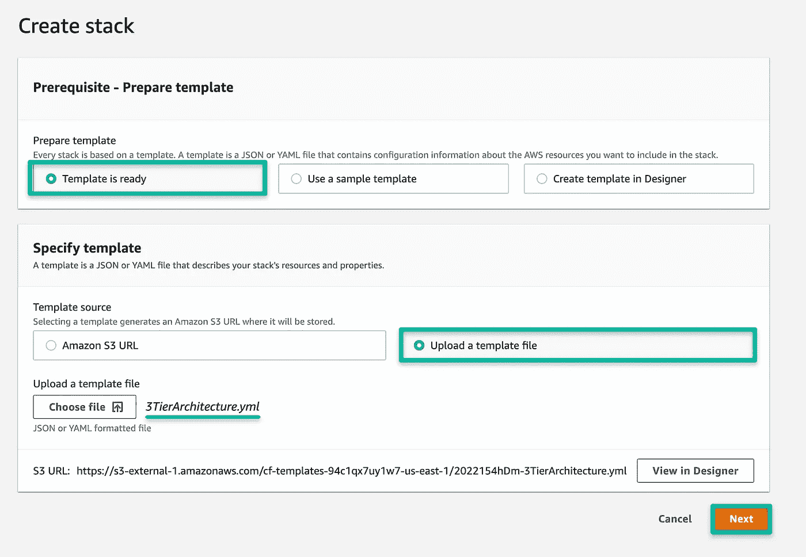

*   接下来，创建你的 ***栈名***
*   分配您的 IAM 角色
*   堆栈失败选项:*回滚所有堆栈资源*
*   保留所有默认设置，点击 ***下一步***
*   查看您的模板并点击 ***创建堆栈***

一旦你点击了 ***创建堆栈*** ，事件将需要一段时间来完全创建你的堆栈。伸伸腿，吃点点心，或者你可以点击几次 ***刷新图标*** 来观看 CloudFormation 一步一步地创建你的堆栈！

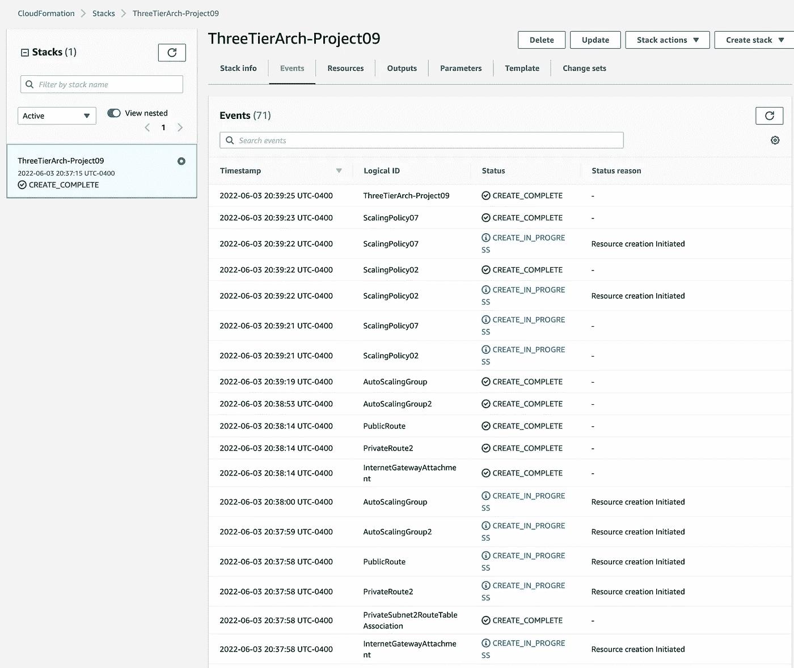

71 项活动已成功部署— WOOT！

# 3|确认安装在 EC2 实例上的 Apache

在 AWS 控制台中，导航至 **EC2。**如果您还记得我们的代码，我们指定我们想要用用户数据启动四个 EC2 实例来安装 Apache Web 服务器。web 层中有两个实例，应用层中有两个实例。

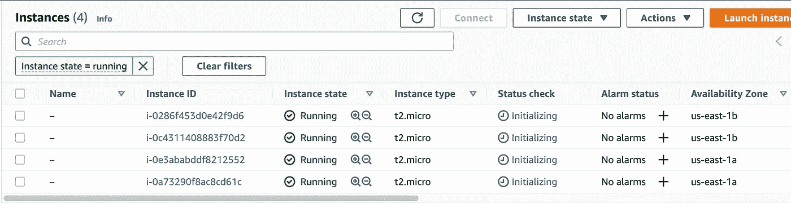

从 Web 层获取公共 IPv4 地址，以验证 Apache 是否正确安装在每个实例上。从下图可以看出，Apache 的安装工作非常完美！

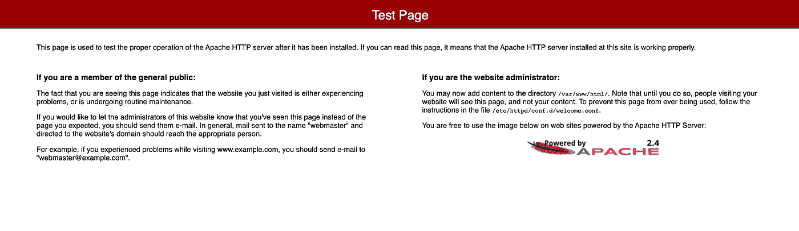

# 4|为您的架构创建数据库层

同样，您可以在 Visual Studio 代码中创建自己的模板，或者派生 my CloudFormation 模板&在本地计算机上另存为. yml 文件。

在您的 AWS **CloudFormation** 控制台中，导航到 ***创建堆栈:***

*   选择 ***模板准备好*** 选项
*   在模板来源下，选择 ***上传模板文件***
*   上传您创建的 YAML 文件或附加。上一步中的 yml 文件
*   点击 ***下一个***

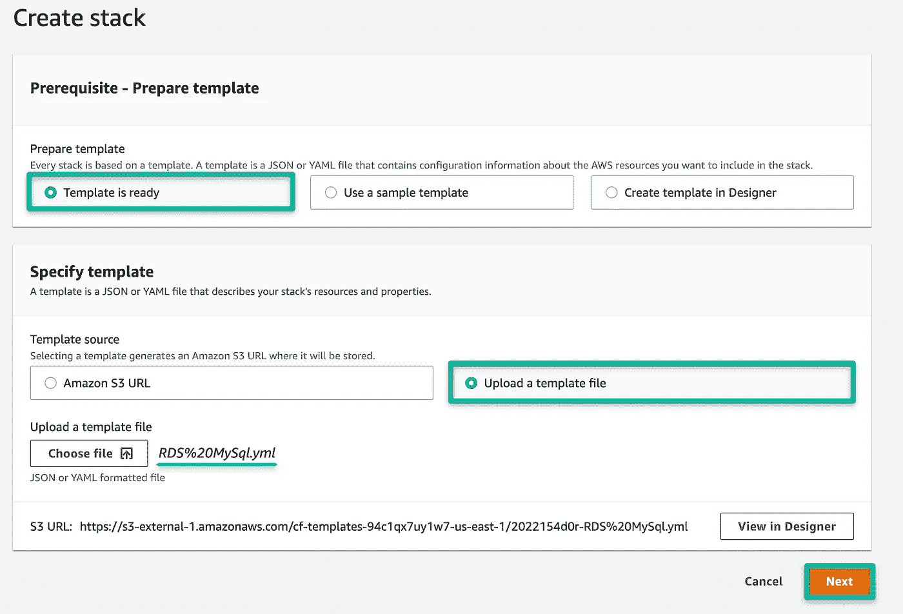

## 指定堆栈详细信息:

**堆栈名称:** RDSDatabase-Project09

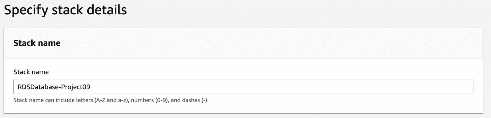

**参数:**

*   在**所有权**下，只需写下您的姓名或部署数据库堆栈的团队名称

**网络配置:**

*   **VPC:** 选择我们用第一个栈创建的 VPC:three tierarch-project 09-cloud VPC
*   **私有子网 1:** 将其放入私有子网 10.0.64.0/20
*   **私有子网 2:** 将其放入私有子网 10.0.80.0/20
*   **公网 ACL:** 导航到 **VPC >网络 ACL**获取网络 ACL ID 号

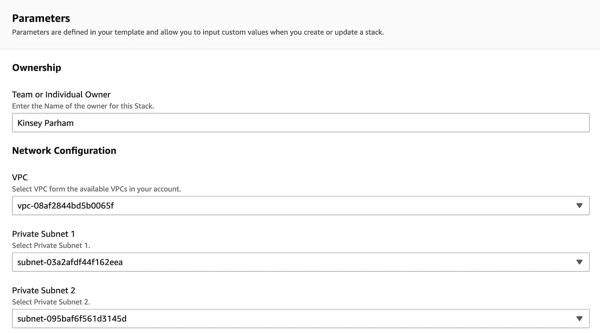

**RDS 配置:**

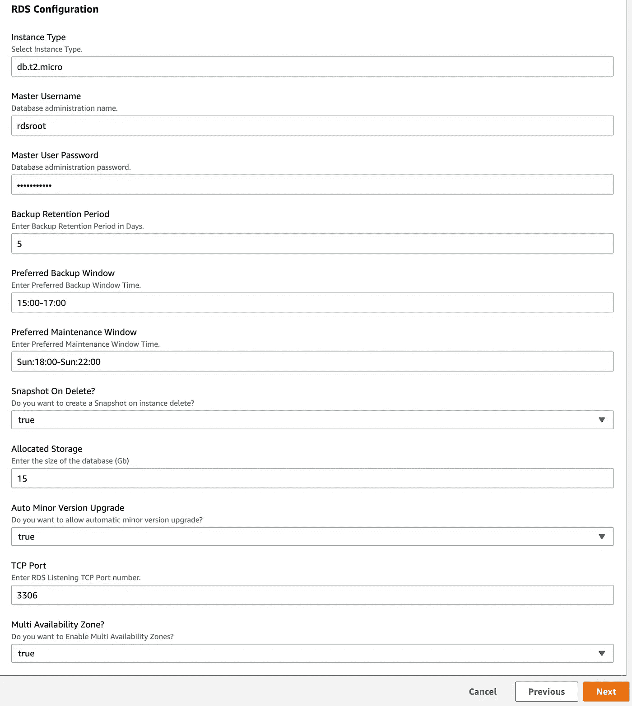

*   将其他一切保持默认，点击 ***下一步***
*   查看您的模板并点击 ***创建堆栈***

***重要提示:**这部分可能需要 5-10 分钟来部署。

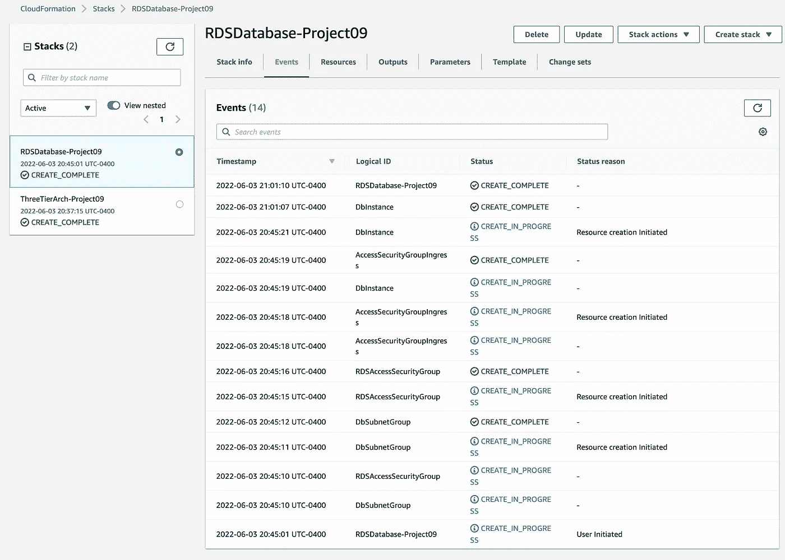

如您所见，堆栈已成功部署，我们可以继续了！！

# 5|创建一个 NAT 网关来路由所有流量

同样，您可以在 Visual Studio 代码中创建自己的模板，或者派生 my CloudFormation 模板&在本地计算机上另存为. yml 文件。

在你的 AWS **CloudFormation** 控制台中，导航到 ***创建堆栈:***

*   选择 ***模板准备好*** 选项
*   在模板来源下，选择 ***上传模板文件***
*   上传您创建的 YAML 文件或附加。上一步中的 yml 文件
*   点击 ***下一个***

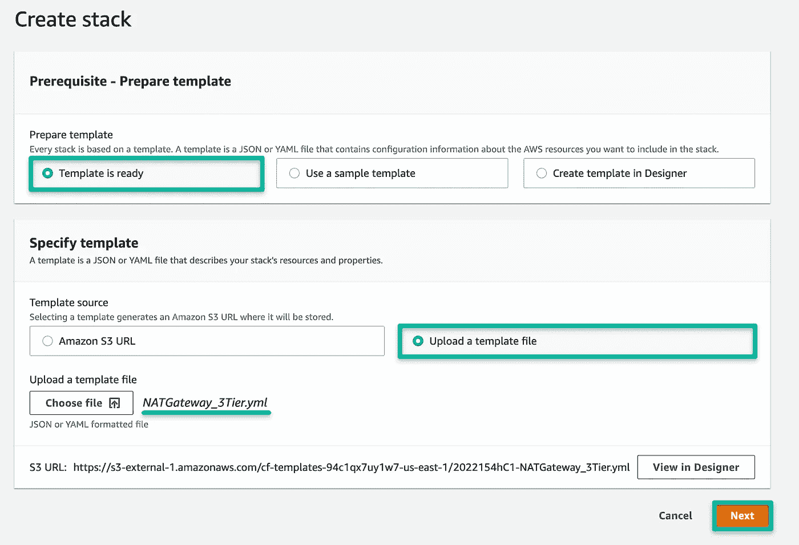

**指定堆栈详细信息:**

堆栈名称: NATGateway-Project09

**参数:**

*   在**所有权**下，只需写下您的姓名或部署数据库堆栈的团队名称

**网络配置:**

*   **VPC:** 选择我们用第一个栈创建的 VPC:three tierarch-project 09-cloud VPC
*   **公共子网:**将其放入公共子网 10.0.16.0/20
*   **私有路由表:**导航到 **VPC >路由表**并获取路由表 ID 号
*   **公网 ACL:** 导航到 **VPC >网络 ACL**，获取网络 ACL ID 号

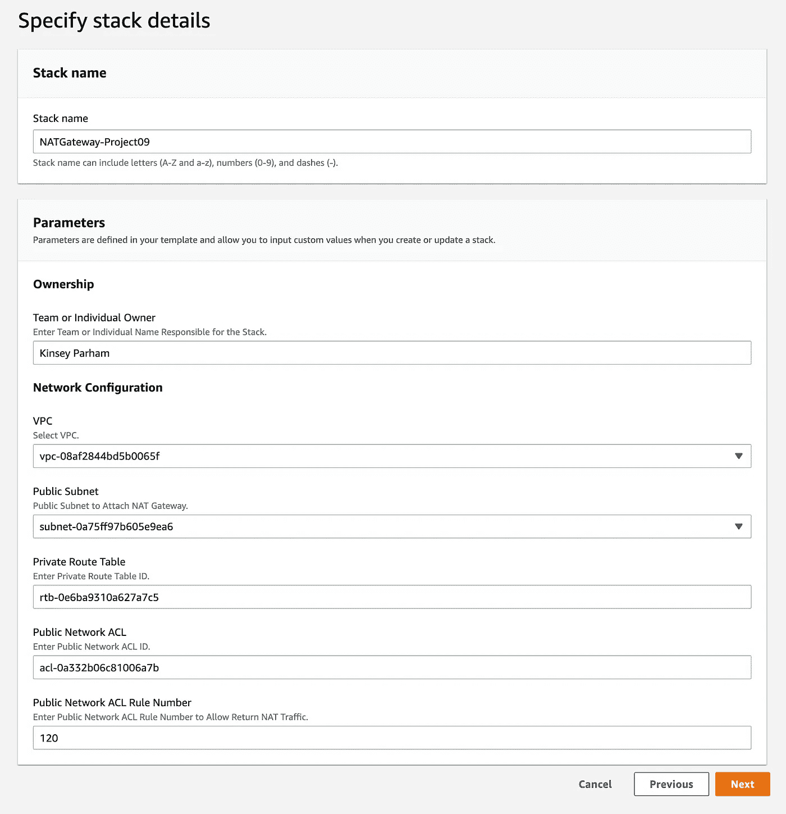

*   点击 ***下一步*** 并部署您的堆栈

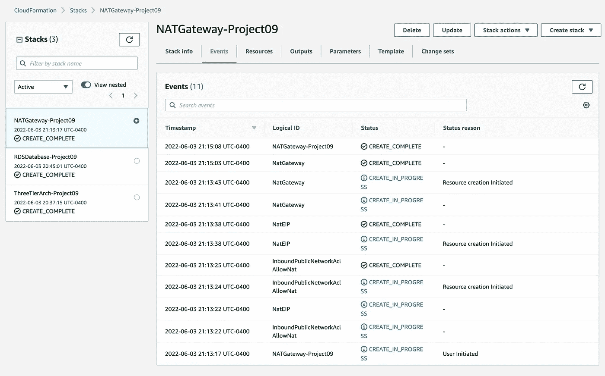

如您所见，我们的最终堆栈已成功部署！！

***加成:***

*使用以下命令从您的公共 Web 实例 Ping 私有应用程序实例:*

```
<private IP address of private app instance>
```

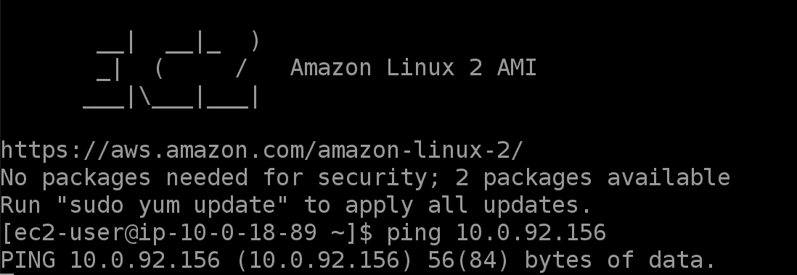

ping 成功！耶！

***恭喜恭喜！您刚刚通过 CloudFormation 构建了一个 AWS 3 层架构！***

*更多内容请看*[***plain English . io***](https://plainenglish.io/)*。报名参加我们的* [***免费每周简讯***](http://newsletter.plainenglish.io/) *。关注我们关于*[***Twitter***](https://twitter.com/inPlainEngHQ)*和*[***LinkedIn***](https://www.linkedin.com/company/inplainenglish/)*。加入我们* [***社区不和谐***](https://discord.gg/GtDtUAvyhW) *。*